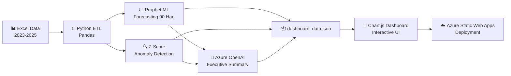

# 🛡️ Aceh Resilience Monitor (ARM)


> **Platform Intelijen Harga Pangan Berbasis Hybrid AI** — Dari pemantauan reaktif ke prediksi proaktif.

Aceh Resilience Monitor adalah sistem peringatan dini harga bahan pangan strategis di Provinsi Aceh yang memadukan **Machine Learning klasik (Meta Prophet)** dengan **Generative AI (Azure OpenAI)** untuk memberikan wawasan prediktif 90 hari ke depan kepada pengambil kebijakan.

**Topik:** Ketahanan Pangan & Agrikultur Modern  
**Kompetisi:** Datathon Dicoding × Microsoft Elevate Training Center 2026

---

## 🏗️ Arsitektur Sistem



---

## ✨ Fitur Utama

| No | Fitur | Deskripsi |
|---|---|---|
| 1 | **Automated ETL Pipeline** | Membersihkan data harga harian dari 3 file Excel (2023–2025) yang formatnya berantakan menjadi dataset terstruktur siap analisis. |
| 2 | **Statistical Anomaly Detection** | Mendeteksi lonjakan harga abnormal menggunakan Z-Score terhadap Moving Average 30 hari. Mengklasifikasikan sebagai ⚠️ WASPADA atau 🚨 KRITIS. |
| 3 | **Interactive Dashboard** | Antarmuka visual premium (dark glassmorphism) dengan 8+ komponen interaktif: KPI cards, status grid, price trend, YoY comparison, seasonality heatmap, volatility heatmap, stacked area chart. |
| 4 | **ML Forecasting 90 Hari** | 18 model Meta Prophet individual (1 per komoditas) memprediksi harga 90 hari ke depan, termasuk batas kepercayaan atas/bawah (*Confidence Interval*). |
| 5 | **🤖 AI Executive Summary** | Integrasi Azure OpenAI yang merangkum anomali dan prediksi menjadi teks laporan naratif bergaya "Analis Ekonomi" secara otomatis untuk pengambil kebijakan. |
| 6 | **Prophet Model Evaluation** | Notebook riset (`evaluate_prophet.ipynb`) dengan backtesting Train/Test Split — metrik MAE, RMSE, dan MAPE untuk ke-18 komoditas. |
| 7 | **Early Warning System** | Feed peringatan real-time dengan 3 tingkat: Normal → Waspada → Kritis, ditambah alert prediksi 🔮 PREDIKSI dari hasil forecasting. |

---

## 📐 Evaluasi Model (Backtesting)

Metode: **Train/Test Split** — Data Training: Jan 2023 – Sep 2025 | Data Testing: Okt – Des 2025 (90 hari)

| Kategori | Contoh Komoditas | MAPE | Keterangan |
|---|---|---|---|
| 🟢 **Sangat Akurat** | Daging Sapi | **0.49%** | Error < 5%, siap referensi kebijakan |
| 🟢 **Sangat Akurat** | Beras (6 varian) | **1.4 – 2.2%** | Sangat stabil dan terprediksi |
| 🟡 **Cukup Akurat** | Telur Ayam, Bawang Putih | **6 – 12%** | Dapat menangkap tren jangka menengah |
| 🔴 **Sulit Diprediksi** | Cabai, Bawang Merah | **20 – 33%** | Butuh data eksternal (cuaca) |

**Rata-rata MAPE keseluruhan: 7.74%** (Kategori: Sangat Baik)

> Detail lengkap: lihat [`evaluation_prophet.md`](evaluation_prophet.md) dan [`scripts/evaluate_prophet.ipynb`](scripts/evaluate_prophet.ipynb)

---

## 🛠️ Teknologi yang Digunakan

| Komponen | Teknologi | Fungsi |
|---|---|---|
| Data Processing | Python, Pandas, NumPy | ETL, cleaning, transformasi |
| Machine Learning | Meta Prophet | Time-series forecasting 90 hari |
| Generative AI | **Azure OpenAI** (GPT-4o-mini) | Ringkasan eksekutif otomatis |
| Visualization | Chart.js v4, Vanilla JS | Dashboard interaktif |
| Styling | Vanilla CSS (Glassmorphism) | UI/UX premium |
| Hosting | **Azure Static Web Apps** | Deployment cloud |
| Version Control | Git, GitHub | Kolaborasi tim |

---

## 🚀 Cara Menjalankan

### Prasyarat
- Python 3.9+
- pip

### 1. Clone Repository
```bash
git clone https://github.com/mhmdarieffh/datathon-dicoding.git
cd datathon-dicoding
```

### 2. Install Dependencies
```bash
pip install -r requirements.txt
```

### 3. (Opsional) Set Azure OpenAI Environment Variables
```bash
export AZURE_OPENAI_ENDPOINT="https://your-resource.openai.azure.com/"
export AZURE_OPENAI_API_KEY="your-api-key"
export AZURE_OPENAI_DEPLOYMENT="gpt-4o-mini"
```
> Jika tidak di-set, sistem akan menggunakan fallback summary otomatis berbasis data.

### 4. Jalankan Pipeline
```bash
python scripts/prepare_dashboard_data.py
```

### 5. Buka Dashboard
Buka file `dashboard/index.html` di browser, atau akses versi live di Azure Static Web Apps.

---

## 📁 Struktur Folder

```
datathon-dicoding/
├── Data/                           # Dataset mentah
│   ├── 2023.xlsx                   # Harga harian 18 komoditas tahun 2023
│   ├── 2024.xlsx                   # Harga harian 18 komoditas tahun 2024
│   └── 2025.xlsx                   # Harga harian 18 komoditas tahun 2025
├── dashboard/                      # Frontend dashboard
│   ├── index.html                  # Halaman utama dashboard
│   ├── app.js                      # Logika rendering Chart.js + interaktivitas
│   ├── style.css                   # Desain premium glassmorphism
│   ├── dashboard_data.json         # Output data pipeline (auto-generated)
│   ├── dashboard_data.js           # Embedded JS version (untuk file://)
│   └── staticwebapp.config.json    # Konfigurasi Azure Static Web Apps
├── scripts/                        # Backend pipeline
│   ├── prepare_dashboard_data.py   # ETL + Prophet + Azure OpenAI + JSON export
│   └── evaluate_prophet.ipynb      # Notebook evaluasi model (backtesting)
├── requirements.txt                # Dependensi Python
├── README.md                       # Dokumentasi proyek (file ini)
├── data_analysis.md                # Analisis eksplorasi data
└── evaluation_prophet.md           # Laporan evaluasi model Prophet
```

---

## 🍚 Komoditas yang Dipantau (18 Komoditas)

| Kategori | Komoditas |
|----------|-----------|
| **Beras** | Bawah I, Bawah II, Medium I, Medium II, Super I, Super II |
| **Daging Ayam** | Ayam Ras Segar |
| **Daging Sapi** | Kualitas 1 |
| **Telur Ayam** | Ras Segar |
| **Bawang Merah** | Ukuran Sedang |
| **Bawang Putih** | Ukuran Sedang |
| **Cabai Merah** | Keriting |
| **Cabai Rawit** | Hijau |
| **Minyak Goreng** | Curah, Kemasan Bermerk 1, Kemasan Bermerk 2 |
| **Gula Pasir** | Kualitas Premium, Lokal |

---

## 👥 Tim

| Nama | Peran |
|------|-------|
| Aulia Muzhaffar | AI Engineer & Data Scientist |
| Ilhaam | Data Engineer & Frontend Developer |
| Arieff | Project Manager |

---

## 📄 Lisensi

Proyek ini dikembangkan untuk keperluan **Datathon Dicoding × Microsoft Elevate Training Center 2026**.  
Dataset bersumber dari PIHPS (Pusat Informasi Harga Pangan Strategis Nasional).
