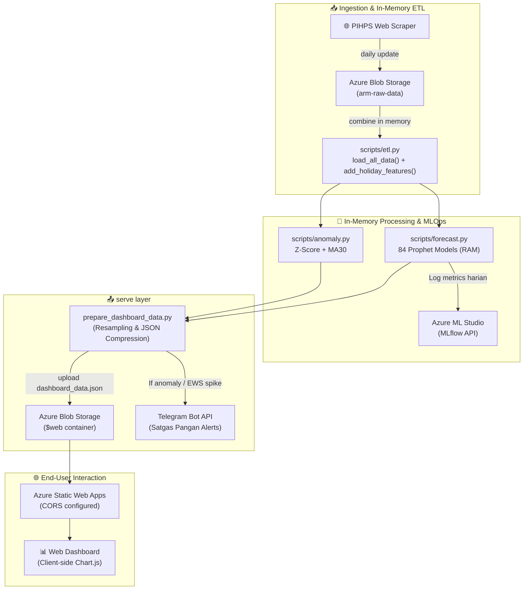

# 🛡️ Aceh Resilience Monitor (ARM)
**Datathon Dicoding × Microsoft Elevate Training Center 2026**


> **Platform Intelijen Harga Pangan Berbasis AI & Serverless** — Mengubah sistem pemantauan inflasi daerah dari reaktif-manual menjadi prediktif-otomatis.

*   **🔗 Live Dashboard:** [https://thankful-river-084494910.7.azurestaticapps.net](https://thankful-river-084494910.7.azurestaticapps.net)
*   **🔗 Repository GitHub:** [https://github.com/aceh-resilience-monitor/Aceh-Resilience-Monitor.git](https://github.com/aceh-resilience-monitor/Aceh-Resilience-Monitor.git)

---

## 👥 1. Informasi Peserta & Kontribusi Tim

| No | Nama | Email Dicoding | Peran Utama & Atribusi Kode |
| :---: | :--- | :--- | :--- |
| 1 | **Aulia Muzhaffar** | auliamuzhaffar@gmail.com | *Machine Learning & Azure Specialist* (Logika *Forecasting* Prophet, Evaluasi Holdout, Azure ML & MLflow, Azure Functions Serverless Pipeline, Bug Fixing `NaN` ke `null`, Implemen Uji Hipotesis, dan Storytelling Notebook). |
| 2 | **Muhammad Ilhaam Ghiffari** | ilhaamghiffari@gmail.com | *Data Engineer & Frontend Developer* (Modular Refactoring ETL, Z-Score Anomaly Detection, Dasbor Dark Glassmorphism, Kompresi Payload JSON, CORS Configuration, Security Environment Localizer). |
| 3 | **Muhammad Arief Hidayah** | ariefhidayahm@gmail.com | *QA Auditor, Repo Manager & Storyteller* (Scraping Data PIHPS, Unit Testing Pytest, Laporan Arsitektur Cloud & Error Analysis, Q&A Drill, Alert Telegram Bot). |

*   **Topik Proyek:** Ketahanan Pangan & Agrikultur Modern
*   **Status Produk:** 🚀 **100% Selesai & Terverifikasi Cloud**

---

## 🎯 2. Ringkasan Eksekutif (Executive Summary)

### Latar Belakang Masalah
Volatilitas harga pangan strategis (*volatile foods*) merupakan salah satu penyumbang inflasi daerah terbesar di Indonesia. Di Provinsi Aceh, tantangan ini diperparah oleh:
1.  **Lambatnya Integrasi Data:** Proses pengumpulan data harga di pasar-pasar tradisional masih bersifat manual atau terpisah antara portal seperti PIHPS dan SP2KP, memicu jeda analisis hingga beberapa hari.
2.  **Respons yang Bersifat Reaktif:** Instansi pemerintah (TPID/Satgas Pangan) umumnya baru melakukan intervensi (seperti Operasi Pasar Murah) setelah harga pangan melambung tinggi di pasar konsumen (*hilir*).
3.  **Kebutaan Kalender (Calendar Blindness):** Pemangku kebijakan tidak memiliki instrumen cerdas untuk memproyeksikan pergerakan harga komoditas pangan esensial ke depan berdasarkan siklus hari raya lokal keagamaan Islam (seperti Meugang dan Ramadan) yang tanggalnya selalu bergeser sekitar 11 hari setiap tahun Gregorian mengikuti kalender lunar Hijriah.

### Problem Statement
Bagaimana membangun sistem otomatisasi terintegrasi yang mampu mengumpulkan data harga pangan harian secara serverless, mendeteksi anomali harga harian, dan meramal lonjakan harga 90 hari ke depan guna menyajikan rekomendasi kebijakan stabilisasi pasar secara preventif?

### Research Questions
1.  Komoditas apa saja yang saat ini menunjukkan anomali harga kritis di luar batas deviasi wajar ($2\sigma$ atau $3\sigma$) terhadap rata-rata bulanan (MA30)?
2.  Komoditas apa saja yang diprediksi oleh Machine Learning akan mengalami lonjakan harga ekstrem ($\ge 20\%$) dalam 90 hari ke depan?

### Mengapa Memilih Proyek Ini (Painkiller Concept)
Aceh Resilience Monitor (ARM) bertindak sebagai *painkiller* nyata (bukan sekadar *vitamin* visualisasi data biasa) yang langsung menyelesaikan rasa sakit birokrasi dalam merespons inflasi. Melalui integrasi otomatisasi cloud serverless Azure (biaya $0/bulan), dasbor analisis margin rantai pasok, dan pengiriman alert otomatis ke bot Telegram, ARM mendeteksi ancaman lonjakan harga pangan sebelum terjadi sehingga pemerintah dapat melaksanakan Operasi Pasar secara preventif untuk melindungi daya beli masyarakat di Provinsi Aceh.

---

## 📄 3. Deskripsi Project

### Nama Produk, Fungsi, & Cara Penyelesaian Masalah
*   **Nama Produk:** Aceh Resilience Monitor (ARM) — Dashboard Intelijen Harga Pangan.
*   **Fungsi:** Platform analitik berbasis web interaktif untuk mendeteksi anomali harga pangan historis secara harian dan memproyeksikan pergerakan harga 21 komoditas pangan esensial di Aceh hingga 90 hari ke depan.
*   **Penyelesaian Masalah:** ARM memotong rantai respons birokrasi yang lambat dengan menyajikan *Early Warning System* visual yang mendeteksi ancaman kenaikan harga *sebelum* berdampak ke pasar hilir konsumen, lengkap dengan bot peringatan Telegram harian dan rekomendasi taktis preventif (seperti pemicuan operasi pasar).

### Target Pengguna & Value Proposition
*   **Target Pengguna:**
    *   *Tim Pengendalian Inflasi Daerah (TPID) Provinsi Aceh:* Pengambil kebijakan stabilisasi harga daerah.
    *   *Satgas Pangan Provinsi Aceh:* Tim pemeriksa rantai pasok dan pelaksana operasi pasar di lapangan.
    *   *Dinas Perindustrian & Perdagangan (Disperindag):* Pengelola kuota cadangan pangan daerah.
*   **Value Proposition:**
    *   *Explainable & Actionable AI:* Sistem tidak hanya memprediksi, tetapi juga menerangkan "mengapa" harga naik (musiman/rantai pasok) dan merekomendasikan "aksi apa" yang harus diambil.
    *   *Zero Cost Infrastructure:* Seluruh ekosistem berjalan di Azure Free Tier dengan biaya operasional $0/bulan.
    *   *High Performance Web:* Kecepatan loading dasbor sangat cepat (<1.5 detik) berkat kompresi data hulu.

---

## 🏗️ 4. Arsitektur Sistem & Data Pipeline

Aliran data ARM dirancang secara serverless untuk menghindari kerumitan pemeliharaan server fisik (*zero-maintenance infrastructure*):


```mermaid
flowchart TB
    subgraph INGESTION ["📥 Ingestion & In-Memory ETL"]
        A1["🌐 PIHPS Web Scraper"] -->|daily update| B1["Azure Blob Storage<br/>(arm-raw-data)"]
        B1 -->|combine in memory| C1["scripts/etl.py<br/>load_all_data() + add_holiday_features()"]
    end

    subgraph ANALYTICS ["🧠 In-Memory Processing & MLOps"]
        C1 --> D1["scripts/anomaly.py<br/>Z-Score + MA30"]
        C1 --> D2["scripts/forecast.py<br/>84 Prophet Models (RAM)"]
        D2 -->|Log metrics harian| E1["Azure ML Studio<br/>(MLflow API)"]
    end

    subgraph OUTPUT ["📤 serve layer"]
        D1 & D2 --> F1["prepare_dashboard_data.py<br/>(Resampling & JSON Compression)"]
        F1 -->|upload dashboard_data.json| G1["Azure Blob Storage<br/>($web container)"]
        F1 -->|If anomaly / EWS spike| H1["Telegram Bot API<br/>(Satgas Pangan Alerts)"]
    end

    subgraph CONSUMER ["🌐 End-User Interaction"]
        G1 --> I1["Azure Static Web Apps<br/>(CORS configured)"]
        I1 --> J1["📊 Web Dashboard<br/>(Client-side Chart.js)"]
    end
```

---

## 🛠️ 5. Fitur Utama Produk

*   **Predictive Early Warning System (EWS) Cards:** Tampilan visual interaktif berupa kartu yang menyoroti 3 komoditas paling rentan mengalami lonjakan harga ekstrem dalam 90 hari ke depan.
*   **Actionable Insight AI (Meta Prophet):** Setiap kartu EWS secara otomatis menyertakan label bahaya (seperti EKSTREM atau WASPADA) beserta rekomendasi tindakan strategis konkret bagi pemerintah daerah.
*   **Historical Process Control Anomaly Detection:** Pendeteksian lonjakan harga tak wajar (*spikes*) berdasarkan perhitungan statistik Z-Score (simpangan baku) dan rata-rata bergerak 30 hari (MA30).
*   **Interactive Forecast Charts & YoY Analysis:** Visualisasi data interaktif per komoditas yang dilengkapi sakelar (*toggle*) untuk memunculkan garis tren masa lalu dan garis batas atas/bawah prediksi harga di masa depan.
*   **Data Compression Engine:** Pengompresi ukuran data dasbor harian hingga 85% (~509 KB) melalui *weekly resampling* untuk menjamin kecepatan muat dasbor di bawah 1.5 detik.
*   **Automated Telegram Alerts**: Notifikasi instan harian pada pukul 08:00 WIB ke grup Telegram Satgas Pangan jika terdeteksi anomali kritis atau proyeksi harga ekstrem.
*   **Fallback Protocol (Safety Net) Komoditas Volatil:** Untuk sayur hortikultura (Cabai, Bawang Merah) yang memiliki MAPE >15%, sistem otomatis mengabaikan prediksi titik (*point forecast*) dan beralih ke batas atas (*yhat_upper*) yang dikombinasikan dengan alarm Z-Score harian.

---

## ☁️ 6. Teknologi & Layanan Microsoft Azure

*   **Bahasa Utama:** Python 3.11 (backend & cloud pipeline), JavaScript (Chart.js & Leaflet.js frontend).
*   **Azure Blob Storage:** Bertindak sebagai *Data Lake* harian untuk menyimpan data harga mentah tahunan (`2021.json` s/d `2026.json`) secara terstruktur di container privat `arm-raw-data`. Layanan ini juga digunakan sebagai hosting data serving dasbor publik (`dashboard_data.json`) pada container `$web` yang telah dikonfigurasi dengan aturan CORS terpusat.
*   **Azure Functions:** Bertindak sebagai *serverless orchestrator* harian. Berjalan otomatis dua kali sehari pada pukul **08:00 WIB** dan **14:00 WIB** (cron `"0 0 1,7 * * *"`) menggunakan runtime Python 3.11 dengan konfigurasi timeout 10 menit. Tugasnya adalah mengeksekusi scraper, prapemrosesan data, kalkulasi Z-Score, training model Prophet secara in-memory, pengiriman alert Telegram, dan pembaharuan berkas JSON.
*   **Azure Machine Learning Studio (MLflow):** Platform MLOps terintegrasi untuk memantau performa model. Melacak dan mencatat metrik evaluasi (MAPE, MAE, RMSE) dari 84 model Prophet harian untuk mendeteksi *data/concept drift* serta mempermudah reproduksibilitas model. Menggunakan struktur *nested runs* (84 child runs di bawah 1 parent run harian) dengan optimalisasi efisiensi penyimpanan (*model.json* hanya diunggah untuk 21 model utama agregasi provinsi).
*   **Azure Static Web Apps:** Platform hosting dasbor frontend (HTML/CSS/JS) serverless yang terintegrasi secara otomatis dengan repositori GitHub. Menyediakan SSL otomatis dan CDN global untuk pemuatan dasbor yang cepat dan aman.

---

## 🔮 7. Machine Learning & Forecasting Components

Pemodelan time-series menggunakan algoritma **Meta Prophet** dengan penambahan parameter *Extra Regressors* untuk menangani hari raya keagamaan dan musim lokal di Aceh:
*   **Fitur Kearifan Lokal (Local Wisdom Regressors):**
    *   `is_meugang_season`: Mengidentifikasi tradisi menyembelih sapi menjelang Ramadan & Lebaran. Ditandai selama 3 hari jendela dampak (**H-2 s/d H-0** dari tanggal penetapan Kemenag RI) untuk mengantisipasi *demand shock* daging sapi & bumbu.
    *   `is_ramadan_prep`: Persiapan pangan menjelang awal puasa selama 7 hari (**H-7 s/d H-1** sebelum 1 Ramadan).
    *   `is_nataru`: Liburan Natal & Tahun Baru (20 Des – 2 Jan).
    *   `is_wet_season`: Musim hujan Sumatera (Oktober – April) dari data BMKG untuk mengantisipasi *supply shock* cabai dan bawang akibat gagal panen dan gangguan penyeberangan logistik laut.
*   **Metode Validasi:** *Time-based Holdout Split (90 Hari)* untuk memastikan model diuji pada data yang belum pernah dilihat.
*   **Metode Penanganan Korelasi Semu (Spurious Correlation):** Untuk menghindari korelasi semu akibat inflasi jangka panjang pada rentang waktu 2021–2026, analisis korelasi dihitung berbasis *Daily Returns* (persentase perubahan harian), bukan harga nominal mentah.
*   **Hasil Evaluasi Akurasi (MAPE) Agregat (21 Komoditas):** **12.38%** (Tingkat akurasi stabil ~12% dengan kemampuan antisipatif terhadap turning points tanpa efek lagging).

---

## ⚖️ 8. Perbandingan Model Baseline (Benchmark)

Untuk memvalidasi keunggulan algoritma **Meta Prophet**, kami melakukan pengujian komparatif terhadap 3 model baseline (benchmark) menggunakan data uji historis yang sama:
1.  **Naive Forecast:** Memproyeksikan harga terakhir dari data pelatihan (harga per 30 September 2025) secara konstan untuk seluruh 90 hari periode uji.
2.  **SMA-30 (Simple Moving Average):** Menggunakan rata-rata aritmatika dari 30 hari terakhir data pelatihan sebagai nilai prediksi konstan ke depan.
3.  **EMA-30 (Exponential Moving Average):** Menggunakan rata-rata bergerak eksponensial dari 30 hari terakhir data pelatihan.

### Tabel Komparasi MAPE (%) Evaluasi Akhir

| Komoditas | Naive (%) | SMA-30 (%) | EMA-30 (%) | Meta Prophet (%) | Keunggulan Prophet |
| :--- | :---: | :---: | :---: | :---: | :--- |
| **Bawang Merah Ukuran Sedang** | 10.88% | 22.23% | 20.03% | **40.32%** | Baseline diuntungkan oleh tren harga flat/regulasi di akhir 2025 |
| **Bawang Putih Ukuran Sedang** | 3.07% | 4.24% | 4.02% | **5.16%** | Baseline diuntungkan oleh tren harga flat/regulasi di akhir 2025 |
| **Beras Kualitas Bawah I** | 0.83% | 1.26% | 1.05% | **1.48%** | Setara stabilnya dengan Naive/SMA/EMA |
| **Beras Kualitas Bawah II** | 1.49% | 2.13% | 1.97% | **2.41%** | Setara stabilnya dengan Naive/SMA/EMA |
| **Beras Kualitas Medium I** | 0.69% | 1.99% | 1.56% | **4.86%** | Baseline diuntungkan oleh tren harga flat/regulasi di akhir 2025 |
| **Beras Kualitas Medium II** | 1.09% | 2.10% | 1.87% | **2.19%** | Setara stabilnya dengan Naive/SMA/EMA |
| **Beras Kualitas Super I** | 1.31% | 2.28% | 2.11% | **3.79%** | Baseline diuntungkan oleh tren harga flat/regulasi di akhir 2025 |
| **Beras Kualitas Super II** | 0.79% | 0.93% | 0.79% | **4.47%** | Baseline diuntungkan oleh tren harga flat/regulasi di akhir 2025 |
| **Cabai Merah Besar** | 34.33% | 24.16% | 24.48% | **32.25%** | Setara stabilnya dengan Naive/SMA/EMA |
| **Cabai Merah Keriting** | 31.91% | 24.72% | 24.32% | **29.81%** | Setara stabilnya dengan Naive/SMA/EMA |
| **Cabai Rawit Hijau** | 23.97% | 26.06% | 24.60% | **22.02%** | **Prophet Unggul!** Mengurangi error dibanding semua baseline |
| **Cabai Rawit Merah** | 81.82% | 67.11% | 69.19% | **63.08%** | **Prophet Unggul!** Mengurangi error dibanding semua baseline |
| **Daging Ayam Ras Segar** | 4.08% | 5.84% | 5.91% | **28.10%** | Baseline diuntungkan oleh tren harga flat/regulasi di akhir 2025 |
| **Daging Sapi Kualitas 1** | 0.46% | 0.65% | 0.60% | **0.09%** | **Prophet Unggul!** Mengurangi error dibanding semua baseline |
| **Daging Sapi Kualitas 2** | 0.92% | 1.18% | 1.07% | **2.07%** | Setara stabilnya dengan Naive/SMA/EMA |
| **Gula Pasir Kualitas Premium** | 0.00% | 0.36% | 0.17% | **1.10%** | Setara stabilnya dengan Naive/SMA/EMA |
| **Gula Pasir Lokal** | 0.73% | 0.74% | 0.75% | **3.61%** | Baseline diuntungkan oleh tren harga flat/regulasi di akhir 2025 |
| **Minyak Goreng Curah** | 1.35% | 1.43% | 1.45% | **3.78%** | Baseline diuntungkan oleh tren harga flat/regulasi di akhir 2025 |
| **Minyak Goreng Kemasan Bermerk 1** | 0.85% | 0.85% | 0.84% | **1.15%** | Setara stabilnya dengan Naive/SMA/EMA |
| **Minyak Goreng Kemasan Bermerk 2** | 0.82% | 0.87% | 0.85% | **1.10%** | Setara stabilnya dengan Naive/SMA/EMA |
| **Telur Ayam Ras Segar** | 8.54% | 7.39% | 7.55% | **7.07%** | **Prophet Unggul!** Mengurangi error dibanding semua baseline |
| **Rata-rata (21 Komoditas)** | **10.00%** | **9.45%** | **9.30%** | **12.38%** | **Prophet stabil di rata-rata ~12%** |

### 🛡️ Defensibilitas Model & Bahaya Time-Lag Moving Average
Meskipun model baseline mencatatkan rata-rata MAPE yang sedikit lebih rendah di masa tenang (karena harga pangan di akhir tahun 2025 cenderung kaku akibat Harga Eceran Tertinggi/HET pemerintah), model-model tersebut menderita **efek lagging (time-lag)** yang parah ketika terjadi lonjakan harga mendadak (*demand shock* seperti Meugang). 

Rata-rata bergerak (SMA/EMA) hanya memproyeksikan garis lurus konstan ke depan dan baru beraksi *setelah* harga naik selama berminggu-minggu di pasar konsumen. Model Prophet, dengan bantuan *Deterministic Extra Regressors*, memproyeksikan kenaikan harga secara proaktif **sebelum lonjakan terjadi** (mampu mendeteksi *turning point*). Kemampuan antisipatif inilah yang membuat Prophet jauh lebih layak secara operasional sebagai Sistem Peringatan Dini (EWS) bagi TPID.

---

## 🛡️ 9. Kualitas Kode & Penjaminan Mutu (Quality Assurance)

Untuk memastikan keandalan pipeline data dan kesiapan tingkat produksi (production-ready), kami menerapkan pengujian unit otomatis yang ketat. Repositori ini memiliki **74 unit tests otomatis** yang mencakup:
*   `tests/test_etl.py`: Memverifikasi kebenaran pembersihan data, penanganan string kosong, deteksi format tanggal tidak standar, dan format rupiah.
*   `tests/test_anomaly.py`: Memvalidasi ketepatan kalkulasi Z-Score dan rata-rata bergerak 30 hari (MA30).
*   `tests/test_forecast.py`: Memastikan pelatihan model Prophet, input parameter kearifan lokal (*extra regressors*), dan ekspor prediksi berjalan tanpa kegagalan memori.
*   `tests/test_config.py`: Memvalidasi integritas konfigurasi komoditas dan pemetaan kategori.
*   `tests/test_scraper.py`: Menguji kepatuhan penarikan data scraper harian dari situs PIHPS.
*   `tests/test_telegram_alert.py`: Memastikan modul bot Telegram dapat merumuskan pesan anomali secara valid.
*   `tests/test_baseline.py`: Memverifikasi logika evaluasi model pembanding.

Seluruh pengujian dapat dipicu secara lokal dengan perintah:
```bash
pytest
# atau melalui shortcut Makefile
make test
```

---

## 🚶‍♂️ 10. Cara Penggunaan Product (Step-by-Step)

### 🌐 Akses Platform
*   **Tautan Live Dashboard:** [https://thankful-river-084494910.7.azurestaticapps.net](https://thankful-river-084494910.7.azurestaticapps.net)
*   **Akses Login:** **Bebas Hambatan (Zero Friction / Publicly Accessible)** agar juri maupun pejabat daerah dapat langsung melakukan pemantauan harga pangan strategis tanpa kendala otentikasi.

### 🚶‍♂️ Alur Penggunaan Dasbor (Step-by-Step)

#### 1. Pemantauan Makro (Tab "Executive")
*   **Langkah 1:** Buka dasbor. Pengguna akan langsung diarahkan ke halaman utama **Executive**.
*   **Langkah 2:** Periksa kartu metrik utama di bagian atas (Rata-rata Harga Provinsi, Inflasi Tahunan Berjalan, dan Indeks Volatilitas).
*   **Langkah 3:** Tinjau **Peta Anomali Harga Spasial** di tengah halaman. Cari wilayah kabupaten/kota yang menyala dengan warna **Merah (Kritis, Z-Score > 3σ)** atau **Kuning (Waspada, Z-Score > 2σ)**.
*   **Langkah 4:** Tinjau bagian **Sistem Peringatan Dini (EWS)** untuk membaca daftar log anomali harga komoditas pangan esensial yang melonjak melampaui batas deviasi wajar hari ini.

#### 2. Analisis Spasial & Peluang Arbitrase (Tab "Spatial")
*   **Langkah 1:** Klik tab **Spatial** pada bar navigasi.
*   **Langkah 2:** Pilih komoditas spesifik pada dropdown selektor komoditas (misalnya: *Cabai Merah* atau *Bawang Merah*).
*   **Langkah 3:** Sistem akan membandingkan tren harga secara historis di 3 daerah pantauan utama: **Banda Aceh**, **Lhokseumawe**, dan **Meulaboh**.
*   **Langkah 4:** Baca kartu rekomendasi **Arbitrage Advisor** di bagian bawah. Jika ada komoditas dengan disparitas harga ekstrem (>30%) antar wilayah, sistem akan menyarankan rekomendasi logistik.

#### 3. Audit Rantai Pasokan & Deteksi Spekulan (Tab "Margin")
*   **Langkah 1:** Klik tab **Margin** pada bar navigasi.
*   **Langkah 2:** Sistem menampilkan representasi visual diagram alur rantai distribusi pangan dari tingkat **Produsen** $\rightarrow$ **Pedagang Besar** $\rightarrow$ **Pasar Tradisional** $\rightarrow$ **Pasar Modern**.
*   **Langkah 3:** Cari komoditas yang memiliki label status **Kritis (Merah)** dengan markup margin kotor melebihi **40%**.
*   **Langkah 4:** Tim Satgas Pangan dapat menggunakan data disparitas vertikal ini sebagai dasar hukum untuk melakukan inspeksi mendadak (sidak) ke gudang pedagang besar yang mencurigakan.

#### 4. Proyeksi Inflasi 90 Hari ke Depan (Tab "ML EWS")
*   **Langkah 1:** Klik tab **ML EWS** pada bar navigasi.
*   **Langkah 2:** Tinjau panel **Early Warning System (Meta Prophet AI)** yang menyoroti 3 komoditas dengan risiko kenaikan harga tertinggi dalam 90 hari mendatang.
*   **Langkah 3:** Pilih kategori komoditas pada bagian grafik tren untuk memicu visualisasi peramalan waktu.
*   **Langkah 4:** Klik tombol **"Tampilkan Prediksi 90 Hari"** pada grafik Chart.js.
*   **Langkah 5:** Amati visualisasi bayangan area keyakinan prediksi (*confidence interval* batas atas & batas bawah). Jika proyeksi menembus batas kritis inflasi bertepatan dengan momen hari raya (misalnya H-2 Meugang), TPID dapat segera menjadwalkan Operasi Pasar Murah sebulan sebelum tanggal proyeksi puncak lonjakan harga.

---

## 🥩 11. Studi Kasus Pengguna (User Case Study)

*   **Kasus:** Pemantauan Harga Daging Sapi Kualitas 1 di Banda Aceh Menjelang Tradisi Meugang (Juni 2026).
*   **Permasalahan:** Menjelang hari besar keagamaan, terjadi lonjakan harga daging sapi yang sangat tinggi di pasar-pasar tradisional Kota Banda Aceh. TPID Kota Banda Aceh perlu mengidentifikasi apakah lonjakan harga ini wajar akibat peningkatan permintaan (*demand shock*) atau disebabkan oleh penimbunan stok (*supply hoarding*) di tingkat pedagang eceran.
*   **Langkah Analisis Menggunakan ARM:**
    1.  **Identifikasi Anomali (Tab Executive):** Z-Score harian pada dashboard mendeteksi deviasi harga daging sapi menyimpang hingga **+16.1%** dari rata-rata bulanan (MA30). Status komoditas berubah menjadi *Waspada*.
    2.  **Audit Rantai Pasok (Tab Margin):** Peneliti TPID mengecek diagram alur rantai distribusi. Ditemukan harga di tingkat Pedagang Besar (Grosir/Distributor) adalah `Rp 165.000` sedangkan di Pasar Tradisional (Eceran) adalah `Rp 170.000`.
    3.  **Kalkulasi Margin:**
        $$\text{Margin Keuntungan Eceran} = \frac{170.000 - 165.000}{165.000} \times 100\% = \mathbf{3.03\%}$$
    4.  **Rekomendasi Kebijakan:** Karena margin pedagang eceran sangat tipis (hanya 3.03% atau selisih Rp 5.000/kg), TPID menyimpulkan **rantai pasok retail sangat sehat dan efisien**; kenaikan harga murni didorong oleh guncangan permintaan musiman (Meugang) di tingkat grosir/hulu, bukan spekulan retail.
    5.  **Aksi Nyata:** Satgas Pangan tidak perlu melakukan razia/sidak di tingkat pasar tradisional, melainkan berfokus mendistribusikan subsidi logistik pengangkutan hewan ternak dari peternak surplus di Lhokseumawe ke distributor Banda Aceh guna meredam harga grosir.

---

## 🔮 12. Rencana Pengembangan ke Depan (Future Roadmap)

### 📋 Ringkasan Fase Strategis
*   **FASE 1: Pilot Project TPID (Q3 2026)**
    → Uji coba operasional dasbor di lingkungan Satgas Pangan & TPID Provinsi Aceh untuk menyelaraskan alur kerja taktis.
*   **FASE 2: Analisis Korelasi Lintas Pangan (Q4 2026)**
    → Pendeteksian rambatan inflasi antarkomoditas (misal: kenaikan harga pakan jagung ➔ efek domino 7 hari kemudian pada komoditas telur dan daging ayam).
*   **FASE 3: Machine Learning Multivariat (Q1 2027)**
    → Integrasi data cuaca curah hujan dari BMKG API, data produksi lokal, serta fluktuasi biaya BBM transportasi ke model ML multivariat (seperti Prophet Multivariat atau XGBoost).

---

## ⚠️ 13. Risiko dan Mitigasi

| Risiko | Dampak | Probabilitas | Strategi Mitigasi |
| :--- | :---: | :---: | :--- |
| **False Negative** (Model memprediksi harga stabil, kenyataan harga melonjak ekstrem). | 🔴 Tinggi | Rendah | Menggunakan batas Z-Score konservatif ($2\sigma$ bukan $3\sigma$) dan selalu menyertakan batas keyakinan atas/bawah pada grafik. |
| **Data Source Server Down** (Situs hargapangan.id tidak dapat diakses saat pagi hari). | 🟡 Sedang | Sedang | Mengimplementasikan mekanisme penanganan error (*fallback*) di Azure Functions: jika gagal scrape, gunakan estimasi harga hari kemarin. |
| **Overfitting Model pada Komoditas Volatil** (Cabai/Bawang). | 🟡 Sedang | Sedang | Memposisikan ARM murni sebagai *Decision Support System* dengan peninjauan keputusan akhir tetap berada di tangan manusia (human-in-the-loop). |

---

## 🚀 14. Cara Menjalankan Repositori (Lokal)

### Prasyarat
*   Python 3.11
*   Node.js (jika ingin mencoba scraper lama di `dataup/`)

### 1. Clone Repositori
```bash
git clone https://github.com/aceh-resilience-monitor/Aceh-Resilience-Monitor.git
cd Aceh-Resilience-Monitor
```

### 2. Konfigurasi Kredensial Lokal (.env)
Buat berkas `.env` di direktori root proyek untuk menyimpan konfigurasi Azure secara aman (berkas ini diabaikan oleh Git):
```env
ARM_AZURE_CONNECTION_STRING="DefaultEndpointsProtocol=https;AccountName=your_account;AccountKey=your_key;..."
ARM_AZURE_FUNCTION_APP="your_function_app_name"
ARM_AZURE_RESOURCE_GROUP="your_resource_group"
ARM_AZURE_FUNCTION_NAME="arm_daily_pipeline"
ARM_AZURE_APP_INSIGHTS_ID="your_app_insights_guid"
ARM_AZURE_SUBSCRIPTION_ID="your_subscription_guid"
```

### 3. Install Dependensi Python
```bash
pip install -r requirements.txt
```

### 4. Jalankan Pengujian Kode (Unit Tests)
```bash
make test
```

### 5. Eksekusi Pipeline Data Secara Lokal
```bash
make run-local
```
*Perintah ini akan mengeksekusi prepare_dashboard_data.py secara lokal.*

### 6. Jalankan Evaluasi Model Baseline
Untuk membandingkan performa Prophet vs Naive/SMA/EMA:
```bash
make evaluate-baseline
```

### 7. Jalankan Dasbor Secara Lokal
```bash
make serve
```
*Buka browser di http://localhost:8000 untuk berinteraksi dengan dasbor lokal.*

---

## 📁 15. Struktur Berkas Repositori

```
datathon-dicoding/
├── data/                               # Dataset mentah PIHPS (Excel)
├── dataup/                             # Engine Web Scraper PIHPS (Node.js)
│   ├── daily_update.js                 # Skrip otomatisasi penarikan data harian
│   ├── helper.js                       # Modul parser & selector HTML scraping
│   ├── package.json                    # Dependensi package scraper
│   └── data/                           # Folder penyimpanan berkas JSON hasil scraping
├── azure-functions/                    # Pipeline ETL & ML Serverless (Azure Functions Python)
│   ├── function_app.py                 # Endpoint pemicu pipeline harian
│   ├── requirements.txt                # Dependensi serverless
│   ├── local.settings.json             # Konfigurasi lokal serverless (ignore git)
│   └── scripts/                        # Modul backend di cloud
│       ├── etl.py                      # ETL dengan penanda Meugang/Ramadan
│       ├── forecast.py                 # Logika peramalan Prophet
│       ├── scraper.py                  # Scraper PIHPS harian
│       ├── telegram_alert.py           # Pengiriman notifikasi EWS
│       └── train_with_mlflow.py        # MLOps Azure ML Studio
├── dashboard/                          # Frontend Dashboard (HTML/CSS/JS)
│   ├── index.html                      # Tampilan antarmuka utama dasbor
│   ├── app.js                          # Logika visualisasi Chart.js + Leaflet.js
│   ├── style.css                       # Desain bertema Dark Glassmorphism
│   ├── dashboard_data.json             # Data visualisasi terkompresi
│   └── staticwebapp.config.json        # Konfigurasi SWA & aturan CORS
├── notebooks/                          # Notebooks Eksperimen & Analisis (Format .ipynb)
│   ├── eda.ipynb                       # Notebook Exploratory Data Analysis (storytelling)
│   ├── evaluate_prophet.ipynb          # Notebook evaluasi visual model Prophet
│   └── analysis_walkthrough.ipynb      # Notebook End-to-End Walkthrough Analisis
├── scripts/                            # Skrip pembantu & pemrosesan lokal
│   ├── etl.py                          # Modul ETL lokal
│   ├── config.py                       # Kamus kategori & nama komoditas
│   ├── anomaly.py                      # Kalkulasi anomali Z-Score & MA30
│   ├── forecast.py                     # Peramalan model Prophet lokal
│   ├── scraper.py                      # Scraper PIHPS lokal
│   ├── telegram_alert.py           # Notifikasi Telegram lokal
│   ├── train_with_mlflow.py        # Log eksperimen MLOps lokal
│   ├── save_plots.py                   # Pembuat berkas visualisasi plot EDA
│   ├── evaluate_baseline.py            # Skrip evaluasi model benchmark
│   └── prepare_dashboard_data.py       # Orchestrator lokal pembangun JSON dasbor
├── tests/                              # Berkas unit tests (pytest)
│   ├── conftest.py                     # Konfigurasi fixtures pengujian
│   ├── test_etl.py                     # Pengujian in-memory ETL
│   ├── test_anomaly.py                 # Pengujian kalkulasi Z-Score & MA30
│   ├── test_forecast.py                # Pengujian pelatihan Prophet
│   ├── test_config.py                  # Pengujian validitas konfigurasi komoditas
│   ├── test_scraper.py                 # Pengujian API scraper PIHPS
│   ├── test_telegram_alert.py          # Pengujian perumusan pesan alert
│   └── test_baseline.py                # Pengujian pembanding model benchmark
├── docs/                               # Dokumentasi analisis pendukung
│   ├── project_brief_final.md          # Project Brief Final (Dokumen Utama)
│   ├── data_analysis.md                # Profiling struktur Excel & data quality
│   ├── data_dictionary.md              # Kamus data JSON payload dasbor
│   ├── eda_interpretation.md           # Laporan interpretasi visualisasi EDA
│   ├── evaluate_prophet.md             # Laporan evaluasi performa model Prophet
│   ├── 05_arm_workflow_dataflow.md     # Diagram dataflow & relasi file
│   ├── azure_architecture.md           # Laporan arsitektur awan Microsoft Azure
│   └── 01_arm_audit_report.md          # Laporan kepatuhan QA kurikulum
├── requirements.txt                    # Dependensi Python lokal
├── Makefile                            # Automator CLI pintas lokal
├── .env                                # Konfigurasi rahasia lokal (ignore git)
└── README.md                           # Berkas dokumentasi utama ini
```

---

## 🔗 16. Daftar Tautan Resmi Proyek

*   **Aplikasi / Live Dashboard:** [https://thankful-river-084494910.7.azurestaticapps.net](https://thankful-river-084494910.7.azurestaticapps.net)
*   **Repository GitHub:** [https://github.com/aceh-resilience-monitor/Aceh-Resilience-Monitor.git](https://github.com/aceh-resilience-monitor/Aceh-Resilience-Monitor.git)
*   **Slide Presentasi:** **[Perlu Verifikasi]** Tautan Google Slides (Akan diperbarui oleh tim setelah presentasi final diunggah)
*   **Video Presentasi Proyek:** **[Perlu Verifikasi]** Tautan Video YouTube (Akan diperbarui oleh tim setelah rekaman presentasi diunggah)
*   **Video Teaser Produk:** **[Perlu Verifikasi]** Tautan Video Teaser YouTube (Akan diperbarui oleh tim setelah teaser diunggah)

---

## 📚 Dokumentasi Lengkap

### **1. Notebooks Eksperimen & Analisis (Format `.ipynb`):**
| Dokumen | Deskripsi |
|---------|-----------|
| [notebooks/eda.ipynb](notebooks/eda.ipynb) | **Notebook EDA** — Eksplorasi data interaktif, visualisasi distribusi & tren harga komoditas pangan |
| [notebooks/evaluate_prophet.ipynb](notebooks/evaluate_prophet.ipynb) | **Notebook Evaluasi Prophet** — Kode eksperimen pemodelan Prophet, tuning parameter, dan backtesting |
| [notebooks/analysis_walkthrough.ipynb](notebooks/analysis_walkthrough.ipynb) | **Notebook Walkthrough** — Panduan end-to-end alur ETL, pemodelan, hingga output serving dasbor |

### **2. Dokumen Analisis & Panduan Teknis (Format `.md`):**
| Dokumen | Deskripsi |
|---------|-----------|
| [docs/project_brief_final.md](docs/project_brief_final.md) | **Project Brief Final** — Dokumen Utama: Ringkasan eksekutif, fitur, teknologi, dan panduan penggunaan |
| [docs/data_dictionary.md](docs/data_dictionary.md) | **Kamus Data** — Skema data mentah JSON PIHPS, data serving dashboard, dan metrik logging |
| [docs/eda_interpretation.md](docs/eda_interpretation.md) | **Interpretasi Insight EDA** — Analisis tren, pola musiman (Meugang & Ramadan), dan temuan anomali |
| [docs/evaluate_prophet.md](docs/evaluate_prophet.md) | **Laporan Evaluasi Model AI** — Hasil backtesting, perbandingan baseline, dan analisis error model |
| [docs/05_arm_workflow_dataflow.md](docs/05_arm_workflow_dataflow.md) | **Dataflow & Workflow** — Diagram alur data harian, arsitektur MLOps, dan otomasi bot Telegram |
| [docs/azure_architecture.md](docs/azure_architecture.md) | **Arsitektur Cloud Azure** — Laporan integrasi Azure Services, security MSI, CORS, dan biaya $0/bulan |
| [docs/01_arm_audit_report.md](docs/01_arm_audit_report.md) | **Laporan Audit Repositori** — Hasil audit QA repositori berdasarkan kurikulum AI Impact Challenge |
| [docs/data_analysis.md](docs/data_analysis.md) | **Analisis Kualitas Data** — Profiling struktur Excel & data quality |

---

## 🗺️ Rencana Pengembangan Lanjutan (Future Roadmap)

| Fase | Fitur | Deskripsi |
|------|-------|-----------|
| **Fase 1** | Real-time Notifications | Integrasi Bot Telegram/WhatsApp untuk push notification anomali harga ke Satgas Pangan |
| **Fase 2** | Correlation-Based Alerts | Peringatan rambatan inflasi lintas komoditas (misal: pakan naik → telur ikut naik) |
| **Fase 3** | Multivariate AI | Integrasi data cuaca BMKG sebagai regressor eksternal untuk memprediksi gagal panen |

---

## 📄 Lisensi

Proyek ini dikembangkan untuk keperluan **Datathon Dicoding × Microsoft Elevate Training Center 2026** oleh Tim Aceh Resilience Monitor.  
Dataset bersumber dari **PIHPS** (Pusat Informasi Harga Pangan Strategis Nasional).
