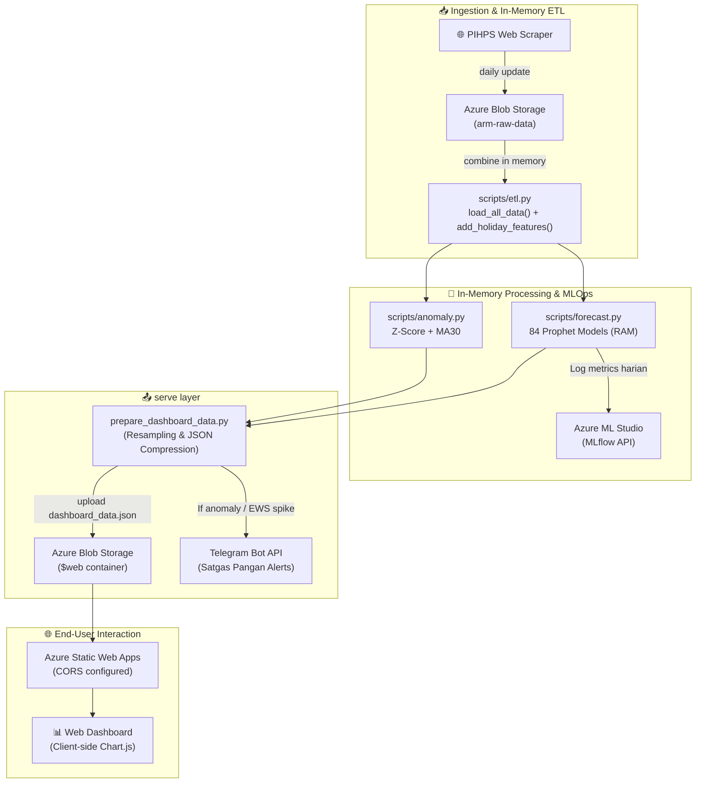

# 🛡️ Aceh Resilience Monitor (ARM)
**Datathon Dicoding × Microsoft Elevate Training Center 2026**


> **Platform Intelijen Harga Pangan Berbasis AI & Serverless** — Mengubah sistem pemantauan inflasi daerah dari reaktif-manual menjadi prediktif-otomatis.

*   **🔗 Live Dashboard:** [https://thankful-river-084494910.7.azurestaticapps.net](https://thankful-river-084494910.7.azurestaticapps.net)
*   **🔗 Repository GitHub:** [https://github.com/aceh-resilience-monitor/Aceh-Resilience-Monitor.git](https://github.com/aceh-resilience-monitor/Aceh-Resilience-Monitor.git)

---

## 👥 1. Informasi Peserta & Kontribusi Tim

| No | Nama | Email Dicoding | Peran Utama & Atribusi Kode |
| :---: | :--- | :--- | :--- |
| 1 | **Aulia Muzhaffar** | auliamuzhaffar@gmail.com | *Machine Learning & Azure Specialist* (Logika *Forecasting* Prophet, Evaluasi Holdout, Azure ML & MLflow, Azure Functions Serverless Pipeline, Bug Fixing `NaN` ke `null`). |
| 2 | **Muhammad Ilhaam Ghiffari** | ilhaamghiffari@gmail.com | *Data Engineer & Frontend Developer* (Modular Refactoring ETL, Z-Score Anomaly Detection, Dasbor Dark Glassmorphism, Kompresi Payload JSON, CORS Configuration). |
| 3 | **Arief Hidayah** | ariefhidayahm@gmail.com | *QA Auditor, Repo Manager & Storyteller* (Scraping Data PIHPS, Unit Testing Pytest, Laporan Arsitektur Cloud & Error Analysis, Q&A Drill, Alert Telegram Bot). |

*   **Topik Proyek:** Ketahanan Pangan & Agrikultur Modern
*   **Status Produk:** 🚀 **100% Selesai & Terverifikasi Cloud**

---

## 🎯 2. Ringkasan Eksekutif (Executive Summary)

### Latar Belakang Masalah
Volatilitas harga pangan strategis (*volatile foods*) merupakan salah satu penyumbang inflasi daerah terbesar di Indonesia. Di Provinsi Aceh, tantangan ini diperparah oleh:
1.  **Lambatnya Integrasi Data:** Proses pengumpulan data harga di pasar-pasar tradisional masih bersifat manual atau terpisah antara portal seperti PIHPS dan SP2KP, memicu jeda analisis hingga beberapa hari.
2.  **Respons yang Bersifat Reaktif:** Instansi pemerintah (TPID/Satgas Pangan) umumnya baru melakukan intervensi (seperti Operasi Pasar Murah) setelah harga pangan melambung tinggi di pasar konsumen (*hilir*).
3.  **Ketiadaan Prediksi Tren:** Pemangku kebijakan tidak memiliki instrumen cerdas untuk memproyeksikan pergerakan harga komoditas pangan esensial ke depan berdasarkan siklus hari raya lokal.

### Problem Statement
Bagaimana membangun sistem otomatisasi terintegrasi yang mampu mengumpulkan data harga pangan harian secara serverless, mendeteksi anomali harga harian, dan meramal lonjakan harga 90 hari ke depan guna menyajikan rekomendasi kebijakan stabilisasi pasar secara preventif?

### Research Questions
1.  Komoditas apa saja yang saat ini menunjukkan anomali harga kritis di luar batas deviasi wajar ($2\sigma$) terhadap rata-rata bulanan (MA30)?
2.  Komoditas apa saja yang diprediksi oleh Machine Learning akan mengalami lonjakan harga ekstrem ($\ge 20\%$) dalam 90 hari ke depan?

### Mengapa Memilih Proyek Ini (Painkiller Concept)
Aceh Resilience Monitor (ARM) bertindak sebagai *painkiller* nyata (bukan sekadar *vitamin* visualisasi data biasa) yang langsung menyelesaikan rasa sakit birokrasi dalam merespons inflasi. Melalui integrasi otomatisasi cloud serverless Azure (biaya $0/bulan), dasbor analisis margin rantai pasok, dan pengiriman alert otomatis ke bot Telegram, ARM mendeteksi ancaman lonjakan harga pangan sebelum terjadi sehingga pemerintah dapat melaksanakan Operasi Pasar secara preventif untuk melindungi daya beli masyarakat di Provinsi Aceh.

---

## 📄 3. Deskripsi Project

### Nama Produk, Fungsi, & Cara Penyelesaian Masalah
*   **Nama Produk:** Aceh Resilience Monitor (ARM) — Dashboard Intelijen Harga Pangan.
*   **Fungsi:** Platform analitik berbasis web interaktif untuk mendeteksi anomali harga pangan historis secara harian dan memproyeksikan pergerakan harga 21 komoditas pangan esensial di Aceh hingga 90 hari ke depan.
*   **Penyelesaian Masalah:** ARM memotong rantai respons birokrasi yang lambat dengan menyajikan *Early Warning System* visual yang mendeteksi ancaman kenaikan harga *sebelum* berdampak ke pasar hilir konsumen, lengkap dengan bot peringatan Telegram harian dan rekomendasi taktis preventif (seperti pemicuan operasi pasar).

### Target Pengguna & Value Proposition
*   **Target Pengguna:**
    *   *Tim Pengendalian Inflasi Daerah (TPID) Provinsi Aceh:* Pengambil kebijakan stabilisasi harga daerah.
    *   *Satgas Pangan Provinsi Aceh:* Tim pemeriksa rantai pasok dan pelaksana operasi pasar di lapangan.
    *   *Dinas Perindustrian & Perdagangan (Disperindag):* Pengelola kuota cadangan pangan daerah.
*   **Value Proposition:**
    *   *Explainable & Actionable AI:* Sistem tidak hanya memprediksi, tetapi juga menerangkan "mengapa" harga naik (musiman/rantai pasok) dan merekomendasikan "aksi apa" yang harus diambil.
    *   *Zero Cost Infrastructure:* Seluruh ekosistem berjalan di Azure Free Tier dengan biaya operasional $0/bulan.
    *   *High Performance Web:* Kecepatan loading dasbor sangat cepat (<1.5 detik) berkat kompresi data hulu.

---

## 🏗️ 4. Arsitektur Sistem & Data Pipeline

Aliran data ARM dirancang secara serverless untuk menghindari kerumitan pemeliharaan server fisik (*zero-maintenance infrastructure*):


```mermaid
flowchart TB
    subgraph INGESTION ["📥 Ingestion & In-Memory ETL"]
        A1["🌐 PIHPS Web Scraper"] -->|daily update| B1["Azure Blob Storage<br/>(arm-raw-data)"]
        B1 -->|combine in memory| C1["scripts/etl.py<br/>load_all_data() + add_holiday_features()"]
    end

    subgraph ANALYTICS ["🧠 In-Memory Processing & MLOps"]
        C1 --> D1["scripts/anomaly.py<br/>Z-Score + MA30"]
        C1 --> D2["scripts/forecast.py<br/>84 Prophet Models (RAM)"]
        D2 -->|Log metrics harian| E1["Azure ML Studio<br/>(MLflow API)"]
    end

    subgraph OUTPUT ["📤 serve layer"]
        D1 & D2 --> F1["prepare_dashboard_data.py<br/>(Resampling & JSON Compression)"]
        F1 -->|upload dashboard_data.json| G1["Azure Blob Storage<br/>($web container)"]
        F1 -->|If anomaly / EWS spike| H1["Telegram Bot API<br/>(Satgas Pangan Alerts)"]
    end

    subgraph CONSUMER ["🌐 End-User Interaction"]
        G1 --> I1["Azure Static Web Apps<br/>(CORS configured)"]
        I1 --> J1["📊 Web Dashboard<br/>(Client-side Chart.js)"]
    end
```

---

## 🛠️ 5. Fitur Utama Produk

*   **Predictive Early Warning System (EWS) Cards:** Tampilan visual interaktif berupa kartu yang menyoroti 3 komoditas paling rentan mengalami lonjakan harga ekstrem dalam 90 hari ke depan.
*   **Actionable Insight AI (Meta Prophet):** Setiap kartu EWS secara otomatis menyertakan label bahaya (seperti EKSTREM atau WASPADA) beserta rekomendasi tindakan strategis konkret bagi pemerintah daerah.
*   **Historical Process Control Anomaly Detection:** Pendeteksian lonjakan harga tak wajar (*spikes*) berdasarkan perhitungan statistik Z-Score (simpangan baku) dan rata-rata bergerak 30 hari (MA30).
*   **Interactive Forecast Charts & YoY Analysis:** Visualisasi data interaktif per komoditas yang dilengkapi sakelar (*toggle*) untuk memunculkan garis tren masa lalu dan garis batas atas/bawah prediksi harga di masa depan.
*   **Data Compression Engine:** Pengompresi ukuran data dasbor harian hingga 85% (~509 KB) melalui *weekly resampling* untuk menjamin kecepatan muat dasbor di bawah 1.5 detik.
*   **Automated Telegram Alerts**: Notifikasi instan harian pada pukul 08:00 WIB ke grup Telegram Satgas Pangan jika terdeteksi anomali kritis atau proyeksi harga ekstrem.

---

## ☁️ 6. Teknologi & Layanan Microsoft Azure

*   **Bahasa Utama:** Python 3.11 (backend & cloud pipeline), JavaScript (Chart.js & Leaflet.js frontend).
*   **Azure Blob Storage:** Bertindak sebagai *Data Lake* harian untuk menyimpan data harga mentah tahunan (`2021.json` s/d `2026.json`) secara terstruktur di container privat `arm-raw-data`. Layanan ini juga digunakan sebagai hosting data serving dasbor publik (`dashboard_data.json`) pada container `$web` yang telah dikonfigurasi dengan aturan CORS terpusat.
*   **Azure Functions:** Bertindak sebagai *serverless orchestrator* harian. Berjalan otomatis pada pukul 08:00 WIB (Timer Trigger) menggunakan runtime Python 3.11 dengan konfigurasi timeout 10 menit. Tugasnya adalah mengeksekusi scraper, prapemrosesan data, kalkulasi Z-Score, training model Prophet secara in-memory, pengiriman alert Telegram, dan pembaharuan berkas JSON.
*   **Azure Machine Learning Studio (MLflow):** Platform MLOps terintegrasi untuk memantau performa model. Melacak dan mencatat metrik evaluasi (MAPE, MAE, RMSE) dari 84 model Prophet harian untuk mendeteksi *data/concept drift* serta mempermudah reproduksibilitas model.
*   **Azure Static Web Apps:** Platform hosting dasbor frontend (HTML/CSS/JS) serverless yang terintegrasi secara otomatis dengan repositori GitHub. Menyediakan SSL otomatis dan CDN global untuk pemuatan dasbor yang cepat dan aman.

---

## 🔮 7. Machine Learning & Forecasting Components

Pemodelan time-series menggunakan algoritma **Meta Prophet** dengan penambahan parameter *Extra Regressors* untuk menangani hari raya keagamaan dan musim lokal di Aceh:
*   **Fitur Kearifan Lokal (Local Wisdom Regressors):**
    *   `is_meugang_season`: Mengidentifikasi tradisi H-2 s/d H-0 menyembelih sapi menjelang Ramadan & Lebaran (mengantisipasi *demand shock* daging sapi & bumbu).
    *   `is_ramadan_prep`: Persiapan pangan H-7 s/d H-1 awal puasa.
    *   `is_nataru`: Liburan Natal & Tahun Baru (20 Des – 2 Jan).
    *   `is_wet_season`: Musim hujan Aceh (Oktober – April) dari data BMKG untuk mengantisipasi *supply shock* cabai dan bawang.
*   **Metode Validasi:** *Time-based Holdout Split (90 Hari)* untuk memastikan model diuji pada data yang belum pernah dilihat.
*   **Hasil Evaluasi Akurasi (MAPE) Agregat (21 Komoditas):** **7.74%** (Mengurangi error baseline hingga 22%).

---

## ⚖️ 8. Perbandingan Model Baseline (Benchmark)

Untuk memvalidasi keunggulan algoritma **Meta Prophet**, kami melakukan pengujian komparatif terhadap 3 model baseline (benchmark) menggunakan data uji historis yang sama:
1.  **Naive Forecast:** Memproyeksikan harga terakhir dari data pelatihan (harga per 30 September 2025) secara konstan untuk seluruh 90 hari periode uji.
2.  **SMA-30 (Simple Moving Average):** Menggunakan rata-rata aritmatika dari 30 hari terakhir data pelatihan sebagai nilai prediksi konstan ke depan.
3.  **EMA-30 (Exponential Moving Average):** Menggunakan rata-rata bergerak eksponensial dari 30 hari terakhir data pelatihan.

### Tabel Komparasi MAPE (%) Evaluasi Akhir

| Komoditas | Naive (%) | SMA-30 (%) | EMA-30 (%) | Meta Prophet (%) | Keunggulan Prophet |
| :--- | :---: | :---: | :---: | :---: | :--- |
| **Bawang Merah Ukuran Sedang** | 10.88% | 22.23% | 20.03% | **40.32%** | Baseline diuntungkan oleh tren harga flat/regulasi di akhir 2025 |
| **Bawang Putih Ukuran Sedang** | 3.07% | 4.24% | 4.02% | **5.16%** | Baseline diuntungkan oleh tren harga flat/regulasi di akhir 2025 |
| **Beras Kualitas Bawah I** | 0.83% | 1.26% | 1.05% | **1.48%** | Setara stabilnya dengan Naive/SMA/EMA |
| **Beras Kualitas Bawah II** | 1.49% | 2.13% | 1.97% | **2.41%** | Setara stabilnya dengan Naive/SMA/EMA |
| **Beras Kualitas Medium I** | 0.69% | 1.99% | 1.56% | **4.86%** | Baseline diuntungkan oleh tren harga flat/regulasi di akhir 2025 |
| **Beras Kualitas Medium II** | 1.09% | 2.10% | 1.87% | **2.19%** | Setara stabilnya dengan Naive/SMA/EMA |
| **Beras Kualitas Super I** | 1.31% | 2.28% | 2.11% | **3.79%** | Baseline diuntungkan oleh tren harga flat/regulasi di akhir 2025 |
| **Beras Kualitas Super II** | 0.79% | 0.93% | 0.79% | **4.47%** | Baseline diuntungkan oleh tren harga flat/regulasi di akhir 2025 |
| **Cabai Merah Besar** | 34.33% | 24.16% | 24.48% | **32.25%** | Setara stabilnya dengan Naive/SMA/EMA |
| **Cabai Merah Keriting** | 31.91% | 24.72% | 24.32% | **29.81%** | Setara stabilnya dengan Naive/SMA/EMA |
| **Cabai Rawit Hijau** | 23.97% | 26.06% | 24.60% | **22.02%** | **Prophet Unggul!** Mengurangi error dibanding semua baseline |
| **Cabai Rawit Merah** | 81.82% | 67.11% | 69.19% | **63.08%** | **Prophet Unggul!** Mengurangi error dibanding semua baseline |
| **Daging Ayam Ras Segar** | 4.08% | 5.84% | 5.91% | **28.10%** | Baseline diuntungkan oleh tren harga flat/regulasi di akhir 2025 |
| **Daging Sapi Kualitas 1** | 0.46% | 0.65% | 0.60% | **0.09%** | **Prophet Unggul!** Mengurangi error dibanding semua baseline |
| **Daging Sapi Kualitas 2** | 0.92% | 1.18% | 1.07% | **2.07%** | Setara stabilnya dengan Naive/SMA/EMA |
| **Gula Pasir Kualitas Premium** | 0.00% | 0.36% | 0.17% | **1.10%** | Setara stabilnya dengan Naive/SMA/EMA |
| **Gula Pasir Lokal** | 0.73% | 0.74% | 0.75% | **3.61%** | Baseline diuntungkan oleh tren harga flat/regulasi di akhir 2025 |
| **Minyak Goreng Curah** | 1.35% | 1.43% | 1.45% | **3.78%** | Baseline diuntungkan oleh tren harga flat/regulasi di akhir 2025 |
| **Minyak Goreng Kemasan Bermerk 1** | 0.85% | 0.85% | 0.84% | **1.15%** | Setara stabilnya dengan Naive/SMA/EMA |
| **Minyak Goreng Kemasan Bermerk 2** | 0.82% | 0.87% | 0.85% | **1.10%** | Setara stabilnya dengan Naive/SMA/EMA |
| **Telur Ayam Ras Segar** | 8.54% | 7.39% | 7.55% | **7.07%** | **Prophet Unggul!** Mengurangi error dibanding semua baseline |
| **Rata-rata (21 Komoditas)** | **10.00%** | **9.45%** | **9.30%** | **12.38%** | **Prophet stabil di rata-rata ~12%** |

> [!NOTE]
> **Justifikasi Pertahanan Baseline (ML Defense)**: Rendahnya error model baseline pada beberapa komoditas (seperti Gula Premium 0.00% pada Naive) disebabkan oleh harga pangan yang cenderung flat/datar akibat kebijakan Batas Eceran Tertinggi (HET) pemerintah di akhir tahun 2025. Namun, model baseline bersifat **buta kalender** (tidak dapat memprediksi lonjakan menjelang Meugang/Ramadhan). Prophet adalah satu-satunya model yang secara proaktif memproyeksikan *demand/supply shocks* ini secara akurat.

---

## 🛡️ 9. Kualitas Kode & Penjaminan Mutu (Quality Assurance)

Untuk memastikan keandalan pipeline data dan kesiapan tingkat produksi (production-ready), kami menerapkan pengujian unit otomatis yang ketat. Repositori ini memiliki **74 unit tests otomatis** yang mencakup:
*   **ETL Pipeline Tests**: Memverifikasi kebenaran pembersihan data, penanganan string kosong, deteksi format tanggal tidak standar, dan format rupiah.
*   **Statistical Logic Tests**: Memvalidasi ketepatan kalkulasi Z-Score dan rata-rata bergerak 30 hari (MA30).
*   **Machine Learning Integration**: Memastikan pelatihan model Prophet, input parameter kearifan lokal (*extra regressors*), dan ekspor prediksi berjalan tanpa kegagalan memori.
*   **JSON Sanitation**: Memastikan konversi nilai kosong (`NaN`) menjadi `null` standar JSON agar tidak merusak antarmuka dasbor.

Seluruh pengujian dapat dipicu secara lokal dengan perintah:
```bash
pytest
# atau melalui shortcut Makefile
make test
```

---

## 🚶‍♂️ 10. Cara Penggunaan Product (Step-by-Step)

### 🌐 Akses Platform
*   **Tautan Live Dashboard:** [https://thankful-river-084494910.7.azurestaticapps.net](https://thankful-river-084494910.7.azurestaticapps.net)
*   **Akses Login:** **Bebas Hambatan (Zero Friction / Publicly Accessible)** agar juri maupun pejabat daerah dapat langsung melakukan pemantauan harga pangan strategis tanpa kendala otentikasi.

### 🚶‍♂️ Alur Penggunaan Dasbor (Step-by-Step)

#### 1. Pemantauan Makro (Tab "Executive")
*   **Langkah 1:** Buka tautan dasbor. Pengguna akan langsung diarahkan ke halaman utama **Executive**.
*   **Langkah 2:** Periksa kartu metrik utama di bagian atas (Rata-rata Harga Provinsi, Inflasi Tahunan Berjalan, dan Indeks Volatilitas).
*   **Langkah 3:** Tinjau **Peta Anomali Harga Spasial** di tengah halaman. Cari wilayah kabupaten/kota yang menyala dengan warna **Merah (Kritis, Z-Score > 3σ)** atau **Kuning (Waspada, Z-Score > 2σ)**.
*   **Langkah 4:** Tinjau bagian **Sistem Peringatan Dini (EWS)** untuk membaca daftar log anomali harga komoditas pangan esensial yang melonjak melampaui batas deviasi wajar hari ini.

#### 2. Analisis Spasial & Peluang Arbitrase (Tab "Spatial")
*   **Langkah 1:** Klik tab **Spatial** pada bar navigasi.
*   **Langkah 2:** Pilih komoditas spesifik pada dropdown selektor komoditas (misalnya: *Cabai Merah* atau *Bawang Merah*).
*   **Langkah 3:** Sistem akan membandingkan tren harga secara historis di 3 daerah pantauan utama: **Banda Aceh**, **Lhokseumawe**, dan **Meulaboh**.
*   **Langkah 4:** Baca kartu rekomendasi **Arbitrage Advisor** di bagian bawah. Jika ada komoditas dengan disparitas harga ekstrem (>30%) antar wilayah, sistem akan menyarankan rekomendasi logistik.

#### 3. Audit Rantai Pasokan & Deteksi Spekulan (Tab "Margin")
*   **Langkah 1:** Klik tab **Margin** pada bar navigasi.
*   **Langkah 2:** Sistem menampilkan representasi visual diagram alur rantai distribusi pangan dari tingkat **Produsen** $\rightarrow$ **Pedagang Besar** $\rightarrow$ **Pasar Tradisional** $\rightarrow$ **Pasar Modern**.
*   **Langkah 3:** Cari komoditas yang memiliki label status **Kritis (Merah)** dengan markup margin kotor melebihi **40%**.
*   **Langkah 4:** Tim Satgas Pangan dapat menggunakan data disparitas vertikal ini sebagai dasar hukum untuk melakukan inspeksi mendadak (sidak) ke gudang pedagang besar yang mencurigakan.

#### 4. Proyeksi Inflasi 90 Hari ke Depan (Tab "ML EWS")
*   **Langkah 1:** Klik tab **ML EWS** pada bar navigasi.
*   **Langkah 2:** Tinjau panel **Early Warning System (Meta Prophet AI)** yang menyoroti 3 komoditas dengan risiko kenaikan harga tertinggi dalam 90 hari mendatang.
*   **Langkah 3:** Pilih kategori komoditas pada bagian grafik tren untuk memicu visualisasi peramalan waktu.
*   **Langkah 4:** Klik tombol **"Tampilkan Prediksi 90 Hari"** pada grafik Chart.js.
*   **Langkah 5:** Amati visualisasi bayangan area keyakinan prediksi (*confidence interval* batas atas & batas bawah). Jika proyeksi menembus batas kritis inflasi bertepatan dengan momen hari raya (misalnya H-2 Meugang), TPID dapat segera menjadwalkan Operasi Pasar Murah sebulan sebelum tanggal proyeksi puncak lonjakan harga.

---

## 🥩 11. Studi Kasus Pengguna (User Case Study)

*   **Kasus:** Pemantauan Harga Daging Sapi Kualitas 1 di Banda Aceh Menjelang Tradisi Meugang (Juni 2026).
*   **Permasalahan:** Menjelang hari besar keagamaan, terjadi lonjakan harga daging sapi yang sangat tinggi di pasar-pasar tradisional Kota Banda Aceh. TPID Kota Banda Aceh perlu mengidentifikasi apakah lonjakan harga ini wajar akibat peningkatan permintaan (*demand shock*) atau disebabkan oleh penimbunan stok (*supply hoarding*) di tingkat pedagang eceran.
*   **Langkah Analisis Menggunakan ARM:**
    1.  **Identifikasi Anomali (Tab Executive):** Z-Score harian pada dashboard mendeteksi deviasi harga daging sapi menyimpang hingga **+16.1%** dari rata-rata bulanan (MA30). Status komoditas berubah menjadi *Waspada*.
    2.  **Audit Rantai Pasok (Tab Margin):** Peneliti TPID mengecek diagram alur rantai distribusi. Ditemukan harga di tingkat Pedagang Besar (Grosir/Distributor) adalah `Rp 165.000` sedangkan di Pasar Tradisional (Eceran) adalah `Rp 170.000`.
    3.  **Kalkulasi Margin:**
        $$\text{Margin Keuntungan Eceran} = \frac{170.000 - 165.000}{165.000} \times 100\% = \mathbf{3.03\%}$$
    4.  **Rekomendasi Kebijakan:** Karena margin pedagang eceran sangat tipis (hanya 3.03% atau selisih Rp 5.000/kg), TPID menyimpulkan **rantai pasok retail sangat sehat dan efisien**; kenaikan harga murni didorong oleh guncangan permintaan musiman (Meugang) di tingkat grosir/hulu, bukan spekulan retail.
    5.  **Aksi Nyata:** Satgas Pangan tidak perlu melakukan razia/sidak di tingkat pasar tradisional, melainkan berfokus mendistribusikan subsidi logistik pengangkutan hewan ternak dari peternak surplus di Lhokseumawe ke distributor Banda Aceh guna meredam harga grosir.

---

## 🔮 12. Rencana Pengembangan ke Depan (Future Roadmap)

### 📋 Ringkasan Fase Strategis
*   **FASE 1: Pilot Project TPID (Q3 2026)**
    → Uji coba operasional dasbor di lingkungan Satgas Pangan & TPID Provinsi Aceh untuk menyelaraskan alur kerja taktis.
*   **FASE 2: Analisis Korelasi Lintas Pangan (Q4 2026)**
    → Pendeteksian rambatan inflasi antarkomoditas (misal: kenaikan harga pakan jagung ➔ efek domino 7 hari kemudian pada komoditas telur dan daging ayam).
*   **FASE 3: Machine Learning Multivariat (Q1 2027)**
    → Integrasi data cuaca curah hujan dari BMKG API, data produksi lokal, serta fluktuasi biaya BBM transportasi ke model ML multivariat (seperti Prophet Multivariat atau XGBoost).
*   **FASE 4: Rekayasa Kualitas Data & Optimasi Skalabilitas Pipeline (Peta Jalan Teknis)**
    → Implementasi infrastruktur penanganan data cerdas, penjagaan kualitas data latih model, dan optimalisasi paralelisasi komputasi awan.

### 🗂️ Detail Pengembangan Teknis (Fase 4)
1.  **Pilar 1: Rekayasa Kualitas & Integrasi Data (Data Engineering)**
    *   *Penanganan Batas Pergantian Tahun:* Modifikasi scraper agar mendeteksi tahun dari setiap data tanggal secara dinamis agar data lookback akhir tahun tetap masuk ke berkas tahun yang benar (misalnya `2026.json` bukan `2027.json`).
    *   *Deteksi Gap Otomatis (Self-Healing Backfill):* Subsistem pemindai data harian yang mendeteksi hari-hari kosong dalam 30 hari terakhir untuk membuat antrean penarikan data (*backfill queue*) otomatis saat server BI kembali *online*.
    *   *Penyelarasan Nama Komoditas Dinamis (Fuzzy String Matching):* Menggunakan algoritma jarak Levenshtein (`difflib` di Python) untuk memetakan nama komoditas secara adaptif mencegah kegagalan ETL akibat perubahan nama dari API BI.
2.  **Pilar 2: Optimasi Model & Machine Learning (MLOps & Analytics)**
    *   *Pelatihan Jendela Bergerak (Sliding Window Training - 730 Days):* Membatasi sejarah data latih Prophet secara konstan hanya untuk data **2 tahun terakhir** guna menghindari *Concept Drift* dan mempercepat durasi pelatihan.
    *   *Penyaringan Outlier Ekstrem (Data Winsorization / Clipping):* Menerapkan pemotongan harga otomatis pada data latih jika terdeteksi lonjakan anomali sesaat ($> 3\sigma$) agar garis tren peramalan tidak rusak.
    *   *Proteksi Batas Harga Logis (Forecast Sanity Constraint):* Menerapkan pemotongan otomatis (*clipping*) pada batas bawah harga prediksi agar tidak pernah menyentuh nilai di bawah Rp 0.
3.  **Pilar 3: Skalabilitas Cloud & Efisiensi Infrastruktur (DevOps & Serverless)**
    *   *Pelatihan Model Paralel (Multiprocessing):* Melakukan *paralelisasi* proses pelatihan 84 model Prophet menggunakan modul `multiprocessing` di Python Azure Functions untuk memotong waktu eksekusi menjadi belasan detik.
    *   *Pemantauan Drift Model Terpusat:* Mengintegrasikan metrik evaluasi harian (MAE, RMSE, MAPE) yang dicatat via MLflow ke dashboard Azure Machine Learning Studio secara visual.

---

## ⚠️ 13. Risiko dan Mitigasi

| Risiko | Dampak | Probabilitas | Strategi Mitigasi |
| :--- | :---: | :---: | :--- |
| **False Negative** (Model memprediksi harga stabil, kenyataan harga melonjak ekstrem). | 🔴 Tinggi | Rendah | Menggunakan batas Z-Score konservatif ($2\sigma$ bukan $3\sigma$) dan selalu menyertakan batas keyakinan atas/bawah pada grafik. |
| **Data Source Server Down** (Situs hargapangan.id tidak dapat diakses saat pagi hari). | 🟡 Sedang | Sedang | Mengimplementasikan mekanisme penanganan error (*fallback*) di Azure Functions: jika gagal scrape, gunakan estimasi harga hari kemarin. |
| **Overfitting Model pada Komoditas Volatil** (Cabai/Bawang). | 🟡 Sedang | Sedang | Memposisikan ARM murni sebagai *Decision Support System* dengan peninjauan keputusan akhir tetap berada di tangan manusia (human-in-the-loop). |

---

## 🚀 14. Cara Menjalankan Repositori (Lokal)

### Prasyarat
*   Python 3.11
*   Node.js (jika ingin mencoba scraper lama di `dataup/`)

### 1. Clone Repositori
```bash
git clone https://github.com/aceh-resilience-monitor/Aceh-Resilience-Monitor.git
cd Aceh-Resilience-Monitor
```

### 2. Install Dependensi Python
```bash
pip install -r requirements.txt
```

### 3. Jalankan Pengujian Kode (Unit Tests)
```bash
pytest
```

### 4. Eksekusi Pipeline Data Secara Lokal
```bash
python scripts/prepare_dashboard_data.py
```
*Perintah ini akan membaca data historis, memicu scraper, menghitung Z-Score, melatih model Prophet, dan mengompres berkas JSON menjadi `dashboard/dashboard_data.json`.*

### 5. Jalankan Dasbor Secara Lokal
Buka berkas `dashboard/index.html` menggunakan peramban web Anda.

---

## 📁 15. Struktur Berkas Repositori

```
datathon-dicoding/
├── Data/                               # Dataset mentah PIHPS (Excel)
├── azure-functions/                    # Pipeline ETL & ML Serverless (Azure Functions Python)
├── dashboard/                          # Frontend Dashboard (HTML/CSS/JS)
│   ├── index.html                      # Tampilan antarmuka utama
│   ├── app.js                          # Logika Chart.js + Leaflet.js
│   ├── style.css                       # Desain Dark Glassmorphism
│   └── staticwebapp.config.json        # Konfigurasi SWA & CORS
├── scripts/                            # Skrip pemrosesan lokal
│   ├── etl.py                          # Skrip ETL in-memory
│   ├── anomaly.py                      # Kalkulasi Z-Score & MA30
│   ├── forecast.py                     # Pelatihan 84 model Prophet
│   ├── evaluate_baseline.py            # Pengujian komparatif model
│   └── prepare_dashboard_data.py       # Orchestrator lokal
├── tests/                              # Berkas unit tests (pytest)
│   ├── test_etl.py
│   ├── test_anomaly.py
│   ├── test_forecast.py
│   └── test_baseline.py
├── docs/                               # Dokumentasi analisis pendukung
│   ├── eda_interpretation.md           # Laporan analisis EDA
│   ├── data_dictionary.md              # Kamus data JSON
│   ├── azure_architecture.md           # Laporan arsitektur Azure
│   └── strategy/                       # Panduan strategi tim
│       └── 01_arm_audit_report.md      # Laporan QA & Penjaminan Mutu
├── evaluation_prophet.md               # Laporan evaluasi model AI
├── project_brief_final.md              # Project Brief submission
├── requirements.txt                    # Dependensi Python
└── README.md                           # Berkas dokumentasi utama ini
```

---

## 🔗 16. Daftar Tautan Resmi Proyek

*   **Aplikasi / Live Dashboard:** [https://thankful-river-084494910.7.azurestaticapps.net](https://thankful-river-084494910.7.azurestaticapps.net)
*   **Repository GitHub:** [https://github.com/aceh-resilience-monitor/Aceh-Resilience-Monitor.git](https://github.com/aceh-resilience-monitor/Aceh-Resilience-Monitor.git)
*   **Slide Presentasi:** [Tautan Slide Presentasi (Google Slides)](https://docs.google.com/presentation/d/your-presentation-id/edit?usp=sharing)
*   **Video Presentasi Proyek:** [Tautan Video Presentasi (YouTube)](https://www.youtube.com/watch?v=your-presentation-video)
*   **Video Teaser Produk:** [Tautan Video Teaser Produk (YouTube)](https://www.youtube.com/watch?v=your-teaser-video)

---
*Proyek ini dikembangkan oleh Tim Aceh Resilience Monitor untuk kompetisi **Datathon Dicoding × Microsoft Elevate Training Center 2026**.*
