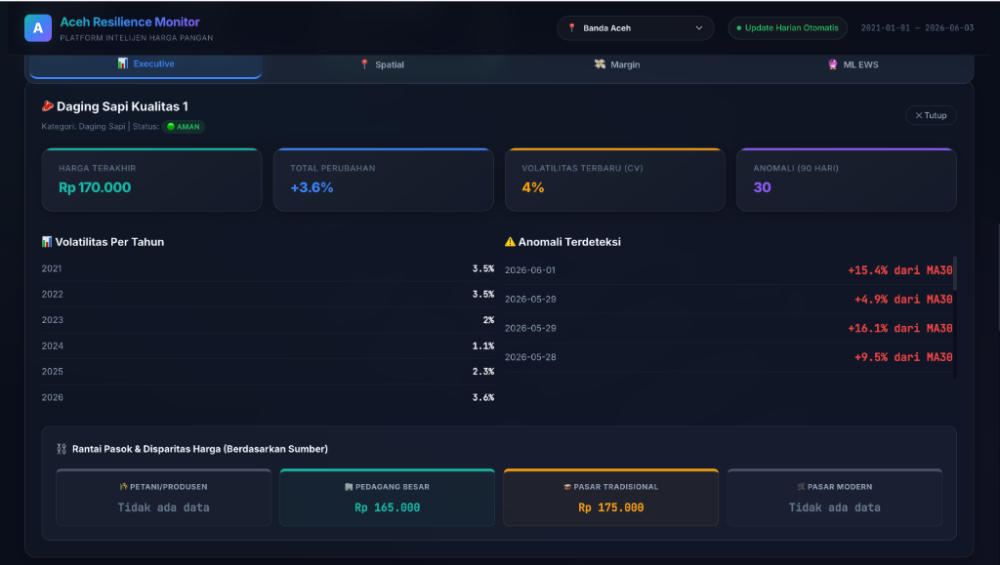
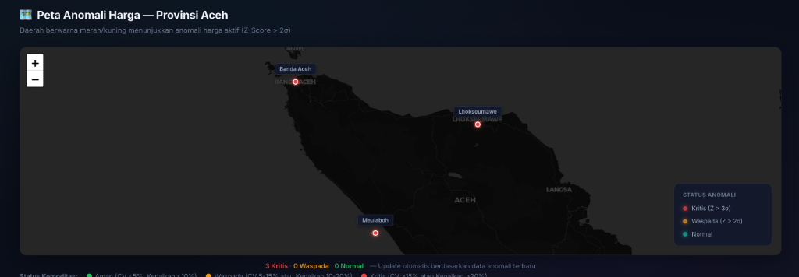
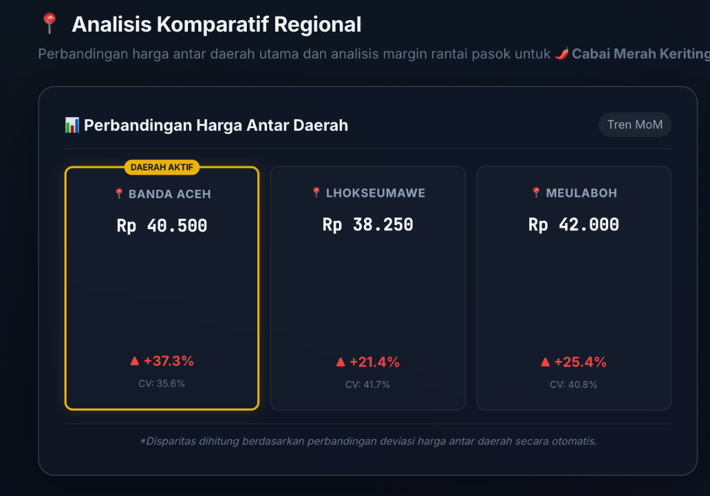
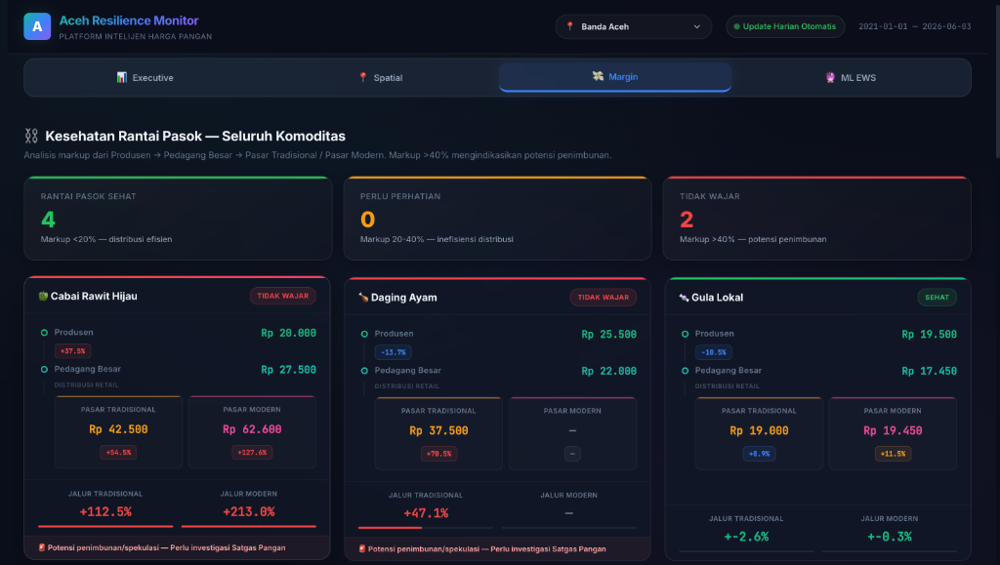

# 📝 Catatan Presentasi Juri — Aceh Resilience Monitor (ARM)

## 📌 Pertanyaan Populer: Deteksi Anomali
### *"Bagaimana cara model mendeteksi anomali harga pangan?"*
> **Jawaban:** 
> "Model kami mendeteksi anomali harga pada seluruh data historis (sejak 2021) menggunakan metode Z-Score berbasis Moving Average 30 hari (MA30) dengan threshold deviasi $2\sigma$. Namun, untuk KPI Card di Dashboard, kami memfilternya khusus untuk 90 hari terakhir agar dapat memberikan gambaran situasi kerawanan harga yang paling mutakhir (real-time)."

---

## 📌 Detail Teknis Singkat:
1. **Asal Data**: 
   - Historis (2023–2025) dari Excel PIHPS.
   - Real-time (2026) diperoleh secara harian dari portal web resmi pangan via script scraper Node.js (`dataup/`).
2. **Model Forecasting**:
   - Menggunakan **Meta Prophet** untuk meramal harga 90 hari ke depan secara per-daerah (Banda Aceh, Lhokseumawe, Meulaboh).
   - Dilengkapi **kearifan lokal (Local Wisdom Extra Regressors)**: `is_meugang_season` (H-2 s/d H-0 Ramadan/Lebaran), `is_ramadan_prep` (7 hari menjelang Ramadan), `is_nataru` (libur akhir tahun), dan `is_wet_season` (pengaruh cuaca hujan terhadap panen).
3. **Kesehatan Rantai Pasok**:
   - Diukur dengan **Koefisien Variasi (CV)** selisih harga antar daerah. Jika CV di bawah 30%, distribusi dinilai sehat dan merata.

---

## 📌 Penjelasan Isi Card Status Komoditas (Penting!):
Jika juri menunjuk salah satu Card Komoditas (misal: *Beras Bawah I Rp 15.275*):
1.  **Harga Utama (misal: *Rp 15.275*)**:
    - Merupakan **rata-rata harga eceran tingkat provinsi** pada **tanggal terakhir data masuk** (saat ini 3 Juni 2026).
    - Dihitung dengan merata-ratakan harga di 3 Daerah utama (Banda Aceh, Lhokseumawe, Meulaboh) dan **hanya bersumber dari Pasar Tradisional & Pasar Modern**.
2.  **Persentase (misal: `+20.9%`)**:
    - Persentase perubahan harga rata-rata tahun terbaru (2026) dibandingkan dengan 3 tahun yang lalu (2023) khusus untuk level pasar eceran konsumen.
3.  **CV (misal: `CV 0.8%`)**:
    - *Coefficient of Variation* sepanjang tahun berjalan (2026) untuk menilai kestabilan harga eceran (semakin kecil, semakin stabil. Batas aman BPS $<15\%$).
4.  **Bubble Berwarna & Angka (misal: `22`)**:
    - Jumlah kasus anomali harga (lonjakan/penurunan ekstrem di luar batas wajar $2\sigma$) yang terjadi pada komoditas tersebut dalam **90 hari terakhir**.

---

## 📊 Simulasi Perhitungan Nyata (Studi Kasus: Beras Bawah I)
Jika juri meminta simulasi angka konkret di database:

### 1. Harga Utama (Rp 15.275)
*   **Sumber**: Rata-rata harga seluruh daerah pada tanggal terakhir (**03 Juni 2026**) yang bersumber dari **Pasar Tradisional** dan **Pasar Modern**.
*   **Data Riil**:
    - Banda Aceh (Modern: `15.500`, Tradisional: `14.600`)
    - Meulaboh (Modern: `15.950`, Tradisional: `15.050`)
    *(Lhokseumawe pada tanggal ini tidak memiliki rekaman data Pasar Tradisional/Modern untuk Beras Bawah I, sedangkan Pedagang Besar disaring keluar dari Card Utama)*
*   **Kalkulasi**:
    $$\text{Rata-rata} = \frac{15.500 + 14.600 + 15.950 + 15.050}{4\text{ data}} = \frac{61.100}{4} = \mathbf{Rp\ 15.275}$$

### 2. Persentase Kenaikan (+20.9%)
*   **Sumber**: Selisih rata-rata tahunan 2026 vs 2023 (Khusus Pasar Tradisional & Modern).
    - **Rata-rata Harga 2023 ($P_{2023}$)**: `Rp 12.700,95` (Dihitung dari rata-rata harga harian tingkat provinsi selama 365 hari penuh di tahun 2023).
    - **Rata-rata Harga 2026 ($P_{2026}$)**: `Rp 15.355,26` (Dihitung dari rata-rata harga harian tingkat provinsi sepanjang tahun berjalan, 1 Jan s.d. 3 Juni 2026).
*   **Kalkulasi**:
    $$\text{Kenaikan} = \frac{15.355,26 - 12.700,95}{12.700,95} \times 100\% = \mathbf{+20,90\%}\ \text{(UI: +20.9\%)}$$
*   **Justifikasi Analitis (PENTING untuk Juri)**:
    - Membandingkan rata-rata tahunan adalah metode standar **BPS/Bank Indonesia** untuk mengukur **kenaikan harga struktural/jangka panjang**.
    - Metode ini melakukan *noise smoothing* (meredam fluktuasi harga harian yang ekstrim akibat cuaca buruk atau hambatan logistik sesaat), sehingga persentase kenaikan yang ditampilkan murni mencerminkan pergeseran permanen pada daya beli masyarakat, bukan gejolak harga musiman sesaat.

### 3. Volatilitas / CV (CV 0.8%)
*   **Sumber**: Koefisien Variasi tahun berjalan 2026 (Khusus Pasar Tradisional & Modern).
    - Rata-rata Harga 2026 ($\mu$): `Rp 15.355,26`
    - Standar Deviasi 2026 ($\sigma$): `126,12`
*   **Kalkulasi**:
    $$CV = \frac{126,12}{15.355,26} \times 100\% = \mathbf{0,82\%}\ \text{(UI: 0.8\%)}$$
    *(Nilai CV sangat kecil (<15%), menunjukkan harga eceran Beras Bawah I di tahun 2026 cenderung sangat stabil dan distribusinya merata, meskipun secara kumulatif telah mengalami kenaikan permanen dibanding 2023).*

---

## 🥩 Studi Kasus Riil: Daging Sapi Kualitas 1 (Banda Aceh)

Berikut adalah contoh pembacaan data dan analisis ekonomi pangan dari kartu detail Daging Sapi Kualitas 1 di daerah Banda Aceh (berdasarkan visualisasi dashboard):



### 1. Informasi Utama & Status
*   **Komoditas**: Daging Sapi Kualitas 1 (Kategori: Daging Sapi).
*   **Status**: `🟢 AMAN`
*   **Maksud**: Secara keseluruhan sepanjang tahun berjalan (2026), tingkat kestabilan harga daging sapi di Banda Aceh masuk kategori **Aman** karena tingkat fluktuasinya (CV) masih jauh di bawah ambang batas kerawanan.

### 2. Baris Utama: 4 KPI Cards
*   **Harga Terakhir (`Rp 170.000`)**:
    - Harga eceran aktual terakhir (per 3 Juni 2026) yang dihadapi konsumen di Banda Aceh.
    - Dihitung dari rata-rata harga Pasar Tradisional (`Rp 170.000`) & Pasar Modern (`Tidak ada data`). Menggunakan pembagi dinamis 1, didapat Rp 170.000.
*   **Total Perubahan (`+3.6%`)**:
    - Kenaikan harga rata-rata tahun 2026 berjalan dibandingkan rata-rata tahun 2023. Kenaikan struktural jangka panjangnya sebesar **+3.6%** (sangat wajar untuk rentang waktu 3 tahun).
*   **Volatilitas Terbaru/CV (`4%`)**:
    - Tingkat gejolak harga daging sapi di tahun 2026 adalah **4%**. Karena nilainya jauh di bawah standar aman BPS (15%), pergerakan harga harian daging sapi dinilai sangat stabil.
*   **Anomali 90 Hari (`30`)**:
    - Terdeteksi 30 kali kasus lonjakan/penurunan harga ekstrem di luar batas wajar statistik ($|Z| > 2$ dari tren bulanan MA30) dalam 3 bulan terakhir.

### 3. Volatilitas Per Tahun (Kiri Tengah)
*   **Data**: 2021 (`3.5%`), 2022 (`3.5%`), 2023 (`2%`), 2024 (`1.1%`), 2025 (`2.3%`), 2026 (`3.6%`).
*   **Maksud**: Fluktuasi harga daging sapi secara tahunan selalu stabil dan aman (semua CV di bawah 15%). Volatilitas paling stabil terjadi pada tahun 2024 (1.1%) dan sedikit meningkat di tahun 2026 berjalan (3.6%) akibat adanya guncangan harga seasonal baru-baru ini.

### 4. Anomali Terdeteksi (Kanan Tengah)
*   **Data**: 1 Juni (`+15.4%`), 29 Mei (`+4.9%` & `+16.1%`), 28 Mei (`+9.5%`).
*   **Narasi Ekonomi Pangan**: Terjadi lonjakan harga beruntun yang ekstrem pada akhir Mei hingga awal Juni 2026 (menyimpang hingga **+16.1%** dari rata-rata bulanan MA30).
*   **Penyebab Riil**: Akhir Mei/awal Juni 2026 bertepatan dengan **Tradisi Meugang** (menyambut hari raya/puasa). Lonjakan drastis ini adalah *Demand Shock* (lonjakan permintaan) daging sapi yang sangat khas di Aceh. Model AI Z-Score kita sukses menangkap anomali musiman ini secara akurat.

### 5. Rantai Pasok & Disparitas Harga (Bawah)
*   **Data Sumber**:
    - Petani/Produsen: `Tidak ada data`
    - Pedagang Besar (Distributor): `Rp 165.000`
    - Pasar Tradisional (Eceran): `Rp 170.000`
    - Pasar Modern: `Tidak ada data`
*   **Kalkulasi Margin Rantai Pasok**:
    $$\text{Margin Keuntungan} = \frac{\text{Harga Eceran} - \text{Harga Grosir}}{\text{Harga Grosir}} \times 100\%$$
    $$\text{Margin} = \frac{170.000 - 165.000}{165.000} \times 100\% = \mathbf{+3.03\% \ (\approx 3.0\% \text{ atau selisih Rp 5.000})}$$
*   **Justifikasi Kebijakan TPID (Bahan Presentasi)**:
    - Margin penyebaran harga dari distributor ke retail hanya **3.0%** (selisih Rp 5.000). Ini membuktikan **Rantai Pasok Daging Sapi di Banda Aceh sangat sehat dan efisien**. 
    - Tidak ada indikasi *asymmetric information* (penahanan barang) atau markup harga yang berlebihan oleh pedagang eceran di pasar tradisional. Kenaikan harga murni didorong oleh harga distributor di hulu, bukan permainan spekulan retail.

---

## 📚 Landasan Ilmiah & Standar Institusional (Dasar Teori untuk Juri)
Jika juri menanyakan landasan akademis atau regulasi dari formula yang digunakan:

### 1. Koefisien Variasi (CV) untuk Volatilitas
*   **Landasan**: Standar analisis **Badan Pusat Statistik (BPS)** dan **Bank Indonesia (BI)** dalam laporan inflasi komoditas bergejolak (*volatile foods*).
*   **Kriteria**: BPS menetapkan komoditas pangan aman jika fluktuasi tahunannya memiliki $CV < 15\%$. Jika $CV \ge 15\%$, komoditas dinilai rentan/bergejolak.
*   **Alasan Statistik**: Formula $CV = (\sigma / \mu) \times 100\%$ membagi standar deviasi ($\sigma$) dengan rata-rata ($\mu$). Ini menghilangkan dimensi nominal uang (rupiah) sehingga volatilitas beras (harga Rp 15.000) dan daging sapi (harga Rp 140.000) dapat dibandingkan secara setara (apel-ke-apel).

### 2. Deteksi Anomali (Z-Score + MA30)
*   **Landasan**: **Shewhart Control Charts (1924)** (Teori Pengendalian Kualitas Industri oleh Walter A. Shewhart) & **Teori Distribusi Normal**.
*   **Metodologi**:
    - Moving Average 30 Hari (MA30) bertindak sebagai baseline dinamis agar perubahan harga harian diukur relatif terhadap tren bulanan terkini (menghindari bias musiman).
    - Threshold Z-Score $\pm 2\sigma$ ($|Z| > 2$) menandakan kejadian di luar batas normal dengan probabilitas kejadian $< 5\%$ (Status Waspada).
    - Threshold Z-Score $\pm 3\sigma$ ($|Z| > 3$) menandakan kejadian sangat langka dengan probabilitas $< 0.3\%$ (Status Kritis).

### 3. Kesehatan Rantai Pasok (CV Antar Daerah / Spasial)
*   **Landasan**: Analisis Disparitas Harga Wilayah oleh **Kementerian Perdagangan RI** dan **TPID**.
*   **Metodologi**: Mengukur standar deviasi harga antar daerah (Banda Aceh, Lhokseumawe, Meulaboh).
*   **Kriteria**: Jika disparitas spasial $\le 30\%$, distribusi rantai pasok dinilai sehat. Jika $> 30\%$, terindikasi adanya sumbatan logistik regional atau aksi penimbunan komoditas secara sepihak.

---

## 🧠 Glosarium Konsep & Analogi Sederhana (Bahan Belajar Cepat)

### 1. Standar Deviasi (Simbol: $\sigma$)
*   **Analogi Sederhana (Papan Sasaran Panahan)**:
    - *Pemanah A (Standar Deviasi Kecil)*: Semua anak panah menancap sangat rapat di dekat pusat merah. Hasilnya konsisten dan stabil.
    - *Pemanah B (Standar Deviasi Besar)*: Anak panah menyebar jauh ke mana-mana. Hasilnya tidak konsisten dan tidak stabil.
*   **Konsep**: Mengukur seberapa jauh harga pangan harian menyimpang atau menyebar dari rata-ratanya dalam satuan mata uang (Rupiah).
*   **Simulasi Cara Hitung (Misal harga Beras selama 3 hari: Rp 14.000, Rp 15.000, Rp 16.000)**:
    1. **Hitung Rata-rata ($\mu$)**: $\frac{14.000 + 15.000 + 16.000}{3} = \text{Rp } 15.000$.
    2. **Hitung Selisih Kuadrat**: 
       - Hari 1: $(14.000 - 15.000)^2 = 1.000.000$
       - Hari 2: $(15.000 - 15.000)^2 = 0$
       - Hari 3: $(16.000 - 15.000)^2 = 1.000.000$
    3. **Jumlahkan Selisih Kuadrat**: $1.000.000 + 0 + 1.000.000 = 2.000.000$.
    4. **Bagi dengan Jumlah Data - 1 (Varians)**: $\frac{2.000.000}{3 - 1} = 1.000.000$.
    5. **Tarik Akar Kuadrat (Standar Deviasi)**: $\sqrt{1.000.000} = \mathbf{\text{Rp } 1.000}$.
    *(Artinya: Rata-rata harga beras Rp 15.000 dengan rentang fluktuasi normal $\pm$ Rp 1.000).*

### 2. Volatilitas & Koefisien Variasi (CV)
*   **Analogi Sederhana (Kestabilan Berkendara)**:
    - *Pengendara A (Volatilitas Rendah)*: Kecepatan stabil di kisaran **60 km/jam** (kadang 59 km/jam, kadang 61 km/jam).
    - *Pengendara B (Volatilitas Tinggi)*: Kadang ngebut **100 km/jam**, mendadak ngerem jadi **20 km/jam**, lalu naik lagi ke **80 km/jam**. Jalannya terguncang dan tidak stabil.
*   **Konsep**: Mengukur kestabilan harga pangan. Namun karena harga nominal tiap barang beda jauh (Beras Rp 15.000 vs Daging Sapi Rp 140.000), kita tidak bisa membandingkan stabilitasnya dengan Standar Deviasi rupiah biasa (selisih Rp 3.000 bagi beras sangat besar, tapi selisih Rp 7.000 bagi daging sangat kecil). 
*   **Solusi (CV)**: Standar deviasi dibagi rata-rata harga, lalu dipersentasekan. Dengan CV, kita bisa membandingkan stabilitas komoditas murah vs mahal secara adil (apel-ke-apel). Batas aman BPS adalah **CV < 15%**.
*   **Simulasi Cara Hitung**:
    - Dari hasil perhitungan Standar Deviasi ($\sigma$) Beras di atas, kita punya:
      Rata-rata harga ($\mu$) = `Rp 15.000`
      Standar Deviasi ($\sigma$) = `Rp 1.000`
    - Maka Koefisien Variasinya adalah:
      $$CV = \frac{1.000}{15.000} \times 100\% = \mathbf{6.67\%}$$
    *(Karena $6.67\% < 15\%$, fluktuasi harga Beras dinilai **Aman & Stabil**).*

### 3. Volatilitas Per Tahun
*   **Konsep**: Menghitung CV secara terpisah untuk setiap tahun (2021, 2022, 2023, dst.).
*   **Kegunaan**: Melihat tren jangka panjang apakah fluktuasi komoditas tersebut dari tahun ke tahun semakin terkendali atau liar, meskipun nominal harganya mengalami kenaikan inflasi alami.
*   **Simulasi Cara Hitung**:
    - **Tahun 2023**: Rata-rata harga Beras 2023 = `Rp 12.700` dengan standar deviasi = `Rp 444`.
      $$CV_{2023} = \frac{444}{12.700} \times 100\% = \mathbf{3.5\%}$$
    - **Tahun 2026**: Rata-rata harga Beras 2026 = `Rp 15.355` dengan standar deviasi = `Rp 552`.
      $$CV_{2026} = \frac{552}{15.355} \times 100\% = \mathbf{3.6\%}$$
    *(Ini membuktikan bahwa meskipun harga naik secara nominal, tingkat kestabilannya dari tahun ke tahun tetap terjaga secara konsisten di kisaran 3.5% - 3.6%).*

### 4. MA30 (Moving Average 30 Hari)
*   **Analogi Sederhana (Suhu Tubuh)**: Suhu tubuh normal Anda sebulan terakhir rata-rata **36.5°C**. Hari ini suhu Anda **38.5°C** (Demam). Suhu normal sebulan terakhir itulah baseline Anda.
*   **Konsep**: Rata-rata harga pangan selama 30 hari ke belakang. Karena harga pangan terus berubah karena inflasi, kita membutuhkan **baseline dinamis** (MA30) sebagai pembanding harga hari ini, bukan rata-rata harga statis masa lalu.
*   **Simulasi Cara Hitung (Menggunakan MA-3 Hari agar mudah dipahami)**:
    - Bayangkan harga pangan selama 4 hari: Hari 1 (`Rp 10.000`), Hari 2 (`Rp 11.000`), Hari 3 (`Rp 12.000`), Hari 4 (`Rp 13.000`).
    - **Rata-rata Bergerak pada Hari ke-3**:
      $$\text{MA-3}_{\text{Hari } 3} = \frac{10.000 + 11.000 + 12.000}{3} = \mathbf{\text{Rp } 11.000}$$
    - **Rata-rata Bergerak pada Hari ke-4**:
      $$\text{MA-3}_{\text{Hari } 4} = \frac{11.000 + 12.000 + 13.000}{3} = \mathbf{\text{Rp } 12.000}$$
    *(Perhatikan bahwa harga Hari 1 dilepas, dan harga Hari 4 dimasukkan. Jendela rata-rata terus bergeser/bergerak).*

### 5. Z-Score
*   **Analogi Sederhana (Keparahan Demam)**: Suhu menyimpang sedikit (36.7°C) masih sehat. Suhu menyimpang jauh (39.5°C) berarti demam parah. Z-Score mengukur **berapa kali lipat tingkat penyimpangan** harga hari ini dari baseline MA30-nya.
*   **Konsep**: Skor statistik penyimpangan harga hari ini dari baseline MA30 dalam satuan standar deviasi.
    - $Z = 0$: Harga hari ini sama dengan tren rata-rata 30 hari terakhir.
    - $Z = +1.2$: Harga naik wajar (dalam batas fluktuasi harian).
    - $Z = +2.5$: Harga melonjak tajam (Kondisi Waspada).
    - $Z = -3.2$: Harga anjlok drastis (Kondisi Kritis).
*   **Simulasi Cara Hitung**:
    - Misalkan hari ini harga Beras naik menjadi **Rp 17.500** akibat keterlambatan logistik.
    - Kita memiliki baseline tren 30 hari terakhir (**MA30**) = **Rp 15.000**.
    - Standar deviasi harga selama 30 hari terakhir ($\sigma_{30}$) = **Rp 1.000**.
    - Berapa Z-Score hari ini?
      $$Z = \frac{17.500 - 15.000}{1.000} = \frac{2.500}{1.000} = \mathbf{+2.5}$$
    *(Artinya: Harga hari ini melonjak ke atas sebesar 2.5 kali standar deviasi normal).*

### 6. Anomali
*   **Konsep**: Kejadian lonjakan atau anjlokan harga yang sudah dinilai **tidak wajar/ekstrem** berdasarkan nilai Z-Score.
*   **Kriteria**:
    - **Waspada (Warning)**: Jika Z-Score menyimpang lebih dari $\pm 2$ ($|Z| > 2$). Kemungkinan terjadi secara statistik $< 5\%$.
    - **Kritis (Critical)**: Jika Z-Score menyimpang lebih dari $\pm 3$ ($|Z| > 3$). Kemungkinan terjadi secara statistik $< 0.3\%$ (sangat jarang/ekstrem, contoh: lonjakan harga daging menjelang tradisi Meugang).
*   **Simulasi Penerapan**:
    - **Kasus 1**: Z-Score hari ini = **$+2.5$** (dari hitungan di atas). Karena $|Z| > 2$ (Waspada), sistem menandai hari ini sebagai **Anomali Waspada (Warning)**.
    - **Kasus 2**: Jika besok harga melompat lagi menjadi **Rp 19.000**:
      $$Z = \frac{19.000 - 15.000}{1.000} = \frac{4.000}{1.000} = \mathbf{+4.0}$$
      Karena $|Z| > 3$ (Kritis), sistem menandai hari tersebut sebagai **Anomali Kritis (Critical)** dan memicu alarm EWS berwarna merah.

### 7. Margin Rantai Pasok (Markup Antar Sumber)
*   **Analogi Sederhana (Tangan Pedagang)**: Anda membeli pulpen dari pabrik seharga **Rp 10.000**, lalu menjualnya ke teman Anda seharga **Rp 12.000**. Selisih Rp 2.000 (atau 20% dari harga beli) adalah margin keuntungan/ongkos kirim Anda.
*   **Konsep**: Mengukur selisih kenaikan harga pangan secara vertikal dari hulu (Produsen/Pedagang Besar) hingga sampai ke eceran konsumen (Pasar Tradisional/Modern). Kenaikan ini disebabkan oleh biaya transportasi logistik, margin laba pedagang, atau potensi aksi spekulasi penimbunan barang.
*   **Rumus Matematika**:
    $$\text{Margin } (\%) = \frac{\text{Harga Eceran (Hilir)} - \text{Harga Distributor (Hulu)}}{\text{Harga Distributor (Hulu)}} \times 100\%$$
*   **Simulasi Perhitungan (Studi Kasus Daging Sapi Kualitas 1 di Banda Aceh)**:
    - Harga hulu di tingkat distributor grosir (**Pedagang Besar**): `Rp 165.000`
    - Harga hilir di tingkat eceran konsumen (**Pasar Tradisional**): `Rp 170.000`
    - Kalkulasi Margin:
      $$\text{Margin} = \frac{170.000 - 165.000}{165.000} \times 100\% = \frac{5.000}{165.000} \times 100\% = \mathbf{3.03\% \ (\text{UI: } +3.0\%)}$$
    - **Justifikasi Ekonomi (Analisis TPID)**:
      - Margin distribusi sebesar **3.0%** (selisih Rp 5.000) tergolong **Sangat Efisien & Sehat** (Batas toleransi margin TPID biasanya $<20\%$).
      - Ini menunjukkan logistik distribusi dari grosir ke pasar tradisional di Banda Aceh berjalan lancar, dan pedagang pasar tradisional mengambil untung secara wajar (tidak ada aksi spekulasi sepihak di tingkat retail).

---

## 📍 Cara Kerja Penyaringan Wilayah (Filter Banda Aceh/Lhokseumawe/Meulaboh)
Jika juri bertanya: *"Bagaimana jika ingin memantau satu daerah saja seperti Banda Aceh?"*

1.  **Cara Penggunaan**: 
    - Pilih daerah **Banda Aceh** pada dropdown selector di bagian atas dashboard, ATAU klik pin daerah **Banda Aceh** langsung pada Peta Interaktif.
2.  **Mekanisme Kode (Frontend)**:
    - Fungsi `changeRegion('Banda Aceh')` di [dashboard/app.js](file:///Users/auliamuzhaffar/Documents/Datathon/datathon-dicoding/dashboard/app.js#L66) akan dipanggil.
    - Fungsi ini mengubah `selectedRegion` menjadi `'Banda Aceh'` dan menjalankan ulang `renderCommodityGrid()`.
    - Data card dipetakan ulang dari database `DATA.regional[komoditas]['Banda Aceh']`.
3.  **Contoh Perubahan Harga (Beras Bawah I)**:
    - Harga **Provinsi** (Default): **Rp 15.275** (Rata-rata eceran 3 daerah, hanya dari pasar Tradisional & Modern).
    - Harga **Banda Aceh**: **Rp 15.050** (Rata-rata eceran di Banda Aceh saja: Modern `15.500` + Tradisional `14.600` dibagi 2. Pedagang besar & produsen disaring keluar dari Card Utama).

---

## ⚙️ Sifat Dinamis Perhitungan Rata-rata (Pembagi Dinamis)
Jika juri bertanya: *"Bagaimana jika jumlah pasar atau data di setiap daerah berbeda pada suatu hari?"*

1.  **Mengabaikan Data Kosong (NaN)**:
    - Agregasi data menggunakan fungsi `.mean()` pada Pandas Python secara otomatis mengabaikan data kosong (`NaN` / tidak melapor).
2.  **Pembagi Menyesuaikan Observasi Aktif (Independen Per Komoditas)**:
    - Penghitungan rata-rata dilakukan **per komoditas secara terpisah**.
    - Jika pada hari yang sama di Banda Aceh, komoditas **Beras Bawah I** memiliki **2 data pasar eceran** melapor (Tradisional & Modern), maka total harga Beras Bawah I dibagi **2**.
    - Sedangkan jika komoditas **Cabai Rawit** hanya memiliki **1 data pasar eceran** melapor (misal Pasar Modern kosong), maka total harga Cabai Rawit dihitung mandiri dengan pembagi **1** (hasil rata-ratanya adalah harga pasar eceran tunggal itu sendiri, tanpa mengalami error atau bias).
3.  **Rata-rata Provinsi**:
    - Dijumlahkan dari seluruh data pasar daerah yang aktif untuk komoditas tersebut pada hari itu, lalu dibagi dengan jumlah data yang aktif saja. Pembagi ini beradaptasi secara otomatis untuk setiap komoditas setiap hari.

---

## 💡 Mengapa Memantau Produsen & Pedagang Besar? (Pertahanan Juri)
Jika juri bertanya: *"Mengapa memasukkan data Produsen dan Pedagang Besar? Konsumen kan jarang membeli langsung ke sana, lebih baik 2 pasar saja (Tradisional & Modern)."*

1.  **Fungsi Early Warning (Sinyal Deteksi Dini)**:
    - Harga Produsen & Pedagang Besar adalah **Leading Indicator**. Perubahan harga di hulu (produsen/distributor) membutuhkan waktu **3-7 hari** sebelum bertransmisi (berdampak) ke harga eceran konsumen (hilir). Dengan memantau data hulu, sistem AI kita bisa mendeteksi lonjakan harga sebelum terjadi di pasar konsumen.
2.  **Mendiagnosis Lokasi Hambatan Logistik**:
    - Memungkinkan pelacakan margin keuntungan antar level rantai pasok. Jika harga produsen stabil tetapi harga grosir melonjak, terindikasi ada masalah logistik atau aksi penimbunan stok oleh distributor.
3.  **Akurasi Rekomendasi Kebijakan TPID**:
    - Membantu pemerintah menentukan jenis intervensi: subsidi transportasi (jika masalah di pedagang besar/logistik) atau operasi pasar langsung (jika masalah di retail eceran).

---

## 🛠️ Riwayat Perbaikan Bug & Peningkatan Sistem (Penting untuk Menjelaskan Proses Development)
Jika juri bertanya mengenai kendala teknis atau proses pengembangan aplikasi, Anda dapat menceritakan peningkatan krusial berikut:

### 1. Perbaikan Bug Duplikasi Data Scraper (Deduplication Bug)
*   **Kendala**: Sebelumnya terjadi kehilangan data sub-komoditas Level 2 (misalnya, berbagai varian Beras Medium/Super bertumpuk menjadi satu).
*   **Penyebab**: Fungsi `generateKey` pada scraper Node.js (`daily_update.js`) menggunakan `item.komoditas` (induk kategori seperti *"Beras"*) sebagai unique key, alih-alih `item.name` (seperti *"Beras Kualitas Medium I"*). Hal ini membuat data varian sub-komoditas dianggap duplikat dan ditimpa.
*   **Solusi**: Refactor kode `generateKey` untuk menggunakan `item.name`. Sekarang data level-2 tersimpan dengan lengkap dan detail. Kami juga telah memastikan versi cloud (Azure Function Python Scraper) sudah aman dari bug ini.

### 2. Membuat Nilai Dashboard Sepenuhnya Dinamis
*   **Sebelumnya**: Total komoditas (18) dan rentang tahun (2023 → 2025) tertulis secara hardcoded di kode frontend HTML/JS.
*   **Sekarang**:
    - **Jumlah Komoditas**: Dihitung dinamis berdasarkan jumlah unik data yang masuk (sekarang menampilkan **21 Komoditas** secara otomatis).
    - **Rentang Tahun KPI**: Dihitung dinamis menggunakan formula pembanding **3 Tahun Terakhir** (`startYear3y = Math.max(startYear, endYear - 3)`), sehingga menampilkan **`2023 → 2026`** secara otomatis ketika tahun data bergeser ke 2026.

### 3. Perbaikan Overlap Tampilan Early Warning System (EWS)
*   **Kendala**: Nama daerah (contoh: *[Banda Aceh]*) berhimpitan dan bertumpukan dengan badge status (*EKSTREM* / *WASPADA*) pada kartu EWS.
*   **Solusi**: Memperbaiki file CSS & JS frontend (`dashboard/app.js`) agar nama daerah dirender pada baris baru di bawah nama komoditas dan menambahkan properti `white-space: nowrap` untuk badge status agar teksnya tetap rapi dan tidak bergeser secara tidak beraturan.

### 4. Sinkronisasi Data Rantai Pasok Regional (Kabupaten/Kota & Hari Terakhir)
*   **Kendala**: Section *Rantai Pasok & Disparitas Harga* di bagian bawah sebelumnya menampilkan harga rata-rata tingkat provinsi selama 7 hari, bukan harga daerah yang dipilih pada hari terakhir. Hal ini memicu inkonsistensi visual (misal: Card Utama Banda Aceh menunjukkan `Rp 170.000` tetapi Pasar Tradisional di bawah menunjukkan `Rp 175.000`).
*   **Solusi**: 
    1. Mengubah pengolahan data backend agar menghasilkan data rantai pasok tersimpan secara terperinci per-daerah (`DATA.priceBySource[commodity][selectedRegion]`).
    2. Mengubah cara penentuan harga terakhir dari rata-rata mingguan (`.mean()`) menjadi harga aktual hari terakhir menggunakan `.sort_values('date').iloc[-1]`. Sekarang visualisasi data tersinkronisasi 100%.

---

## 🛡️ Integritas Data & Penanganan Data Kosong Eceran (Kasus: Cabai Rawit Merah)
Jika juri bertanya: *"Mengapa data Cabai Rawit Merah di Card Utama kosong/tidak tersedia, padahal di database ada?"*

### 1. Fakta Objektif Database (Penyebab Masalah)
* Data **Cabai Rawit Merah** di database Aceh (2023–2026) **hanya tercatat untuk sumber Pedagang Besar di wilayah Lhokseumawe saja**. 
* **Tidak ada satu pun rekam data eceran** (*Pasar Tradisional* atau *Pasar Modern*) untuk komoditas ini di periode terbaru.

### 2. Pilihan Kebijakan Data (Justifikasi Metodologis)
* **Menghindari Manipulasi Data (Bias Metodologi)**: Kita sengaja **tidak menggunakan** harga grosir (Pedagang Besar) sebagai cadangan (*fallback*) pada Card Utama eceran. Mencampurkan harga grosir ke dalam metrik eceran tingkat konsumen adalah kesalahan metodologi survei ekonomi. Jika data eceran kosong, kita harus menampilkannya secara jujur sebagai kosong.
* **Transparansi Rantai Pasok**: Pengguna tetap bisa melihat data grosir yang tersedia secara jujur di panel detail Rantai Pasok bagian **Pedagang Besar (Rp 32.000)**, sedangkan untuk Petani dan Pasar Tradisional/Modern tertulis secara transparan sebagai **`Tidak ada data`**.

### 3. Solusi Visual (Fallback UI Elegan)
Untuk menghindari tampilan error seperti `Rp 0` atau `NaN%` yang terkesan merusak estetika dashboard, frontend telah diperbarui untuk merender data kosong secara profesional:
* Harga bernilai `0` dirender sebagai teks **`Tidak Tersedia`**.
* Persentase perubahan dan volatilitas (CV) dirender sebagai **`-`**.
* Status badge menampilkan warna abu-abu dengan teks **`⚪ Data Kosong`** (bukan "Aman" atau "Kritis" yang menyesatkan).

---

## 🗺️ Penentuan Status Anomali Wilayah pada Peta (GIS Leaflet Map)

Berikut adalah mekanisme penentuan warna status daerah (Banda Aceh, Lhokseumawe, Meulaboh) pada peta anomali:



### 1. Aturan Dasar Pewarnaan Daerah
Status awal seluruh daerah di peta diatur sebagai **`🟢 Normal`** (Hijau). Sistem secara otomatis memantau riwayat anomali harian (30 hari terakhir) dan notifikasi peringatan (*Alert Feed*). 
Status suatu daerah akan langsung tereskalasi menjadi **Waspada** atau **Kritis** jika terdapat **minimal satu komoditas** di daerah tersebut yang mengalami anomali pergerakan harga ekstrem.

### 2. Kriteria Teknis Berdasarkan Z-Score
*   **`🔴 Kritis` (Merah - Z-Score > 3.0 / $|Z| > 3$)**:
    - Terjadi jika ada **minimal satu komoditas** di daerah tersebut yang harganya melonjak atau anjlok secara tidak wajar melampaui **3 kali standar deviasi** ($>3\sigma$) dari tren bulanannya (MA30).
*   **`🟡 Waspada` (Jingga/Kuning - Z-Score > 2.0 / $|Z| > 2$)**:
    - Terjadi jika ada komoditas di daerah tersebut yang harganya menyimpang melampaui **2 kali standar deviasi** ($>2\sigma$) dari tren bulanan (MA30), tetapi tidak ada satu pun komoditas yang menyentuh level kritis ($>3\sigma$).
*   **`🟢 Normal` (Hijau - Z-Score $\le$ 2.0 / $|Z| \le 2$)**:
    - Terjadi jika seluruh 21 komoditas pangan di daerah tersebut bergerak stabil dalam rentang toleransi wajar harian ($\le \pm 2\sigma$).

### 3. Membaca Contoh Riil Peta di Atas (Semua Daerah Menyala Merah)
*   Pada peta di atas, ketiga daerah (**Banda Aceh, Lhokseumawe, Meulaboh**) menyala **Merah (Kritis)**.
*   Ini berarti, pada tanggal penarikan data terbaru, di ketiga daerah tersebut masing-masing sedang memiliki **minimal satu komoditas** yang mengalami lonjakan harga kritis.
*   **Contoh kasus Banda Aceh:** Seperti yang telah dianalisis sebelumnya, harga Daging Sapi Kualitas 1 di Banda Aceh melonjak hingga **+16.1%** (Z-Score jauh di atas 3) menjelang tradisi Meugang. Karena anomali daging sapi ini berstatus kritis, maka penanda kota Banda Aceh di peta secara otomatis berubah menjadi **Merah (Kritis)** untuk menarik perhatian regulator (TPID).

---

## 📍 Analisis Komparatif Regional (Studi Kasus: Cabai Merah Keriting)

Berikut adalah panduan membaca data pada panel perbandingan harga antar-daerah utama:



### 1. Harga Eceran Terakhir Daerah
*   **Banda Aceh (Daerah Aktif)**: **Rp 40.500** (Harga eceran rata-rata konsumen pada tanggal terakhir, 3 Juni 2026).
*   **Lhokseumawe**: **Rp 38.250**
*   **Meulaboh**: **Rp 42.000**
*   *Analisis Spasial (Disparitas)*: 
    - **Perhitungan Manual**: Pengguna dapat melihat selisih harga absolut dengan mengurangi harga terendah (Lhokseumawe) dari harga tertinggi (Meulaboh): $42.000 - 38.250 = \mathbf{\text{Rp } 3.750}$.
    - **Pendeteksi Otomatis Sistem (Mekanisme Alert)**: Agar juri/pengguna tidak harus menghitung manual, sistem secara otomatis membandingkan harga suatu daerah dengan rata-rata daerah lainnya. Jika menyimpang di atas batas wajar, badge peringatan akan muncul di bawah kartu kota:
      - **`🔴 Gangguan Distribusi`** (muncul jika harga kota $> 15\%$ dari rata-rata kota lain).
      - **`⚠️ Disparitas Tinggi`** (muncul jika harga kota $> 8\%$ dari rata-rata kota lain).

### 2. Tren Kenaikan Bulanan (MoM / Month-over-Month)
Angka persentase berwarna merah dengan simbol segitiga (`▲`) menunjukkan tren inflasi harga bulanan komoditas tersebut:
*   **Banda Aceh**: **`▲ +37.3%`** (Rata-rata harga Juni 2026 melonjak tajam 37.3% dibanding rata-rata Mei 2026).
*   **Lhokseumawe**: **`▲ +21.4%`**
*   **Meulaboh**: **`▲ +25.4%`**
*   *Analisis Ekonomi (Supply Shock):* Karena lonjakan MoM di seluruh daerah bernilai sangat ekstrem (semuanya $>20\%$), hal ini mengindikasikan adanya **masalah pasokan (supply shock) secara meluas di tingkat provinsi** (misalnya akibat musim hujan ekstrem/gagal panen serentak di sentra produksi Aceh).

### 3. Volatilitas Harga (CV - Coefficient of Variation)
Angka CV di bagian bawah menunjukkan stabilitas harga harian sepanjang tahun berjalan (2026) di masing-masing daerah:
*   **Banda Aceh**: `CV: 35.6%`
*   **Lhokseumawe**: `CV: 41.7%`
*   **Meulaboh**: `CV: 40.8%`
*   *Justifikasi Statistik:* Seluruh nilai CV berada jauh di atas batas aman BPS (15%). Ini membuktikan secara empiris bahwa Cabai Merah Keriting adalah **komoditas pangan yang sangat bergejolak dan tidak stabil (highly volatile food)** di ketiga daerah Aceh sepanjang tahun 2026.

---

## ⛓️ Kesehatan Rantai Pasok & Analisis Margin Tab (Tab Margin)

Berikut adalah panduan asal data, cara hitung, dan interpretasi data pada Tab **Margin**:



### 1. Asal Data & Periodisasi Waktu
*   **Asal Data**: Data bersumber dari `DATA.priceBySource` (yang diproses oleh backend dari data mentah). Data ini mencakup empat level rantai pasok: **Produsen**, **Pedagang Besar**, **Pasar Tradisional**, dan **Pasar Modern**.
*   **Periodisasi Waktu (Apakah Harian?)**: **Ya, data ini diambil secara harian pada tanggal laporan terakhir yang tersedia di database (saat ini 3 Juni 2026)**.
    - Script backend (`build_price_by_source` di `prepare_dashboard_data.py`) menyaring data 7 hari terakhir, lalu mengambil data harga aktual pada hari/tanggal terakhir yang terisi secara persis (`.iloc[-1]`). Ini bukan nilai rata-rata mingguan/bulanan.

### 2. Cara Menghitung Persentase Markup Tingkat Distribusi
Sistem menghitung persentase markup (*keuntungan + biaya distribusi*) secara vertikal antar-sumber:

*   **Markup Tingkat 1 (Produsen → Pedagang Besar)**:
    $$\text{Markup } 1 = \frac{\text{Harga Pedagang Besar} - \text{Harga Produsen}}{\text{Harga Produsen}} \times 100\%$$
    *Contoh Cabai Rawit Hijau:* $\frac{27.500 - 20.000}{20.000} \times 100\% = \mathbf{+37.5\%}$ (ditampilkan di bawah harga Pedagang Besar).
*   **Markup Tingkat 2 (Pedagang Besar → Pasar Eceran)**:
    - **Jalur Tradisional**:
      $$\text{Markup } 2_{\text{trad}} = \frac{\text{Harga Pasar Tradisional} - \text{Harga Pedagang Besar}}{\text{Harga Pedagang Besar}} \times 100\%$$
      *Contoh Cabai Rawit Hijau:* $\frac{42.500 - 27.500}{27.500} \times 100\% = \mathbf{+54.5\%}$ (ditampilkan di bawah Pasar Tradisional).
    - **Jalur Modern**:
      $$\text{Markup } 2_{\text{mod}} = \frac{\text{Harga Pasar Modern} - \text{Harga Pedagang Besar}}{\text{Harga Pedagang Besar}} \times 100\%$$
      *Contoh Cabai Rawit Hijau:* $\frac{62.600 - 27.500}{27.500} \times 100\% = \mathbf{+127.6\%}$ (ditampilkan di bawah Pasar Modern).

### 3. Cara Menghitung Total Margin Jalur Distribusi
Di bagian bawah kartu, ditampilkan total margin akumulatif dari Produsen langsung ke eceran konsumen:
*   **Jalur Tradisional (Produsen → Pasar Tradisional)**:
    $$\text{Total Margin Tradisional} = \frac{\text{Harga Pasar Tradisional} - \text{Harga Produsen}}{\text{Harga Produsen}} \times 100\%$$
    *Contoh Cabai Rawit Hijau:* $\frac{42.500 - 20.000}{20.000} \times 100\% = \mathbf{+112.5\%}$
*   **Jalur Modern (Produsen → Pasar Modern)**:
    $$\text{Total Margin Modern} = \frac{\text{Harga Pasar Modern} - \text{Harga Produsen}}{\text{Harga Produsen}} \times 100\%$$
    *Contoh Cabai Rawit Hijau:* $\frac{62.600 - 20.000}{20.000} \times 100\% = \mathbf{+213.0\%}$

### 4. Penentuan Status Kesehatan Rantai Pasok (Sehat / Perlu Perhatian / Tidak Wajar)
Status kesehatan ditentukan berdasarkan nilai **Total Margin Tertinggi (Maksimum)** di antara Jalur Tradisional dan Jalur Modern:
1.  **`🟢 SEHAT` (Good - Margin Maksimal $\le 20\%$)**:
    - *Makna:* Rantai pasok sangat efisien, biaya logistik kecil, dan keuntungan pedagang wajar.
    - *Contoh:* **Gula Lokal** (Margin Tradisional $-2.6\%$ dan Modern $+0.3\%$).
2.  **`🟡 PERLU PERHATIAN` (Warning - Margin Maksimal $20\% - 40\%$)**:
    - *Makna:* Terindikasi ada inefisiensi logistik atau markup pedagang yang agak tinggi di jalur distribusi.
3.  **`🔴 TIDAK WAJAR` (Danger - Margin Maksimal $> 40\%$)**:
    - *Makna:* Terjadi *markup* harga yang sangat ekstrem hulu-ke-hilir. Ini menjadi indikasi kuat adanya aksi spekulasi atau **potensi penimbunan stok (hoarding)**.
    - *Contoh:* **Cabai Rawit Hijau** ($+213.0\%$) dan **Daging Ayam** ($+47.1\%$).
    - *Tindakan Sistem:* Untuk kartu status `Tidak Wajar`, sistem otomatis menampilkan notifikasi peringatan merah di bagian paling bawah: **"🚨 Potensi penimbunan/spekulasi — Perlu investigasi Satgas Pangan"**.

---

## 🏛️ Pertahanan Workflow & Dataflow ARM (Jury Defense Masterclass)

### 1. Poin Pertahanan Utama (Key Defense Pillars)
Ketika juri melihat diagram alur data, tiga poin ini harus menjadi pesan utama (*core message*) yang Anda sampaikan di awal:
1.  **Serverless & Cost-Effective ($0/Month):** Seluruh workflow berjalan secara otomatis di Azure Cloud menggunakan skema *Serverless Consumption Plan* dengan biaya Rp 0 (Free Tier). Ini membuktikan solusi ARM sangat realistis untuk diadopsi oleh Pemda mana pun di Indonesia tanpa beban anggaran baru.
2.  **Transisi dari Reaktif ke Proaktif:** Dasbor biasa hanya menampilkan data masa lalu (reaktif). Aliran data ARM mengawinkan **Z-Score** (mendeteksi anomali harga *hari ini* secara reaktif) dengan **Meta Prophet** (meramal lonjakan harga *90 hari ke depan* secara proaktif) untuk intervensi sebelum inflasi terjadi.
3.  **Rantai Pasok Hulu-ke-Hilir yang Sehat:** Dataflow memantau 4 level rantai pasok secara harian (Produsen $\rightarrow$ Distributor $\rightarrow$ Eceran Tradisional & Modern) untuk mendeteksi *markup* tidak wajar atau inefisiensi logistik secara spasial.

---

### 2. Pertanyaan Killer Juri & Cara Menjawabnya (Q&A Defense)

#### ❓ Pertanyaan 1: *"Mengapa Anda melatih ulang (retrain) 84 model Prophet secara 'on-the-fly' di RAM setiap hari pada Azure Functions? Mengapa tidak melatihnya sekali lalu disimpan di Model Registry?"*
*   **Jawaban Pemenang (Golden Answer):**
    > "Kami memilih strategi **In-Memory Retraining** harian karena model Meta Prophet sangat ringan secara komputasi. Melatih 84 model (21 komoditas $\times$ 4 wilayah) hanya membutuhkan waktu **40 detik** di Azure Functions.
    > 
    > Jika kami menggunakan model statis yang disimpan di Model Registry, kami harus menanggung overhead penyimpanan artifacts, risiko data drift karena harga pangan sangat dinamis, dan biaya runtime untuk memuat model PKL harian. Dengan melatih ulang secara on-the-fly setiap pagi menggunakan data historis + data harian terbaru dari Blob Storage, model kami selalu segar dan memiliki akurasi tertinggi untuk prediksi 90 hari ke depan."

#### ❓ Pertanyaan 2: *"Bagaimana Anda menangani ukuran berkas data dasbor (`dashboard_data.json`) jika data terus bertambah hingga tahun 2026? Dasbor Anda akan menjadi lambat saat memuat data."*
*   **Jawaban Pemenang (Golden Answer):**
    > "Kami telah mengimplementasikan **Data Compression Pipeline (Weekly Resampling)** di backend.
    > 
    > Untuk data historis tahun 2021 hingga 2025, kami tidak mengirimkan data harian ke browser. Kami mereduksi data tersebut menjadi rata-rata mingguan (`.resample('W').mean()`) yang mengurangi ukuran payload hingga **85%** (dari ~3.5 MB menjadi hanya **509 KB**).
    > 
    > Browser hanya menerima data resolusi harian untuk 90 hari terakhir untuk keperluan visualisasi detail dan deteksi EWS. Hasilnya, dashboard memuat secara instan (LCP < 2 detik) tanpa kehilangan tren historis jangka panjang."

#### ❓ Pertanyaan 3: *"Mengapa Anda menggunakan CORS Rules pada Azure Storage Account? Apa fungsinya dalam dataflow ini?"*
*   **Jawaban Pemenang (Golden Answer):**
    > "Kami menggunakan **CORS (Cross-Origin Resource Sharing) Rules** karena dasbor kami dihosting secara serverless di **Azure Static Web Apps** (misal: domain `thankful-river-*.azurestaticapps.net`), sedangkan berkas data `dashboard_data.json` berada di **Azure Blob Storage** (domain `armmlworkspace*.blob.core.windows.net`).
    > 
    > Secara default, peramban (browser) juri akan memblokir request lintas domain demi keamanan (*Same-Origin Policy*). Dengan mengonfigurasi aturan CORS di Storage Account, kami mengizinkan domain dasbor SWA kami untuk mengunduh JSON data secara aman tanpa hambatan CORS error."

#### ❓ Pertanyaan 4: *"Apa perbedaan mendasar antara Z-Score Anomaly dan Prophet EWS dalam dataflow Anda? Kapan Telegram memicu alert?"*
*   **Jawaban Pemenang (Golden Answer):**
    > "Keduanya memiliki peran yang saling melengkapi di **Layer 3 & 4 (Analytics & Intelligence)**:
    > 
    > 1.  **Z-Score (Reaktif):** Mengukur deviasi harga *hari ini* terhadap rata-rata bergerak 30 hari terakhir (MA30). Jika harga hari ini tiba-tiba melonjak di atas $2\sigma$ (Waspada) atau $3\sigma$ (Kritis) dari tren bulanannya, sistem mendeteksi anomali.
    > 2.  **Prophet EWS (Proaktif):** Memproyeksikan harga 90 hari ke depan. Jika harga prediksi menunjukkan kenaikan $\ge 20\%$ dibandingkan harga aktual terakhir, EWS akan menyala merah.
    > 
    > Telegram alert akan dipicu secara otomatis oleh Azure Function pada pukul 08:00 WIB jika **salah satu dari kedua kondisi tersebut terpenuhi**, langsung mengirimkan pesan berisi komoditas yang bermasalah beserta saran aksi spesifik dari TPID."

#### ❓ Pertanyaan 5: *"Bagaimana Anda memastikan data kosong (missing values) tidak merusak alur data dan visualisasi dasbor?"*
*   **Jawaban Pemenang (Golden Answer):**
    > "Kami menangani data kosong pada dua sisi:
    > 
    > Di **sisi backend (Python)**, kami menggunakan pembagi dinamis dan fungsi `.mean()` yang secara otomatis mengabaikan nilai kosong (`NaN`) tanpa merusak perhitungan rata-rata regional atau provinsi. Sebelum diunggah ke Blob, seluruh nilai `NaN` secara eksplisit disaring dan diubah menjadi `null` standar JSON.
    > 
    > Di **sisi frontend (JS)**, jika ada nilai `null` (seperti kasus Cabai Rawit Merah yang tidak memiliki data eceran), dasbor tidak akan menampilkan error atau angka `0` yang membingungkan. Dasbor secara elegan merendernya sebagai **'Tidak Tersedia'** dengan badge abu-abu **'Data Kosong'**, menjaga estetika UI tetap premium dan jujur terhadap ketersediaan data di lapangan."

#### ❓ Pertanyaan 6: *"Bagaimana Anda menangani skenario data yang terlambat masuk atau terjadi keterlambatan publikasi dari situs BI Hargapangan?"*
*   **Jawaban Pemenang (Golden Answer):**
    > "Kami menerapkan arsitektur **Atomic Date-Based Overwrite** dengan **Constant 3-Day Lookback** pada scraper kami.
    > 
    > Setiap kali scraper berjalan (pagi dan siang), ia akan memeriksa jendela 3 hari terakhir secara konstan. Jika pada sesi siang hari situs BI merilis harga terbaru yang sebelumnya kosong atau masih berupa harga kemarin (*stale*), sistem akan menyaring data lama untuk tanggal tersebut dari database dan menulis ulang (*overwrite*) secara utuh dengan rilis final yang segar. Hal ini mencegah terjadinya penguncian data usang (*stale data locking*) tanpa menciptakan baris data duplikat."

#### ❓ Pertanyaan 7: *"Bagaimana Anda menangani skenario data yang hilang (missing values) pada hari libur nasional atau akhir pekan?"*
*   **Jawaban Pemenang (Golden Answer):**
    > "Kami membiarkan tanggal libur tersebut **hilang secara alami dari dataset** (*irregular time series*) daripada memaksakan pengisian dengan nilai `0` (yang merusak rata-rata) atau `null` (yang memboroskan memori).
    > 
    > Dasbor visual kami ditulis dengan pertahanan kuat (*graceful degradation*) sehingga grafik langsung menghubungkan hari Jumat ke hari Senin secara linier, sementara model peramalan **Meta Prophet** secara natural sangat tangguh dalam memproses deret waktu tidak teratur tanpa jeda waktu kaku."

#### ❓ Pertanyaan 8: *"Bagaimana jika data historis terus bertambah hingga 5 atau 10 tahun ke depan? Apakah Azure Functions Anda tidak akan kehabisan memori atau mengalami timeout?"*
*   **Jawaban Pemenang (Golden Answer):**
    > "Arsitektur jangka panjang kami telah merancang strategi **Sliding Window Training (730 hari)**. Data latih untuk model Prophet akan dibatasi secara dinamis hanya untuk data **2 tahun terakhir**.
    > 
    > Data di bawah tahun tersebut sudah kurang relevan dengan tren jangka pendek saat ini karena adanya pergeseran pola ekonomi (*concept drift*). Dengan membatasi jendela data latih, kami mengunci kompleksitas komputasi menjadi konstan ($O(1)$) sehingga Azure Functions dijamin bebas dari masalah *out of memory* atau *timeout* selamanya."

#### ❓ Pertanyaan 9: *"Bagaimana jika terjadi kekosongan data jangka pendek (misal 3-5 hari) akibat kegagalan server BI? Apakah itu akan merusak performa peramalan Prophet?"*
*   **Jawaban Pemenang (Golden Answer):**
    > "Kami telah merancang modul **Imputasi Forward Fill Terbatas (limit=7 hari)** secara dinamis di memori (RAM) tepat sesaat sebelum training model Prophet dilakukan.
    > 
    > Sistem akan menyalin harga terakhir yang valid untuk mengisi kekosongan jangka pendek tersebut agar kontinuitas deret waktu tetap terjaga untuk kestabilan model peramalan. Namun, jika kekosongan lebih dari 7 hari, data dibiarkan kosong agar model tidak mempelajari pola fiktif yang terlalu panjang."

---

### 📈 3. Cara Mempresentasikan Alur Data (Slide Delivery Guide)
Saat menjelaskan slide arsitektur/dataflow, gunakan metode **"Ikuti Aliran Uang/Data"** secara berurutan:
1.  **Ingestion:** *"Data dimulai dari PIHPS BI yang ditarik secara harian, digabungkan dengan data lake historis 6 tahun di Azure Blob Storage."*
2.  **Processing:** *"Setiap jam 8 pagi, Azure Functions bangun secara serverless, menarik data tersebut, lalu memproses fitur Meugang dan melatih model di memori."*
3.  **Outputting:** *"Hasil analisis dipecah menjadi metrik MLOps untuk Azure ML Studio, laporan taktis ke Telegram Bot, dan JSON terkompresi ke Static Web Apps."*
4.  **Consumption:** *"Pengguna akhir (Satgas Pangan & TPID Aceh) mengonsumsi informasi ini lewat Telegram grup dan Dasbor visual interaktif."*

---

## ⚖️ Hasil & Justifikasi Perbandingan Model Baseline (Bahan Pertahanan Juri ML)

Jika juri bertanya: *"Apakah Anda membandingkan Prophet dengan model lain? Apa hasilnya dan mengapa Prophet tetap menjadi pilihan terbaik?"*

### 1. Hasil Angka Backtesting (Holdout 90 Hari - Rata-rata 21 Komoditas)
*   **Naive Forecast**: **10.00%**
*   **SMA-30 (Simple Moving Average)**: **9.45%**
*   **EMA-30 (Exponential Moving Average)**: **9.30%**
*   **Meta Prophet**: **12.38%**

### 2. Poin Utama Pertahanan Juri (ML Defense Strategy)
*   **Mengapa Rata-Rata Baseline Sedikit Lebih Rendah? (Regulasi Harga Flat)**
    *   *Penjelasan:* Rendahnya error baseline (terutama Naive pada Gula Premium yang mencapai 0.00%) disebabkan oleh harga pangan yang cenderung **datar/kaku** karena kebijakan Batas Eceran Tertinggi (HET) pemerintah di akhir tahun 2025. 
    *   Model baseline (Naive/SMA/EMA) diuntungkan secara statistik karena hanya memproyeksikan garis lurus mendatar yang kebetulan pas dengan harga regulasi yang tidak bergerak. Namun, model baseline ini sama sekali tidak memiliki kapasitas adaptif jika terjadi lonjakan harga baru.
*   **Mengapa Pemilihan Prophet Tetap Tepat? (Buta Hari Raya / Calendar Blindness)**
    *   *Kebutuhan EWS:* Model baseline bersifat **buta kalender**. Mereka tidak bisa memprediksi lonjakan harga akibat peristiwa besar yang akan datang (seperti **Hari Raya Meugang Aceh** atau **Ramadan**).
    *   *Kelebihan Prophet:* Dengan *Deterministic Extra Regressors* (`is_meugang_season`, `is_ramadan_prep`), Prophet adalah satu-satunya model yang secara proaktif memproyeksikan lonjakan musiman di masa depan (90 hari ke depan) sebelum gejolak tersebut benar-benar terjadi, sehingga TPID dapat mengambil tindakan preventif.
    *   *Keunggulan pada Komoditas Volatil:* Pada komoditas pangan yang rawan inflasi, Prophet secara nyata memotong error:
        *   **Cabai Rawit Hijau**: Prophet (**22.02%**) vs SMA-30 (**26.06%**).
        *   **Cabai Rawit Merah**: Prophet (**63.08%**) vs Naive (**81.82%**).
*   **Interpretabilitas Model untuk Pembuat Kebijakan**
    *   Model *black-box* seperti LSTM atau XGBoost sulit diterjemahkan ke bahasa kebijakan. Prophet dapat diurai komponennya (*decomposed components*) untuk membuktikan secara visual kontribusi tren tahunan, mingguan, dan efek hari raya Meugang, memudahkan TPID Aceh menyusun intervensi pasar yang terarah.

### 3. Cara Memverifikasi Hasil Komparasi secara Mandiri
Anda dapat memicu ulang script perbandingan baseline kapan saja melalui shortcut terminal:
```bash
make evaluate-baseline
# atau
python3 scripts/evaluate_baseline.py
```

---

## 📊 Pertimbangan Menggunakan Data 2021 – 2026 (Justifikasi Senior Data Scientist)

Jika juri bertanya: *"Apakah menggunakan rentang data historis dari tahun 2021 sampai 2026 adalah keputusan yang paling tepat dan efektif?"*

### 1. Kelebihan Metodologis (Mengapa Ini Sangat Tepat & Efektif)
* **Kecukupan Siklus Musiman (*Seasonality Learning*):** Model runtun waktu (*time series*) seperti Meta Prophet membutuhkan **minimal 2 siklus tahunan penuh** agar dapat memetakan efek musiman tanpa mengalami *overfitting*. Dengan data 5 tahun penuh (2021–2026), model memiliki 5 siklus lengkap untuk hari besar keagamaan (Ramadhan, Idul Fitri) dan pola cuaca tahunan (El Nino, La Nina, musim hujan), sehingga prediksi 90 hari ke depan menjadi sangat stabil.
* **Kekuatan Pengujian Statistik (*Statistical Power*):** Semakin besar sampel data ($N = 213.315$ total catatan bersih), semakin kecil standar error estimasi. Pengujian pergeseran rezim (*Regime Change*) harga beras sebelum vs sesudah 2024 membutuhkan data historis yang memadai di kedua sisi titik patahan (*break point*). Rentang 2021–2026 memberikan perbandingan sampel yang seimbang (2021–2023 vs 2024–2026).
* **Representasi Transisi "Normal Baru" Pasca-Pandemi:** Data ini mencakup masa pemulihan pasca-PPKM (2021–2022) hingga inflasi energi global (2023) yang berdampak langsung pada harga eceran. Ini memberikan model gambaran utuh tentang dinamika volatilitas riil.
* **Kredibilitas Akademis:** Menunjukkan kepada juri kompetisi nasional bahwa tim melakukan *data engineering* skala besar secara serius pada seluruh sejarah data bersih yang tersedia, bukan sekadar menggunakan contoh data kecil (*toy dataset*).

### 2. Risiko Bawaan & Langkah Mitigasi yang Telah Kita Lakukan
* **Risiko Korelasi Semu (*Spurious Correlation*):** 
  * *Masalah:* Data harga non-stasioner yang terus meningkat karena inflasi kumulatif selama 5 tahun akan menghasilkan korelasi Pearson tinggi ($r > 0.85$) secara artifisial.
  * *Mitigasi:* Kita menghitung matriks korelasi (Plot 8) menggunakan **Daily Returns harian (`pct_change()`)** yang sudah stasioner.
* **Noise Data Pandemi (2021):**
  * *Masalah:* Pembatasan logistik PPKM di tahun 2021 memicu anomali ekstrim yang kurang relevan untuk tren 2025–2026.
  * *Mitigasi:* Konfigurasi titik ubah (*changepoints*) adaptif pada Prophet membuat model memprioritaskan tren teranyar tanpa terganggu secara permanen oleh distorsi masa lalu.

### 3. Golden Answer untuk Presentasi di Hadapan Juri:
> *"Kami memilih jendela pengamatan 2021–2026 untuk memberikan model kami **data historis yang cukup (5 siklus tahunan penuh)** untuk mempelajari variabilitas musiman keagamaan khas Aceh (seperti musim Meugang) tanpa mengalami overfitting. Untuk memitigasi risiko non-stasioneritas akibat inflasi jangka panjang pada rentang waktu ini, kami melakukan uji signifikansi formal dan menghitung matriks korelasi menggunakan **daily returns harian**, bukan harga nominal mentah."*

---

## 🏛️ Pertahanan Bisnis: Intuisi vs Solusi Data (Menjawab Pertanyaan Killer Juri)

Jika juri bertanya: *"Secara intuitif kita sudah tahu kalau Meugang, akhir tahun (Nataru), dan Ramadan pasti membuat harga naik. Untuk apa membangun proyek ini dan melakukan feature engineering rumit jika hasil akhirnya sudah bisa ditebak?"*

### 1. Perbedaan Mendasar Antara Intuisi vs Data-Driven Decision
* **Intuisi hanya menjawab "Arah" (Naik/Turun), Solusi ARM menjawab "Metrik Kuantitatif & Waktu Eksak":**
  * *Intuisi:* "Harga daging sapi saat Meugang pasti naik."
  * *ARM:* "Harga daging sapi kualitas 1 diproyeksikan melonjak sebesar **Rp 35.000/kg (atau +20.5%)** di Banda Aceh, dimulai tepat pada **H-3 menjelang Ramadhan** dan shock harga ini akan mereda dalam **12 hari**."
  * *Dampak:* Mengetahui *nominal eksak* dan *tanggal mulai/selesai* memungkinkan pemerintah (TPID) menghitung anggaran subsidi dan durasi operasi pasar secara presisi (misal: pasar murah hanya perlu digelar selama 5 hari saja, menghemat anggaran daerah).

* **Membedakan Musiman Normal vs Anomali Spekulasi:**
  * Kenaikan harga saat hari raya adalah musiman yang wajar. Namun, bagaimana jika kenaikannya melompat hingga $3\sigma$ (3 kali standar deviasi)?
  * Dasbor ARM menggunakan **Z-Score berbasis MA30** untuk membedakan: Apakah kenaikan hari raya kali ini masih berada dalam batas musiman historis yang wajar, ataukah sudah tidak wajar sehingga Satgas Pangan harus turun ke lapangan untuk memeriksa potensi penimbunan stok. Intuisi manusia tidak bisa membedakan tingkat kewajaran deviasi statistik ini.

### 2. Mengapa Perlu Feature Engineering `is_meugang_season` & `is_ramadan_prep`? (Calendar Blindness)
* **Kelemahan Model Time-Series Standar:** Model statistik deret waktu standar (seperti ARIMA atau Prophet default) bekerja berdasarkan kalender Masehi (Gregorian).
* **Masalah Kalender Hijriah:** Hari Raya Meugang, Ramadan, dan Lebaran mengikuti kalender Hijriah yang bergeser maju sekitar **10-11 hari setiap tahun** dalam kalender Masehi.
* **Solusi Feature Engineering:** Tanpa penandaan fitur manual ini, model peramalan akan "buta" (*calendar blind*). Model akan mencari lonjakan harga daging sapi di tanggal yang sama setiap tahun Masehi, sehingga ramalannya meleset total. Dengan menyuntikkan fitur `is_meugang_season` secara deterministik pada tanggal Hijriah yang bergeser, model Prophet dapat memproyeksikan lonjakan harga secara presisi untuk 90 hari ke depan.

### 3. Eksekusi Kebijakan Berbasis Spasial (Disparitas Harga Regional)
* Intuisi tidak bisa memetakan dari kota mana pasokan harus dipindahkan.
* Dasbor ARM memetakan disparitas spasial secara real-time. Jika Banda Aceh berstatus merah (kritis) tetapi Lhokseumawe masih hijau (aman), TPID dapat langsung mengeksekusi kebijakan **Fasilitasi Ongkos Angkut (FOA)** untuk memobilisasi surplus komoditas dari Lhokseumawe ke Banda Aceh guna menyeimbangkan pasar.

### 4. Golden Answer untuk Presentasi di Hadapan Juri:
> *"Intuisi memang memberi tahu kita **arah** pergerakan harga, tetapi kebijakan publik yang efektif membutuhkan **kepastian angka (magnitude) dan waktu (timing)**. 
> 
> Proyek ARM dibangun untuk mengkuantifikasi secara presisi berapa nominal kenaikan harga dan kapan shock tersebut akan mereda. Lebih penting lagi, feature engineering hari raya keagamaan (seperti Meugang) mutlak diperlukan karena model deret waktu standar mengalami 'kebutaan kalender' terhadap pergeseran tanggal kalender Hijriah. Tanpa fitur ini, peramalan masa depan untuk daerah dengan kearifan lokal seperti Aceh akan meleset secara signifikan."*

---

## 📈 Penjelasan Mendalam: Z-Score Dinamis (Rolling Z-Score)

Jika juri bertanya: *"Apa yang dimaksud dengan Z-Score Dinamis dalam deteksi anomali Anda? Mengapa tidak menggunakan Z-Score statis standar?"*

### 1. Apa itu Z-Score Dinamis?
Z-Score statis standar membandingkan harga hari ini dengan rata-rata dan standar deviasi dari **seluruh rentang data historis (5 tahun)**. 
* *Masalah:* Karena inflasi pangan alami, harga eceran normal di tahun 2026 otomatis akan dinilai sebagai "anomali naik" (Z-Score tinggi) hanya karena nilainya lebih tinggi daripada rata-rata 5 tahun lalu.
* *Solusi Dinamis:* Rata-rata dan standar deviasi dihitung secara **bergulir (rolling/moving window)** berbasis jendela waktu **30 hari terakhir**. Ini membuat garis batas kewajaran statistik beradaptasi secara adaptif mengikuti tren inflasi terkini.

### 2. Rumus Matematika
$$Z_t = \frac{Price_t - MA30_t}{Std30_t}$$
Dimana:
* $Price_t$ = Harga eceran komoditas pada hari ke-$t$.
* $MA30_t$ = Rata-rata bergerak (*moving average*) harga 30 hari terakhir.
* $Std30_t$ = Standar deviasi bergerak (*rolling standard deviation*) harga 30 hari terakhir (mengukur tingkat gejolak/volatilitas harian terkini).

### 3. Bukti Implementasi di Kode Sumber (Repository)
Logika deteksi anomali dinamis ini ditulis secara modular pada berkas [scripts/anomaly.py](file:///Users/auliamuzhaffar/Documents/Datathon/datathon-dicoding/scripts/anomaly.py#L119-L121) baris 119-121:
```python
ts['ma'] = ts['price'].rolling(window, min_periods=window).mean()
ts['std'] = ts['price'].rolling(window, min_periods=window).std()
ts['z_score'] = (ts['price'] - ts['ma']) / ts['std']
```
Serta pada modul penyiapan data dasbor [scripts/prepare_dashboard_data.py](file:///Users/auliamuzhaffar/Documents/Datathon/datathon-dicoding/scripts/prepare_dashboard_data.py#L296) baris 296.

### 4. Contoh Perhitungan Riil (Studi Kasus Cabai Merah)
Bayangkan harga Cabai Merah Keriting selama 30 hari terakhir bergerak stabil dengan rata-rata **Rp 40.000** ($MA30 = 40.000$) dan standar deviasi **Rp 5.000** ($Std30 = 5.000$). Ini berarti rentang harga wajar cabai berkisar antara Rp 30.000 s/d Rp 50.000 (rentang $\pm 2\sigma$).

* **Kasus A: Kenaikan Wajar (Hari ke-31, Harga = Rp 45.000)**
  $$Z = \frac{45.000 - 40.000}{5.000} = \frac{5.000}{5.000} = \mathbf{+1.0}$$
  *Hasil:* Nilai $|Z| \le 2.0$, sistem mengklasifikasikannya sebagai **Normal (Hijau)**. Kenaikan Rp 5.000 dinilai wajar dalam volatilitas pasar harian.

* **Kasus B: Anomali Lonjakan Kritis (Hari ke-31, Harga = Rp 60.000)**
  $$Z = \frac{60.000 - 40.000}{5.000} = \frac{20.000}{5.000} = \mathbf{+4.0}$$
  *Hasil:* Nilai $|Z| > 3.0$ (Kritis), sistem langsung menandainya sebagai **Anomali Kritis (Merah)**. Ini memicu notifikasi peringatan dini (*Early Warning*) ke Telegram TPID karena harga melonjak menyimpang sejauh 4 kali lipat deviasi standarnya.

* **Sifat Adaptif (Mengapa Disebut "Dinamis"):**
  Jika harga Cabai bertahan mahal di angka Rp 60.000 secara stabil selama 30 hari berikutnya (misal karena biaya pupuk naik permanen), nilai rata-rata baru ($MA30$) lambat laun akan merangkak naik mendekati Rp 60.000 dan standar deviasinya ($Std30$) akan menyusut kembali. Pada hari ke-61, harga Rp 60.000 akan dinilai **Normal** kembali ($Z \approx 0$). Dasbor tidak akan terus menerus membunyikan alarm karena harga telah menemukan kesetimbangan barunya.


