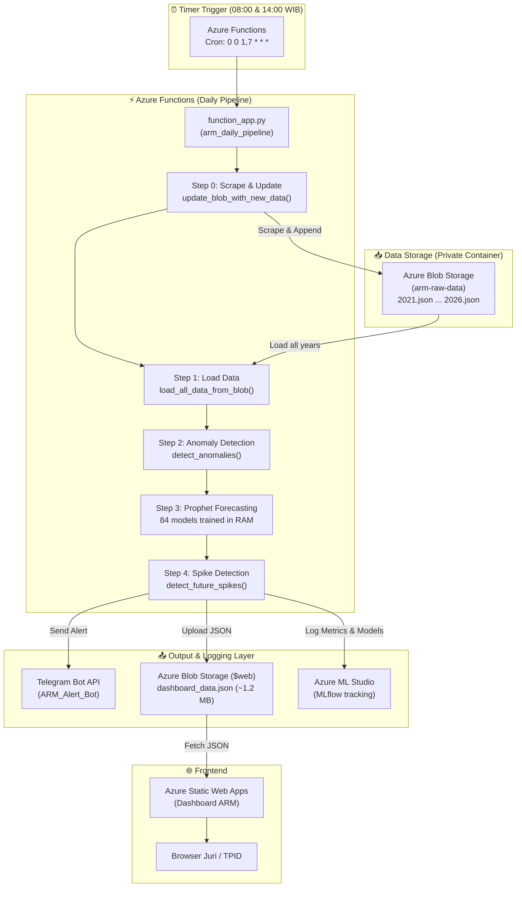

# ☁️ ARM Azure Architecture Documentation

> **Dokumentasi arsitektur teknis untuk integrasi Azure Services ke dalam Aceh Resilience Monitor**
>
> Authors: Arief (Test, Docs & Comms) — G14 & Aulia (ML & Azure) — G13

---

## 📋 Daftar Isi
1. [Diagram Arsitektur](#1-diagram-arsitektur)
2. [Azure Services yang Digunakan](#2-azure-services)
3. [Justifikasi Azure vs AWS/GCP](#3-justifikasi-azure)
4. [Estimasi Biaya](#4-estimasi-biaya)
5. [Skalabilitas](#5-skalabilitas)

---

## 1. Diagram Arsitektur



---

## 2. Azure Services yang Digunakan

| # | Service | Fungsi | Justifikasi |
|---|---------|--------|-------------|
| 1 | **Azure Blob Storage** | Data Lake (raw JSON per tahun) + Dashboard Feed (publik JSON) | Murah, scalable, REST API native. Pemisahan Private container (`arm-raw-data`) vs Public container (`$web`). |
| 2 | **Azure Functions** | Serverless daily pipeline (V2 Programming Model) | Pay-per-execution, auto-scale harian, timer trigger native. Menjalankan pipeline lengkap Scrape → ETL → ML (Z-Score + Prophet 84 model) → Alert → Dashboard Update → MLflow. |
| 3 | **Azure Static Web Apps** | Hosting dashboard web (HTML/CSS/JS) | Zero-config deployment dari GitHub, SSL otomatis, CDN global. Free tier unlimited. |
| 4 | **Azure ML + MLflow** | Experiment tracking, model metrics logging, dan audit | Integrasi MLflow native dengan Azure ML Studio. Mendukung pencatatan metrik evaluasi (MAE, RMSE, MAPE) serta model artifacts (`model.json` untuk 21 model agregat provinsi). |

### Alur Data per Service

```
[Azure Functions] (Timer Trigger 08:00 & 14:00 WIB)
    │
    ├── SCRAPE & WRITE ─► [Blob Storage: arm-raw-data/2026.json] (Private - Append daily prices)
    │
    ├── READ ALL ───────► [Blob Storage: arm-raw-data/2021-2026.json] (Private - Load history)
    │
    ├── WRITE JSON ─────► [Blob Storage: $web/dashboard_data.json] (Public - Dashboard feed)
    │
    ├── SEND ALERTS ────► [Telegram Bot API → Grup TPID Aceh]
    │
    └── LOG METRICS ────► [Azure ML Studio via MLflow API] (Parent & nested runs)

[Azure Static Web Apps]
    │
    └── FETCH ──────────► [Blob Storage: $web/dashboard_data.json] (Browser client-side download)
```

---

## 3. Justifikasi Azure vs AWS/GCP

| Kriteria | Azure | AWS | GCP |
|----------|-------|-----|-----|
| **MLflow Integration** | Native di Azure ML ✅ | SageMaker (terpisah) | Vertex AI (terpisah) |
| **Static Web Hosting** | Static Web Apps (zero-config) ✅ | S3 + CloudFront (manual) | Firebase Hosting |
| **Serverless Functions** | Functions V2 (Python) ✅ | Lambda | Cloud Functions |
| **Free Tier** | Sangat dermawan ✅ | Terbatas | Terbatas |
| **Relevansi Datathon** | Datathon Microsoft ✅ | ❌ | ❌ |

> **Kesimpulan:** Azure dipilih karena:
> 1. **MLflow terintegrasi native** di Azure ML Studio — tidak perlu setup server tracking terpisah.
> 2. **Static Web Apps** zero-config dari GitHub — deploy otomatis CD/CD.
> 3. **Free tier mencakup semua kebutuhan** ARM — $0/bulan.
> 4. **Konteks datathon Dicoding** — keselarasan ekosistem teknologi Microsoft Azure.

---

## 4. Estimasi Biaya

| Service | Tier | Harga/Bulan | Catatan |
|---------|------|-------------|---------|
| Azure Blob Storage | Free tier (5 GB) | **$0** | Raw data ~70 MB + dashboard_data.json ~1.2 MB |
| Azure Functions | Consumption Plan | **$0** | 2 eksekusi/hari × ~40 detik. Free: 1M eksekusi + 400K GB-s per bulan. |
| Azure Static Web Apps | Free tier | **$0** | Unlimited bandwidth, SSL, CDN global |
| Azure ML + MLflow | Free tier (workspace) | **$0** | Experiment tracking gratis. Compute hanya jika training di cloud (ARM train di RAM Functions). |
| **TOTAL** | | **$0/bulan** | Semua berjalan di dalam free tier |

> **Golden Statement :**
> *"Seluruh infrastruktur cloud ARM berjalan di Azure Free Tier dengan total biaya $0 per bulan, membuktikan bahwa sistem monitoring pangan cerdas bisa diakses oleh pemerintah daerah mana pun tanpa hambatan biaya."*

---

## 5. Skalabilitas

### Horizontal Scaling (Ekspansi ke 34 Provinsi)

```
Saat Ini:  3 daerah (Banda Aceh, Lhokseumawe, Meulaboh) × 21 komoditas = 84 model Prophet (~40 detik)
Target:   34 provinsi × 21 komoditas = ribuan model

Solusi:
├── Azure Functions: Auto-scale otomatis (Consumption Plan)
├── Blob Storage: Unlimited storage
├── Data Source: PIHPS mencakup 34 provinsi nasional
└── Kode: Arsitektur modular → tambah data source = tambah provinsi
```

### Detail Logging MLflow & Prophet di RAM
Untuk menghemat waktu komputasi dan mencegah timeout pada serverless consumption plan:
1. **Model Training**: 84 model Prophet dilatih secara paralel *on-the-fly* di dalam memori (RAM) Azure Functions.
2. **Prophet Extra Regressors**: Model diperkaya dengan 4 regressor deterministik:
   - `is_meugang_season` (Tradisi Meugang Aceh: H-2 s/d H-0)
   - `is_ramadan_prep` (7 hari menjelang Ramadan)
   - `is_nataru` (Natal + Tahun Baru: 20 Des - 2 Jan)
   - `is_wet_season` (Musim Hujan BMKG Sumatera: Okt - Apr)
3. **MLflow Optimization**:
   - Struktur pencatatan menggunakan Nested Runs (`daily-[YYYYMMDD]` sebagai parent, dan run `prophet-[commodity]-[region]` sebagai child).
   - Metrik evaluasi yang dicatat meliputi: MAE, RMSE, dan MAPE.
   - Untuk mempercepat eksekusi pipeline, model artifacts (`model.json` hasil serialisasi) **hanya diunggah untuk 21 model utama tingkat provinsi (aggregated)**, sedangkan 63 model tingkat regional (Banda Aceh, Lhokseumawe, Meulaboh) dilewatkan dari pengunggahan artefak.

### Estimasi Waktu per Skala

| Skala | Model | Estimasi Waktu | Plan |
|-------|-------|----------------|------|
| 3 daerah (saat ini) | 84 | ~40 detik | Consumption (gratis) |
| 10 kota | 210 | ~2 menit | Consumption (gratis) |
| 34 provinsi | 714 | ~5-8 menit | Premium ($0-20/bulan) |
| Nasional granular | 5000+ | ~30 menit | Dedicated ($50+/bulan) |

> **Golden Statement :**
> *"Arsitektur ARM bersifat modular. Untuk ekspansi ke 34 provinsi, cukup tambahkan data source per provinsi di Azure Functions. PIHPS Bank Indonesia sudah mencakup seluruh Indonesia. Cost per provinsi tambahan: ~$0 (masih di free tier)."*
