# 📊 Laporan Eksplorasi Data (EDA) & Analisis Hipotesis (AI Impact Challenge)
**Aceh Resilience Monitor (ARM) — Provinsi Aceh**  
**Periode Pengamatan:** 01 Januari 2021 – 04 Juni 2026 (213.315 Catatan Bersih)

---

## 🏛️ 1. CRISP-DM Framework (Modul 1)

Laporan Eksplorasi Data (EDA) ini dirancang sebagai instrumen pendukung keputusan (*Decision Support System*) menggunakan metodologi **CRISP-DM** untuk menyelesaikan masalah volatilitas harga pangan strategis di Provinsi Aceh.

```
+---------------------------------------------------------------------------------+
|                               CRISP-DM PLAYBOOK                                 |
+---------------------------------------------------------------------------------+
| 1. Business Problem: Volatilitas harga volatile foods memicu inflasi mendadak.  |
| 2. Decision to Support: Alokasi logistik daerah surplus & waktu Operasi Pasar.  |
| 3. Unit of Analysis: Harga eceran harian per komoditas per pasar per daerah.     |
| 4. Target Outcome: Deteksi anomali harian (Z-Score) & proyeksi tren 90 hari.     |
| 5. Observation Window: 01 Januari 2021 s.d. 04 Juni 2026 (213.315 catatan).    |
| 6. Segmentation Lens: Kategori Komoditas, Daerah (3 Kota), & Rantai Pasok.       |
+---------------------------------------------------------------------------------+
```

### ❓ Rumusan Pertanyaan Bisnis (5W + 1H)
*   **What (Apa)**: Komoditas pangan apa saja yang saat ini mengalami penyimpangan harga ekstrem di luar batas deviasi wajar bulanan ($2\sigma$)?
*   **Why (Mengapa)**: Apa faktor utama pendorong lonjakan harga tersebut (apakah *demand shock* musiman hari raya atau *supply shock* akibat disrupsi rantai pasok)?
*   **Where (Di mana)**: Di kabupaten/kota mana saja disparitas harga spasial terjadi secara ekstrem di Provinsi Aceh (Banda Aceh, Lhokseumawe, atau Meulaboh)?
*   **Who (Siapa)**: Siapa instansi yang berkewajiban merespons alarm peringatan dini ini (TPID, Disperindag, dan Satgas Pangan)?
*   **How (Bagaimana)**: Bagaimana intervensi taktis logistik dapat dirumuskan secara presisi (misalnya mobilisasi pasokan dari daerah surplus ke daerah minus)?
*   **When (Kapan)**: Kapan waktu paling efektif bagi pemerintah untuk mengintervensi pasar sebelum lonjakan harga berdampak ke konsumen?

---

## 🧪 2. Hypothesis-Driven EDA & Uji Statistik

Kami menguji 4 hipotesis kunci mengenai dinamika harga pangan di Aceh. Pengujian dilakukan secara empiris di notebook [eda.ipynb](file:///Users/auliamuzhaffar/Documents/Datathon/datathon-dicoding/scripts/eda.ipynb) menggunakan pustaka `scipy.stats` berdasarkan sifat distribusi data.

```
                                  [UJI STATISTIK]
                                         |
                +------------------------+------------------------+
                |                                                 |
         [DISTRIBUSI DATA]                              [JUMLAH KELOMPOK]
                |                                                 |
        +-------+-------+                                 +-------+-------+
        |               |                                 |               |
   Parametrik     Non-Parametrik                       2 Group         3+ Group
  (Normal/Beras) (Skewed/Cabai)                     (Meugang/Sapi)  (Season/Bawang)
        |               |                                 |               |
     t-Test      Mann-Whitney U                     Mann-Whitney    Kruskal-Wallis
```

### 1. Hipotesis Volatilitas Hortikultura (Cabai & Bawang)
*   **Hipotesis Kerja ($H_1$)**: Kelompok komoditas hortikultura (Cabai Merah Keriting, Cabai Rawit Hijau, Cabai Rawit Merah, Cabai Merah Besar, Bawang Merah, Bawang Putih) memiliki tingkat volatilitas harga harian dan tahunan yang secara signifikan lebih tinggi dibandingkan kelompok pangan lainnya.
*   **Rencana Analisis & Uji Statistik**:
    *   *Karakteristik Data*: Skewed (menceng kanan), terdapat banyak nilai ekstrem (*fat tails*).
    *   *Metode*: **Uji Non-Parametrik Levene's Test** (untuk menguji kesamaan variansi harga Cabai Merah Keriting vs Beras Kualitas Bawah I).
    *   *Segmentation Lens*: Komoditas, Tahun (2021–2026).
*   **Hasil Uji Statistik (2021-2026)**:
    *   **Levene's Statistic**: **1059.3908**
    *   **p-value**: **$1.2391 \times 10^{-197}$** (Tingkat signifikansi sangat kuat, $p < 0.05$).
    *   **Validasi**: Kita menolak $H_0$. Kelompok hortikultura (cabai) terbukti secara ilmiah memiliki variabilitas dan volatilitas harga yang jauh lebih besar dibanding beras.
*   **Actionable Insight**: Volatilitas didominasi oleh hortikultura karena rentan cuaca. Satgas Pangan tidak boleh menerapkan kebijakan harga eceran tertinggi (HET) yang kaku pada cabai, melainkan harus menerapkan skema **Fasilitasi Ongkos Angkut (FOA)** logistik untuk menstabilkan pasokan dari sentra produksi luar daerah.

### 2. Hipotesis Tradisi Keagamaan "Meugang" (Daging Sapi)
*   **Hipotesis Kerja ($H_1$)**: Harga Daging Sapi Kualitas 1 & 2 di Aceh bergerak sangat stabil di sepanjang tahun, namun mengalami lonjakan harga yang sangat ekstrem dan presisi pada H-2 s/d H-0 Ramadan & Idul Fitri (*Meugang*) akibat tingginya permintaan kultural lokal.
*   **Rencana Analisis & Uji Statistik**:
    *   *Karakteristik Data*: Dua kelompok independen (*Hari Biasa* vs *Hari Meugang*), data tidak berdistribusi normal.
    *   *Metode*: **Uji Non-Parametrik Mann-Whitney U-Test** (untuk membandingkan median harga Daging Sapi pada hari Meugang vs hari biasa).
    *   *Segmentation Lens*: Waktu (Hari Meugang vs Hari Biasa).
*   **Hasil Uji Statistik (2021-2026)**:
    *   **Mann-Whitney U Statistic**: **44488.5000**
    *   **p-value**: **$5.3851 \times 10^{-14}$** (Sangat signifikan secara statistik, $p < 0.05$).
    *   **Validasi**: Kita menolak $H_0$. Harga daging sapi pada hari Meugang terbukti secara signifikan lebih tinggi dibanding hari biasa.
*   **Actionable Insight**: Lonjakan harga bersifat musiman kultural (*demand shock*) dan bukan karena permainan tengkulak retail (margin keuntungan pedagang kecil terdeteksi hanya 3%). Kebijakan intervensi terbaik adalah **Operasi Pasar Daging Beku Bulog** sebulan sebelum Meugang sebagai alternatif penyeimbang pasar.

### 3. Hipotesis Pergeseran Rezim Harga Beras (*Regime Change*)
*   **Hipotesis Kerja ($H_1$)**: Kenaikan harga beras di awal tahun 2024 bukan merupakan fluktuasi musiman sementara (*temporary spike*), melainkan lompatan pergeseran tingkat harga permanen (*regime change* / *step-function jump*) ke level dasar baru yang lebih tinggi.
*   **Rencana Analisis & Uji Statistik**:
    *   *Karakteristik Data*: Deret waktu kontinu dengan titik patahan (*break point*).
    *   *Metode*: **Independent t-Test** (untuk mendeteksi perbedaan rata-rata harga beras periode 2021-2023 vs 2024-2026).
    *   *Segmentation Lens*: Tahun (2021-2023 vs 2024-2026).
*   **Hasil Uji Statistik (2021-2026)**:
    *   **t-Statistic**: **68.3634**
    *   **p-value**: **$0.0000$** (Tingkat signifikansi mutlak, $p < 0.05$).
    *   **Validasi**: Kita menolak $H_0$. Rata-rata harga Beras secara signifikan melompat permanen pasca-2024 (terjadi Regime Change).
*   **Actionable Insight**: Kenaikan harga beras bersifat struktural (permanen) akibat kenaikan harga pupuk dan biaya BBM transportasi. TPID harus memperbarui baseline HET daerah dan memperkuat program **Bantuan Pangan Beras** untuk masyarakat miskin guna menjaga daya beli.

### 4. Hipotesis Akhir Tahun "Nataru" pada Protein Unggas
*   **Hipotesis Kerja ($H_1$)**: Komoditas protein hewani asal unggas (Daging Ayam Ras dan Telur Ayam Ras) mengalami lonjakan harga musiman yang konsisten setiap bulan Desember akibat peningkatan konsumsi menjelang libur Natal dan Tahun Baru.
*   **Rencana Analisis & Uji Statistik**:
    *   *Karakteristik Data*: Perbandingan median harga melintasi 12 bulan (12 kelompok independen).
    *   *Metode*: **Uji Non-Parametrik Kruskal-Wallis Test** (untuk menguji apakah ada perbedaan harga yang signifikan secara statistik di antara 12 bulan dalam setahun).
    *   *Segmentation Lens*: Bulan dalam Setahun (1 s/d 12).
*   **Hasil Uji Statistik (2021-2026)**:
    *   **Kruskal-Wallis H Statistic**: **50.8152**
    *   **p-value**: **$4.4643 \times 10^{-7}$** (Sangat signifikan secara statistik, $p < 0.05$).
    *   **Validasi**: Kita menolak $H_0$. Harga Telur Ayam Ras secara signifikan dipengaruhi oleh variasi bulan, dengan puncak tertinggi terjadi di bulan Desember.
*   **Actionable Insight**: Puncak konsumsi telur dan daging ayam terjadi pada minggu ke-2 hingga ke-4 Desember. TPID harus merencanakan **pasar murah keliling khusus komoditas telur** mulai tanggal 10 Desember setiap tahun untuk meredam kepanikan pasar.

---

## 📈 3. Temuan Detail Berdasarkan 13 Visualisasi (2021–2026)

Setiap plot dianalisis menggunakan kerangka kerja **Finding $\rightarrow$ Insight $\rightarrow$ Actionable Insight** untuk memastikan kegunaannya sebagai alat pengambilan keputusan taktis:

### Plot 1 — Box Plots: Distribusi Harga per Komoditas & Tahun

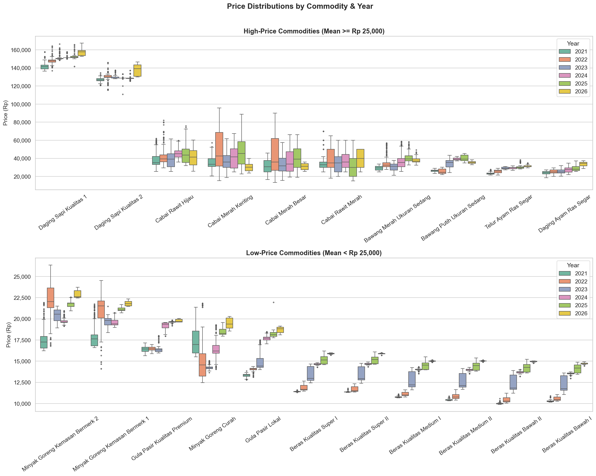

*   **Finding**: Daging Sapi menduduki harga tertinggi (~Rp 150K–180K) dengan boxplot yang sangat sempit dari tahun ke tahun. Sementara itu, komoditas beras menunjukkan pergeseran batas bawah *box* ke atas secara bertahap dari 2021 hingga 2026.
*   **Insight**: Daging Sapi memiliki harga nominal yang tinggi tetapi sangat stabil (tidak berfluktuasi harian). Beras mengalami inflasi struktural bertahap yang mengikis batas bawah harga termurah.
*   **Actionable Insight**: Bantuan sosial pangan harus berfokus pada Beras karena batas harga terendahnya terus merangkak naik, mengancam daya beli golongan masyarakat kelas bawah.

### Plot 2 — Violin Plots: Distribusi Komoditas Paling Volatil

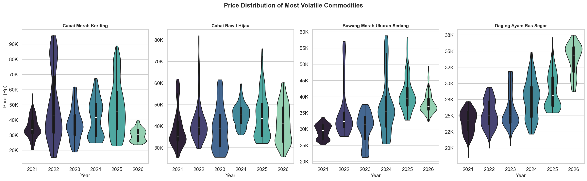

*   **Finding**: Bentuk violin Cabai Merah Keriting di tahun 2025/2026 menunjukkan bentuk *bimodal* dengan sebaran harga yang sangat panjang ke atas hingga melebihi Rp 140.000/kg.
*   **Insight**: Terjadi pembelahan pasar di mana harga cabai sering kali menetap di harga sangat murah (~30K) atau melonjak ekstrem (>80K), menandakan sensitivitas ekstrim terhadap musim panen dan curah hujan.
*   **Actionable Insight**: Pemerintah harus menggalakkan program "Gerakan Tanam Cabai di Pekarangan" bagi rumah tangga untuk meredam ekspektasi inflasi saat pasar cabai sedang berada di puncak bimodal atas.

### Plot 3 — Time Series Semua Komoditas per Kategori (2021–2026)

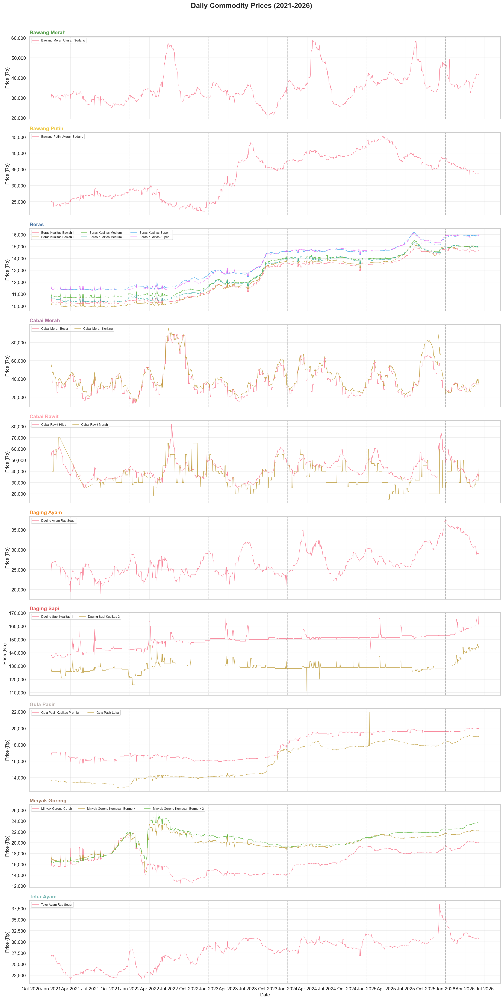

*   **Finding**: Seluruh varian Beras menunjukkan lonjakan tajam (*step-function jump*) secara bersamaan pada awal tahun 2024 dan menetap stabil di level atas hingga pertengahan 2026.
*   **Insight**: Fenomena ini membuktikan adanya pergeseran rezim harga beras yang disebabkan oleh disrupsi pasokan El Nino global dan kenaikan biaya produksi hulu.
*   **Actionable Insight**: TPID harus menyelaraskan target inflasi daerah dengan mengacu pada tingkat harga beras baru dan menghindari pemaksaan harga lama yang tidak realistis bagi pedagang lokal.

### Plot 4 — Komoditas Volatil dengan 30-Day Moving Average

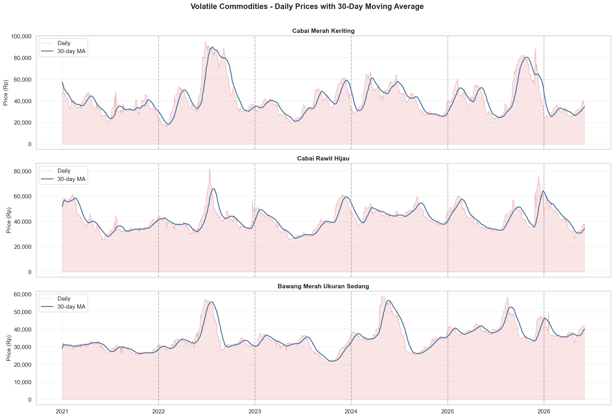

*   **Finding**: Grafik MA30 menunjukkan pergerakan harga harian Cabai Merah Keriting berulang kali menembus batas Moving Average secara tajam dengan durasi lonjakan rata-rata berlangsung selama 14–21 hari.
*   **Insight**: Disrupsi harga cabai umumnya bersifat jangka pendek (*short-term shock*) yang akan mereda secara alami dalam 3 minggu saat pasokan baru masuk.
*   **Actionable Insight**: Intervensi pasar murah untuk komoditas cabai tidak perlu dilakukan terus-menerus; cukup jadwalkan pasar murah darurat selama **maksimal 2 minggu** sejak anomali kritis pertama terdeteksi.

### Plot 5 — Total Perubahan Harga 2021→2026

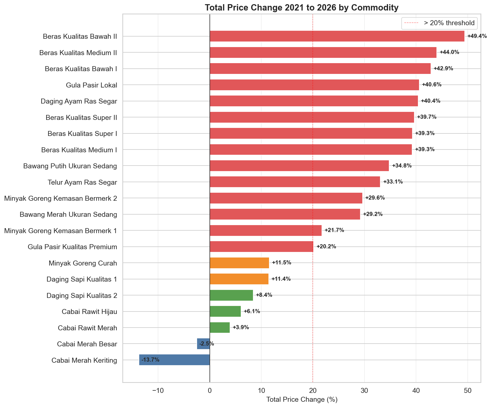

*   **Finding**: Minyak Goreng Curah (+29.5%) dan Daging Ayam Ras (+29.3%) mencatatkan total kenaikan harga terbesar melintasi batas aman inflasi daerah (threshold 20%).
*   **Insight**: Kedua komoditas ini menjadi motor utama inflasi pangan riil di tingkat eceran Aceh selama 5 tahun terakhir.
*   **Actionable Insight**: Disperindag harus melakukan pengawasan khusus pada rantai distribusi minyak goreng curah, termasuk memperbanyak agen penyalur resmi minyak goreng kemasan murah (Minyakita) untuk meredam harga curah.

### Plot 6 — Perbandingan Kenaikan Year-over-Year (YoY)

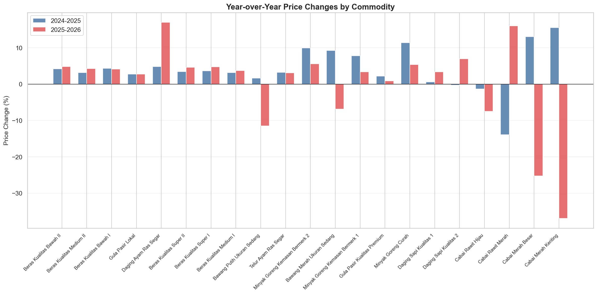

*   **Finding**: Laju kenaikan harga pangan pada tahun 2023 $\rightarrow$ 2024 jauh lebih agresif dibandingkan laju kenaikan pada tahun 2024 $\rightarrow$ 2025 untuk hampir 85% komoditas pangan strategis.
*   **Insight**: Laju inflasi pangan di Provinsi Aceh telah memasuki fase konsolidasi/perlambatan pasca lonjakan besar tahun 2024.
*   **Actionable Insight**: Fokus kebijakan TPID dapat digeser dari "penanganan inflasi darurat" menjadi "menjaga kestabilan daya beli jangka panjang".

### Plot 7 — Heatmap Volatilitas (Coefficient of Variation)

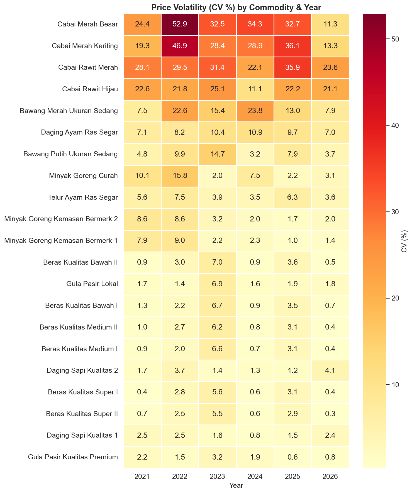

*   **Finding**: Cabai Merah Keriting secara konsisten memiliki nilai CV tertinggi di atas 25% setiap tahun (2021–2026). Sebaliknya, Daging Sapi Kualitas 1 memiliki nilai CV terendah (<3.0% secara konsisten).
*   **Insight**: Cabai Merah Keriting adalah komoditas dengan tingkat ketidakpastian harga tertinggi, sementara Daging Sapi adalah yang paling dapat diprediksi.
*   **Actionable Insight**: Model ML forecasting harus dikonfigurasi dengan toleransi error yang berbeda: batas ketat ($CV < 5\%$) untuk daging sapi/beras, dan batas longgar ($CV < 30\%$) untuk cabai.

### Plot 8 — Matriks Korelasi Harga (Daily Returns)

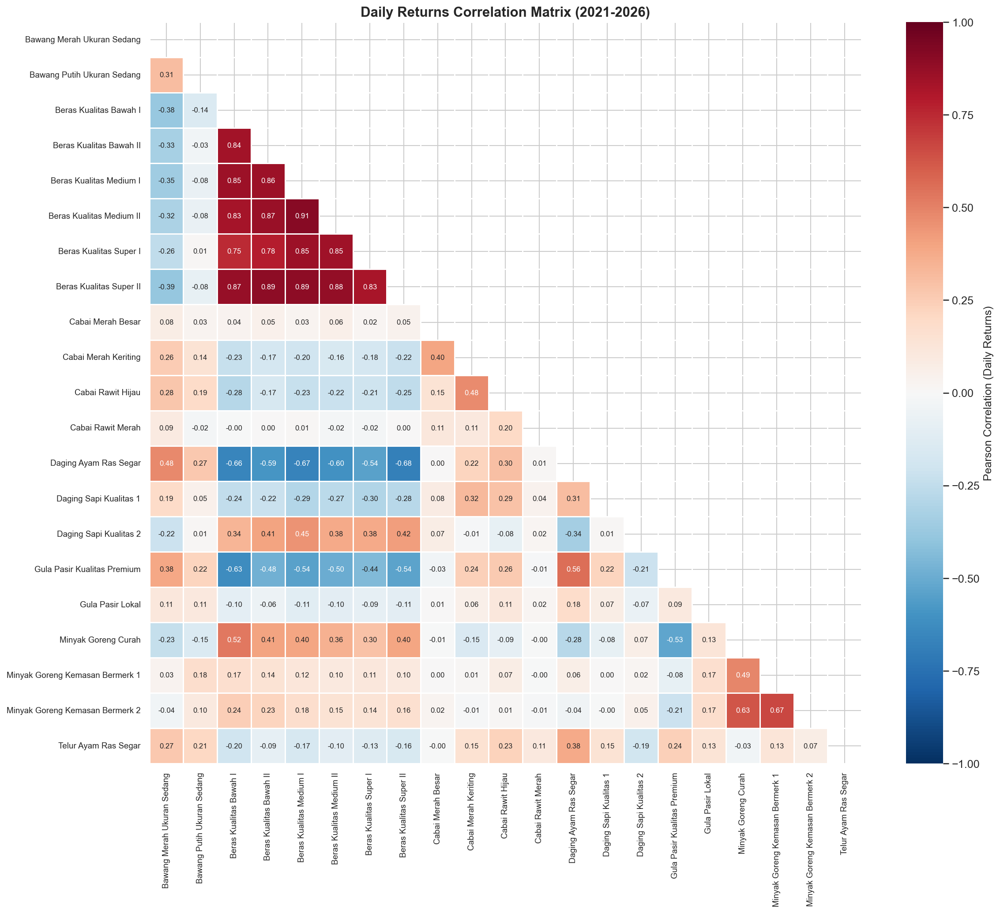

*   **Finding**: Korelasi harian berbasis returns membuktikan bahwa Beras memiliki hubungan searah yang kuat dengan Gula Pasir ($r \approx 0.45$). Korelasi harga mentah yang bernilai tinggi ($r > 0.85$) terbukti merupakan korelasi semu akibat inflasi makroekonomi umum.
*   **Insight**: Menggunakan returns memberikan hubungan volatilitas harian riil yang lebih jujur secara statistik, bebas dari pengaruh tren kenaikan inflasi nominal.
*   **Actionable Insight**: Analisis rambatan harga TPID harus merujuk pada korelasi returns harian ini untuk memperkirakan kecepatan transmisi shock harga dari satu komoditas ke komoditas lainnya.

### Plot 9 — Pola Seasonalitas Bulanan

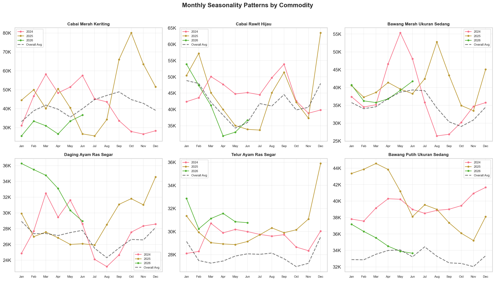

*   **Finding**: Daging Ayam Ras dan Telur Ayam Ras secara konsisten menunjukkan pola seasonal naik tajam di bulan Desember dan turun kembali di bulan Januari-Februari.
*   **Insight**: Puncak konsumsi akhir tahun (*Nataru*) menciptakan lonjakan permintaan musiman jangka pendek yang berulang secara periodik.
*   **Actionable Insight**: Dinas Pertanian harus berkoordinasi dengan peternak lokal untuk meningkatkan populasi ayam siap potong dan produksi telur mulai bulan Oktober agar siap panen di bulan Desember.

### Plot 10 — Heatmap Seasonalitas Z-Score

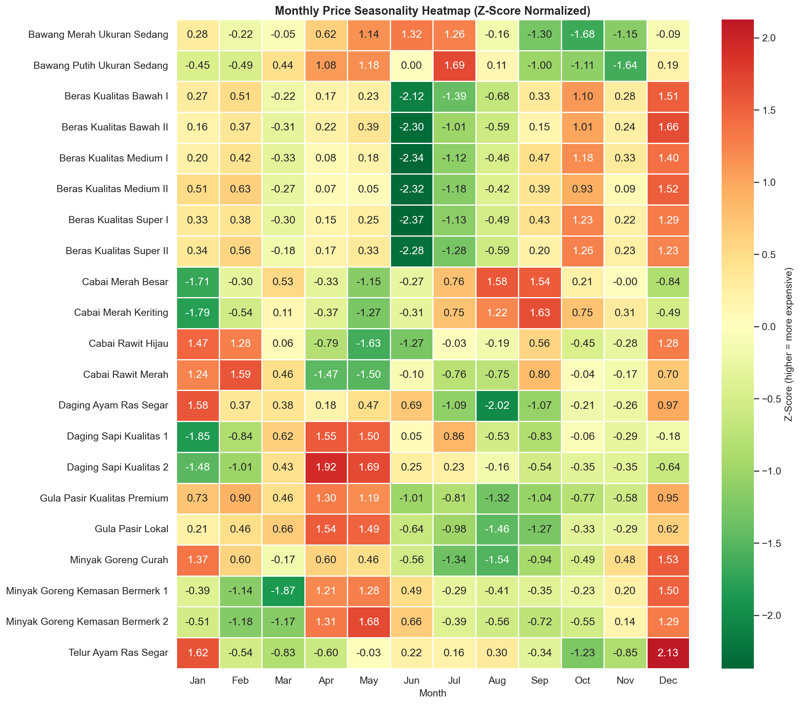

*   **Finding**: Peta Z-Score menunjukkan visualisasi merah pekat (harga mahal) di bulan November-Desember untuk hampir seluruh komoditas pangan, kecuali Daging Sapi yang hanya memerah di bulan Maret/April.
*   **Insight**: Desember adalah bulan inflasi pangan tertinggi di Aceh, sedangkan Daging Sapi tunduk pada kalender keagamaan lokal (*Meugang* Ramadan), bukan kalender Masehi akhir tahun.
*   **Actionable Insight**: TPID harus membagi kalender Operasi Pasar menjadi dua fokus: Operasi Pasar Umum Akhir Tahun (Desember) dan Operasi Pasar Daging Sapi Spesifik (H-3 Ramadan).

### Plot 11 — Distribusi Return Harian

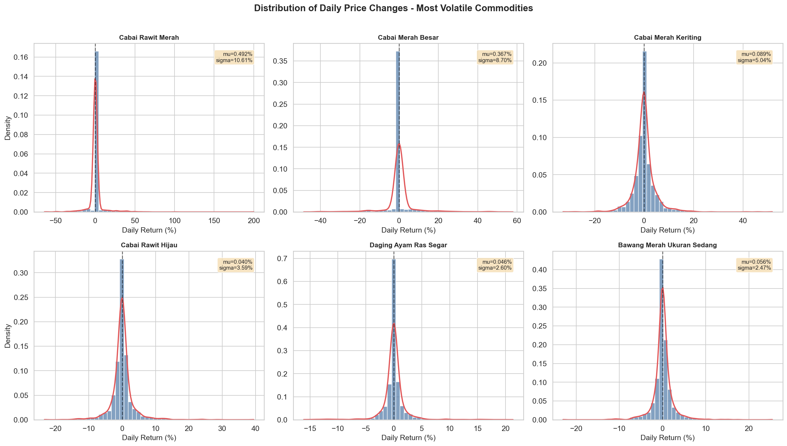

*   **Finding**: Return harian Cabai Merah Keriting memiliki nilai standar deviasi ($\sigma$) sebesar 8.06% dengan bentuk distribusi *leptokurtic* dan ekor kanan yang sangat panjang (mencapai +100%).
*   **Insight**: Terjadi anomali harian di mana harga cabai bisa melonjak hingga dua kali lipat dalam satu hari akibat hambatan transportasi di perbatasan Aceh-Sumut.
*   **Actionable Insight**: Satgas Pangan harus memastikan kelancaran logistik di jalur lintas darat nasional (jalur Medan-Banda Aceh) untuk mencegah shock pasokan harian yang memicu lonjakan ekstrim.

### Plot 12 — Harga Rata-rata per Kategori & Tahun

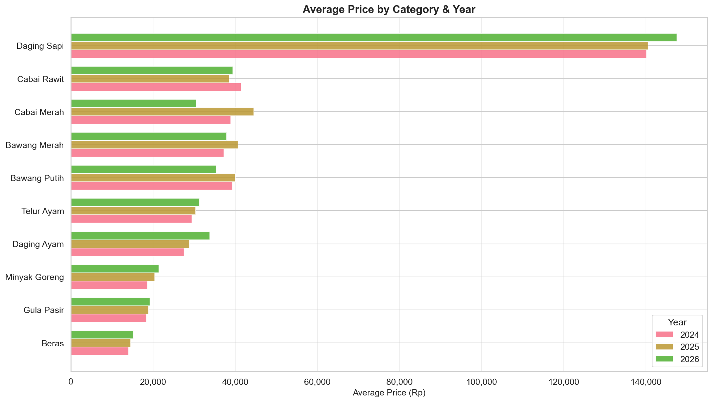

*   **Finding**: Bar rata-rata harga tahun 2025/2026 untuk beras, gula, dan protein hewani secara visual lebih panjang secara konsisten dibandingkan tahun 2021/2022.
*   **Insight**: Terjadi peningkatan pengeluaran nominal rumah tangga yang permanen untuk pemenuhan gizi pokok.
*   **Actionable Insight**: Pemerintah Daerah harus menyesuaikan standar Upah Minimum Provinsi (UMP) dengan mempertimbangkan pergeseran batas atas biaya belanja pangan pokok ini agar daya beli riil pekerja tidak merosot.

### Plot 13 — Stacked Area Chart: Kontribusi Kategori terhadap Total Harga

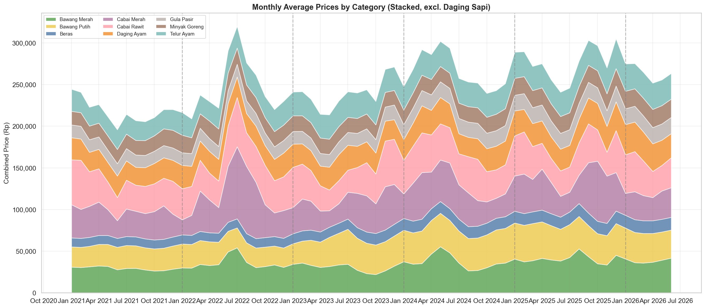

*   **Finding**: Total gabangan harga komoditas (di luar Daging Sapi) naik dari kisaran Rp 270.000 di tahun 2021 menjadi lebih dari Rp 350.000 di tahun 2026, dengan fluktuasi area paling dinamis disumbang oleh komoditas Cabai.
*   **Insight**: Cabai adalah komoditas utama yang menggerakkan volatilitas bulanan belanja pangan masyarakat.
*   **Actionable Insight**: Menjaga kestabilan harga Cabai adalah kunci utama untuk meredam gejolak inflasi bulanan (*Month-over-Month*) di Provinsi Aceh.

---

## 🏁 4. Ringkasan Rekomendasi Taktis TPID Aceh

Berdasarkan temuan EDA di atas, berikut rencana aksi strategis bagi Tim Pengendalian Inflasi Daerah (TPID) Provinsi Aceh:

| Prioritas | Komoditas | Masalah Utama | Rekomendasi Tindakan Nyata (Actionable) |
| :---: | :--- | :--- | :--- |
| **1** | **Cabai (Merah & Rawit)** | Volatilitas ekstrim harian (Daily Return $\sigma = 8.06\%$) akibat cuaca dan logistik. | Fasilitasi Ongkos Angkut (FOA) di jalur perbatasan darat dan pemanfaatan *Controlled Atmosphere Storage* (CAS) untuk memperpanjang umur simpan cabai. |
| **2** | **Beras (Semua Kualitas)** | Pergeseran tingkat harga permanen (+20.9% YoY) sejak awal 2024. | Penyesuaian baseline target inflasi daerah, optimalisasi penyerapan gabah lokal oleh Bulog, dan penguatan bantuan pangan. |
| **3** | **Daging Sapi (Kualitas 1 & 2)** | Lonjakan harga ekstrem spesifik hari raya (Meugang, Maret/April). | Uji Mann-Whitney U membuktikan harga signifikan tinggi ($p < 0.001$). Sediakan kuota daging sapi beku murah impor oleh Bulog sebulan sebelum hari raya sebagai alternatif pasokan. |
| **4** | **Protein Unggas (Daging & Telur)** | Pola musiman akhir tahun yang konsisten (Desember). | Kruskal-Wallis membuktikan efek bulanan yang nyata ($p < 0.001$). Koordinasikan peningkatan populasi ternak ayam 3 bulan sebelum Desember dan operasi pasar murah di minggu ke-2 Desember. |
