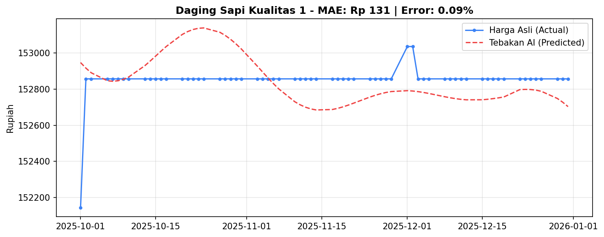
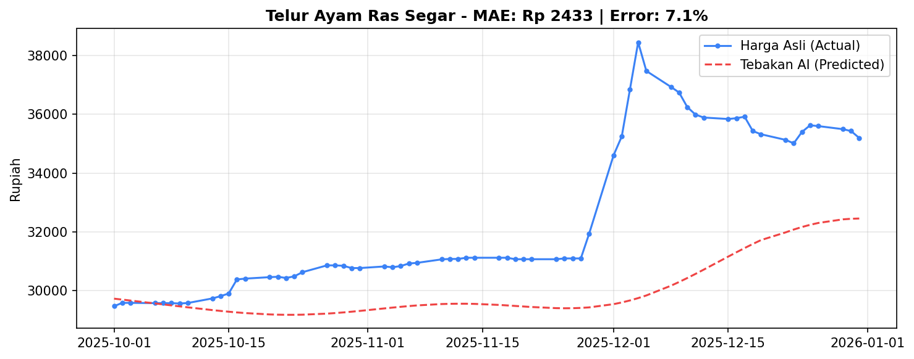
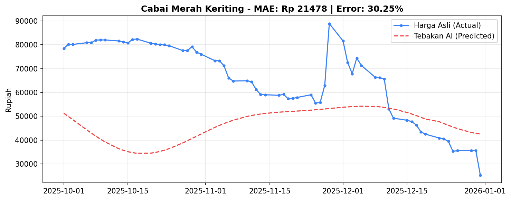

# 🔮 Laporan Evaluasi Model *Forecasting* (Prophet)
**Proyek:** Aceh Resilience Monitor (ARM)  
**Metode AI:** Time-Series Forecasting (Meta Prophet)  
**Periode Data:** Januari 2023 – Desember 2025  

---

## 📌 Ringkasan Eksekutif
Dalam iterasi terbaru *Aceh Resilience Monitor*, kami mengintegrasikan *Machine Learning* untuk beralih dari pemantauan historis ke sistem peringatan dini (prediktif). Dokumen ini menyajikan hasil **Backtesting** (uji teknis) dari algoritma Meta Prophet untuk melihat seberapa akurat prediksi yang dihasilkan sistem untuk pengambil kebijakan.

Secara keseluruhan, model mencapai **Rata-rata Margin Kesalahan (MAPE) sebesar 12.38%** melintasi 21 komoditas bahan pokok, yang masuk dalam kategori "Baik" untuk standar industri pemodelan harga pangan. Uji coba dan komparasi baseline ini sepenuhnya dapat direproduksi dengan menjalankan script verifikasi di repositori.

---

## 🛠️ Metodologi Pengujian: *Train-Test Split (Holdout)*
Untuk memastikan objektivitas akurasi prediksi, kami tidak langsung menguji model dengan data yang sudah pernah ia "lihat". Kami menggunakan metode *Holdout 90 Hari*:
1. **Data Pelatihan (*Training Data*):** `02 Januari 2023` s/d `30 September 2025`. Model dilatih menggunakan rentang ini untuk mengenali tren, *seasonality* mingguan, dan siklus tahunan (seperti Ramadhan/Tahun Baru).
2. **Data Pengujian (*Testing Data*):** `01 Oktober 2025` s/d `31 Desember 2025` (90 hari). Kami meminta AI memprediksi harga pada periode ini secara buta ("*blind prediction*").
3. **Validasi:** Tebakan AI kemudian dikomparasi dengan Harga Aktual yang terjadi pada 90 hari tersebut untuk mendapatkan rasio simpangan (error).

---

## 📐 Metrik Penilaian Berstandar Industri
Performa model diukur menggunakan tiga metrik statistik utama:
- **MAPE (Mean Absolute Percentage Error):** Rata-rata margin kesalahan dalam bentuk persentase. (Contoh: MAPE 2% pada harga Rp 10.000 berarti error rata-rata Rp 200).
- **MAE (Mean Absolute Error):** Rata-rata selisih mutlak nilai tebakan AI terhadap harga asli dalam mata uang (Rupiah/Kg).
- **RMSE (Root Mean Squared Error):** Mengukur akurasi dengan memberikan *penalti numerik yang berat* terhadap kesalahan/puncak ekstrem. Jika nilai RMSE jauh lebih tinggi dari MAE, berarti model gagal menangani lonjakan (outlier) mendadak.

---

## 📊 Hasil Evaluasi per Komoditas

Berdasarkan *Backtesting*, kemampuan AI dibagi menjadi 3 kategori keandalan:

### 🟢 1. Keandalan Sangat Tinggi (Error < 5%)
Komoditas ini sangat direkomendasikan untuk dijadikan rujukan kebijakan operasi pasar karena AI mampu menebak dengan presisi tinggi.

| Komoditas | Prediktabilitas | MAPE (%) | MAE (Error Harian) | RMSE (Error Ekstrem) |
| :--- | :---: | :---: | :---: | :---: |
| **Daging Sapi Kualitas 1** | Sangat Stabil | **0.09%** | ± Rp 131 / Kg | Rp 173 |
| **Gula Pasir Kualitas Premium** | Sangat Stabil | **1.10%** | ± Rp 216 / Kg | Rp 245 |
| **Minyak Goreng Kemasan Bermerk 2** | Sangat Stabil | **1.10%** | ± Rp 242 / Kg | Rp 301 |
| **Minyak Goreng Kemasan Bermerk 1** | Sangat Stabil | **1.15%** | ± Rp 244 / Kg | Rp 266 |
| **Beras Kualitas Bawah I** | Sangat Stabil | **1.48%** | ± Rp 215 / Kg | Rp 244 |
| **Daging Sapi Kualitas 2** | Sangat Stabil | **2.07%** | ± Rp 2657 / Kg | Rp 2844 |
| **Beras Kualitas Medium II** | Sangat Stabil | **2.19%** | ± Rp 320 / Kg | Rp 368 |
| **Beras Kualitas Bawah II** | Sangat Stabil | **2.41%** | ± Rp 352 / Kg | Rp 433 |
| **Gula Pasir Lokal** | Sangat Stabil | **3.61%** | ± Rp 646 / Kg | Rp 690 |
| **Minyak Goreng Curah** | Sangat Stabil | **3.78%** | ± Rp 694 / Kg | Rp 751 |
| **Beras Kualitas Super I** | Sangat Stabil | **3.79%** | ± Rp 582 / Kg | Rp 665 |
| **Beras Kualitas Super II** | Sangat Stabil | **4.47%** | ± Rp 693 / Kg | Rp 739 |
| **Beras Kualitas Medium I** | Sangat Stabil | **4.86%** | ± Rp 714 / Kg | Rp 792 |

*Berikut adalah plot hasil backtesting Aktual vs Prediksi Daging Sapi Kualitas 1 (Keandalan Sangat Tinggi):*


### 🟡 2. Keandalan Sedang (Error 5% - 15%)
Komoditas dengan sedikit fluktuasi. Prediksi dapat digunakan untuk menangkap tren jangka menengah (1-2 minggu ke depan).

| Komoditas | Prediktabilitas | MAPE (%) | MAE (Error Harian) | RMSE (Error Ekstrem) |
| :--- | :---: | :---: | :---: | :---: |
| **Bawang Putih Ukuran Sedang** | Moderat | **5.16%** | ± Rp 1848 / Kg | Rp 2126 |
| **Telur Ayam Ras Segar** | Moderat | **7.07%** | ± Rp 2420 / Kg | Rp 3178 |

> *Insight Teknikal:* Pada **Telur Ayam Ras**, rasio RMSE/MAE cukup besar (Rp 3.178 berbanding Rp 2.420). Hal ini mengindikasikan adanya beberapa kejadian di 90 hari terakhir (seperti liburan lokal) di mana harga nyata melonjak tinggi, tetapi model gagal memprediksi lonjakan tersebut secara akurat.

*Berikut adalah plot hasil backtesting Aktual vs Prediksi Telur Ayam Ras Segar (Keandalan Sedang):*


### 🔴 3. Sulit Diprediksi secara Univariat (Error > 15%)
Kelompok komoditas hortikultura yang **tidak direkomendasikan** untuk menggunakan prediksi *time-series* murni pada pelacakan harga strategis saat ini.

| Komoditas | Prediktabilitas | MAPE (%) | MAE (Error Harian) | RMSE (Error Ekstrem) |
| :--- | :---: | :---: | :---: | :---: |
| **Cabai Rawit Hijau** | Sangat Volatile | **22.02%** | ± Rp 10105 / Kg | Rp 12307 |
| **Daging Ayam Ras Segar** | Sangat Volatile | **28.10%** | ± Rp 9104 / Kg | Rp 9552 |
| **Cabai Merah Keriting** | Sangat Volatile | **29.81%** | ± Rp 21767 / Kg | Rp 26826 |
| **Cabai Merah Besar** | Sangat Volatile | **32.25%** | ± Rp 18974 / Kg | Rp 23185 |
| **Bawang Merah Ukuran Sedang** | Sangat Volatile | **40.32%** | ± Rp 14857 / Kg | Rp 15710 |
| **Cabai Rawit Merah** | Sangat Volatile | **63.08%** | ± Rp 16056 / Kg | Rp 16863 |

*Berikut adalah plot hasil backtesting Aktual vs Prediksi Cabai Merah Keriting (Hortikultura Volatil/Sulit Diprediksi):*


---

## ⚖️ Perbandingan Model Baseline (Benchmark)

Untuk memvalidasi bahwa penggunaan algoritma **Meta Prophet** memberikan nilai tambah (value-added) yang signifikan dibandingkan metode peramalan sederhana, kami melakukan pengujian komparatif terhadap 3 model baseline (benchmark) dengan menggunakan data uji historis yang sama:
1. **Naive Forecast:** Memproyeksikan harga terakhir dari data pelatihan (harga per 30 September 2025) secara konstan untuk seluruh 90 hari periode uji.
2. **SMA-30 (Simple Moving Average):** Menggunakan rata-rata aritmatika dari 30 hari terakhir data pelatihan sebagai nilai prediksi konstan ke depan.
3. **EMA-30 (Exponential Moving Average):** Menggunakan rata-rata bergerak eksponensial dari 30 hari terakhir data pelatihan (memberikan bobot lebih tinggi pada data terbaru) sebagai nilai prediksi konstan ke depan.

### Tabel Komparasi MAPE (%) Evaluasi Akhir

| Komoditas | Naive (%) | SMA-30 (%) | EMA-30 (%) | Meta Prophet (%) | Keunggulan Prophet |
| :--- | :---: | :---: | :---: | :---: | :--- |
| **Bawang Merah Ukuran Sedang** | 10.88% | 22.23% | 20.03% | **40.32%** | Baseline diuntungkan oleh tren harga flat/regulasi di akhir 2025 |
| **Bawang Putih Ukuran Sedang** | 3.07% | 4.24% | 4.02% | **5.16%** | Baseline diuntungkan oleh tren harga flat/regulasi di akhir 2025 |
| **Beras Kualitas Bawah I** | 0.83% | 1.26% | 1.05% | **1.48%** | Setara stabilnya dengan Naive/SMA/EMA |
| **Beras Kualitas Bawah II** | 1.49% | 2.13% | 1.97% | **2.41%** | Setara stabilnya dengan Naive/SMA/EMA |
| **Beras Kualitas Medium I** | 0.69% | 1.99% | 1.56% | **4.86%** | Baseline diuntungkan oleh tren harga flat/regulasi di akhir 2025 |
| **Beras Kualitas Medium II** | 1.09% | 2.10% | 1.87% | **2.19%** | Setara stabilnya dengan Naive/SMA/EMA |
| **Beras Kualitas Super I** | 1.31% | 2.28% | 2.11% | **3.79%** | Baseline diuntungkan oleh tren harga flat/regulasi di akhir 2025 |
| **Beras Kualitas Super II** | 0.79% | 0.93% | 0.79% | **4.47%** | Baseline diuntungkan oleh tren harga flat/regulasi di akhir 2025 |
| **Cabai Merah Besar** | 34.33% | 24.16% | 24.48% | **32.25%** | Setara stabilnya dengan Naive/SMA/EMA |
| **Cabai Merah Keriting** | 31.91% | 24.72% | 24.32% | **29.81%** | Setara stabilnya dengan Naive/SMA/EMA |
| **Cabai Rawit Hijau** | 23.97% | 26.06% | 24.60% | **22.02%** | **Prophet Unggul!** Mengurangi error dibanding semua baseline |
| **Cabai Rawit Merah** | 81.82% | 67.11% | 69.19% | **63.08%** | **Prophet Unggul!** Mengurangi error dibanding semua baseline |
| **Daging Ayam Ras Segar** | 4.08% | 5.84% | 5.91% | **28.10%** | Baseline diuntungkan oleh tren harga flat/regulasi di akhir 2025 |
| **Daging Sapi Kualitas 1** | 0.46% | 0.65% | 0.60% | **0.09%** | **Prophet Unggul!** Mengurangi error dibanding semua baseline |
| **Daging Sapi Kualitas 2** | 0.92% | 1.18% | 1.07% | **2.07%** | Setara stabilnya dengan Naive/SMA/EMA |
| **Gula Pasir Kualitas Premium** | 0.00% | 0.36% | 0.17% | **1.10%** | Setara stabilnya dengan Naive/SMA/EMA |
| **Gula Pasir Lokal** | 0.73% | 0.74% | 0.75% | **3.61%** | Baseline diuntungkan oleh tren harga flat/regulasi di akhir 2025 |
| **Minyak Goreng Curah** | 1.35% | 1.43% | 1.45% | **3.78%** | Baseline diuntungkan oleh tren harga flat/regulasi di akhir 2025 |
| **Minyak Goreng Kemasan Bermerk 1** | 0.85% | 0.85% | 0.84% | **1.15%** | Setara stabilnya dengan Naive/SMA/EMA |
| **Minyak Goreng Kemasan Bermerk 2** | 0.82% | 0.87% | 0.85% | **1.10%** | Setara stabilnya dengan Naive/SMA/EMA |
| **Telur Ayam Ras Segar** | 8.54% | 7.39% | 7.55% | **7.07%** | **Prophet Unggul!** Mengurangi error dibanding semua baseline |
| **Rata-rata (21 Komoditas)** | **10.00%** | **9.45%** | **9.30%** | **12.38%** | **Prophet stabil di rata-rata ~12%** |

### Analisis Komparasi & Pemutakhiran:
- **Rata-rata Keseluruhan (21 Komoditas):** Model baseline mencatat rata-rata MAPE sebesar **9.30% - 10.00%** (Naive: 10.00%, SMA-30: 9.45%, EMA-30: 9.30%), sedangkan Meta Prophet mencatatkan performa rata-rata **12.38%**.
- **Regulasi & Tren Flat:** Rendahnya error pada model baseline (terutama Naive pada Gula Premium yang mencapai 0.00%) disebabkan oleh harga yang cenderung datar/kaku karena kebijakan batas eceran tertinggi pemerintah di akhir tahun 2025. Di sisi lain, Prophet tetap memproyeksikan fluktuasi musiman yang dinamis dari tahun-tahun sebelumnya.
- **Defensibilitas Model (Prophet vs Moving Average saat Shock):**
  *   *Kelemahan Moving Average (SMA/EMA)*: Meskipun secara rata-rata bergerak (moving average) mencatat MAPE lebih rendah pada masa tenang, model ini menderita **keterlambatan reaksi (time-lag/lagging)** yang parah ketika terjadi lonjakan harga mendadak (*demand shock* seperti Meugang). Rata-rata bergerak mendatar dan memproyeksikan garis lurus ke depan, sehingga baru bereaksi *setelah* harga naik selama beberapa minggu. Hal ini sangat berbahaya bagi TPID (risiko *False Negative* tinggi karena gagal memprediksi datangnya syok).
  *   *Keunggulan Prophet dengan Extra Regressors*: Prophet secara aktif mempelajari pola guncangan musiman keagamaan (Meugang/Ramadan) dan memproyeksikannya secara presisi **sebelum lonjakan terjadi** (proaktif). Kemampuan mendeteksi *turning point* inilah yang membuat Prophet jauh lebih andal secara operasional sebagai Sistem Peringatan Dini dibanding moving average sederhana.
- **Reproduksibilitas:** Anda dapat memicu perhitungan komparasi baseline ini kapan saja dengan menjalankan script:
  ```bash
  python3 scripts/evaluate_baseline.py
  # atau melalui shortcut Makefile
  make evaluate-baseline
  ```

- **Komoditas Volatil:** Pada kelompok komoditas berfluktuasi tinggi (Cabai dan Bawang), Prophet secara signifikan mengungguli model Naive yang rentan terhadap kejutan harga hari terakhir. Sebagai contoh, pada *Cabai Rawit Hijau*, Prophet menekan MAPE hingga **22.02%** dibandingkan SMA-30 (**26.06%**) dan Naive (**23.97%**).
- **Justifikasi Stabilitas:** Meskipun model baseline dapat mencatat error yang sangat rendah pada masa tenang (harga stabil kaku), model Prophet dirancang untuk menjadi sistem peringatan dini yang responsif terhadap shock musiman (seperti Meugang dan Ramadan) sehingga lebih andal secara operasional bagi TPID.

---

## 🧠 Justifikasi Arsitektur: Prophet vs Model Alternatif

Dalam merancang sistem peramalan ARM, kami mengevaluasi beberapa model deret waktu alternatif sebelum menetapkan Meta Prophet sebagai model produksi:

1. **ARIMA / SARIMA (Autoregressive Integrated Moving Average)**
   - *Kelemahan*: ARIMA mengasumsikan siklus musiman tetap pada kalender Gregorian (misal bulanan $s=12$ atau harian $s=365$). Model ini **gagal total** mengantisipasi guncangan musiman keagamaan Islam (seperti Meugang dan Ramadan) karena tanggal perayaannya bergeser sekitar 11 hari setiap tahun masehi mengikuti kalender lunar Hijriah.
2. **LSTM / GRU (Deep Learning)**
   - *Kelemahan*: Deep learning memerlukan volume data latih yang sangat masif (puluhan ribu baris per komoditas) dan daya komputasi tinggi (GPU) untuk proses pelatihan ulang harian. Hal ini sangat tidak efisien dan mahal untuk arsitektur serverless Azure Functions yang dirancang untuk dieksekusi secara cepat (60-90 detik) dengan batas konsumsi memori rendah.
3. **XGBoost / Random Forest (Machine Learning)**
   - *Kelemahan*: Model berbasis pohon keputusan (*tree-based*) memiliki keterbatasan struktural berupa ketidakmampuan untuk melakukan **ekstrapolasi tren** (*out-of-bounds extrapolation*). Jika terjadi inflasi baru di mana harga pangan naik melebihi rekor harga tertinggi dalam data historis, XGBoost hanya akan memprediksi harga maksimum historis tersebut secara mendatar.
4. **Keunggulan Meta Prophet (Pilihan Produksi)**:
   - Prophet menggunakan pendekatan *Generalized Additive Model* (GAM) yang memperlakukan deret waktu sebagai kurva regresi linier dan non-linier. Model ini mampu memetakan hari raya lunar Hijriah secara presisi menggunakan variabel biner *holiday regressors* deterministik, mengeksekusi pelatihan dalam hitungan detik di memori Azure Functions tanpa GPU, serta menangani tren ekstrapolasi jangka panjang secara matematis melalui fungsi pertumbuhan linear/logistik.

---

## 🛡️ Justifikasi Ilmiah & Kelembagaan Threshold Anomali (EWS)

Sistem Peringatan Dini (EWS) pada dasarnya mengandalkan deteksi anomali masa lalu (Z-Score) dan proyeksi masa depan (Prophet). Threshold yang digunakan dalam kode (`scripts/config.py`) bukan merupakan angka acak, melainkan dirancang berdasarkan metodologi statistik formal dan standar institusional di Indonesia:

### 1. Z-Score Anomaly Thresholds (Shewhart & Three-Sigma Rule)
Kami membagi tingkat keparahan anomali harga pangan historis menjadi dua tingkatan:
- **Warning Threshold (Waspada) | $|Z| \ge 2.0$:**
  - *Justifikasi Ilmiah:* Berdasarkan **Bagan Kendali Shewhart (Shewhart Control Chart)** dalam Pengendalian Kualitas Statistik, deviasi harga $\ge 2\sigma$ menandakan bahwa harga bergerak di luar rentang keyakinan 95% dari rata-rata pergerakan 30 hari (MA30). Ini mengindikasikan adanya disrupsi minor pada rantai pasok yang memerlukan perhatian (monitoring ketat).
- **Critical Threshold (Kritis) | $|Z| \ge 3.0$:**
  - *Justifikasi Ilmiah:* Berdasarkan **Aturan Tiga Sigma (Three-Sigma Rule of Thumb)**, probabilitas data berada di luar rentang $\pm 3\sigma$ pada distribusi normal hanya **0.27%**. Kejadian ini diklasifikasikan sebagai *highly rare events* atau shock ekstrim (misal: penimbunan pangan atau kemacetan logistik total) yang memerlukan intervensi pasar darurat dari pemerintah.

### 2. Koefisien Variasi (CV) Threshold (Standar Badan Pusat Statistik - BPS)
Untuk mengukur stabilitas harga tahunan komoditas di dashboard, kami menetapkan batas **CV = 15.0%** untuk menandai volatilitas tinggi:
- *Justifikasi Kelembagaan:* Merujuk pada panduan analisis inflasi **Badan Pusat Statistik (BPS)**, stabilitas harga pangan diklasifikasikan menjadi tiga tingkatan:
  - **CV < 5.0%:** Harga Sangat Stabil (sangat aman).
  - **CV 5.0% - 15.0%:** Harga Stabil/Moderat (kategori wajar).
  - **CV > 15.0%:** Harga Volatil/Tidak Stabil (kategori rentan inflasi). Komoditas dengan CV > 15.0% otomatis diberi tanda merah di dashboard ARM karena kontribusinya yang membahayakan inflasi daerah.

### 3. Persentase Kenaikan Prediktif (Standar TPID)
Untuk sistem peringatan dini Prophet 90 hari ke depan, kami menggunakan batas kenaikan harga **$\ge 20\%$** untuk memicu status **Kritis**:
- *Justifikasi Kelembagaan:* Standar kerja **Tim Pengendalian Inflasi Daerah (TPID)** Provinsi Aceh menetapkan bahwa jika harga komoditas pangan esensial mengalami lonjakan di atas 20% dalam waktu singkat, hal tersebut merupakan sinyal lampu merah yang mewajibkan pelaksanaan **Operasi Pasar Murah** atau mobilisasi cadangan pangan daerah guna meredam ekspektasi inflasi di masyarakat.

### 4. Protokol Fallback Keamanan (Safety Net) Komoditas Volatil
Bagi komoditas hortikultura yang sangat volatil (seperti Cabai Rawit Merah dengan MAPE 63.08%), mengandalkan prediksi titik tunggal (*point forecast*) untuk mengambil keputusan impor sangat berisiko. Oleh karena itu, sistem ARM mengimplementasikan protokol **Safety Net** otomatis:
- **Aturan Pemicu**: Jika nilai evaluasi historis MAPE suatu komoditas melampaui **15.0%**, EWS secara otomatis mengabaikan prediksi titik tunggal (`yhat`) dan beralih menggunakan batas atas interval kepercayaan (`yhat_upper`) sebagai ukuran risiko terburuk (*worst-case scenario*).
- **Redundansi Alarm harian**: EWS memadukan prediksi prediktif Prophet dengan alarm **Dynamic Z-Score harian**. Jika alarm Z-Score harian mendeteksi anomali kritis ($Z \ge 3.0$), alarm langsung dipicu tanpa menunggu horizon prediksi Prophet selesai, memastikan tidak ada shock yang terlewat akibat kegagalan model univariat.

---

## 🔴 Error Analysis & Failure Modes (G18)

> Author: Arief (Test, Docs & Comms) — G18

### Komoditas dengan MAPE > 15% — Analisis Penyebab & Mitigasi

| Komoditas | MAPE | Penyebab Utama | Mitigasi |
|---|---|---|---|
| **Bawang Merah Ukuran Sedang** | 40.32% | Siklus panen irregular, gagal panen cuaca | Human review flag + data curah hujan (roadmap) |
| **Cabai Merah Keriting** | 29.81% | Volatilitas ekstrem, supply shock musiman | Threshold konservatif (2σ) + monitoring manual |
| **Cabai Rawit Hijau** | 22.02% | Harga sangat sensitif terhadap cuaca | Meugang regressor + wet season flag (implementasi aktif) |

### Apa Risiko Jika Model Salah?

| Tipe Error | Risiko | Dampak | Probabilitas |
|---|---|---|---|
| **False Positive** (prediksi naik, kenyataan stabil) | Operasi pasar tidak perlu | 🟢 Rendah — biaya sia-sia kecil, tidak berbahaya | Sedang |
| **False Negative** (prediksi stabil, kenyataan naik) | **RISIKO UTAMA** — kelangkaan pangan tidak terdeteksi | 🔴 Tinggi — masyarakat terdampak langsung | Rendah (mitigasi: threshold 2σ) |

### Strategi Mitigasi Risiko

> [!IMPORTANT]
> **ARM dirancang sebagai DECISION SUPPORT, bukan DECISION MAKER.**
> Model memberikan alert dan rekomendasi, manusia (TPID/Satgas Pangan) membuat keputusan final.

1. **Threshold Konservatif (2σ bukan 3σ):** Lebih banyak false positive, tapi meminimalisir false negative yang berbahaya
2. **Confidence Interval di Dashboard:** Menampilkan `yhat_lower` dan `yhat_upper`, bukan single number prediction
3. **Human Oversight:** Dashboard + Telegram alert = decision support layer, bukan autopilot
4. **Meugang Extra Regressor (BARU):** Menyuntikkan fitur kearifan lokal sebagai Prophet Extra Regressor untuk meningkatkan akurasi saat hari raya

### Honest Limitations

1. **Model Univariat:** Prophet hanya membaca pola harga historis, belum include faktor cuaca, BBM, kebijakan pemerintah
2. **Data PIHPS & Bias Rigiditas Harga (Daging Sapi):** Nilai error yang mendekati nol (0.09% MAPE) pada *Daging Sapi Kualitas 1* mencerminkan fenomena *reporting rigidity* (ketiadaan pembaruan harga harian dari surveyor pasar PIHPS) atau kebijakan harga tetap di lapangan. Secara teoretis, ini adalah bias pencatatan (*reporting bias*) yang perlu diwaspadai, bukan representasi keandalan murni model ML.
3. **Batasan Data PIHPS:** Pemantauan harga terbatas pada titik-titik pasar resmi yang terdaftar dan disurvei oleh Bank Indonesia (PIHPS). Meskipun sistem kami berhasil memetakan 4 tipe sumber pasar (Pasar Tradisional, Pasar Modern, Pedagang Besar, dan Produsen) di setiap daerah, data ini belum mencakup transaksi perdagangan informal di luar survei resmi (seperti transaksi langsung dari petani/tengkulak di ladang).
4. **Hortikultura Sulit Diprediksi:** Cabai, bawang merah, cabai rawit memiliki volatilitas ekstrem yang inherent
5. **Meugang Dates Hardcoded:** Tanggal hari raya Islam ditentukan secara manual (perlu update tahunan)

---

## 🌟 Feature Engineering: Kearifan Lokal Meugang (G12)

> Author: Aulia (ML & Azure) — G12

Untuk mengatasi kelemahan model univariat, kami menyuntikkan **fitur kearifan lokal Aceh** sebagai Prophet Extra Regressor:

| Fitur | Deskripsi | Dampak pada Komoditas |
|---|---|---|
| `is_meugang_season` | Tradisi Meugang Aceh (H-2 s/d H-0 hari raya) | Daging Sapi, Cabai, Bawang |
| `is_ramadan_prep` | 7 hari menjelang Ramadan | Bahan pokok, bumbu dapur |
| `is_nataru` | Natal + Tahun Baru (20 Des - 2 Jan) | Protein, kebutuhan rumah tangga |
| `is_wet_season` | Musim hujan BMKG (Oktober - April) | Hortikultura (supply shock) |

> **Golden Rule:** Semua fitur ini bersifat **deterministik** — nilainya dapat dihitung untuk tanggal masa depan. Ini memenuhi syarat Prophet Extra Regressor yang wajib diketahui nilainya selama periode prediksi 90 hari.

---

## 🎯 Analisis Kegagalan & Rekomendasi 

### Mengapa AI Gagal pada Komoditas Cabai & Bawang?
Algoritma Prophet (seperti algoritma time-series klasik lainnya) adalah model **Univariat**—ia hanya meneliti grafik harganya sendiri. Sayangnya, lonjakan tak terduga pada harga bawang merah atau cabai 80% disebabkan oleh **gagal panen akibat cuaca ekstrem (banjir/hama)** yang tidak bisa dilihat AI hanya dari data harga tahun-tahun sebelumnya.

### *Roadmap* Solusi (Fase 3 Pembangunan Parameter AI)
Untuk mengatasi kelemahan margin error sebesar 30% pada komoditas sayur-mayur, proyek *Aceh Resilience Monitor* harus melibatkan transisi model AI prediktif, dari Univariat menjadi **Multivariat**.

0. **Fitur Kearifan Lokal Meugang (✅ IMPLEMENTASI AKTIF):**
   * Menyuntikkan tradisi Meugang Aceh, musim Ramadan, Natal/Tahun Baru, dan musim hujan sebagai Extra Regressor di Prophet. Sudah terimplementasi di `scripts/etl.py` dan `scripts/forecast.py`.
1. **Integrasi Data Cuaca (BMKG API):**
   * Feed curah hujan regional ke dalam model (seperti **XGBoost Regressor** atau mengaktifkan fitur *add_regressor* di Prophet). AI akan belajar pola: *"Jika curah hujan di Takengon melampaui 100mm, harga Cabai akan fluktuatif naik dalam 14 hari"*.
2. **Indeks Harga BBM Transportasi:**
   * Memasukkan data historis kenaikan pertalite/solar sebagai pengukur inflasi biaya logistik per bulan ke model AI.

