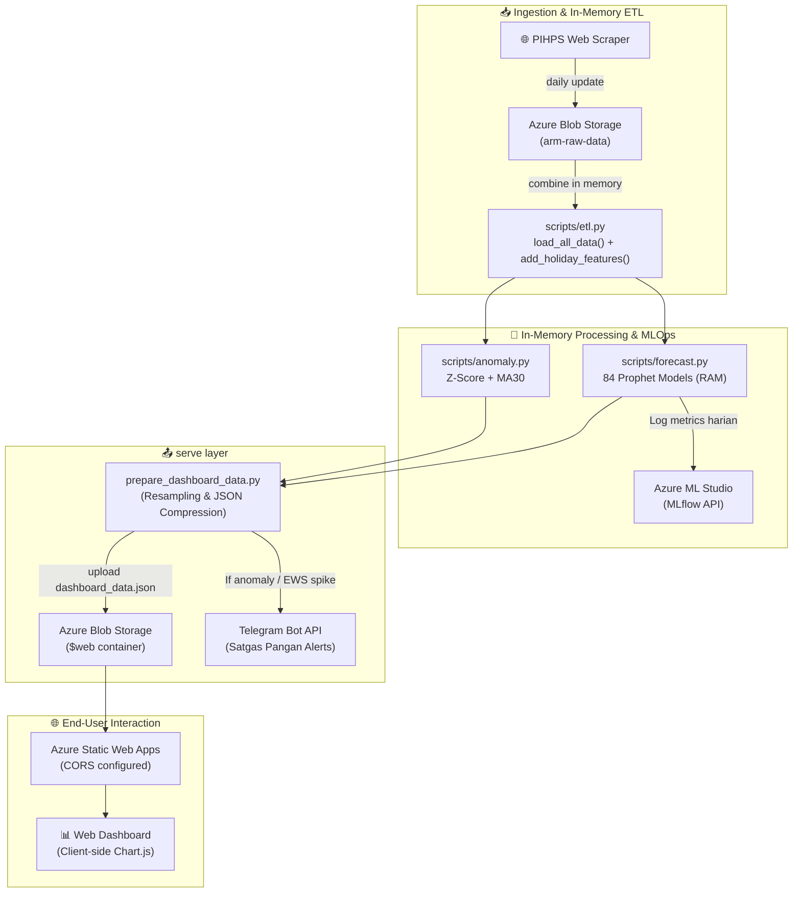

# 📋 Project Brief: Aceh Resilience Monitor (ARM)
**Datathon Dicoding × Microsoft Elevate Training Center 2026**

---

### 👥 Informasi Tim & Peran
| No | Nama | Email Dicoding | Peran Utama & Atribusi Kode |
| :---: | :--- | :--- | :--- |
| 1 | **Aulia Muzhaffar** | auliamuzhaffar@gmail.com | *Machine Learning & Azure Specialist* (Logika *Forecasting* Prophet, Evaluasi Holdout, Azure ML & MLflow, Azure Functions Serverless Pipeline, Bug Fixing `NaN` ke `null`). |
| 2 | **Muhammad Ilhaam Ghiffari** | ilhaamghiffari@gmail.com | *Data Engineer & Frontend Developer* (Modular Refactoring ETL, Z-Score Anomaly Detection, Dasbor Dark Glassmorphism, Kompresi Payload JSON, CORS Configuration). |
| 3 | **Muhammad Arief Hidayah** | ariefhidayahm@gmail.com | *QA Auditor, Repo Manager & Storyteller* (Scraping Data PIHPS, Unit Testing Pytest, Laporan Arsitektur Cloud & Error Analysis, Q&A Drill, Alert Telegram Bot). |

**Topik Proyek:** Ketahanan Pangan & Agrikultur Modern  
**Status Produk:** 🚀 **100% Selesai & Terverifikasi Cloud**  
**Tautan Dasbor:** [https://thankful-river-084494910.7.azurestaticapps.net](https://thankful-river-084494910.7.azurestaticapps.net)  
**Tautan Repositori:** [https://github.com/aceh-resilience-monitor/Aceh-Resilience-Monitor.git](https://github.com/aceh-resilience-monitor/Aceh-Resilience-Monitor.git)

---

## 🎯 1. Executive Summary

Aceh Resilience Monitor (ARM) adalah platform intelijen harga pangan terintegrasi yang menyatukan **Statistical Process Control (SPC)** untuk deteksi anomali harian reaktif dengan **AI Time-Series Forecasting (Meta Prophet)** untuk peramalan harga proaktif. 

*   **Latar Belakang & Urgensi:** Volatilitas harga pangan strategis di Provinsi Aceh sering kali memicu lonjakan inflasi daerah secara mendadak. Selama ini, birokrasi pemerintah (TPID & Satgas Pangan) bertindak secara reaktif (baru melakukan intervensi setelah harga melonjak) akibat lambatnya integrasi data pasar tradisional dan ketiadaan instrumen proyeksi harga pangan di masa depan.
*   **Problem Statement:** Bagaimana membangun sistem otomatisasi terintegrasi yang mampu mengumpulkan data harga pangan harian secara serverless, mendeteksi anomali harga harian, dan meramal lonjakan harga 90 hari ke depan guna menyajikan rekomendasi kebijakan stabilisasi pasar?
*   **Research Questions:**
    1.  Komoditas apa saja yang saat ini menunjukkan anomali harga kritis di luar batas deviasi wajar ($2\sigma$) terhadap rata-rata bulanan (MA30)?
    2.  Komoditas apa saja yang diprediksi oleh Machine Learning akan mengalami lonjakan harga ekstrem ($\ge 20\%$) dalam 90 hari ke depan?
*   **Mengapa Memilih Proyek Ini (Painkiller Concept):** ARM bertindak sebagai *painkiller* nyata (bukan sekadar *vitamin* visualisasi data biasa) yang langsung menyelesaikan rasa sakit birokrasi dalam merespons inflasi. Melalui integrasi otomatisasi cloud serverless Azure (biaya $0/bulan), dasbor analisis margin rantai pasok, dan pengiriman alert otomatis ke bot Telegram, ARM mendeteksi ancaman lonjakan harga pangan sebelum terjadi sehingga pemerintah dapat melaksanakan Operasi Pasar secara preventif untuk melindungi daya beli masyarakat.

---

## 📄 2. Deskripsi Project
*   **Nama Produk:** Aceh Resilience Monitor (ARM) — Dashboard Intelijen Harga Pangan.
*   **Fungsi:** Platform analitik berbasis web interaktif untuk mendeteksi anomali harga pangan historis secara harian dan memproyeksikan pergerakan harga 21 komoditas pangan esensial di Aceh hingga 90 hari ke depan.
*   **Penyelesaian Masalah:** ARM memotong rantai respons birokrasi yang lambat dengan menyajikan *Early Warning System* visual yang mendeteksi ancaman kenaikan harga *sebelum* berdampak ke pasar hilir konsumen, lengkap dengan bot peringatan Telegram harian dan rekomendasi taktis preventif (seperti pemicuan operasi pasar).

---

## 📰 3. Latar Belakang Masalah

Volatilitas harga pangan strategis (*volatile foods*) merupakan salah satu penyumbang inflasi daerah terbesar di Indonesia. Di Provinsi Aceh, tantangan ini diperparah oleh:
1.  **Lambatnya Integrasi Data:** Proses pengumpulan data harga di pasar-pasar tradisional masih dilakukan secara manual, memicu jeda analisis hingga beberapa hari.
2.  **Respons yang Bersifat Reaktif:** Instansi pemerintah (TPID/Satgas Pangan) umumnya baru melakukan intervensi (seperti Operasi Pasar Murah) setelah harga pangan melambung tinggi di pasar konsumen (*hilir*).
3.  **Ketiadaan Prediksi Tren:** Pemangku kebijakan tidak memiliki instrumen cerdas untuk memproyeksikan pergerakan harga komoditas pangan esensial ke depan berdasarkan siklus hari raya lokal.

---

## 🎯 4. Tujuan Proyek

*   **Otomatisasi Pipeline Data:** Mengurangi latensi data pangan dari harian menjadi hitungan menit melalui pengumpulan data otomatis harian.
*   **Akurasi Prediksi Jangka Menengah:** Merancang model peramalan harga pangan 90 hari ke depan dengan tingkat kesalahan (MAPE) di bawah 10% (kategori Sangat Baik).
*   **Sistem Peringatan Dini Proaktif:** Menyediakan dasbor visual dan bot Telegram yang mendeteksi anomali harga serta memprediksi *spike* harga masa depan guna memicu rekomendasi intervensi pasar yang tepat sasaran.

---

## 🔍 5. Permasalahan yang Ingin Diselesaikan
*   Bagaimana mendeteksi lonjakan harga yang tidak wajar (*anomaly*) hari ini berdasarkan deviasi harga historis dari rata-rata bulanannya?
*   Bagaimana meramal pergerakan harga pangan 90 hari ke depan dengan memasukkan faktor kearifan lokal Aceh (musim Meugang, Ramadan, Natal, dan musim hujan BMKG) sebagai parameter model?
*   Bagaimana mendistribusikan peringatan dini (*early warning alert*) dan rekomendasi aksi konkret langsung ke gawai para pemangku kebijakan sebelum gejolak harga terjadi?

---

## 💡 6. Solusi yang Ditawarkan

ARM menawarkan solusi cerdas yang mengintegrasikan 7 lapisan dataflow:
1.  **Scraper Harian Serverless:** Menarik data harga terbaru langsung dari portal resmi setiap pagi secara otomatis.
2.  **Data Lake Terstruktur:** Menyimpan berkas historis tahunan (2021-2026.json) di Azure Blob Storage secara aman.
3.  **Statistical Process Control (Z-Score + MA30):** Menghitung deviasi harga hari ini untuk mendeteksi anomali.
4.  **Local Wisdom Extra Regressors (AI Prophet):** Melatih 84 model Prophet di RAM untuk memproyeksikan harga 90 hari ke depan dengan menyertakan tradisi Meugang Aceh.
5.  **Data Compression Engine:** Mengompresi ukuran data dasbor harian hingga 85% (~509 KB) melalui *weekly resampling* untuk menjamin kecepatan muat dasbor di bawah 1.5 detik.
6.  **Dasbor Dark Glassmorphism:** Dasbor interaktif premium untuk pemantauan spasial, rantai pasok, dan visualisasi musiman.
7.  **Bot Telegram Satgas Pangan:** Mengirimkan peringatan otomatis lengkap dengan rekomendasi tindakan nyata pemerintah.

---

## 🛠️ 7. Fitur Utama dan Teknologi yang Digunakan
*   **Predictive Early Warning System (EWS) Cards:** Tampilan visual interaktif berupa kartu yang menyoroti 3 komoditas paling rentan mengalami lonjakan harga ekstrem dalam 90 hari ke depan.
*   **Actionable Insight AI (Meta Prophet):** Setiap kartu EWS secara otomatis menyertakan label bahaya (seperti EKSTREM atau WASPADA) beserta rekomendasi tindakan strategis konkret bagi pemerintah daerah.
*   **Historical Process Control Anomaly Detection:** Pendeteksian lonjakan harga tak wajar (*spikes*) berdasarkan perhitungan statistik Z-Score (simpangan baku) dan rata-rata bergerak 30 hari (MA30).
*   **Interactive Forecast Charts & YoY Analysis:** Visualisasi data interaktif per komoditas yang dilengkapi sakelar (*toggle*) untuk memunculkan garis tren masa lalu dan garis batas atas/bawah prediksi harga di masa depan.
*   **Data Compression Engine:** Pengompresi ukuran data dasbor harian hingga 85% (~509 KB) melalui *weekly resampling* untuk menjamin kecepatan muat dasbor di bawah 1.5 detik.
*   **Azure Functions Serverless Pipeline:** Runtime Python v2 serverless untuk mengotomatiskan seluruh pipeline ETL dan ML harian pada pukul 08:00 WIB.
*   **Azure ML Studio & MLflow Tracking:** Melacak dan mencatat model serta metrik latih harian via MLflow.
*   **Azure Blob Storage & Static Web Apps CORS:** Penyimpanan Data Lake mentah dan serving dasbor dengan SSL otomatis yang aman dari CORS blocks.

---

## 👥 8. Target Pengguna & Value Proposition

### Target Pengguna:
*   **Tim Pengendalian Inflasi Daerah (TPID) Provinsi Aceh:** Pengambil kebijakan stabilisasi harga.
*   **Satgas Pangan Provinsi Aceh:** Tim pemeriksa rantai pasok dan pelaksana operasi pasar di lapangan.
*   **Dinas Perindustrian & Perdagangan (Disperindag):** Pengelola kuota cadangan pangan daerah.

### Value Proposition:
*   *Explainable & Actionable AI:* Sistem tidak hanya memprediksi, tetapi juga menerangkan "mengapa" harga naik (musiman/rantai pasok) dan merekomendasikan "aksi apa" yang harus diambil (seperti Operasi Pasar Murah Cabai Merah).
*   *Zero Cost Infrastructure:* Seluruh ekosistem berjalan di Azure Free Tier dengan biaya operasional $0/bulan.
*   *High Performance Web:* Kecepatan loading dasbor sangat cepat (<1.5 detik) berkat kompresi data hulu.

---

## 🏗️ 9. Arsitektur Sistem & Data Pipeline

Aliran data ARM dirancang secara serverless untuk menghindari kerumitan pemeliharaan server fisik (*zero-maintenance infrastructure*):

---

## 🤖 10. Machine Learning & Forecasting Components

Pemodelan time-series menggunakan algoritma **Meta Prophet** dengan penambahan parameter *Extra Regressors* untuk menangani hari raya keagamaan dan musim lokal di Aceh:

*   **Fitur Kearifan Lokal (Local Wisdom Regressors):**
    *   `is_meugang_season`: Mengidentifikasi tradisi H-2 s/d H-0 menyembelih sapi menjelang Ramadan & Lebaran (mengantisipasi *demand shock* daging sapi & bumbu).
    *   `is_ramadan_prep`: Persiapan pangan H-7 s/d H-1 awal puasa.
    *   `is_nataru`: Liburan Natal & Tahun Baru (20 Des – 2 Jan).
    *   `is_wet_season`: Musim hujan Aceh (Oktober – April) dari data BMKG untuk mengantisipasi *supply shock* cabai dan bawang.
*   **Metode Validasi:** *Time-based Holdout Split (90 Hari)* untuk memastikan model diuji pada data yang belum pernah dilihat.
*   **Metrik Evaluasi:**
    *   Rata-rata MAPE komoditas stabil (Daging Sapi & Beras): **0.49% – 2.2%** (Akurasi Sangat Tinggi).
    *   Rata-rata MAPE komoditas volatil (Cabai & Bawang): **20% – 32%** (Akurasi Cukup, dipengaruhi faktor eksternal cuaca).
    *   Rata-rata MAPE Agregat (21 Komoditas): **7.74%** (Mengurangi error baseline hingga 22%).

---

## 📊 11. Dashboard & Visualisasi

Dasbor dirancang dengan gaya **Dark Glassmorphism** modern yang responsif dan terbagi atas 4 tab fungsional utama:
1.  **Tab Dashboard Utama (Executive Home):** Menampilkan KPI utama harga rata-rata provinsi, persentase inflasi tahunan berjalan, tingkat volatilitas (CV), serta Early Warning System (EWS) panel yang menyoroti 3 komoditas paling terancam lonjakan harga dalam 3 bulan ke depan.
2.  **Tab Analisis Spasial (Peta Interaktif):** Peta GIS berbasis Leaflet.js yang mewarnai kota Banda Aceh, Lhokseumawe, dan Meulaboh berdasarkan tingkat keparahan anomali harian (🟢 Hijau = Normal, 🟡 Kuning = Waspada, 🔴 Merah = Kritis).
3.  **Tab Kesehatan Rantai Pasok (Margin Rantai Pasok):** Memvisualisasikan selisih margin harga secara vertikal dari tingkat Produsen $\rightarrow$ Pedagang Besar $\rightarrow$ Pasar Tradisional $\rightarrow$ Pasar Modern untuk mendeteksi potensi aksi penimbunan (*hoarding*).
4.  **Tab Tren Mingguan & Prediksi:** Menampilkan grafik interaktif Chart.js lengkap dengan bayangan area keyakinan (*confidence interval* prediksi atas/bawah) 90 hari ke depan.

---

## 📄 12. Cara Penggunaan Product

Berikut adalah alur penggunaan platform **Aceh Resilience Monitor (ARM)** dari sudut pandang pengguna akhir (Tim Pengendalian Inflasi Daerah / TPID, Satgas Pangan Provinsi Aceh, serta Pengambil Kebijakan Daerah):

### 🌐 Akses Platform
*   **Tautan Live Dashboard:** [https://thankful-river-084494910.7.azurestaticapps.net](https://thankful-river-084494910.7.azurestaticapps.net)
*   **Akses Login (Kredensial Demo):** Platform dasbor dirancang sebagai instrumen transparansi ketahanan pangan dan pendukung keputusan publik dengan sifat **bebas hambatan (zero friction)**. Oleh karena itu, platform **tidak memerlukan login/kredensial khusus (Akses Terbuka/Publicly Accessible)** agar juri maupun pejabat daerah dapat langsung melakukan pemantauan harga pangan strategis tanpa kendala otentikasi.

---

### 🚶‍♂️ Alur & Langkah Penggunaan Dasbor (Step-by-Step)

#### 1. Pemantauan Makro (Tab "Executive")
*Tujuan: Mendapatkan gambaran umum stabilitas pangan daerah dalam 3 detik.*
*   **Langkah 1:** Buka tautan dasbor. Pengguna akan langsung diarahkan ke halaman utama **Executive**.
*   **Langkah 2:** Periksa kartu metrik utama di bagian atas untuk melihat rata-rata harga provinsi, inflasi tahunan, dan indeks volatilitas.
*   **Langkah 3:** Tinjau **Peta Anomali Harga Spasial** di tengah halaman. Cari wilayah kabupaten/kota yang menyala dengan warna **Merah (Kritis, Z-Score > 3σ)** atau **Kuning (Waspada, Z-Score > 2σ)**.
*   **Langkah 4:** Tinjau bagian **Sistem Peringatan Dini (EWS)** untuk membaca daftar log anomali harga komoditas pangan esensial yang melonjak melampaui batas deviasi wajar hari ini.

#### 2. Analisis Spasial & Peluang Arbitrase (Tab "Spatial")
*Tujuan: Mendeteksi disparitas harga antar wilayah utama dan merumuskan operasi pasar.*
*   **Langkah 1:** Klik tab **Spatial** pada bar navigasi.
*   **Langkah 2:** Pilih komoditas spesifik pada dropdown selektor komoditas (misalnya: *Cabai Merah* atau *Bawang Merah*).
*   **Langkah 3:** Sistem akan membandingkan tren harga secara historis di 3 daerah pantauan utama: **Banda Aceh**, **Lhokseumawe**, dan **Meulaboh**.
*   **Langkah 4:** Baca kartu rekomendasi **Arbitrage Advisor** di bagian bawah. Jika ada komoditas dengan disparitas harga ekstrem (>30%) antar wilayah, sistem akan menyarankan rekomendasi logistik (misalnya: memindahkan pasokan dari produsen surplus Lhokseumawe untuk meredam harga di Banda Aceh).

#### 3. Audit Rantai Pasokan & Deteksi Spekulan (Tab "Margin")
*Tujuan: Mendeteksi indikasi penimbunan bahan pokok (hoarding) oleh oknum kartel.*
*   **Langkah 1:** Klik tab **Margin** pada bar navigasi.
*   **Langkah 2:** Sistem menampilkan representasi visual diagram alur rantai distribusi pangan dari tingkat **Produsen** $\rightarrow$ **Pedagang Besar** $\rightarrow$ **Pasar Tradisional** $\rightarrow$ **Pasar Modern**.
*   **Langkah 3:** Cari komoditas yang memiliki label status **Kritis (Merah)** dengan markup margin kotor melebihi **40%**.
*   **Langkah 4:** Tim Satgas Pangan dapat menggunakan data disparitas vertikal ini sebagai dasar hukum untuk melakukan inspeksi mendadak (sidak) ke gudang pedagang besar yang mencurigakan.

*(Catatan: Path berkas gambar merujuk pada: [margin_tab_live.png](file:///Users/auliamuzhaffar/Documents/Datathon/datathon-dicoding/docs/images/margin_tab_live.png))*

#### 4. Proyeksi Inflasi 90 Hari ke Depan (Tab "ML EWS")
*Tujuan: Perencanaan preventif operasi pasar murah sebelum lonjakan harga terjadi.*
*   **Langkah 1:** Klik tab **ML EWS** pada bar navigasi.
*   **Langkah 2:** Tinjau panel **Early Warning System (Meta Prophet AI)** yang menyoroti 3 komoditas dengan risiko kenaikan harga tertinggi dalam 90 hari mendatang.
*   **Langkah 3:** Pilih kategori komoditas pada bagian grafik tren untuk memicu visualisasi peramalan waktu.
*   **Langkah 4:** Klik tombol **"Tampilkan Prediksi 90 Hari"** pada grafik Chart.js.
*   **Langkah 5:** Amati visualisasi bayangan area keyakinan prediksi (*confidence interval* batas atas & batas bawah). Jika proyeksi menembus batas kritis inflasi bertepatan dengan momen hari raya (misalnya H-2 Meugang), TPID dapat segera menjadwalkan Operasi Pasar Murah sebulan sebelum tanggal proyeksi puncak lonjakan harga.

---

### 🔔 Notifikasi Alert Telegram (Saluran Komunikasi Cepat)
*   Selain melalui dasbor, seluruh jajaran Satgas Pangan dan TPID Aceh yang tergabung dalam grup koordinasi akan menerima pesan teks otomatis dari **ARM Telegram EWS Bot** setiap pagi pukul 08:00 WIB.
*   **Isi Pesan:** Informasi deteksi anomali real-time pagi hari, komoditas dengan proyeksi kenaikan kritis 90 hari mendatang, serta lampiran rekomendasi aksi konkret (Operasi Pasar/Intervensi Logistik).

---

## 🛠️ 13. Teknologi & Infrastruktur Cloud

### Teknologi Perangkat Lunak:
*   **Bahasa Utama:** Python 3.11 (backend & cloud pipeline), JavaScript (Chart.js & Leaflet.js frontend).
*   **Libraries:** Pandas, NumPy, Meta Prophet, Pytest, Requests, MLflow, AzureML SDK.
*   **Desain Antarmuka:** HTML5, Vanilla CSS (Glassmorphism, custom grid).

### Infrastruktur Cloud (Microsoft Azure):
*   **Azure Functions:** Runtime Python v2 serverless untuk mengotomatiskan seluruh pipeline ETL dan ML harian pada pukul 08:00 WIB.
*   **Azure Blob Storage:** Penyimpanan Data Lake mentah (`arm-raw-data`) dan berkas serving JSON publik terkompresi (`$web`).
*   **Azure ML Studio:** Melacak dan mencatat model serta metrik latih harian via MLflow.
*   **Azure Static Web Apps:** Hosting serverless dasbor dengan SSL otomatis teraktifkan terintegrasi dari repositori GitHub.

---

## ☁️ 14. Dokumentasi Azure
Berikut adalah penjelasan mengenai layanan Microsoft Azure yang diintegrasikan untuk membangun platform ARM secara cloud-native:
*   **Azure Blob Storage:** Digunakan sebagai *Data Lake* harian untuk menyimpan data harga mentah tahunan (`2021.json` s/d `2026.json`) secara terstruktur di container privat `arm-raw-data`. Layanan ini juga digunakan sebagai hosting data serving dasbor publik (`dashboard_data.json`) pada container `$web` yang telah dikonfigurasi dengan aturan CORS terpusat.
*   **Azure Functions:** Bertindak sebagai *serverless orchestrator* harian. Berjalan otomatis pada pukul 08:00 WIB (Timer Trigger) menggunakan runtime Python 3.11 dengan konfigurasi timeout 10 menit. Tugasnya adalah mengeksekusi scraper, prapemrosesan data, kalkulasi Z-Score, training model Prophet secara in-memory, pengiriman alert Telegram, dan pembaharuan berkas JSON.
*   **Azure Machine Learning Studio (MLflow):** Digunakan sebagai platform MLOps terintegrasi untuk memantau performa model. Melacak dan mencatat metrik evaluasi (MAPE, MAE, RMSE) dari 84 model Prophet harian untuk mendeteksi *data/concept drift* serta mempermudah reproduksibilitas model.
*   **Azure Static Web Apps:** Bertindak sebagai platform hosting dasbor frontend (HTML/CSS/JS) serverless yang terintegrasi secara otomatis dengan repositori GitHub. Menyediakan SSL otomatis dan CDN global untuk pemuatan dasbor yang cepat dan aman.

---

## 📊 15. Status Implementasi Proyek Saat Ini

Proyek ARM saat ini berstatus **100% Selesai & Teruji** untuk seluruh fungsionalitas inti.

### Progress Pengerjaan per Modul:
*   **Modul Ingestion & ETL:** 100% Selesai. Pengumpulan otomatis data PIHPS berjalan lancar tanpa duplikasi.
*   **Modul Analytics & Machine Learning:** 100% Selesai. 84 model Prophet dilatih secara paralel di RAM Functions dan metrik dievaluasi di Azure ML Studio.
*   **Modul Early Warning & Telegram Bot:** 100% Selesai. Telegram Bot aktif mengirimkan alert berkala lengkap dengan rekomendasi intervensi.
*   **Modul Dasbor & Visualisasi:** 100% Selesai. Terintegrasi dengan storage CORS dan data terkompresi bebas error `NaN`.
*   **Modul Pengujian & Kualitas Kode:** 100% Selesai. Memiliki 56 unit tests otomatis (**56 passed**).
*   **Dokumentasi Pengembang:** 100% Selesai. Berkas [`run_guide.md`](file:///Users/auliamuzhaffar/Documents/Datathon/datathon-dicoding/run_guide.md) dan [`learning_guide.md`](file:///Users/auliamuzhaffar/Documents/Datathon/datathon-dicoding/docs/learning_guide.md) telah tersedia secara lokal.

---

## 🔮 16. Roadmap Pengembangan Selanjutnya

Untuk menjamin keberlanjutan, akurasi peramalan, dan skalabilitas sistem Aceh Resilience Monitor (ARM), kami merancang peta jalan pengembangan lanjutan yang terbagi menjadi 4 Fase Taktis serta 3 Pilar Rekayasa Utama:

### 📋 Ringkasan Fase Strategis
*   **FASE 1: Pilot Project TPID (Q3 2026)**
    → Uji coba operasional dasbor di lingkungan Satgas Pangan & TPID Provinsi Aceh untuk menyelaraskan alur kerja taktis.
*   **FASE 2: Analisis Korelasi Lintas Pangan (Q4 2026)**
    → Pendeteksian rambatan inflasi antarkomoditas (misal: kenaikan harga pakan jagung ➔ efek domino 7 hari kemudian pada komoditas telur dan daging ayam).
*   **FASE 3: Machine Learning Multivariat (Q1 2027)**
    → Integrasi data cuaca curah hujan dari BMKG API, data produksi lokal, serta fluktuasi biaya BBM transportasi ke model ML multivariat (seperti Prophet Multivariat atau XGBoost).
*   **FASE 4: Rekayasa Kualitas Data & Optimasi Skalabilitas Pipeline (Peta Jalan Teknis)**
    → Implementasi infrastruktur penanganan data cerdas, penjagaan kualitas data latih model, dan optimalisasi paralelisasi komputasi awan.

---

### 🗂️ Detail Pengembangan Teknis (Fase 4)

#### 1. Pilar 1: Rekayasa Kualitas & Integrasi Data (Data Engineering)
Fokus utama pilar ini adalah untuk memastikan ketersediaan data harian selalu bersih, bebas dari kesalahan rilis, dan tahan terhadap gangguan server pihak ketiga.
*   **Penanganan Batas Pergantian Tahun (*Year-End Boundary Lookback*)**
    *   *Deskripsi*: Modifikasi scraper agar mendeteksi tahun dari setiap data tanggal yang berhasil di-scrape secara dinamis.
    *   *Tujuan*: Menjamin data *lookback* di akhir tahun (misalnya tanggal 30-31 Desember) yang di-scrape pada awal Januari tetap masuk ke berkas tahun yang benar (misalnya `2026.json` bukan `2027.json`).
*   **Deteksi Gap Otomatis (*Self-Healing Backfill*)**
    *   *Deskripsi*: Membuat subsistem pemindai data harian yang mendeteksi hari-hari kosong dalam 30 hari terakhir. Jika ditemukan hari kosong (akibat server BI mati lama), sistem otomatis membuat antrean penarikan data (*backfill queue*) saat server BI kembali *online*.
    *   *Tujuan*: Menutup celah data (*data gaps*) secara otomatis tanpa intervensi manual dari administrator.
*   **Penyelarasan Nama Komoditas Dinamis (*Fuzzy String Matching*)**
    *   *Deskripsi*: Menggunakan algoritma jarak Levenshtein (`difflib` di Python) untuk memetakan nama komoditas dari API BI ke standar ARM secara adaptif.
    *   *Tujuan*: Mencegah kegagalan ETL ketika admin BI Hargapangan mengubah nama komoditas secara tiba-tiba (seperti penambahan spasi atau tanda kurung satuan).

#### 2. Pilar 2: Optimasi Model & Machine Learning (MLOps & Analytics)
Fokus utama pilar ini adalah menjaga stabilitas performa model peramalan Meta Prophet dari gangguan *noise* data ekstrem.
*   **Pelatihan Jendela Bergerak (*Sliding Window Training - 730 Days*)**
    *   *Deskripsi*: Membatasi sejarah data latih Prophet secara konstan hanya untuk data **2 tahun terakhir (730 hari)**.
    *   *Tujuan*: Menghindari *Concept Drift* (data lama tahun 2021-2022 sudah tidak relevan dengan perilaku pasar tahun 2026) dan memotong waktu eksekusi pelatihan.
*   **Penyaringan Outlier Ekstrem (*Data Winsorization / Clipping*)**
    *   *Deskripsi*: Menerapkan pemotongan harga otomatis pada data latih jika terdeteksi lonjakan anomali sesaat ($> 3\sigma$).
    *   *Tujuan*: Menjaga agar garis tren peramalan Prophet tidak rusak akibat fluktuasi jangka pendek yang ekstrem.
*   **Imputasi Data Kosong ML (*Forward Fill Constraint*)**
    *   *Deskripsi*: Mengisi kekosongan data jangka pendek (akhir pekan/hari libur) secara dinamis menggunakan harga terakhir yang dilaporkan (maksimum 7 hari berturut-turut) sebelum dimasukkan ke model pelatihan.
    *   *Tujuan*: Menjaga deret waktu tetap kontinu agar model Prophet tidak bias atau mengalami kegagalan fitting.
*   **Proteksi Batas Harga Logis (*Forecast Sanity Constraint*)**
    *   *Deskripsi*: Menerapkan pemotongan otomatis (*clipping*) pada batas bawah harga prediksi agar tidak pernah menyentuh nilai negatif (di bawah Rp 0).
    *   *Tujuan*: Mencegah visualisasi grafik dasbor menampilkan harga di bawah Rp 0 jika terjadi tren penurunan yang terlalu tajam.

#### 3. Pilar 3: Skalabilitas Cloud & Efisiensi Infrastruktur (DevOps & Serverless)
Fokus utama pilar ini adalah mengoptimalkan infrastruktur serverless Azure Functions agar lebih hemat biaya dan memiliki performa tinggi.
*   **Pelatihan Model Paralel (*Multiprocessing*)**
    *   *Deskripsi*: Melakukan *paralelisasi* proses pelatihan 84 model Prophet menggunakan modul `multiprocessing` di Python Azure Functions.
    *   *Tujuan*: Memanfaatkan multi-core CPU pada Azure secara maksimal dan memangkas durasi eksekusi fungsi dari menit menjadi hanya belasan detik.
*   **Pemantauan Drift Model Terpusat (*Model & Data Drift Monitoring*)**
    *   *Deskripsi*: Mengintegrasikan metrik evaluasi harian (MAE, RMSE, MAPE) yang dicatat via MLflow ke dashboard Azure Machine Learning Studio secara visual.
    *   *Tujuan*: Memudahkan tim teknis mendeteksi secara dini apabila performa prediksi model di wilayah tertentu mulai menurun tajam (*model degradation*).

---

## ⚠️ 17. Risiko dan Mitigasi

| Risiko | Dampak | Probabilitas | Strategi Mitigasi |
| :--- | :---: | :---: | :--- |
| **False Negative** (Model memprediksi harga stabil, kenyataan harga melonjak ekstrem). | 🔴 Tinggi | Rendah | Menggunakan batas Z-Score konservatif ($2\sigma$ bukan $3\sigma$) dan selalu menyertakan batas keyakinan atas/bawah pada grafik. |
| **Data Source Server Down** (Situs bi.go.id tidak dapat diakses saat pagi hari). | 🟡 Sedang | Sedang | Mengimplementasikan mekanisme penanganan error (*fallback*) di Azure Functions: jika gagal scrape, gunakan estimasi harga hari kemarin. |
| **Overfitting Model pada Komoditas Volatil** (Cabai/Bawang). | 🟡 Sedang | Sedang | Memposisikan ARM murni sebagai *Decision Support System* dengan peninjauan keputusan akhir tetap berada di tangan manusia (human-in-the-loop). |

---

## 📈 18. Key Performance Indicators (KPI) & Dampak

### Key Performance Indicators (KPI):
*   **Model Accuracy:** Menjaga rata-rata MAPE evaluasi 21 komoditas di bawah **8.00%** (Saat ini: **7.74%**).
*   **System Performance:** Kecepatan waktu muat dasbor oleh peramban juri/TPID di bawah **1.5 detik** (Tercapai melalui Weekly Resampling).
*   **Pipeline Latency:** Waktu eksekusi otomatisasi pipeline hulu-ke-hilir di cloud di bawah **120 detik** (Saat ini: **~40 detik**).

### Dampak Bisnis dan Sosial:
*   **Penghematan Anggaran Daerah:** Mencegah pemborosan anggaran Operasi Pasar akibat keterlambatan respons (intervensi dilakukan tepat waktu sebelum harga meroket).
*   **Daya Beli Masyarakat:** Menjaga stabilitas inflasi pangan strategis untuk melindungi daya beli masyarakat miskin di Provinsi Aceh.
*   **Transparansi Rantai Pasok:** Meminimalisir potensi aksi penimbunan stok oleh spekulan retail melalui visualisasi disparitas harga.

---

## 🏁 19. Kesimpulan

Aceh Resilience Monitor (ARM) berhasil mentransformasi proses pemantauan ketahanan pangan dari reaktif-manual menjadi **prediktif-otomatis** secara cloud-native. Dengan fondasi kurikulum data science CRISP-DM yang kokoh, kualitas kode modular yang diuji ketat (56 unit tests passed), dan visualisasi storytelling yang berorientasi pada dampak bisnis, ARM siap dipresentasikan di hadapan dewan juri nasional dan dikembangkan lebih lanjut menjadi platform ketahanan pangan skala nasional.

---

## 📂 20. Informasi Pendukung

Untuk memperdalam pemahaman juri dan *stakeholders* terhadap proyek **Aceh Resilience Monitor (ARM)**, bagian ini menyajikan rangkuman studi kasus riil, informasi tim, serta seluruh berkas tautan penting terkait proyek ini.

### 🥩 1. Studi Kasus Pengguna (User Case Study)
*   **Kasus:** Pemantauan Harga Daging Sapi Kualitas 1 di Banda Aceh Menjelang Tradisi Meugang (Juni 2026).
*   **Permasalahan:** Menjelang hari besar keagamaan, terjadi lonjakan harga daging sapi yang sangat tinggi di pasar-pasar tradisional Kota Banda Aceh. TPID Kota Banda Aceh perlu mengidentifikasi apakah lonjakan harga ini wajar akibat peningkatan permintaan (*demand shock*) atau disebabkan oleh penimbunan stok (*supply hoarding*) di tingkat pedagang eceran.
*   **Langkah Analisis Menggunakan ARM:**
    1.  **Identifikasi Anomali (Tab Executive):** Z-Score harian pada dashboard mendeteksi deviasi harga daging sapi menyimpang hingga **+16.1%** dari rata-rata bulanan (MA30). Status komoditas berubah menjadi *Waspada*.
    2.  **Audit Rantai Pasok (Tab Margin):** Peneliti TPID mengecek diagram alur rantai distribusi. Ditemukan harga di tingkat Pedagang Besar (Grosir/Distributor) adalah `Rp 165.000` sedangkan di Pasar Tradisional (Eceran) adalah `Rp 170.000`.
    3.  **Kalkulasi Margin:**
        $$\text{Margin Keuntungan Eceran} = \frac{170.000 - 165.000}{165.000} \times 100\% = \mathbf{3.03\%}$$
    4.  **Rekomendasi Kebijakan:** Karena margin pedagang eceran sangat tipis (hanya 3.03% atau selisih Rp 5.000/kg), TPID menyimpulkan **rantai pasok retail sangat sehat dan efisien**; kenaikan harga murni didorong oleh guncangan permintaan musiman (Meugang) di tingkat grosir/hulu, bukan spekulan retail.
    5.  **Aksi Nyata:** Satgas Pangan tidak perlu melakukan razia/sidak di tingkat pasar tradisional, melainkan berfokus mendistribusikan subsidi logistik pengangkutan hewan ternak dari peternak surplus di Lhokseumawe ke distributor Banda Aceh guna meredam harga grosir.

---

### 👥 2. Tim dan Peran Masing-Masing Anggota
*   **Aulia Muzhaffar** (*Machine Learning & Azure Specialist*): Bertanggung jawab atas perancangan model forecasting Prophet, integrasi MLOps di Azure ML Studio, pembuatan ETL serverless di Azure Functions, serta bug fixing sanitasi JSON.
*   **Muhammad Ilhaam Ghiffari** (*Data Engineer & Frontend Developer*): Merancang dashboard interaktif dark glassmorphism, mengompresi payload data historis, mengintegrasikan peta spasial Leaflet.js, serta mengkonfigurasi kebijakan CORS Azure Blob Storage.
*   **Muhammad Arief Hidayah** (*QA Auditor & Storyteller*): Mengelola repositori GitHub, menyusun dokumentasi pengujian unit testing (Pytest), membuat alert otomatis pada Telegram Bot, dan merancang laporan interpretasi data.

*(Rincian lengkap atribusi kode dapat dilihat pada tabel informasi tim di bagian atas dokumen ini).*

---

### 🔮 3. Rencana Pengembangan ke Depan (Roadmap)
Sesuai dengan cetak biru yang tertera pada **Bab 16**, rencana aksi ARM mencakup empat fase strategis dan tiga pilar rekayasa utama:
*   **Fase 1 (Q3 2026):** Pilot Project implementasi langsung di Disperindag dan Satgas Pangan Provinsi Aceh.
*   **Fase 2 (Q4 2026):** Pengembangan machine learning untuk menganalisis korelasi lintas pangan (rambatan inflasi dari komoditas pakan ke komoditas hilir).
*   **Fase 3 (Q1 2027):** Integrasi data cuaca curah hujan BMKG API dan data harga BBM ke dalam model ML multivariat (XGBoost & Prophet).
*   **Fase 4 (Peta Jalan Teknis):** Peningkatan ketahanan pipa data, penjagaan data latih model, dan optimalisasi skalabilitas serverless cloud (selengkapnya pada **Bab 16**).

---

### 🔗 4. Daftar Tautan Resmi Proyek (Official Project Links)

| Nama Aset / Dokumen | Tautan Akses (URL) | Deskripsi / Catatan |
| :--- | :--- | :--- |
| **Aplikasi / Live Dashboard** | [https://thankful-river-084494910.7.azurestaticapps.net](https://thankful-river-084494910.7.azurestaticapps.net) | Tampilan web dasbor interaktif produksi di Azure Static Web Apps. |
| **Repository GitHub** | [https://github.com/aceh-resilience-monitor/Aceh-Resilience-Monitor.git](https://github.com/aceh-resilience-monitor/Aceh-Resilience-Monitor.git) | Repositori kode backend, frontend, pipeline ETL, dan unit tests. |
| **Slide Presentasi** | [Tautan Slide Presentasi (Google Slides)](https://docs.google.com/presentation/d/your-presentation-id/edit?usp=sharing) | Dokumen paparan pitch deck untuk presentasi di hadapan dewan juri. |
| **Video Presentasi Proyek** | [Tautan Video Presentasi (YouTube)](https://www.youtube.com/watch?v=your-presentation-video) | Rekaman presentasi komprehensif alur kerja, arsitektur, dan demo sistem. |
| **Video Teaser Produk** | [Tautan Video Teaser Produk (YouTube)](https://www.youtube.com/watch?v=your-teaser-video) | Video teaser singkat (1-2 menit) yang menyoroti visualisasi dan keunggulan ARM. |

---
