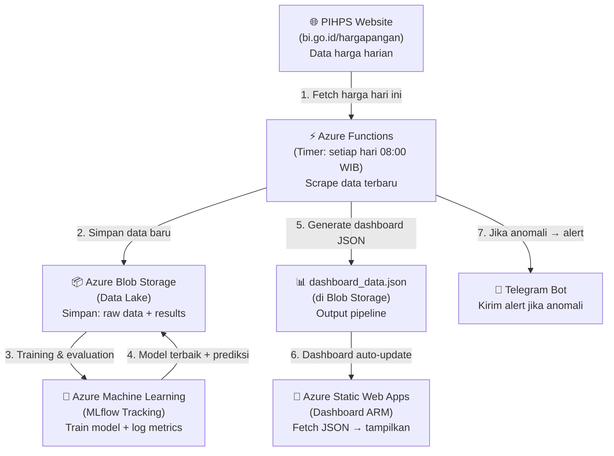

# 🏗️ Panduan Implementasi Azure ML + Azure Functions untuk ARM

> **Ditulis dari NOL** — untuk tim yang belum pernah pakai layanan ini.
> **Deadline:** 5 Juni 2026

---

## 📍 Kondisi Saat Ini vs Target

### SEBELUM (Semua Lokal)
```
Laptop Kamu
├── Excel (2023-2025.xlsx)
├── Python script (prepare_dashboard_data.py)
│   ├── ETL + cleaning
│   ├── Prophet training (18 model)
│   ├── Z-Score anomaly detection
│   └── Output: dashboard_data.json
├── Dashboard (HTML/CSS/JS)
└── Manual upload ke Azure Blob & Static Web Apps
```

**Masalahnya:** Semua jalan di laptop. Tidak ada automation. Tidak ada experiment tracking. Data berhenti di Desember 2025.

### SESUDAH (Dengan Azure ML + Azure Functions)
```
☁️ CLOUD (Azure)
├── Azure ML Workspace        → Tempat TRAINING & TRACKING model
├── Azure Functions            → OTOMATIS jalankan pipeline setiap hari
├── Azure Blob Storage         → SIMPAN semua data & hasil (sudah ada ✅)
└── Azure Static Web Apps      → HOSTING dashboard (sudah ada ✅)
```

---

## 🔄 Data Flow End-to-End (Arsitektur Final)



### Penjelasan Sederhana per Langkah

| Step | Apa yang Terjadi | Siapa yang Menjalankan |
|:---:|---|---|
| 1 | Ambil harga 18 komoditas hari ini dari website PIHPS | Azure Functions (otomatis) |
| 2 | Simpan data baru ke "gudang data" di cloud | Azure Functions → Blob Storage |
| 3 | Train ulang model Prophet + log semua metrik (MAPE, MAE, dll) | Azure ML + MLflow |
| 4 | Simpan model terbaik + hasil prediksi 90 hari | Azure ML → Blob Storage |
| 5 | Generate `dashboard_data.json` yang baru (dengan data terbaru) | Azure Functions |
| 6 | Dashboard otomatis menampilkan data terbaru saat dibuka | Static Web Apps ← Blob Storage |
| 7 | Jika harga hari ini anomali (Z-Score > 2σ), kirim notifikasi | Azure Functions → Telegram |

---

## 🧠 Bagian 1: Azure Machine Learning + MLflow

### Apa Itu Azure ML? (Penjelasan Sederhana)

> Azure ML = **"Lab eksperimen"** di cloud. Setiap kali kamu train model, semua dicatat: parameter apa yang dipakai, metrik hasilnya berapa, model file-nya disimpan di mana.

**Kenapa perlu?** Karena saat ini kamu train 18 model Prophet di laptop dan TIDAK ADA catatan formal. Juri tidak bisa melihat proses eksperimen kamu.

### Apa yang Akan Kamu Lakukan di Azure ML?

```
┌─────────────────────────────────────────────┐
│           Azure ML Workspace                │
│                                             │
│  Experiment: "arm-prophet-forecasting"      │
│  ├── Run 1: Beras Bawah I                   │
│  │   ├── Params: yearly_seasonality=True    │
│  │   ├── Metrics: MAPE=1.39%, MAE=201      │
│  │   └── Artifact: model_beras_bawah_1.pkl  │
│  ├── Run 2: Cabai Merah Keriting            │
│  │   ├── Params: yearly_seasonality=True    │
│  │   ├── Metrics: MAPE=29.54%, MAE=22855   │
│  │   └── Artifact: model_cabai_merah.pkl    │
│  └── ... (18 runs, 1 per komoditas)         │
│                                             │
│  Experiment: "arm-automl-comparison"        │
│  ├── AutoML run (otomatis coba 15+ model)   │
│  └── Leaderboard: Prophet vs XGBoost vs ... │
└─────────────────────────────────────────────┘
```

### Step-by-Step: Setup Azure ML

**Step 1: Buat Azure ML Workspace (di Azure Portal)**
```
1. Login ke portal.azure.com
2. Search "Machine Learning" → Create
3. Isi:
   - Resource Group: rg-arm-datathon
   - Workspace name: arm-ml-workspace
   - Region: Southeast Asia
4. Klik Create → tunggu 2-3 menit
```

**Step 2: Install SDK di laptop**
```bash
pip install azureml-core mlflow azureml-mlflow
```

**Step 3: Buat script training yang log ke MLflow**

```python
# scripts/train_with_mlflow.py
import mlflow
from mlflow.tracking import MlflowClient
from azureml.core import Workspace
from prophet import Prophet
import pandas as pd

# 1. Connect ke Azure ML
ws = Workspace.from_config()  # pakai config.json dari Azure Portal
mlflow.set_tracking_uri(ws.get_mlflow_tracking_uri())
mlflow.set_experiment("arm-prophet-forecasting")

# 2. Load data (dari etl.py yang sudah di-refactor)
from etl import load_all_data
df_clean = load_all_data()
commodities = df_clean['commodity'].unique()

# 3. Train setiap komoditas, log ke MLflow
for commodity in commodities:
    with mlflow.start_run(run_name=f"prophet-{commodity}"):
        # Prepare data
        cdf = df_clean[df_clean['commodity'] == commodity]
        pdf = cdf[['date', 'price']].rename(columns={'date': 'ds', 'price': 'y'})
        
        # Log parameters
        mlflow.log_param("commodity", commodity)
        mlflow.log_param("yearly_seasonality", True)
        mlflow.log_param("data_points", len(pdf))
        
        # Train
        model = Prophet(yearly_seasonality=True, 
                       weekly_seasonality=False, 
                       daily_seasonality=False)
        model.fit(pdf)
        
        # Evaluate (holdout 90 hari)
        # ... (hitung MAE, RMSE, MAPE)
        
        # Log metrics
        mlflow.log_metric("mape", mape_value)
        mlflow.log_metric("mae", mae_value)
        mlflow.log_metric("rmse", rmse_value)
        
        # Log model artifact
        mlflow.prophet.log_model(model, "prophet_model")
        
        print(f"✅ {commodity}: MAPE={mape_value:.2f}%")
```

**Step 4: Download config.json dari Azure Portal**
```
1. Buka Azure ML Workspace di portal
2. Overview → Download config.json
3. Taruh di root project: datathon-dicoding/config.json
4. Tambahkan config.json ke .gitignore (jangan commit credentials!)
```

**Step 5: Jalankan training**
```bash
python scripts/train_with_mlflow.py
```

**Step 6: Lihat hasilnya di Azure ML Studio**
```
1. Buka ml.azure.com
2. Pilih workspace arm-ml-workspace
3. Klik Experiments → arm-prophet-forecasting
4. Lihat semua 18 runs dengan metrics, params, artifacts
5. Screenshot ini untuk presentasi! 📸
```

### Apa yang Juri Lihat?

> "Tim ini tidak hanya train model di notebook. Mereka punya **experiment tracking formal** di Azure ML dengan MLflow — setiap model di-log parameter, metrik, dan artifact-nya. Ini best practice MLOps level industri."

---

## ⚡ Bagian 2: Azure Functions

### Apa Itu Azure Functions? (Penjelasan Sederhana)

> Azure Functions = **"Robot yang menjalankan kode kamu secara otomatis"** di cloud. Kamu set jadwal (misal: setiap hari jam 8 pagi), dan dia jalankan Python script kamu tanpa kamu harus buka laptop.

### Apa yang Akan Azure Functions Lakukan?

```
Setiap hari jam 08:00 WIB, Azure Functions akan:
1. ✅ Scrape harga terbaru dari PIHPS
2. ✅ Append ke data historis di Blob Storage
3. ✅ Jalankan anomaly detection (Z-Score)
4. ✅ Update dashboard_data.json
5. ✅ Upload ke Blob Storage
6. ✅ Jika ada anomali → kirim Telegram notification
```

### Step-by-Step: Setup Azure Functions

**Step 1: Install Azure Functions Core Tools**
```bash
brew install azure-functions-core-tools@4
pip install azure-functions
```

**Step 2: Buat project Azure Functions**
```bash
# Di dalam repo datathon-dicoding
mkdir azure-functions
cd azure-functions
func init --python --model V2
```

**Step 3: Buat function (Timer Trigger)**

```python
# azure-functions/function_app.py
import azure.functions as func
import logging
import json
import requests
from datetime import datetime

app = func.FunctionApp()

# Jalan setiap hari jam 08:00 WIB (01:00 UTC)
@app.timer_trigger(schedule="0 0 1 * * *", 
                   arg_name="myTimer",
                   run_on_startup=False)
def daily_pipeline(myTimer: func.TimerRequest) -> None:
    logging.info("🚀 ARM Daily Pipeline started")
    
    # Step 1: Scrape data terbaru dari PIHPS
    new_data = scrape_pihps_today()
    logging.info(f"Scraped {len(new_data)} commodity prices")
    
    # Step 2: Load data historis dari Blob Storage
    historical = load_from_blob("arm-data", "historical_data.json")
    
    # Step 3: Append data baru
    historical.extend(new_data)
    save_to_blob("arm-data", "historical_data.json", historical)
    
    # Step 4: Run anomaly detection
    anomalies_today = detect_anomalies(new_data, historical)
    
    # Step 5: Update dashboard JSON
    dashboard_data = generate_dashboard_json(historical, anomalies_today)
    save_to_blob("arm-data", "dashboard_data.json", dashboard_data)
    
    # Step 6: Send notification if critical anomaly
    critical = [a for a in anomalies_today if a['severity'] == 'critical']
    if critical:
        send_telegram_alert(critical)
        logging.warning(f"🚨 {len(critical)} critical anomalies detected!")
    
    logging.info("✅ ARM Daily Pipeline completed")


def scrape_pihps_today():
    """Fetch latest prices from PIHPS API."""
    commodities = [
        "Beras Kualitas Bawah I", "Cabai Merah Keriting",
        # ... semua 18 komoditas
    ]
    results = []
    for com in commodities:
        try:
            resp = requests.get(
                "https://www.bi.go.id/hargapangan/WebSite/Home/GetChartData",
                params={"comName": com}
            )
            data = resp.json()
            # Extract harga terbaru
            latest = data[-1]  # item terakhir = hari ini
            results.append({
                "date": latest["date"],
                "commodity": com,
                "price": latest["harga"]
            })
        except Exception as e:
            logging.error(f"Failed to scrape {com}: {e}")
    return results


def send_telegram_alert(anomalies):
    """Send alert to Telegram group."""
    BOT_TOKEN = os.environ["TELEGRAM_BOT_TOKEN"]
    CHAT_ID = os.environ["TELEGRAM_CHAT_ID"]
    
    message = "🚨 *ARM Alert - Anomali Harga Terdeteksi*\n\n"
    for a in anomalies[:5]:
        message += (
            f"• *{a['commodity']}*\n"
            f"  Harga: Rp {a['price']:,.0f}\n"
            f"  Deviasi: {a['deviation_pct']:+.1f}% dari MA30\n\n"
        )
    message += "🔗 [Buka Dashboard ARM](https://thankful-river-084494910.7.azurestaticapps.net)"
    
    requests.post(
        f"https://api.telegram.org/bot{BOT_TOKEN}/sendMessage",
        json={
            "chat_id": CHAT_ID, 
            "text": message, 
            "parse_mode": "Markdown"
        }
    )
```

**Step 4: Deploy ke Azure**
```bash
# Buat Function App di Azure
az functionapp create \
  --resource-group rg-arm-datathon \
  --consumption-plan-location southeastasia \
  --runtime python \
  --runtime-version 3.11 \
  --functions-version 4 \
  --name arm-daily-pipeline \
  --storage-account armdatalake2026

# Deploy kode
func azure functionapp publish arm-daily-pipeline
```

**Step 5: Set environment variables di Azure Portal**
```
1. Buka Function App → Configuration → Application settings
2. Tambahkan:
   - TELEGRAM_BOT_TOKEN = (dari @BotFather di Telegram)
   - TELEGRAM_CHAT_ID = (ID group chat tim)
   - AZURE_STORAGE_CONNECTION = (dari Blob Storage)
```

---

## 📦 Hasil Akhir Project yang Dikumpulkan

### Struktur Repo Final

```
datathon-dicoding/
├── Data/                          # Dataset (existing ✅)
├── dashboard/                     # Frontend (existing ✅)
│   ├── index.html
│   ├── app.js
│   ├── style.css
│   └── staticwebapp.config.json
├── scripts/                       # Backend pipeline
│   ├── config.py                  # 🆕 Single source of truth (constants)
│   ├── etl.py                     # 🆕 Data loading & cleaning
│   ├── anomaly.py                 # 🆕 Z-Score anomaly detection
│   ├── forecast.py                # 🆕 Prophet forecasting
│   ├── train_with_mlflow.py       # 🆕 Training + MLflow logging
│   ├── prepare_dashboard_data.py  # Updated: orchestrator
│   ├── save_plots.py              # Updated: import from config
│   └── evaluate_prophet.ipynb     # Existing ✅
├── azure-functions/               # 🆕 Azure Functions project
│   ├── function_app.py            # Daily pipeline + Telegram
│   ├── requirements.txt
│   └── host.json
├── tests/                         # 🆕 Unit tests
│   ├── test_etl.py
│   ├── test_anomaly.py
│   └── test_forecast.py
├── docs/                          # Documentation
│   ├── azure_architecture.md      # 🆕 Azure architecture doc
│   ├── data_analysis.md
│   ├── eda_interpretation.md
│   └── decision_framework.md      # 🆕 Decision guide for govt
├── plots/                         # EDA plots
├── README.md                      # Updated
├── project_brief_final.md         # Updated
├── evaluation_prophet.md          # Updated (+ baseline comparison)
├── requirements.txt               # Updated
└── .gitignore                     # Updated (config.json excluded)
```

### Apa yang Juri Terima?

| Deliverable | Lokasi | Status |
|---|---|---|
| **GitHub Repo** | github.com/aceh-resilience-monitor/... | Kode lengkap + dokumentasi |
| **Live Dashboard** | thankful-river-....azurestaticapps.net | Auto-update via pipeline |
| **Azure ML Studio** | ml.azure.com (screenshot di docs) | 18 experiments + metrics |
| **Azure Functions** | Portal (screenshot di docs) | Daily pipeline running |
| **Telegram Bot** | Live demo di presentasi | Real-time alerts |

### Yang TIDAK di-commit ke GitHub (di .gitignore):
```
config.json          # Azure ML credentials
.env                 # Telegram tokens, API keys
```

---

## 💰 Estimasi Biaya Azure

| Layanan | Tier | Biaya |
|---|---|---|
| Azure ML Workspace | Free tier | **$0** (10 GB storage, basic compute) |
| Azure Functions | Consumption plan | **$0** (1 juta eksekusi gratis/bulan) |
| Azure Blob Storage | Sudah ada | **~$0.02/bulan** |
| Azure Static Web Apps | Free tier | **$0** |
| **TOTAL** | | **Praktis gratis** untuk scope datathon |

---

## 📅 Timeline Implementasi (Realistis)

| Hari | Task | Siapa | Jam |
|---|---|---|---|
| **1** | Setup Azure ML Workspace + install SDK | Aulia | 2 jam |
| **2** | Refactor scripts → modular (config, etl, anomaly, forecast) | Ilhaam | 4 jam |
| **3** | Buat `train_with_mlflow.py` + jalankan 18 experiments | Aulia | 4 jam |
| **4** | Setup Azure Functions project + scraper PIHPS | Aulia | 4 jam |
| **5** | Setup Telegram Bot + notification logic | Arief | 3 jam |
| **6** | Deploy Azure Functions + testing end-to-end | Aulia + Ilhaam | 4 jam |
| **7** | Unit tests + dokumentasi azure_architecture.md | Arief | 4 jam |
| **Total** | | | **~25 jam (1 minggu)** |
