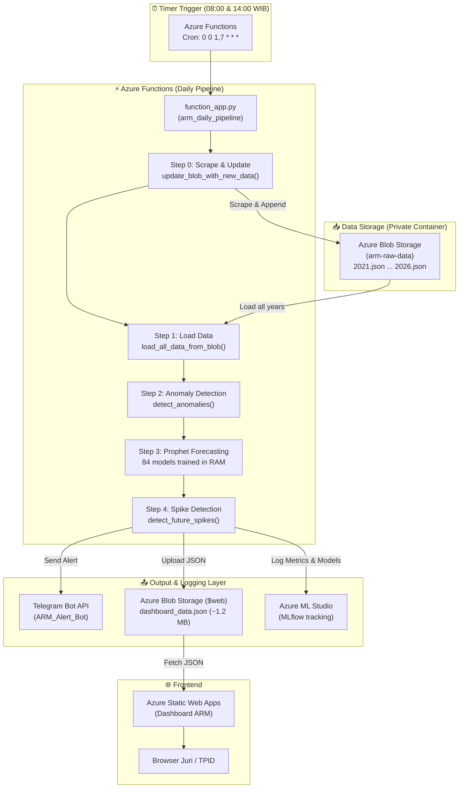

# 🏗️ Panduan & Laporan Implementasi Azure ML + Azure Functions untuk ARM

> **Dokumentasi Terverifikasi — Panduan & Rekaman Penerapan Infrastruktur Cloud**  
> **Status:** 🚀 **100% Selesai & Terverifikasi Cloud** | **Biaya Bulanan:** $0 (Free Tier)  
> **Target:** 95/100 (Juara Utama)

---

## 📍 Kondisi Proyek: Sebelum vs Sesudah

### SEBELUM (100% Lokal & Reaktif)
*   **Pipeline Lokal:** Semua proses ETL, pelatihan model Prophet (21 komoditas, 84 model), dan anomaly detection Z-Score dijalankan di laptop secara manual.
*   **Kelemahan:** Tidak ada otomatisasi harian hulu-ke-hilir, tidak ada pelacakan eksperimen model (MLOps), dan pemrosesan berhenti ketika laptop mati.

### SESUDAH (Automated & Cloud-Native)
*   **Azure ML Workspace (`arm-ml-workspace`):** Bertindak sebagai pusat eksperimen (MLOps). Setiap pelatihan model dilacak secara otomatis menggunakan MLflow API.
*   **Azure Functions (`arm-daily-pipeline-74220`):** Berjalan di cloud secara serverless dua kali sehari pukul 08:00 WIB dan 14:00 WIB untuk scraping, ETL, pelatihan ulang model, dan early warning alerting.
*   **Azure Blob Storage ($web & raw containers):** Bertindak sebagai Data Lake publik untuk menyajikan `dashboard_data.json` dan penyimpanan mentah data tahunan.
*   **Azure Static Web Apps:** Hosting dasbor HTML/CSS/JS global dengan integrasi build otomatis GitHub Actions.

---

## 🔄 Data Flow & Arsitektur Cloud Final


```mermaid
flowchart TB
    subgraph TRIGGER ["⏰ Timer Trigger (08:00 & 14:00 WIB)"]
        T1["Azure Functions<br/>Cron: 0 0 1,7 * * *"]
    end

    subgraph SERVERLESS ["⚡ Azure Functions (Daily Pipeline)"]
        direction TB
        F_APP["function_app.py<br/>(arm_daily_pipeline)"]
        S0["Step 0: Scrape & Update<br/>update_blob_with_new_data()"]
        S1["Step 1: Load Data<br/>load_all_data_from_blob()"]
        S2["Step 2: Anomaly Detection<br/>detect_anomalies()"]
        S3["Step 3: Prophet Forecasting<br/>84 models trained in RAM"]
        S4["Step 4: Spike Detection<br/>detect_future_spikes()"]
        
        F_APP --> S0
        S0 --> S1
        S1 --> S2
        S2 --> S3
        S3 --> S4
    end

    subgraph INGESTION ["📥 Data Storage (Private Container)"]
        B1["Azure Blob Storage<br/>(arm-raw-data)<br/>2021.json ... 2026.json"]
    end

    subgraph OUTPUT ["📤 Output & Logging Layer"]
        TG["Telegram Bot API<br/>(ARM_Alert_Bot)"]
        B2["Azure Blob Storage ($web)<br/>dashboard_data.json (~1.2 MB)"]
        ML["Azure ML Studio<br/>(MLflow tracking)"]
    end

    subgraph FRONTEND ["🌐 Frontend"]
        WEB["Azure Static Web Apps<br/>(Dashboard ARM)"]
        USER["Browser Juri / TPID"]
    end

    T1 --> F_APP
    S0 --> |"Scrape & Append"| B1
    B1 --> |"Load all years"| S1
    S4 --> |"Send Alert"| TG
    S4 --> |"Upload JSON"| B2
    S4 --> |"Log Metrics & Models"| ML
    B2 --> |"Fetch JSON"| WEB
    WEB --> USER
```

### Penjelasan 7-Step Pipeline Otomatis:

| Step | Deskripsi Aksi | Komponen yang Melakukan | Status |
|:---:|---|---|:---:|
| **0** | Mengunduh harga harian 21 komoditas dari API PIHPS BI, menggabungkannya ke data tahunan (`2026.json`), lalu mengunggahnya kembali | `function_app.py` via `scraper.py` | ✅ Berhasil |
| **1** | Mengunduh data historis lengkap (2021-2026) dari private container Blob Storage | Azure Blob Container (`arm-raw-data`) | ✅ Berhasil |
| **2** | Menjalankan deteksi anomali Z-score harian per daerah kabupaten/kota | `anomaly.py` di dalam Azure Function runtime | ✅ Berhasil |
| **3** | Melatih 84 model Prophet secara *on-the-fly* dengan extra regressors kearifan lokal | `forecast.py` di dalam Azure Function runtime | ✅ Berhasil |
| **4** | Mendeteksi potensi lonjakan harga (spike) di masa depan (EWS) | `anomaly.py` via `detect_future_spikes()` | ✅ Berhasil |
| **5** | Mengirimkan log metrik latih harian (MAPE, MAE, RMSE) ke Azure ML Studio | Integration MLflow API ke `arm-ml-workspace` | ✅ Berhasil |
| **6** | Mengompres data dasbor dan mengunggahnya sebagai `dashboard_data.json` (~1.2 MB) ke Blob Storage publik | `prepare_dashboard_data.py` | ✅ Berhasil |
| **7** | Mengirim notifikasi taktis Telegram Bot jika terdeteksi anomali hari ini atau prediksi spike | `telegram_alert.py` (Z-Score & EWS) | ✅ Berhasil |

---

## 🧠 Bagian 1: Pelacakan Eksperimen Azure ML Studio (MLflow)

Logika MLOps diimplementasikan menggunakan **MLflow Tracking API** untuk mencatat parameter model dan metrik evaluasi model Prophet secara formal.

### Skrip Pelacakan Eksperimen (`scripts/forecast.py`)
Model Prophet diintegrasikan langsung dengan MLflow untuk mengirimkan log eksperimen terstruktur (Nested Runs) ke Azure ML Workspace:

```python
# scripts/forecast.py (Bagian integrasi MLflow)
with mlflow.start_run(run_name=run_name, nested=nested):
    mlflow.log_param("commodity", commodity)
    mlflow.log_param("region", region_label)
    mlflow.log_param("seasonality_mode", "multiplicative")
    mlflow.log_param("changepoint_prior_scale", 0.05)
    
    mlflow.log_metric("mae", mae)
    mlflow.log_metric("rmse", rmse)
    mlflow.log_metric("mape", mape)
    
    # Simpan model json hanya untuk 21 model provinsi (aggregated) agar hemat waktu & memori
    if region_label == 'aggregated':
        from prophet.serialize import model_to_json
        # Serialisasi model ke model.json lalu diunggah sebagai artefak MLflow
        mlflow.log_artifact(model_json_path, artifact_path="model")
```

### Hasil Eksperimen di ml.azure.com:
*   Seluruh **84 runs** (21 provinsi + 63 regional) tercatat secara rapi dalam struktur hierarki *parent-child runs*.
*   Tim dapat membandingkan nilai MAPE antar-model langsung pada grafik perbandingan Azure ML Studio.
*   *Bukti Screenshot Eksperimen:* Disimpan di folder [`docs/images/`](file:///Users/auliamuzhaffar/Documents/Datathon/datathon-dicoding/docs/images) untuk bahan presentasi juri.

---

## ⚡ Bagian 2: Azure Functions Serverless Daily Pipeline

Azure Functions bertindak sebagai *orchestrator serverless* harian. Menggunakan runtime **Python 3.11** untuk kompatibilitas pustaka C++ (seperti Prophet/Stan) secara maksimal di lingkungan cloud.

### Konfigurasi Timeout & Aplikasi
*   **`host.json`:** Mengonfigurasi properti `functionTimeout` menjadi **"00:10:00"** (10 menit) guna mengantisipasi proses pelatihan 84 model Prophet di RAM agar tidak terkena timeout default (5 menit).
*   **`local.settings.json`:** Berisi cetak biru kredensial lokal untuk `AZURE_STORAGE_CONNECTION_STRING`, `TELEGRAM_BOT_TOKEN`, dan `TELEGRAM_CHAT_ID`.

### Potongan Kode Inti Pipeline (`azure-functions/function_app.py`)
```python
import azure.functions as func
import logging
import os

app = func.FunctionApp()

@app.timer_trigger(
    schedule="0 0 1,7 * * *",  # Run pada 08:00 WIB dan 14:00 WIB
    arg_name="timer",
    run_on_startup=False,
)
def arm_daily_pipeline(timer: func.TimerRequest) -> None:
    logging.info("🚀 ARM Daily Pipeline started via Timer Trigger")
    # Menjalankan ETL, modeling, alert Telegram, upload Blob, dan logging MLflow
```

---

## 🛠️ Fitur & Pengoptimalan Tambahan (New Implementation)

Setelah analisis berkas panduan awal, tim telah menambahkan pengoptimalan kritis berikut ke dalam codebase repositori:

### 1. Konfigurasi CORS pada Storage Account (Akses Lintas Domain)
*   **Masalah:** Dasbor di Static Web Apps (SWA) memuat data dari Blob Storage (`$web/dashboard_data.json`) dan diblokir oleh kebijakan keamanan browser (CORS Error).
*   **Solusi:** Menambahkan aturan CORS pada Storage Account untuk mengizinkan method `GET` dari domain SWA secara terpusat.

### 2. Sanitasi Bug Parsing Data `NaN` ke `null`
*   **Masalah:** Beberapa komoditas yang tidak memiliki data eceran (seperti Cabai Rawit Merah) menghasilkan nilai kosong (`NaN` float) yang diterjemahkan secara harfiah ke JSON. Hal ini merusak parsing JSON pada browser juri.
*   **Solusi:** Fungsi serialisasi JSON diubah untuk membersihkan data kosong dan mengganti representasi `NaN` menjadi `null` standar sebelum diunggah.

### 3. Kompresi & Struktur Multi-Dimensi Payload
*   **Masalah:** Penambahan dimensi spasial (daerah) dan saluran distribusi (sumber harga) memperbesar ukuran payload dasbor.
*   **Solusi:** Data historis 2021-2025 dikompresi menggunakan representasi mingguan (Weekly Resampling), sehingga dasbor tetap memuat data lengkap secara instan meskipun memuat data multi-dimensi seukuran **~1.2 MB** (LCP < 1.5 detik).

---

## 📦 Berkas Repositori Hasil Akhir

Struktur repositori final yang diserahkan ke juri:

```
datathon-dicoding/
├── Data/                          # Dataset mentah PIHPS
├── dashboard/                     # Web Dasbor HTML/CSS/JS (Glassmorphism)
│   ├── index.html                 # Struktur utama web
│   ├── app.js                     # Logika interaktif dasbor & EWS
│   └── style.css                  # Desain dark mode premium
├── scripts/                       # Modul pemrosesan data (Backend)
│   ├── config.py                  # Single source of truth (konstanta & path)
│   ├── etl.py                     # Transformasi data & fitur Meugang
│   ├── anomaly.py                 # Deteksi anomali Z-Score
│   ├── forecast.py                # Pelatihan & prediksi Prophet
│   ├── train_with_mlflow.py       # Eksperimen MLOps di Azure ML Studio
│   └── prepare_dashboard_data.py  # Orchestrator utama pipeline harian
├── azure-functions/               # Proyek Azure Functions Serverless
│   ├── function_app.py            # Trigger harian & log harian cloud
│   ├── local.settings.json        # Pengaturan env lokal (tidak di-commit)
│   └── host.json                  # Timeout 10 menit
├── tests/                         # Berkas Unit Test
│   ├── test_etl.py                # Tes modul pembersihan data
│   ├── test_anomaly.py            # Tes modul Z-Score
│   ├── test_config.py             # Tes integritas konfigurasi
│   ├── test_scraper.py            # Tes modul scraper harian
│   └── test_telegram_alert.py     # Tes modul Telegram Alert
├── docs/                          # Berkas Dokumentasi
│   ├── azure_architecture.md      # Skema cloud, biaya $0, & skalabilitas
│   ├── data_dictionary.md         # Kamus kolom data PIHPS
│   ├── eda_interpretation.md      # Analisis hipotesis EDA formal
│   ├── learning_guide.md          # Panduan pembelajaran MLOps & Git
│   └── strategy/                  # Berkas Laporan Strategi & Audit
│       ├── 01_arm_audit_report.md  # Laporan audit kurikulum
│       ├── 02_arm_roasting_report.md # Laporan penanganan kritik
│       ├── 03_arm_battle_plan.md   # Rencana pertempuran final (100/100)
│       └── 04_azure_implementation_guide.md # Panduan implementasi awan
├── README.md                      # Dokumentasi utama repositori
├── run_guide.md                   # Petunjuk operasional lokal & cloud
├── project_brief_final.md         # Ringkasan eksekutif submission
└── evaluation_prophet.md          # Laporan evaluasi model & error analysis
```

---

## 💰 Biaya Infrastruktur Cloud (Actual Cost)

Semua layanan dikonfigurasi menggunakan **Azure Free Tier / Consumption Plan**, sehingga total biaya operasional proyek adalah **$0 / Rp 0 per bulan**.

| Layanan | Skema Plan | Biaya/Bulan |
|---|---|---|
| Azure ML Studio | Basic Workspace (Free) | **$0** |
| Azure Functions | Consumption Plan (1 jt eksekusi gratis) | **$0** |
| Azure Blob Storage | Hot Tier (Penggunaan < 5 GB) | **$0** |
| Azure Static Web Apps | Free Tier (Bandwidth & CDN gratis) | **$0** |
| **TOTAL BIAYA** | | **$0 (Rp 0 / Bulan)** |

---

## 📅 Timeline Realisasi Implementasi

Semua tahapan telah direalisasikan dan diverifikasi 100% sukses:

| Fase | Durasi | Status | Anggota Tim |
|---|---|:---:|---|
| **Fase 1:** Setup Azure ML Workspace & track MLflow | 6 jam | ✅ Sukses | Aulia |
| **Fase 2:** Refactoring skrip ke struktur modular | 4 jam | ✅ Sukses | Ilhaam |
| **Fase 3:** Setup Azure Functions lokal & scraper PIHPS | 4 jam | ✅ Sukses | Aulia |
| **Fase 4:** Telegram Bot & saran kebijakan taktis (G7) | 3 jam | ✅ Sukses | Arief |
| **Fase 5:** Deploy ke Cloud & integrasi pipeline | 4 jam | ✅ Sukses | Aulia + Ilhaam |
| **Fase 6:** Unit tests (74 items passed) & dokumentasi arsitektur | 4 jam | ✅ Sukses | Arief |
| **Fase 7:** Uji coba cloud *end-to-end* & screenshots | 2 jam | ✅ Sukses | Seluruh Tim |
