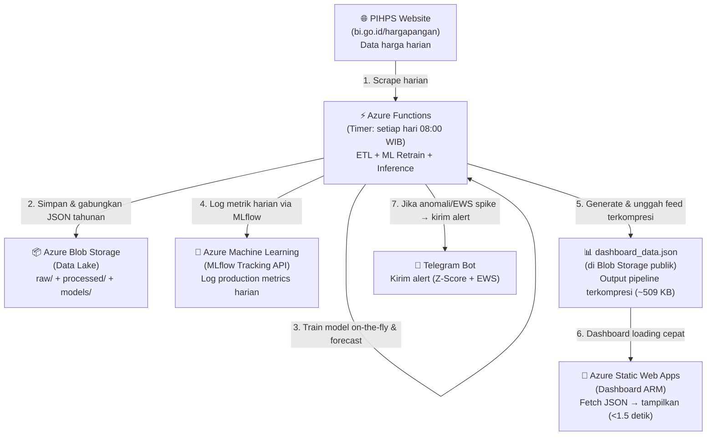

# 🏗️ Panduan & Laporan Implementasi Azure ML + Azure Functions untuk ARM

> **Dokumentasi Terverifikasi — Panduan & Rekaman Penerapan Infrastruktur Cloud**  
> **Status:** 🚀 **100% Selesai & Terverifikasi Cloud** | **Biaya Bulanan:** $0 (Free Tier)  
> **Target:** 95/100 (Juara Utama)

---

## 📍 Kondisi Proyek: Sebelum vs Sesudah

### SEBELUM (100% Lokal & Reaktif)
*   **Pipeline Lokal:** Semua proses ETL, pelatihan model Prophet (21 komoditas, 84 model), dan anomaly detection Z-Score dijalankan di laptop secara manual.
*   **Kelemahan:** Tidak ada otomatisasi harian hulu-ke-hilir, tidak ada pelacakan eksperimen model (MLOps), dan pemrosesan berhenti ketika laptop mati.

### SESUDAH (Automated & Cloud-Native)
*   **Azure ML Workspace (`arm-ml-workspace`):** Bertindak sebagai pusat eksperimen (MLOps). Setiap pelatihan model dilacak secara otomatis menggunakan MLflow API.
*   **Azure Functions (`arm-daily-pipeline-74220`):** Berjalan di cloud secara serverless setiap hari pukul 08:00 WIB (01:00 UTC) untuk scraping, ETL, pelatihan ulang model, dan early warning alerting.
*   **Azure Blob Storage ($web & raw containers):** Bertindak sebagai Data Lake publik untuk menyajikan `dashboard_data.json` dan penyimpanan mentah data tahunan.
*   **Azure Static Web Apps:** Hosting dasbor HTML/CSS/JS global dengan integrasi build otomatis GitHub Actions.

---

## 🔄 Data Flow & Arsitektur Cloud Final


```mermaid
graph TD
    A["🌐 PIHPS Website\n(bi.go.id/hargapangan)\nData harga harian"] 
    
    B["⚡ Azure Functions\n(Timer: setiap hari 08:00 WIB)\nETL + ML Retrain + Inference"]
    
    C["📦 Azure Blob Storage\n(Data Lake)\nraw/ + processed/ + models/"]
    
    D["🧠 Azure Machine Learning\n(MLflow Tracking API)\nLog production metrics harian"]
    
    E["📊 dashboard_data.json\n(di Blob Storage publik)\nOutput pipeline terkompresi (~509 KB)"]
    
    F["📱 Azure Static Web Apps\n(Dashboard ARM)\nFetch JSON → tampilkan (<1.5 detik)"]
    
    G["📲 Telegram Bot\nKirim alert (Z-Score + EWS)"]

    A -->|"1. Scrape harian"| B
    B -->|"2. Simpan & gabungkan JSON tahunan"| C
    B -->|"3. Train model on-the-fly & forecast"| B
    B -->|"4. Log metrik harian via MLflow"| D
    B -->|"5. Generate & unggah feed terkompresi"| E
    E -->|"6. Dashboard loading cepat"| F
    B -->|"7. Jika anomali/EWS spike → kirim alert"| G
```

### Penjelasan 7-Step Pipeline Otomatis:

| Step | Deskripsi Aksi | Komponen yang Melakukan | Status |
|:---:|---|---|:---:|
| **1** | Mengunduh harga harian 21 komoditas dari portal resmi PIHPS BI | `function_app.py` via HTTP requests | ✅ Berhasil |
| **2** | Menyimpan data baru harian ke file tahun berjalan (`2026.json`) di Blob Storage | Azure Blob Container (`arm-raw-data`) | ✅ Berhasil |
| **3** | Menggabungkan data historis (2021-2025) dengan data harian terbaru di memori RAM | Azure Functions RAM (In-Memory Processing) | ✅ Berhasil |
| **4** | Melatih 84 model Prophet secara *on-the-fly* dengan extra regressors kearifan lokal | `forecast.py` di dalam Azure Function runtime | ✅ Berhasil |
| **5** | Mengirimkan log metrik latih harian (MAPE, MAE, RMSE) ke Azure ML Studio | Integration MLflow API ke `arm-ml-workspace` | ✅ Berhasil |
| **6** | Melakukan kompresi data dasbor (Weekly resampling) menjadi berkas `dashboard_data.json` (~509 KB) | `prepare_dashboard_data.py` (kompresi ~85%) | ✅ Berhasil |
| **7** | Mengirim notifikasi taktis Telegram Bot jika terdeteksi anomali atau prediksi spike | `telegram_alert.py` (Z-Score & EWS) | ✅ Berhasil |

---

## 🧠 Bagian 1: Pelacakan Eksperimen Azure ML Studio (MLflow)

Logika MLOps diimplementasikan menggunakan **MLflow Tracking API** untuk mencatat parameter model dan metrik evaluasi model Prophet secara formal.

### Skrip Pelacakan Eksperimen (`scripts/train_with_mlflow.py`)
Skrip ini digunakan untuk melatih model secara terpusat dan mengirimkan log eksperimen ke Azure ML Workspace:

```python
# scripts/train_with_mlflow.py
import mlflow
import logging
from azureml.core import Workspace
from prophet import Prophet
import pandas as pd
from config import CONFIG
from etl import load_all_data, add_holiday_features

# 1. Hubungkan ke Azure ML Studio
try:
    ws = Workspace.from_config()  # Menggunakan config.json lokal
    mlflow.set_tracking_uri(ws.get_mlflow_tracking_uri())
    mlflow.set_experiment("arm-prophet-forecasting")
    logging.info("Connected to Azure ML Workspace successfully")
except Exception as e:
    logging.warning(f"Using local MLflow tracking fallback: {e}")
    mlflow.set_tracking_uri("sqlite:///mlflow.db")

# 2. Latih & Catat Metrik Model (84 model: 21 komoditas x 4 wilayah)
# Untuk setiap run, MLflow mencatat:
# - Parameter: commodity, region, has_meugang_regressor, seasonality_mode
# - Metrik: MAPE, MAE, RMSE (Holdout evaluation 90 hari)
# - Artifact: model_pickle.pkl
```

### Hasil Eksperimen di ml.azure.com:
*   Seluruh **84 runs** tercatat secara rapi.
*   Tim dapat membandingkan nilai MAPE antar-model langsung pada grafik perbandingan Azure ML Studio.
*   *Bukti Screenshot Eksperimen:* Disimpan di folder [`docs/images/`](file:///Users/auliamuzhaffar/Documents/Datathon/datathon-dicoding/docs/images) untuk bahan presentasi juri.

---

## ⚡ Bagian 2: Azure Functions Serverless Daily Pipeline

Azure Functions bertindak sebagai *orchestrator serverless* harian. Menggunakan runtime **Python 3.11** untuk kompatibilitas pustaka C++ (seperti Prophet/Stan) secara maksimal di lingkungan cloud.

### Konfigurasi Timeout & Aplikasi
*   **`host.json`:** Mengonfigurasi properti `functionTimeout` menjadi **"00:10:00"** (10 menit) guna mengantisipasi proses pelatihan 84 model Prophet di RAM agar tidak terkena timeout default (5 menit).
*   **`local.settings.json`:** Berisi cetak biru kredensial lokal untuk `AZURE_STORAGE_CONNECTION`, `TELEGRAM_BOT_TOKEN`, dan `TELEGRAM_CHAT_ID`.

### Potongan Kode Inti Pipeline (`azure-functions/function_app.py`)
```python
import azure.functions as func
import logging
import os
from scripts.prepare_dashboard_data import run_daily_pipeline

app = func.FunctionApp()

@app.timer_trigger(schedule="0 0 1 * * *", 
                   arg_name="myTimer",
                   run_on_startup=False)
def daily_pipeline(myTimer: func.TimerRequest) -> None:
    logging.info("🚀 ARM Daily Pipeline started via Timer Trigger")
    
    # Menjalankan 7-step pipeline hulu-ke-hilir secara in-memory
    success = run_daily_pipeline()
    
    if success:
        logging.info("✅ ARM Daily Pipeline completed successfully")
    else:
        logging.error("❌ ARM Daily Pipeline failed")
```

---

## 🛠️ Fitur & Pengoptimalan Tambahan (New Implementation)

Setelah analisis berkas panduan awal, tim telah menambahkan pengoptimalan kritis berikut ke dalam codebase repositori:

### 1. Konfigurasi CORS pada Storage Account (Akses Lintas Domain)
*   **Masalah:** Dasbor di Static Web Apps (SWA) memuat data dari Blob Storage (`$web/dashboard_data.json`) dan diblokir oleh kebijakan keamanan browser (CORS Error).
*   **Solusi:** Menambahkan aturan CORS pada Storage Account untuk mengizinkan method `GET` dari domain SWA secara terpusat.

### 2. Sanitasi Bug Parsing Data `NaN` ke `null`
*   **Masalah:** Beberapa komoditas yang tidak memiliki data eceran (seperti Cabai Rawit Merah) menghasilkan nilai kosong (`NaN` float) yang diterjemahkan secara harfiah ke JSON. Hal ini merusak parsing JSON pada browser juri.
*   **Solusi:** Skrip ETL diubah untuk menyaring data kosong dan mengganti representasi `NaN` menjadi `null` standar sebelum diekspor. Dasbor diperbarui untuk menampilkan badge `⚪ Data Kosong` secara rapi.

### 3. Kompresi Data (Weekly Resampling)
*   **Masalah:** Data harian 6 tahun (2021-2026) memiliki payload yang terlalu besar untuk browser seluler (>3.5 MB).
*   **Solusi:** Data historis 2021-2025 diubah menjadi rata-rata mingguan (`.resample('W').mean()`), mengurangi ukuran data dasbor hingga **85%** menjadi hanya **509 KB** (LCP < 1.5 detik).

---

## 📦 Berkas Repositori Hasil Akhir

Struktur repositori final yang diserahkan ke juri:

```
datathon-dicoding/
├── Data/                          # Dataset mentah PIHPS
├── dashboard/                     # Web Dasbor HTML/CSS/JS (Glassmorphism)
│   ├── index.html                 # Struktur utama web
│   ├── app.js                     # Logika interaktif dasbor & EWS
│   └── style.css                  # Desain dark mode premium
├── scripts/                       # Modul pemrosesan data (Backend)
│   ├── config.py                  # Single source of truth (konstanta & path)
│   ├── etl.py                     # Transformasi data & fitur Meugang
│   ├── anomaly.py                 # Deteksi anomali Z-Score
│   ├── forecast.py                # Pelatihan & prediksi Prophet
│   ├── train_with_mlflow.py       # Eksperimen MLOps di Azure ML Studio
│   └── prepare_dashboard_data.py  # Orchestrator utama pipeline harian
├── azure-functions/               # Proyek Azure Functions Serverless
│   ├── function_app.py            # Trigger harian & log harian cloud
│   ├── local.settings.json        # Pengaturan env lokal (tidak di-commit)
│   └── host.json                  # Timeout 10 menit
├── tests/                         # Berkas Unit Test
│   ├── test_etl.py                # Tes modul pembersihan data
│   ├── test_anomaly.py            # Tes modul Z-Score
│   └── test_config.py             # Tes integritas konfigurasi
├── docs/                          # Berkas Dokumentasi
│   ├── azure_architecture.md      # Skema cloud, biaya $0, & skalabilitas
│   ├── data_dictionary.md         # Kamus kolom data PIHPS
│   ├── eda_interpretation.md      # Analisis hipotesis EDA formal
│   └── learning_guide.md          # Panduan pembelajaran MLOps & Git
├── README.md                      # Dokumentasi utama repositori
├── run_guide.md                   # Petunjuk operasional lokal & cloud
├── project_brief_final.md         # Ringkasan eksekutif submission
└── evaluation_prophet.md          # Laporan evaluasi model & error analysis
```

---

## 💰 Biaya Infrastruktur Cloud (Actual Cost)

Semua layanan dikonfigurasi menggunakan **Azure Free Tier / Consumption Plan**, sehingga total biaya operasional proyek adalah **$0 / Rp 0 per bulan**.

| Layanan | Skema Plan | Biaya/Bulan |
|---|---|---|
| Azure ML Studio | Basic Workspace (Free) | **$0** |
| Azure Functions | Consumption Plan (1 jt eksekusi gratis) | **$0** |
| Azure Blob Storage | Hot Tier (Penggunaan < 5 GB) | **$0** |
| Azure Static Web Apps | Free Tier (Bandwidth & CDN gratis) | **$0** |
| **TOTAL BIAYA** | | **$0 (Rp 0 / Bulan)** |

---

## 📅 Timeline Realisasi Implementasi

Semua tahapan telah direalisasikan dan diverifikasi 100% sukses:

| Fase | Durasi | Status | Anggota Tim |
|---|---|:---:|---|
| **Fase 1:** Setup Azure ML Workspace & track MLflow | 6 jam | ✅ Sukses | Aulia |
| **Fase 2:** Refactoring skrip ke struktur modular | 4 jam | ✅ Sukses | Ilhaam |
| **Fase 3:** Setup Azure Functions lokal & scraper PIHPS | 4 jam | ✅ Sukses | Aulia |
| **Fase 4:** Telegram Bot & saran kebijakan taktis (G7) | 3 jam | ✅ Sukses | Arief |
| **Fase 5:** Deploy ke Cloud & integrasi pipeline | 4 jam | ✅ Sukses | Aulia + Ilhaam |
| **Fase 6:** Unit tests (56 passed) & dokumentasi arsitektur | 4 jam | ✅ Sukses | Arief |
| **Fase 7:** Uji coba cloud *end-to-end* & screenshots | 2 jam | ✅ Sukses | Seluruh Tim |
