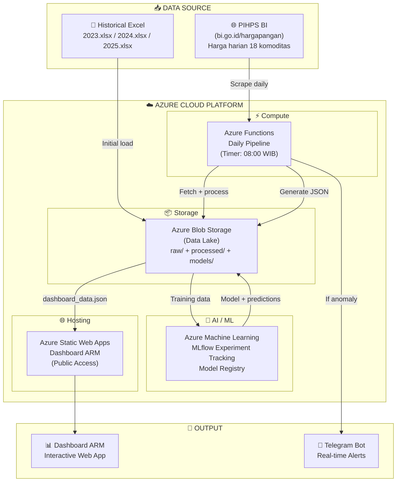
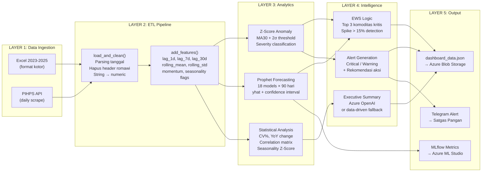
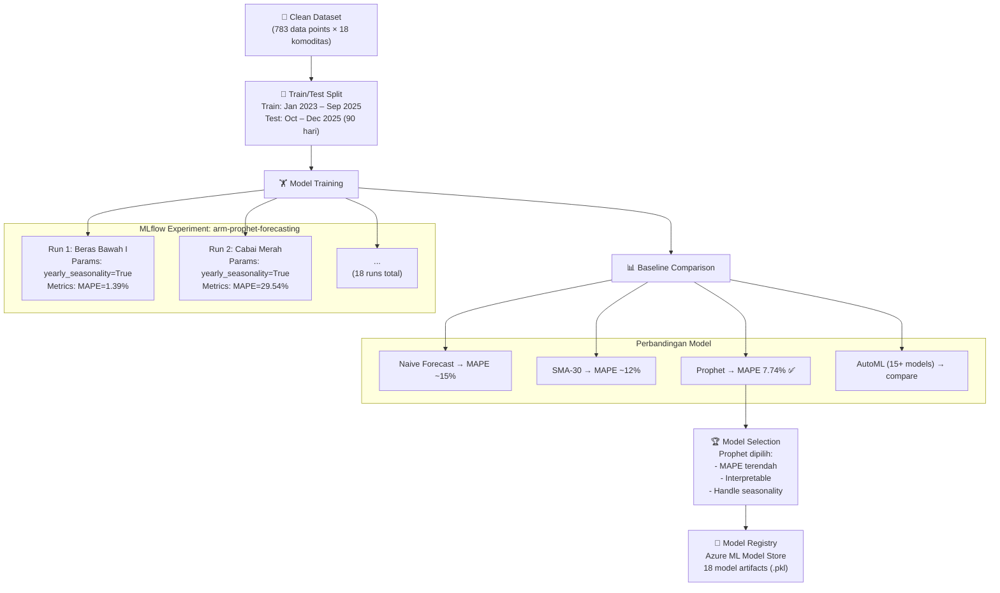
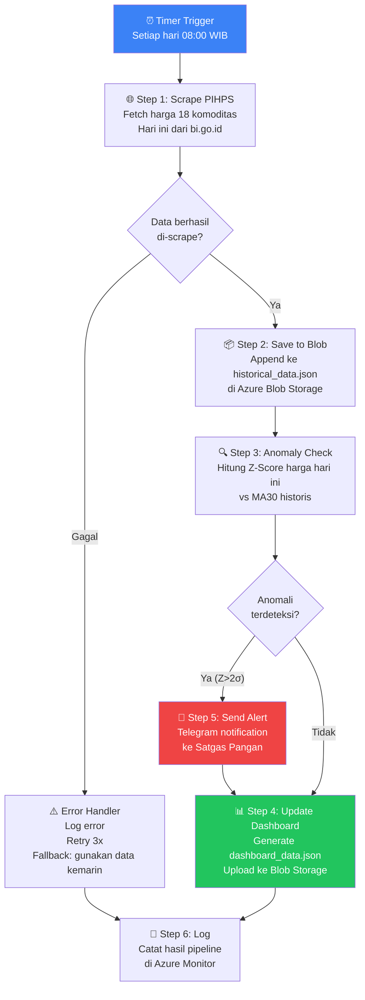
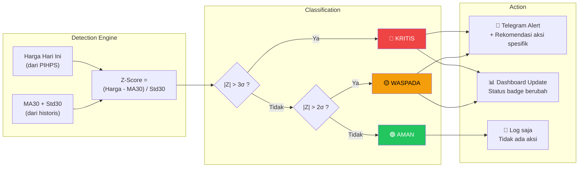
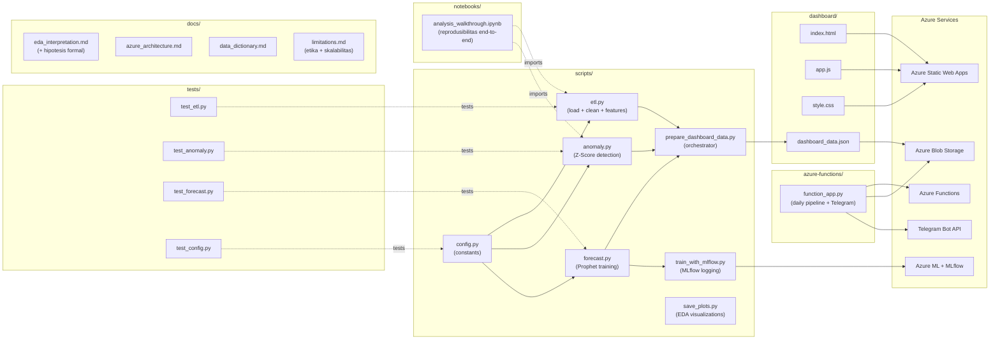
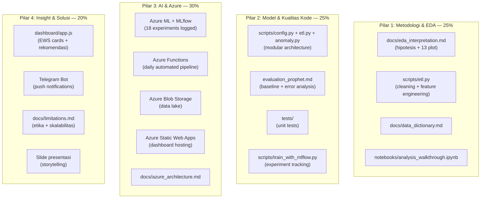
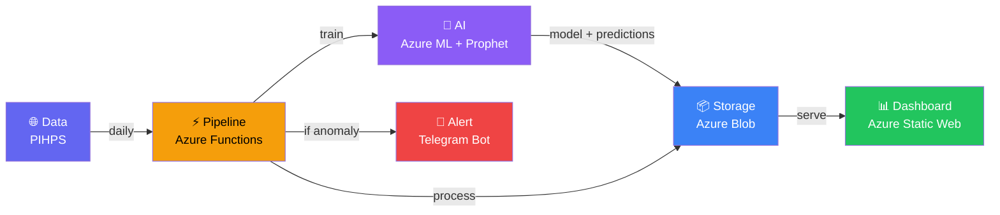

# 🔄 ARM Final Project — Workflow & Data Flow Diagrams

> Semua diagram siap dipakai di README, presentasi, dan `docs/azure_architecture.md`.

---

## 1. Arsitektur Sistem (Overview)

---

## 2. Data Flow End-to-End (Detail)

---

## 3. ML Training Workflow (Azure ML + MLflow)

---

## 4. Daily Automated Pipeline (Azure Functions)

---

## 5. Alert & Notification Flow

---

## 6. File Map — Kode ↔ Arsitektur (Complete)

---

## 7. Deliverables Map — File ↔ Pilar Rubrik

---

## 8. Workflow Ringkas (Untuk Presentasi — 1 Slide)

