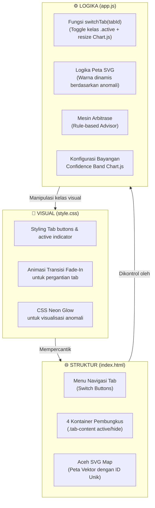

# 🎨 Aceh Resilience Monitor (ARM) — Master Design & Dashboard Overhaul Specification
> **Dokumen Arsitektur Desain, Struktur Antarmuka Multi-Tab Premium, dan Spesifikasi Komponen Visual Baru**
> 
> *Dokumen ini merupakan panduan konseptual bagi tim developer (Ilhaam) dan AI Agent lainnya untuk memahami struktur, tata letak, dan fitur-fitur baru pada rencana perombakan Dashboard ARM dari format single scroll-page menjadi Strategic 4-Tab Interface.*

---

## 🏗️ 1. Perbandingan Arsitektur Layout (Sebelum vs Sesudah)

Rencana perombakan ini merestrukturisasi visual dari halaman scroll panjang tunggal (*cluttered single page*) menjadi antarmuka modular berbasis tab (*Strategic Decision Support System*).

### 📐 Skema Layout Sebelum Perombakan (Single Scroll-Page)
```
┌────────────────────────────────────────────────────────┐
│                        NAVBAR                          │
├────────────────────────────────────────────────────────┤
│ 1. KPI Overview (Rangkuman makro)                      │
├────────────────────────────────────────────────────────┤
│ 2. Early Warning System (Top 3 Prophet EWS)            │
├────────────────────────────────────────────────────────┤
│ 3. Status Komoditas (Grid ubin interaktif)             │
├────────────────────────────────────────────────────────┤
│ 4. Detail Panel (Tampil saat ubin diklik)              │
├────────────────────────────────────────────────────────┤
│ 5. Analisis Komparatif Regional & Margin Rantai Pasok  │
├────────────────────────────────────────────────────────┤
│ 6. Tren Harga Komoditas (Line Chart + toggle EWS)      │
├────────────────────────────────────────────────────────┤
│ 7. Feed Alerts & Tabel Anomali (Z-Score)               │
├────────────────────────────────────────────────────────┤
│ 8. Heatmap Volatilitas & Heatmap Seasonalitas           │
├────────────────────────────────────────────────────────┤
│ 9. Grafik Area Kontribusi Kategori                     │
├────────────────────────────────────────────────────────┤
│                        FOOTER                          │
└────────────────────────────────────────────────────────┘
```
*Kekurangan:* Pengguna mengalami kelelahan kognitif (*cognitive fatigue*) akibat penumpukan informasi visual yang terlalu panjang.

### 📐 Skema Layout Sesudah Perombakan (Strategic 4-Tab)
```
┌────────────────────────────────────────────────────────┐
│                        NAVBAR                          │
├────────────────────────────────────────────────────────┤
│               MENU TAB NAVIGATION (Glassmorphism)      │
│ [ Tab 1: Macro ] [ Tab 2: Spatial ] [ Tab 3: Margin ] [ Tab 4: ML EWS ] │
├────────────────────────────────────────────────────────┤
│                                                        │
│  ┌──────────────────────────────────────────────────┐  │
│  │                TAB CONTENT AREA                  │  │
│  │                                                  │  │
│  │  • Mengikuti pilihan tab yang aktif secara       │  │
│  │    dinamis dan mulus (transisi Fade-In).         │  │
│  │                                                  │  │
│  └──────────────────────────────────────────────────┘  │
│                                                        │
├────────────────────────────────────────────────────────┤
│                        FOOTER                          │
└────────────────────────────────────────────────────────┘
```

---

## 📋 2. Spesifikasi Fungsional 4 Tab Utama & Fitur Baru

Masing-masing tab memiliki target fungsional yang berbeda untuk melayani pembuat keputusan (pemerintah daerah) dengan kedalaman analisis yang fokus.

### 📊 Tab 1: Executive Dashboard (Macro & Operational Report)
*Target Pengguna: Kepala Dinas / Gubernur untuk memantau keamanan pangan harian dalam 3 detik.*
*   **Komponen yang Dimuat:**
    *   **KPI Overview Grid:** Metrik volatilitas rata-rata, jumlah komoditas kritis/waspada.
    *   **Status Komoditas Grid:** Ubin interaktif 21 komoditas bersandi warna (Aman/Waspada/Kritis).
    *   **Tabel Anomali & Feed Peringatan Dini:** Laporan harian harga pangan hari ini yang melanggar batas Z-Score ($>2\sigma$).
    *   **Heatmap Seasonalitas & Volatilitas:** Analisis statistik historis bulanan.
*   **Fitur Premium Baru (Interactive SVG map of Aceh):**
    *   Integrasi peta vektor SVG Provinsi Aceh.
    *   Daerah yang mengalami anomali harga kritis ($Z > 3\sigma$) akan menyala dengan warna merah neon transparan (*glow effect*), memberikan isyarat visual geografis instan kepada juri.

### 📍 Tab 2: Regional Disparity (Spatial & Arbitrage Advisor)
*Target Pengguna: Satgas Pangan & Dinas Perhubungan untuk operasi pasar dan logistik.*
*   **Komponen yang Dimuat:**
    *   **Grafik Garis Komparasi Regional:** Menampilkan visualisasi garis perbandingan harga Banda Aceh vs Lhokseumawe vs Meulaboh secara langsung.
*   **Fitur Premium Baru (Smart Arbitrage Advisor Engine):**
    *   Panel rekomendasi berbasis aturan logis (*Rule-based Recommendation*).
    *   Sistem secara otomatis mendeteksi jika selisih harga komoditas X antar dua daerah melebihi batas wajar (misal $>30\%$).
    *   Menghasilkan teks rekomendasi pengiriman stok secara otomatis (misal: *"Harga beras di Meulaboh terpantau jauh lebih murah dibanding Banda Aceh. Disarankan melakukan mobilisasi stok untuk menekan disparitas"*).

### 💸 Tab 3: Supply Chain Margin (Intelligence Markup Analysis)
*Target Pengguna: KPPU / Satgas Pangan untuk mendeteksi penimbunan dan spekulasi pasar.*
*   **Komponen yang Dimuat:**
    *   **Visualisasi Alur Rantai Pasok:** Memetakan harga riil dari tingkat Produsen ➔ Pedagang Besar ➔ Pasar Tradisional/Modern.
*   **Fitur Premium Baru (Supply Chain Health Check):**
    *   Indikator status kesehatan margin dalam bentuk lencana berwarna (*colored badges*).
    *   **Sehat 🟢 (Markup $<20\%$):** Rantai pasok berjalan normal dan efisien.
    *   **Mengkhawatirkan 🟡 (Markup $20-40\%$):** Terjadi inefisiensi distribusi atau kenaikan biaya logistik.
    *   **Tidak Wajar 🔴 (Markup $>40\%$):** Deteksi dini adanya potensi spekulasi harga atau penimbunan barang di tingkat pedagang besar/tengah.

### 🔮 Tab 4: Predictive Forecasting (Meta Prophet ML EWS)
*Target Pengguna: Badan Ketahanan Pangan untuk perencanaan jangka panjang (90 Hari ke depan).*
*   **Komponen yang Dimuat:**
    *   **Early Warning System Panel:** Menampilkan 3 komoditas paling rawan mengalami lonjakan harga di masa depan.
    *   **Grafik Tren Harga Utama:** Visualisasi garis historis yang terhubung mulus dengan 90 hari garis proyeksi masa depan.
    *   **Perbandingan YoY & Kontribusi Kategori:** Grafik statistik historis jangka panjang pendukung validasi tren.
*   **Fitur Premium Baru (Confidence Interval Bands / Uncertainty Shadows):**
    *   Grafik peramalan dilengkapi dengan area bayangan transparan (*uncertainty shadow bands*) yang menggambarkan rentang batas bawah (`yhat_lower`) dan batas atas (`yhat_upper`) prediksi model Prophet. Ini memperkuat aspek saintifik model di depan juri.

---

## 📦 3. Hubungan & Peran Berkas Sisi Klien (Client-Side Mapping)

Perombakan layout ini murni terjadi pada sisi klien (frontend). Berikut adalah pembagian tugas dan peran dari berkas-berkas utama di folder `dashboard/`:



---

## 🎨 4. Panduan Desain & Estetika Premium (Style System)

Untuk mempertahankan visualisasi yang memukau juri (*wow factor*), seluruh komponen tab baru harus mematuhi sistem desain di bawah ini:

*   **Sistem Navigasi Tab (Tabs Bar):**
    *   *Latar belakang:* Glassmorphism transparan (`backdrop-filter: blur(12px)`) dengan warna dasar semi-gelap (`rgba(30, 41, 59, 0.7)`).
    *   *Efek Aktif:* Tombol tab aktif mendapat garis bawah neon tebal (`border-bottom: 3px solid #3b82f6`) dan bayangan cahaya lembut (*soft glow*).
*   **Efek Transisi Tab:**
    *   Ketika tab berganti, konten baru harus memudar masuk menggunakan animasi transisi halus:
        ```css
        @keyframes fadeIn {
          from { opacity: 0; transform: translateY(8px); }
          to { opacity: 1; transform: translateY(0); }
        }
        ```
*   **Warna Status & Indikator (Neon Palette):**
    *   🔴 **Kritis / Bahaya:** Merah neon (`#ef4444`, `rgba(239, 68, 68, 0.15)`)
    *   🟡 **Waspada / Peringatan:** Amber/Kuning neon (`#f59e0b`, `rgba(245, 158, 11, 0.15)`)
    *   🟢 **Aman / Normal:** Hijau emerald neon (`#10b981`, `rgba(16, 185, 129, 0.15)`)
*   **Tipografi:**
    *   Font utama wajib menggunakan **Inter** untuk teks antarmuka umum, dan **JetBrains Mono** untuk representasi nilai harga/matematika agar terlihat sangat bersih dan presisi tinggi.
