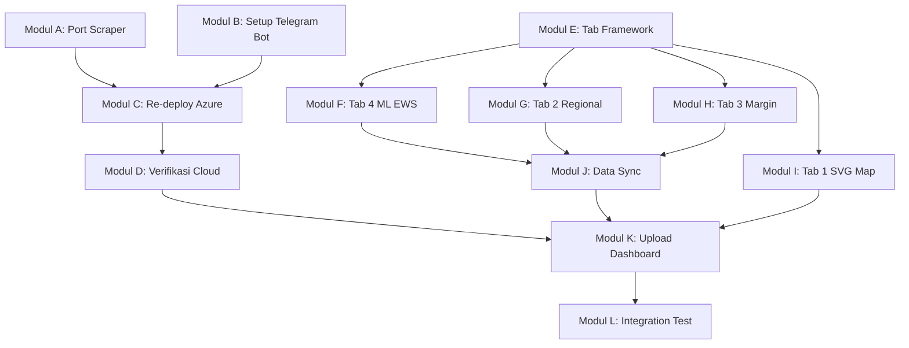

# 📋 ARM Planning v3 — Final Technical Execution Plan
> **Tujuan:** Menyelesaikan seluruh pekerjaan teknis agar project ARM siap di-demo dan diuji end-to-end
> 
> **Deadline:** 5 Juni 2026 | **Sisa:** ~4 hari
> 
> **Output Akhir:**
> 1. ✅ Azure Function pipeline berjalan end-to-end di cloud (scrape → proses → output)
> 2. ✅ Dashboard versi baru (4-Tab Premium) live dan bisa di-demo
> 3. ✅ Telegram Bot aktif dan mengirim alert otomatis
> 4. ✅ Semua komponen terverifikasi dan siap untuk submit

---

## 🗺️ Peta Besar (Big Picture)

```
┌─────────────────────────────────────────────────────────────────────┐
│                    FASE 1: BACKEND PIPELINE                        │
│  (Azure Function end-to-end: Scrape → Proses → Output)            │
│                                                                     │
│  Modul A: Port Scraper → Python                                     │
│  Modul B: Setup Telegram Bot                                        │
│  Modul C: Re-deploy ke Azure Cloud                                  │
│  Modul D: Verifikasi Cloud End-to-End                               │
└───────────────────────┬─────────────────────────────────────────────┘
                        │ (data pipeline sudah jalan)
                        ▼
┌─────────────────────────────────────────────────────────────────────┐
│                    FASE 2: DASHBOARD OVERHAUL                      │
│  (Perombakan tampilan dari single-page → 4-Tab Premium)            │
│                                                                     │
│  Modul E: Tab Navigation Framework                                  │
│  Modul F: Tab 4 — ML EWS + Confidence Bands                        │
│  Modul G: Tab 2 — Regional + Arbitrage Advisor                      │
│  Modul H: Tab 3 — Supply Chain + Health Check                       │
│  Modul I: Tab 1 — SVG Map Aceh + Polish                             │
└───────────────────────┬─────────────────────────────────────────────┘
                        │ (dashboard sudah versi baru)
                        ▼
┌─────────────────────────────────────────────────────────────────────┐
│                    FASE 3: INTEGRASI & VALIDASI                    │
│  (Semua komponen terhubung dan terverifikasi)                      │
│                                                                     │
│  Modul J: Update dashboard_data.json (backend → frontend sync)     │
│  Modul K: Upload Dashboard ke Azure Static Web App                  │
│  Modul L: Full Integration Test + Screenshot Dokumentasi            │
└─────────────────────────────────────────────────────────────────────┘
```

---

## 📦 FASE 1: Backend Pipeline (End-to-End Azure Function)

### Modul A: Port Scraper PIHPS ke Python & Integrasikan ke `function_app.py`
> **Dikerjakan oleh:** AI Agent
> **Estimasi:** ~2 jam
> **Dependensi:** Tidak ada (bisa mulai langsung)

**Situasi saat ini:**
- Scraper sudah ada di `dataup/daily_update.js` (Node.js) — scrape dari `bi.go.id/hargapangan` API
- `function_app.py` hanya membaca data lama dari Blob Storage, **tidak scrape data baru**
- Logika utilitas API, mapping, dan penanganan data berada di `dataup/helper.js` (Node.js)

**Yang harus dilakukan:**
1. Buat fungsi Python baru `scrape_daily_pihps()` yang **mereplikasi penuh logika dari `dataup/helper.js` & `dataup/daily_update.js`**:
   - Menerjemahkan mapping `MAPPING_DAERAH` dan `MAPPING_SUMBER` ke Python.
   - HTTP GET ke `https://www.bi.go.id/hargapangan/WebSite/TabelHarga/GetGridDataDaerah` menggunakan library `requests`.
   - Parameter: `regency_id` (1=Banda Aceh, 2=Lhokseumawe, 3=Meulaboh), `price_type_id` (1-4), tanggal.
   - Parse response JSON, ekstraksi harga harian dinamis (sesuai format key tanggal `DD/MM/YYYY` seperti di `helper.js`), dan penanganan kategori (parent category level 1).
   - Melakukan deduplikasi data terhadap database yang ada di Azure Blob Storage.
2. Buat fungsi `update_blob_with_new_data()`:
   - Download `2026.json` dari Blob Storage
   - Append data baru (hasil scrape harian/lookback 7 hari) ke array JSON
   - Upload kembali `2026.json` ke Blob Storage
3. Integrasikan sebagai **Step 0** di `arm_daily_pipeline()`:
   ```
   Step 0: Scrape hari ini (BARU)
   Step 1: Load semua data dari Blob (termasuk data baru!)
   Step 2-7: Proses seperti biasa
   ```

**Output Modul A:** `function_app.py` yang bisa scrape data harian otomatis sebelum memproses dengan mengadopsi fungsi yang di-porting dari Node.js.

**Berkas yang digunakan sebagai referensi utama:**
- [helper.js](file:///Users/auliamuzhaffar/Documents/Datathon/datathon-dicoding/dataup/helper.js) — Referensi blueprint API request, data mapping & parsing
- [daily_update.js](file:///Users/auliamuzhaffar/Documents/Datathon/datathon-dicoding/dataup/daily_update.js) — Referensi workflow eksekusi & lookback 7 hari

**Berkas yang diubah:**
- [function_app.py](file:///Users/auliamuzhaffar/Documents/Datathon/datathon-dicoding/azure-functions/function_app.py) — Tambah Step 0

---

### Modul B: Setup Telegram Bot
> **Dikerjakan oleh:** Arief (Manual) atau Anggota Tim
> **Estimasi:** ~15 menit
> **Dependensi:** Tidak ada (paralel dengan Modul A)

**Situasi saat ini:**
- Kode modul `telegram_alert.py` sudah lengkap (352 baris, premium format, rekomendasi spesifik)
- Bot belum dibuat di Telegram sama sekali
- Token dan Chat ID belum diset

**Yang harus dilakukan (langkah manual di HP/laptop):**
1. Buka Telegram → cari `@BotFather` → kirim `/newbot`
2. Beri nama bot: `ARM Alert Bot` (atau nama lain)
3. Beri username: `arm_alert_aceh_bot` (harus unik)
4. **Simpan token** yang diberikan BotFather (format: `123456:ABC-DEF...`)
5. Buat group Telegram baru → beri nama `ARM Satgas Pangan`
6. Invite bot ke group
7. Dapatkan Chat ID:
   - Kirim pesan apapun di group
   - Buka browser: `https://api.telegram.org/bot<TOKEN>/getUpdates`
   - Cari `"chat":{"id":-123456789}` → itu Chat ID group
8. **Catat 2 nilai ini:**
   - `TELEGRAM_BOT_TOKEN = 123456:ABC-DEF...`
   - `TELEGRAM_CHAT_ID = -123456789`

**Output Modul B:** Token bot dan Chat ID yang siap dimasukkan ke konfigurasi

---

### Modul C: Re-deploy ke Azure Cloud
> **Dikerjakan oleh:** AI Agent + Aulia (perlu login Azure CLI)
> **Estimasi:** ~30 menit
> **Dependensi:** Modul A selesai, Modul B selesai

**Yang harus dilakukan:**
1. Update `local.settings.json` dengan token Telegram dari Modul B
2. Set App Settings di Azure Portal:
   ```bash
   az functionapp config appsettings set \
     --name arm-daily-pipeline-74220 \
     --resource-group arm-datathon-rg \
     --settings \
       TELEGRAM_BOT_TOKEN="<dari Modul B>" \
       TELEGRAM_CHAT_ID="<dari Modul B>"
   ```
3. Re-publish kode terbaru (yang sudah include scraper dari Modul A):
   ```bash
   cd azure-functions
   func azure functionapp publish arm-daily-pipeline-74220
   ```

**Output Modul C:** Kode terbaru terdeploy di Azure Cloud dengan konfigurasi Telegram

---

### Modul D: Verifikasi Cloud End-to-End
> **Dikerjakan oleh:** Aulia (via Azure Portal atau CLI)
> **Estimasi:** ~30 menit
> **Dependensi:** Modul C selesai

**Yang harus dilakukan:**
1. Trigger manual dari Azure Portal:
   - Azure Portal → `arm-daily-pipeline-74220` → Functions → `arm_daily_pipeline` → Code + Test → Run
2. Monitor logs di Application Insights / Log Stream
3. Checklist verifikasi:
   - ✅ Step 0: Scraper berhasil fetch data hari ini
   - ✅ Step 1: Data dari Blob loaded (termasuk data baru)
   - ✅ Step 2: Anomali terdeteksi
   - ✅ Step 3: 84 model Prophet trained
   - ✅ Step 4: EWS spike predicted
   - ✅ Step 5: Telegram alert **terkirim ke group** ✉️
   - ✅ Step 6: `dashboard_data.json` ter-upload ke `$web`
   - ✅ Step 7: MLflow metrics logged
4. Ambil screenshot untuk dokumentasi

**Output Modul D:** Pipeline terbukti berjalan end-to-end di cloud. Telegram alert terkirim. Data terbaru.

---

## 📦 FASE 2: Dashboard Overhaul (4-Tab Premium)

> **Referensi Desain:** [plan-desain.md](file:///Users/auliamuzhaffar/Documents/Datathon/datathon-dicoding/docs/strategy/plan-desain.md) & [implementation.md](file:///Users/auliamuzhaffar/Documents/Datathon/datathon-dicoding/docs/strategy/implementation.md)

**Temuan penting dari riset kode:**
Dashboard saat ini (`app.js` 1340 baris) **sudah memiliki** banyak fitur yang disebutkan di plan-desain:
- ✅ Regional comparison (3 daerah) — ada di `renderRegionalAnalysis()`
- ✅ Supply chain margin flow (Produsen → P.Besar → Pasar) — ada di `showCommodityDetail()`
- ✅ EWS Prophet cards — ada di `renderEarlyWarning()`
- ✅ Anomaly table + alert feed
- ✅ Heatmap seasonalitas & volatilitas
- ❌ **Belum ada:** Tab navigation, SVG Map Aceh, Confidence Bands, Arbitrage Advisor auto-text

Jadi overhaul utamanya adalah **restrukturisasi layout ke 4 tab** + tambah fitur premium baru.

---

### Modul E: Tab Navigation Framework & Layout Migration
> **Dikerjakan oleh:** AI Agent
> **Estimasi:** ~2-3 jam
> **Dependensi:** Tidak ada (paralel dengan Fase 1)

**Yang harus dilakukan:**
1. **index.html:**
   - Tambah Tab Bar (Glassmorphism) di bawah navbar: `[Executive] [Spatial] [Margin] [ML EWS]`
   - Bungkus section-section yang ada ke dalam 4 kontainer: `#tab-macro`, `#tab-spatial`, `#tab-margin`, `#tab-forecast`
   - Redistribusi konten:
     - **Tab 1 (Macro):** KPI grid, Status Komoditas grid, Alert Feed, Tabel Anomali, Heatmap
     - **Tab 2 (Spatial):** Regional Comparison, Arbitrage Advisor (baru)
     - **Tab 3 (Margin):** Supply Chain Flow (sudah ada di detail panel, pindahkan jadi tab sendiri)
     - **Tab 4 (Forecast):** EWS cards, Price Trend Chart, YoY chart, Category Area chart

2. **style.css:**
   - Kelas `.tab-content` (default hidden) dan `.tab-content.active` (visible + fade-in)
   - Glassmorphism tab bar styling
   - Animasi transisi `@keyframes fadeIn`

3. **app.js:**
   - Fungsi `switchTab(tabId)` — toggle `.active` pada tombol dan kontainer
   - **Penting:** Panggil `.resize()` / `.update()` pada Chart.js saat tab dibuka agar grafik tidak gepeng

**Output Modul E:** Dashboard modular 4-tab yang stabil, semua konten existing terdistribusi dengan benar

**Berkas yang diubah:**
- [index.html](file:///Users/auliamuzhaffar/Documents/Datathon/datathon-dicoding/dashboard/index.html)
- [style.css](file:///Users/auliamuzhaffar/Documents/Datathon/datathon-dicoding/dashboard/style.css)
- [app.js](file:///Users/auliamuzhaffar/Documents/Datathon/datathon-dicoding/dashboard/app.js)

---

### Modul F: Tab 4 — ML EWS + Confidence Bands (Uncertainty Shadows)
> **Dikerjakan oleh:** AI Agent
> **Estimasi:** ~1-2 jam
> **Dependensi:** Modul E selesai

**Situasi saat ini:**
- EWS cards dan Price Trend Chart sudah ada
- Data `yhat_lower` dan `yhat_upper` sudah tersedia di `dashboard_data.json` (dari `forecasts`)
- Belum ada visualisasi confidence band di grafik

**Yang harus dilakukan:**
1. Pindahkan EWS cards + Price Trend Chart ke `#tab-forecast`
2. Tambah 2 dataset baru di Chart.js price trend:
   - `yhat_lower` — garis bawah (borderDash, warna biru transparan)
   - `yhat_upper` — garis atas (borderDash, warna biru transparan)
   - `fill: '+1'` antara kedua dataset → shaded area (uncertainty band)
   - Warna fill: `rgba(59, 130, 246, 0.15)`
3. Tambah legend entry: "Rentang Ketidakpastian Prophet"

**Output Modul F:** Tab 4 dengan grafik prediksi premium yang menampilkan confidence interval

---

### Modul G: Tab 2 — Regional Disparity + Automated Arbitrage Advisor
> **Dikerjakan oleh:** AI Agent
> **Estimasi:** ~2 jam
> **Dependensi:** Modul E selesai

**Situasi saat ini:**
- `renderRegionalAnalysis()` sudah menampilkan perbandingan 3 daerah
- Sudah ada deteksi `disparityAlerts` (>15% = Disparitas Tinggi, >30% = Gangguan Distribusi)
- Belum ada teks rekomendasi arbitrase otomatis

**Yang harus dilakukan:**
1. Pindahkan regional comparison ke `#tab-spatial`
2. Tambah grafik garis Chart.js komparasi harga 3 daerah (timeseries per region)
3. Buat `#arbitrage-advisor-card` (Glassmorphism card):
   - Algoritma: cari komoditas dengan selisih harga >30% antar daerah
   - Generate teks rekomendasi otomatis:
     ```
     💡 REKOMENDASI ARBITRASE:
     Harga Cabai Merah Keriting di Banda Aceh (Rp 85.000) jauh lebih 
     tinggi dibanding Meulaboh (Rp 52.000). Selisih: +63%.
     ⚡ Aksi: Mobilisasi stok dari Meulaboh ke Banda Aceh untuk 
     menekan disparitas harga.
     ```
4. Tampilkan kartu rekomendasi untuk **semua komoditas** yang memiliki disparitas tinggi

**Output Modul G:** Tab 2 dengan visualisasi spasial dan sistem penasihat arbitrase otomatis

---

### Modul H: Tab 3 — Supply Chain Margin + Distribution Health Check
> **Dikerjakan oleh:** AI Agent
> **Estimasi:** ~1-2 jam
> **Dependensi:** Modul E selesai

**Situasi saat ini:**
- Margin flow sudah ada di `showCommodityDetail()` (dalam detail panel, hanya muncul saat klik komoditas)
- Data `priceBySource` sudah ada di `dashboard_data.json`

**Yang harus dilakukan:**
1. Buat tab `#tab-margin` yang menampilkan margin flow **semua komoditas sekaligus** (bukan per-klik)
2. Grid layout: setiap komoditas punya 1 kartu mini margin flow
3. Tambah badge health check warna:
   - 🟢 Sehat (Markup <20%)
   - 🟡 Mengkhawatirkan (Markup 20-40%)
   - 🔴 Tidak Wajar (Markup >40%) + pesan peringatan penimbunan
4. Tambah summary card: "X komoditas sehat, Y waspada, Z tidak wajar"
5. Dropdown filter komoditas (opsional)

**Output Modul H:** Tab 3 yang menampilkan kesehatan rantai pasok seluruh komoditas

---

### Modul I: Tab 1 — Interactive SVG Map Aceh + Polish (OPSIONAL)
> **Dikerjakan oleh:** AI Agent (jika waktu tersedia)
> **Estimasi:** ~2-3 jam
> **Dependensi:** Modul E selesai
> **Prioritas:** 🟢 Nice-to-have (skip jika waktu mepet)

**Yang harus dilakukan:**
1. Cari/buat SVG peta Provinsi Aceh (path untuk Banda Aceh, Lhokseumawe, Meulaboh)
2. Embed di `#tab-macro` di bawah KPI grid
3. Buat `updateSVGMap(anomalies)`:
   - Z > 3σ → `.glow-anomaly-red` (merah neon + drop-shadow)
   - Z > 2σ → `.glow-anomaly-yellow` (amber neon + drop-shadow)
   - Normal → warna dasar gelap
4. Update peta setiap kali data di-render

**Output Modul I:** Peta SVG Aceh interaktif yang menyala sesuai anomali

---

## 📦 FASE 3: Integrasi & Validasi Final

### Modul J: Update Format `dashboard_data.json` (Backend ↔ Frontend Sync)
> **Dikerjakan oleh:** AI Agent
> **Estimasi:** ~1 jam
> **Dependensi:** Modul F, G, H selesai (kita tahu data apa yang dibutuhkan frontend baru)

**Situasi saat ini:**
- `compress_dashboard_data()` di `function_app.py` menghasilkan:
  - `metadata`, `commodities`, `timeseries` (weekly), `timeseriesRecentDaily`, `forecasts`, `anomalies`, `spikes`
- Frontend baru mungkin butuh data tambahan:
  - `regional` (harga per daerah per komoditas) — perlu dicek apakah sudah include
  - `priceBySource` (harga per sumber: Produsen, Pedagang Besar, dll.) — perlu dicek
  - `kpi`, `commodityCards`, `volatility`, `alertFeed` — perlu dicek

**Yang harus dilakukan:**
1. Bandingkan output `compress_dashboard_data()` di `function_app.py` vs data yang dibutuhkan `app.js`
2. Tambahkan field yang kurang (regional, priceBySource, kpi, commodityCards, volatility, alertFeed)
3. Pastikan `prepare_dashboard_data.py` (versi lokal) dan `function_app.py` (versi Azure) menghasilkan format yang sama

**Output Modul J:** Format data backend dan frontend sinkron sempurna

---

### Modul K: Upload Dashboard ke Azure Static Web App
> **Dikerjakan oleh:** Aulia (via Azure CLI)
> **Estimasi:** ~15 menit
> **Dependensi:** Modul E-I selesai + Modul J selesai

**Yang harus dilakukan:**
1. Upload file dashboard baru ke `$web` container:
   ```bash
   az storage blob upload-batch \
     --destination '$web' \
     --source dashboard/ \
     --connection-string "<CONN_STRING>" \
     --overwrite
   ```
2. Verifikasi dashboard live di browser:
   - `https://armmlworkspace7422048783.z23.web.core.windows.net/`

**Output Modul K:** Dashboard versi baru live di Azure

---

### Modul L: Full Integration Test + Screenshot Dokumentasi
> **Dikerjakan oleh:** Seluruh Tim
> **Estimasi:** ~1 jam
> **Dependensi:** Semua modul selesai

**Checklist Final:**

#### Pipeline Azure (Backend)
- ✅ Trigger `arm-daily-pipeline-74220` → pipeline berjalan tanpa error
- ✅ Step 0: Data hari ini ter-scrape dan ter-append ke Blob
- ✅ Step 5: Telegram alert terkirim ke group
- ✅ Step 6: `dashboard_data.json` terbaru ter-upload ke `$web`

#### Dashboard (Frontend)
- [ ] Tab 1 (Executive): KPI cards, status grid, anomaly table, heatmap
- [ ] Tab 2 (Spatial): Regional comparison, arbitrage advisor text
- [ ] Tab 3 (Margin): Supply chain flow semua komoditas, health badges
- [ ] Tab 4 (Forecast): EWS cards, price trend + confidence bands
- [ ] Perpindahan tab smooth (no Chart.js gepeng)
- [ ] Dashboard loads < 3 detik
- [ ] Mobile responsive (basic)

#### Telegram Bot
- ✅ Alert terkirim ke group saat pipeline jalan
- ✅ Format pesan premium (emoji, rekomendasi spesifik)

#### Screenshot untuk Dokumentasi
- [ ] Azure Portal: Functions dashboard
- [ ] Azure Portal: Function execution logs
- [ ] Azure Portal: Blob Storage containers
- [ ] Telegram: Screenshot alert yang terkirim
- [ ] Dashboard: Screenshot setiap tab (4 screenshot)

**Output Modul L:** Semua komponen terverifikasi, screenshot tersimpan di `docs/screenshots/`

---

## 📊 Ringkasan Modul & Alur Dependensi



## ⏰ Jadwal Eksekusi yang Disarankan

| Waktu | Modul | Dikerjakan Oleh | Paralel? |
|-------|-------|:---------------:|:--------:|
| **Sesi 1** | Modul A (Scraper) + Modul E (Tab Framework) | AI Agent | ✅ Bersamaan |
| **Sesi 1** | Modul B (Telegram Bot) | Arief / Tim | ✅ Paralel manual |
| **Sesi 2** | Modul F (Confidence Bands) + Modul G (Arbitrage) | AI Agent | ✅ Bersamaan |
| **Sesi 2** | Modul H (Supply Chain) | AI Agent | Setelah F/G |
| **Sesi 3** | Modul J (Data Sync) + Modul C (Re-deploy) | AI Agent + Aulia | Setelah A, F, G, H |
| **Sesi 3** | Modul I (SVG Map) | AI Agent | Opsional |
| **Sesi 4** | Modul D (Cloud Verify) + Modul K (Upload) + Modul L (Final Test) | Seluruh Tim | Sequential |

---

## 🚫 Yang TIDAK Termasuk di Planning v3 ini

Berikut item Minggu 3 yang akan dibahas di dokumen planning terpisah:
- ❌ Slide presentasi (G17)
- ❌ Update README.md dan project brief (G19, G20)
- ❌ Etika & limitasi (G20)
- ❌ Drill Q&A juri (G22)
- ❌ Final review dan submit

---

> **Pertanyaan untuk Tim:**
> 1. Apakah urutan modul di atas sudah sesuai prioritas tim?
> 2. Modul I (SVG Map Aceh) — dikerjakan atau di-skip untuk hemat waktu?
> 3. Siapa yang akan setup Telegram Bot (Modul B)?
