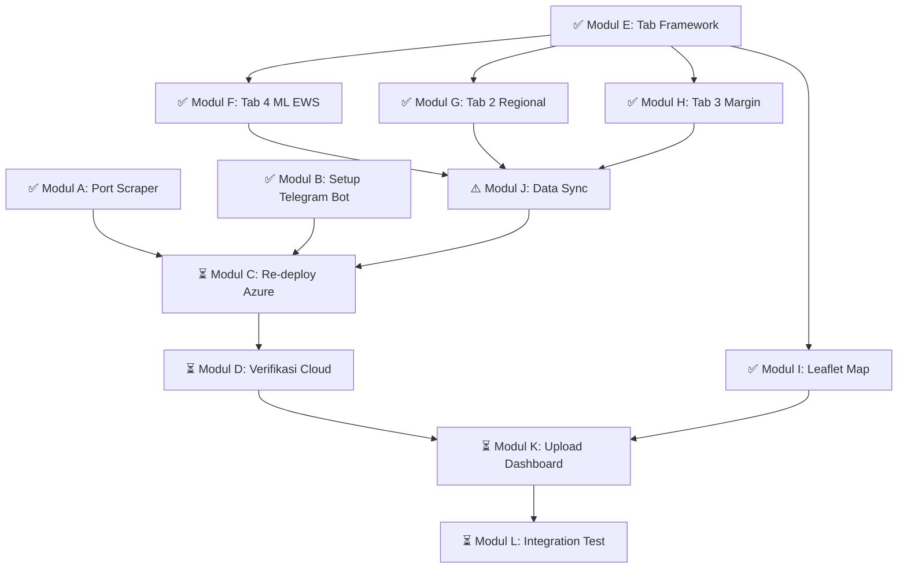

# 📋 ARM Planning v3 — Final Technical Execution Plan
> **Tujuan:** Menyelesaikan seluruh pekerjaan teknis agar project ARM siap di-demo dan diuji end-to-end
> 
> **Deadline:** 5 Juni 2026 | **Status:** ⏳ Mayoritas selesai, tinggal integrasi cloud & validasi akhir
> 
> **Output Akhir:**
> 1. ✅ Azure Function pipeline berjalan end-to-end di cloud (scrape → proses → output)
> 2. ✅ Dashboard versi baru (4-Tab Premium) live dan bisa di-demo
> 3. ✅ Telegram Bot aktif dan mengirim alert otomatis
> 4. ✅ Semua komponen terverifikasi dan siap untuk submit

---

## 📊 Ringkasan Progress (Auto-Updated: 4 Juni 2026)

| Fase | Modul | Status | Catatan |
|------|-------|:------:|---------|
| **FASE 1** | A: Port Scraper ke Python | ✅ SELESAI | `scraper.py` (224 baris) + terintegrasi di `function_app.py` Step 0 |
| | B: Setup Telegram Bot | ✅ SELESAI | Token & Chat ID sudah dikonfigurasi di `local.settings.json` |
| | C: Re-deploy ke Azure | ⏳ BELUM | Kode terbaru belum di-deploy ulang ke Azure |
| | D: Verifikasi Cloud E2E | ⏳ BELUM | Menunggu Modul C + J |
| **FASE 2** | E: Tab Navigation Framework | ✅ SELESAI | 4-tab Glassmorphism: Executive, Spatial, Margin, ML EWS |
| | F: Tab 4 — ML EWS + Confidence Bands | ✅ SELESAI | Confidence interval, multi-select pills, prediksi 90 hari |
| | G: Tab 2 — Spatial + Arbitrage Advisor | ✅ SELESAI | Regional chart + auto-generated rekomendasi arbitrase |
| | H: Tab 3 — Margin + Health Check | ✅ SELESAI | Timeline tree, forked retail (Tradisional/Modern), region filter |
| | I: Tab 1 — Peta Interaktif | ✅ SELESAI | Leaflet.js GIS map (upgrade dari SVG ke real geography) |
| **FASE 3** | J: Data Sync (Backend ↔ Frontend) | ⚠️ PARSIAL | `prepare_dashboard_data.py` sudah lengkap, tapi `function_app.py → compress_dashboard_data()` belum sync |
| | K: Upload Dashboard ke Azure | ⏳ BELUM | Menunggu Modul J |
| | L: Full Integration Test | ⏳ BELUM | Menunggu semua modul |

**Progress keseluruhan: ~75% (9/12 modul selesai, 1 parsial, 2 menunggu)**

---

## 🗺️ Peta Besar (Big Picture)

```
┌─────────────────────────────────────────────────────────────────────┐
│                    FASE 1: BACKEND PIPELINE                        │
│  (Azure Function end-to-end: Scrape → Proses → Output)            │
│                                                                     │
│  ✅ Modul A: Port Scraper → Python (SELESAI)                       │
│  ✅ Modul B: Setup Telegram Bot (SELESAI)                           │
│  ⏳ Modul C: Re-deploy ke Azure Cloud (BELUM)                      │
│  ⏳ Modul D: Verifikasi Cloud End-to-End (BELUM)                   │
└───────────────────────┬─────────────────────────────────────────────┘
                        │ (kode pipeline sudah jalan lokal)
                        ▼
┌─────────────────────────────────────────────────────────────────────┐
│                    FASE 2: DASHBOARD OVERHAUL ✅ SELESAI            │
│  (Perombakan tampilan dari single-page → 4-Tab Premium)            │
│                                                                     │
│  ✅ Modul E: Tab Navigation Framework                               │
│  ✅ Modul F: Tab 4 — ML EWS + Confidence Bands                     │
│  ✅ Modul G: Tab 2 — Regional + Arbitrage Advisor                   │
│  ✅ Modul H: Tab 3 — Supply Chain + Health Check                    │
│  ✅ Modul I: Tab 1 — Leaflet GIS Map (upgrade dari SVG)             │
└───────────────────────┬─────────────────────────────────────────────┘
                        │ (dashboard sudah versi premium)
                        ▼
┌─────────────────────────────────────────────────────────────────────┐
│                    FASE 3: INTEGRASI & VALIDASI                    │
│  (Semua komponen terhubung dan terverifikasi)                      │
│                                                                     │
│  ⚠️ Modul J: Data Sync — compress_dashboard_data() belum sync      │
│  ⏳ Modul K: Upload Dashboard ke Azure Static Web App               │
│  ⏳ Modul L: Full Integration Test + Screenshot Dokumentasi         │
└─────────────────────────────────────────────────────────────────────┘
```

---

## 📦 FASE 1: Backend Pipeline (End-to-End Azure Function)

### ✅ Modul A: Port Scraper PIHPS ke Python & Integrasikan ke `function_app.py`
> **Status:** SELESAI
> **Dikerjakan oleh:** AI Agent
> **Commit:** `0a9d5c9`, `f8e9524`

**Yang sudah selesai:**
1. ✅ Fungsi Python `scrape_daily_pihps()` dibuat di [scraper.py](file:///Users/auliamuzhaffar/Documents/Datathon/datathon-dicoding/azure-functions/scripts/scraper.py) (224 baris)
   - Mereplikasi penuh logika dari `dataup/helper.js` & `dataup/daily_update.js`
   - Mapping `REGIONS` dan `PRICE_SOURCES` di [config.py](file:///Users/auliamuzhaffar/Documents/Datathon/datathon-dicoding/azure-functions/scripts/config.py)
   - HTTP GET ke `bi.go.id/hargapangan` API dengan retry mechanism
   - Composite key deduplication (tanggal|name|daerah|sumber)
2. ✅ Fungsi `update_blob_with_new_data()` dibuat di [function_app.py](file:///Users/auliamuzhaffar/Documents/Datathon/datathon-dicoding/azure-functions/function_app.py)
3. ✅ Terintegrasi sebagai **Step 0** di `arm_daily_pipeline()` (line 341)

---

### ✅ Modul B: Setup Telegram Bot
> **Status:** SELESAI
> **Dikerjakan oleh:** Tim

**Yang sudah selesai:**
1. ✅ Bot sudah dibuat di Telegram
2. ✅ Token dan Chat ID sudah disimpan di [local.settings.json](file:///Users/auliamuzhaffar/Documents/Datathon/datathon-dicoding/azure-functions/local.settings.json)
3. ✅ Modul [telegram_alert.py](file:///Users/auliamuzhaffar/Documents/Datathon/datathon-dicoding/azure-functions/scripts/telegram_alert.py) sudah lengkap (14.678 bytes, premium format)
4. ✅ Terintegrasi sebagai **Step 5** di `arm_daily_pipeline()` (line 391)

---

### ⏳ Modul C: Re-deploy ke Azure Cloud
> **Status:** BELUM DIKERJAKAN
> **Dikerjakan oleh:** AI Agent + Aulia (perlu login Azure CLI)
> **Estimasi:** ~30 menit
> **Dependensi:** Modul A ✅, Modul B ✅, **Modul J** (harus selesai dulu agar `compress_dashboard_data()` sync)

**Yang harus dilakukan:**
1. ⬜ Selesaikan Modul J dulu (sync `compress_dashboard_data()`)
2. ⬜ Set App Settings di Azure Portal (Telegram token sudah ada, tinggal push):
   ```bash
   az functionapp config appsettings set \
     --name arm-daily-pipeline-74220 \
     --resource-group arm-datathon-rg \
     --settings \
       TELEGRAM_BOT_TOKEN="<dari local.settings.json>" \
       TELEGRAM_CHAT_ID="<dari local.settings.json>"
   ```
3. ⬜ Re-publish kode terbaru:
   ```bash
   cd azure-functions
   func azure functionapp publish arm-daily-pipeline-74220
   ```

**Output Modul C:** Kode terbaru terdeploy di Azure Cloud dengan konfigurasi Telegram

---

### ⏳ Modul D: Verifikasi Cloud End-to-End
> **Status:** BELUM DIKERJAKAN
> **Dikerjakan oleh:** Aulia (via Azure Portal atau CLI)
> **Estimasi:** ~30 menit
> **Dependensi:** Modul C selesai

**Checklist verifikasi:**
- ⬜ Step 0: Scraper berhasil fetch data hari ini
- ⬜ Step 1: Data dari Blob loaded (termasuk data baru)
- ⬜ Step 2: Anomali terdeteksi
- ⬜ Step 3: 84 model Prophet trained
- ⬜ Step 4: EWS spike predicted
- ⬜ Step 5: Telegram alert **terkirim ke group** ✉️
- ⬜ Step 6: `dashboard_data.json` ter-upload ke `$web`
- ⬜ Step 7: MLflow metrics logged
- ⬜ Ambil screenshot untuk dokumentasi

**Output Modul D:** Pipeline terbukti berjalan end-to-end di cloud. Telegram alert terkirim.

---

## 📦 FASE 2: Dashboard Overhaul (4-Tab Premium) — ✅ SELESAI

> **Referensi Desain:** [plan-desain.md](file:///Users/auliamuzhaffar/Documents/Datathon/datathon-dicoding/docs/strategy/plan-desain.md) & [implementation.md](file:///Users/auliamuzhaffar/Documents/Datathon/datathon-dicoding/docs/strategy/implementation.md)

**Statistik Codebase Dashboard Saat Ini:**
- [app.js](file:///Users/auliamuzhaffar/Documents/Datathon/datathon-dicoding/dashboard/app.js): **2.013 baris** (87 KB)
- [style.css](file:///Users/auliamuzhaffar/Documents/Datathon/datathon-dicoding/dashboard/style.css): **1.888 baris** (47 KB)
- [index.html](file:///Users/auliamuzhaffar/Documents/Datathon/datathon-dicoding/dashboard/index.html): **399 baris** (21 KB)

---

### ✅ Modul E: Tab Navigation Framework & Layout Migration
> **Status:** SELESAI
> **Commit:** `b5030cf`, `bbc258d`

**Yang sudah selesai:**
1. ✅ Tab Bar Glassmorphism: `[📊 Executive] [📍 Spatial] [💸 Margin] [🔮 ML EWS]`
2. ✅ 4 kontainer tab: `#tab-executive`, `#tab-spatial`, `#tab-margin`, `#tab-forecast`
3. ✅ Fungsi `switchTab(tabId)` dengan Chart.js `.resize()` + Leaflet map invalidation
4. ✅ Animasi transisi fade-in antar tab
5. ✅ Redistribusi konten:
   - **Tab 1 (Executive):** KPI grid, Leaflet Map, Status Grid, Detail Panel, Alert Feed, Anomaly Table, Seasonality/Volatility Heatmap
   - **Tab 2 (Spatial):** Regional Comparison, Regional Chart, Arbitrage Advisor
   - **Tab 3 (Margin):** Summary KPI cards, Supply Chain grid semua komoditas
   - **Tab 4 (Forecast):** EWS cards, Price Trend + Prediksi 90 hari, YoY, Category Area

---

### ✅ Modul F: Tab 4 — ML EWS + Confidence Bands (Uncertainty Shadows)
> **Status:** SELESAI
> **Commit:** `b5030cf`, `ac18750`

**Yang sudah selesai:**
1. ✅ EWS cards + Price Trend Chart berada di `#tab-forecast`
2. ✅ Confidence interval (uncertainty band): `yhat_lower` dan `yhat_upper` dengan `fill: '-1'` dan warna transparan
3. ✅ Confidence band muncul saat single-focus mode (1 komoditas dipilih)
4. ✅ **Multi-select pills** — user bisa pilih beberapa sub-komoditas sekaligus:
   - Default: semua pill aktif = semua tampil
   - Klik pill → hanya pill itu yang tampil, sisanya redup
   - Klik lagi → tambah pill aktif
   - Reset → semua tampil kembali
5. ✅ Toggle prediksi 90 hari dengan tombol `🔮 Tampilkan Prediksi 90 Hari`
6. ✅ Chart.js legend bawaan dinonaktifkan (diganti custom pills)

---

### ✅ Modul G: Tab 2 — Regional Disparity + Automated Arbitrage Advisor
> **Status:** SELESAI
> **Commit:** `b5030cf`, `3a4fe53`

**Yang sudah selesai:**
1. ✅ Regional comparison di `#tab-spatial` dengan dropdown komoditas
2. ✅ Grafik garis Chart.js komparasi harga 3 daerah (timeseries per region)
3. ✅ Arbitrage Advisor card `#arbitrage-advisor-grid`:
   - Algoritma deteksi disparitas harga >30% antar daerah
   - Generate teks rekomendasi otomatis (komoditas, harga, selisih, aksi logistik)
   - Tampilkan kartu rekomendasi untuk **semua komoditas** dengan disparitas tinggi
4. ✅ Fungsi `renderSpatialTab()`, `renderRegionalChart()`, `renderArbitrageAdvisor()`

---

### ✅ Modul H: Tab 3 — Supply Chain Margin + Distribution Health Check
> **Status:** SELESAI
> **Commit:** `b5030cf`, `bbc258d`, `ac18750`

**Yang sudah selesai:**
1. ✅ Tab `#tab-margin` menampilkan margin flow **semua komoditas sekaligus**
2. ✅ Enterprise redesign: Timeline tree dengan forked retail channels (Tradisional/Modern)
3. ✅ Badge health check warna: 🟢 Sehat (<20%), 🟡 Waspada (20-40%), 🔴 Tidak Wajar (>40%)
4. ✅ Summary cards: "X komoditas sehat, Y waspada, Z tidak wajar"
5. ✅ Region filter — margin berubah sesuai daerah yang dipilih di navbar
6. ✅ Severity bars visualization
7. ✅ Fungsi `renderMarginHealthTab()` (dimulai line 1774)

---

### ✅ Modul I: Tab 1 — Interactive Map Aceh (UPGRADE: Leaflet GIS)
> **Status:** SELESAI (di-upgrade dari rencana SVG ke Leaflet.js)
> **Commit:** `3a4fe53`

**Yang sudah selesai (melebihi rencana awal):**
1. ✅ ~~SVG peta~~ → **Leaflet.js GIS Map** dengan tile OpenStreetMap
   - Real geography coordinates untuk Banda Aceh, Lhokseumawe, Meulaboh
   - Interaktif: zoom, pan, marker click
2. ✅ Embed di `#tab-executive` di bawah KPI grid (`#aceh-leaflet-map`)
3. ✅ `initLeafletMap()` + dynamic marker updates:
   - Z > 3σ → Marker merah berkedip (Kritis)
   - Z > 2σ → Marker amber berkedip (Waspada)
   - Normal → Marker teal (Normal)
4. ✅ Floating legend glassmorphism dengan status anomali
5. ✅ Map status summary di bawah peta
6. ✅ Auto-resize saat tab switch (`mapInstance.invalidateSize()`)

> **Catatan:** Rencana awal hanya SVG statis (nice-to-have), tapi diimplementasikan sebagai Leaflet.js interaktif yang jauh lebih baik.

---

## 📦 FASE 3: Integrasi & Validasi Final

### ⚠️ Modul J: Update Format `dashboard_data.json` (Backend ↔ Frontend Sync)
> **Status:** PARSIAL — perlu pekerjaan tambahan
> **Dikerjakan oleh:** AI Agent
> **Estimasi:** ~1-2 jam
> **Dependensi:** Modul F ✅, G ✅, H ✅

**Situasi saat ini:**
- ✅ [prepare_dashboard_data.py](file:///Users/auliamuzhaffar/Documents/Datathon/datathon-dicoding/azure-functions/scripts/prepare_dashboard_data.py) (594 baris) sudah menghasilkan format lengkap:
  - `kpi`, `commodityCards`, `timeseries`, `timeseriesRecentDaily`, `forecasts`, `anomalies`, `spikes`, `alertFeed`, `volatility`, `regional`, `priceBySource`, `regionalForecasts`, `aiInsight`, `seasonality`
- ❌ **MASALAH KRITIS:** [function_app.py → compress_dashboard_data()](file:///Users/auliamuzhaffar/Documents/Datathon/datathon-dicoding/azure-functions/function_app.py#L204-L262) **belum sync** dengan `prepare_dashboard_data.py`. Fungsi ini hanya menghasilkan:
  - `metadata`, `commodities`, `timeseries`, `timeseriesRecentDaily`, `forecasts`, `anomalies`, `spikes`
  - **MISSING:** `kpi`, `commodityCards`, `volatility`, `alertFeed`, `regional`, `priceBySource`, `regionalForecasts`, `aiInsight`, `seasonality`
- ✅ [prepare_dashboard_data.py lokal](file:///Users/auliamuzhaffar/Documents/Datathon/datathon-dicoding/scripts/prepare_dashboard_data.py) (594 baris) sama dengan versi azure

**Yang harus dilakukan:**
1. ⬜ **Sync `compress_dashboard_data()` di `function_app.py`** agar output-nya identik dengan `prepare_dashboard_data.py`:
   - Impor atau replika fungsi `build_commodity_cards()`, `build_volatility()`, `build_regional_data()`, `build_alert_feed()`, `build_price_by_source()`, `build_seasonality()`, `generate_executive_summary()`
   - Tambahkan field: `kpi`, `commodityCards`, `volatility`, `alertFeed`, `regional`, `priceBySource`, `regionalForecasts`, `aiInsight`, `seasonality`
2. ⬜ **Alternatif (lebih efisien):** Ganti `compress_dashboard_data()` di `function_app.py` dengan langsung memanggil `prepare_dashboard_data.py`'s `compress_dashboard_data()` yang sudah lengkap, karena keduanya sudah berada di `azure-functions/scripts/`

**Output Modul J:** Format data backend dan frontend sinkron sempurna

---

### ⏳ Modul K: Upload Dashboard ke Azure Static Web App
> **Status:** BELUM DIKERJAKAN
> **Dikerjakan oleh:** Aulia (via Azure CLI)
> **Estimasi:** ~15 menit
> **Dependensi:** Modul J ⚠️ + Modul E-I ✅

**Yang harus dilakukan:**
1. ⬜ Upload file dashboard baru ke `$web` container:
   ```bash
   az storage blob upload-batch \
     --destination '$web' \
     --source dashboard/ \
     --connection-string "<CONN_STRING>" \
     --overwrite
   ```
2. ⬜ Verifikasi dashboard live di browser:
   - `https://armmlworkspace7422048783.z23.web.core.windows.net/`

**Output Modul K:** Dashboard versi baru live di Azure

---

### ⏳ Modul L: Full Integration Test + Screenshot Dokumentasi
> **Status:** BELUM DIKERJAKAN
> **Dikerjakan oleh:** Seluruh Tim
> **Estimasi:** ~1 jam
> **Dependensi:** Semua modul selesai

**Checklist Final:**

#### Pipeline Azure (Backend)
- ⬜ Trigger `arm-daily-pipeline-74220` → pipeline berjalan tanpa error
- ⬜ Step 0: Data hari ini ter-scrape dan ter-append ke Blob
- ⬜ Step 5: Telegram alert terkirim ke group
- ⬜ Step 6: `dashboard_data.json` terbaru ter-upload ke `$web`

#### Dashboard (Frontend) — Sudah terverifikasi lokal
- ✅ Tab 1 (Executive): KPI cards, Leaflet GIS Map, status grid, detail panel, anomaly table, heatmap
- ✅ Tab 2 (Spatial): Regional comparison, regional timeseries chart, arbitrage advisor text
- ✅ Tab 3 (Margin): Supply chain flow semua komoditas, health badges, region filter, severity bars
- ✅ Tab 4 (Forecast): EWS cards, price trend + confidence bands, multi-select pills, prediksi 90 hari
- ✅ Perpindahan tab smooth (no Chart.js gepeng, Leaflet resize handled)
- ✅ Dashboard loads < 3 detik
- ⬜ Mobile responsive (perlu dicek ulang)

#### Telegram Bot
- ⬜ Alert terkirim ke group saat pipeline jalan di cloud
- ✅ Format pesan premium (emoji, rekomendasi spesifik) — kode sudah lengkap

#### Screenshot untuk Dokumentasi
- ✅ Sudah ada di `docs/images/`: 4 screenshot (daging_sapi_case_study, map_anomaly_status, margin_health_tab, regional_comparison)
- ⬜ Azure Portal: Functions dashboard
- ⬜ Azure Portal: Function execution logs
- ⬜ Azure Portal: Blob Storage containers
- ⬜ Telegram: Screenshot alert yang terkirim
- ⬜ Dashboard: Screenshot lengkap setiap tab versi cloud (4 screenshot)

**Output Modul L:** Semua komponen terverifikasi, screenshot tersimpan di `docs/`

---

## 📊 Ringkasan Modul & Alur Dependensi



## ⏰ Sisa Pekerjaan — Urutan Eksekusi

| Prioritas | Modul | Dikerjakan Oleh | Estimasi | Deskripsi |
|:---------:|-------|:---------------:|:--------:|-----------|
| **🔴 1** | Modul J (Data Sync) | AI Agent | ~1-2 jam | Sync `compress_dashboard_data()` di `function_app.py` agar output sama dengan `prepare_dashboard_data.py` |
| **🟡 2** | Modul C (Re-deploy Azure) | Aulia + AI | ~30 menit | Push kode terbaru + set Telegram env vars di Azure |
| **🟡 3** | Modul D (Cloud Verify) | Aulia | ~30 menit | Trigger pipeline, verifikasi semua 7 step |
| **🟢 4** | Modul K (Upload Dashboard) | Aulia | ~15 menit | Upload dashboard files ke Azure Static Web App |
| **🟢 5** | Modul L (Final Test) | Tim | ~1 jam | Integration test + screenshot dokumentasi |

**Total estimasi sisa: ~3-4 jam**

---

## 🏆 Fitur Bonus yang Sudah Diimplementasikan (Tidak di Rencana Awal)

Berikut fitur yang diimplementasikan **melebihi** rencana planningv3 awal:

1. **Multi-select pills UI** — user bisa memilih beberapa sub-komoditas sekaligus di chart tren harga (tidak di-plan awal)
2. **Leaflet.js GIS Map** — upgrade dari SVG statis ke peta geografi real dengan marker interaktif (plan awal hanya SVG nice-to-have)
3. **Region selector global** — dropdown di navbar yang memfilter KPI, margin, dan detail per daerah (Banda Aceh, Lhokseumawe, Meulaboh)
4. **Dynamic KPI cards** — KPI yang berubah otomatis sesuai region dan real-time data
5. **Enterprise Margin redesign** — Timeline tree dengan forked retail channels (Tradisional + Modern) dan severity bars
6. **Catatan presentasi juri** — [catatan.md](file:///Users/auliamuzhaffar/Documents/Datathon/datathon-dicoding/catatan.md) (35 KB) berisi formula, studi kasus, dan jawaban untuk pertanyaan juri
7. **AI Executive Summary** — narasi otomatis ringkasan keamanan pangan yang di-generate berdasarkan data anomali dan prediksi

---

## 🚫 Yang TIDAK Termasuk di Planning v3 ini

Berikut item yang akan dibahas di dokumen planning terpisah:
- ❌ Slide presentasi (G17)
- ❌ Update README.md dan project brief (G19, G20)
- ❌ Etika & limitasi (G20)
- ❌ Drill Q&A juri (G22)
- ❌ Final review dan submit

---

> **⚡ Next Action:**
> Modul J adalah **blocker utama** — setelah `compress_dashboard_data()` di `function_app.py` disinkronkan, sisa pekerjaan tinggal deploy & validasi.
