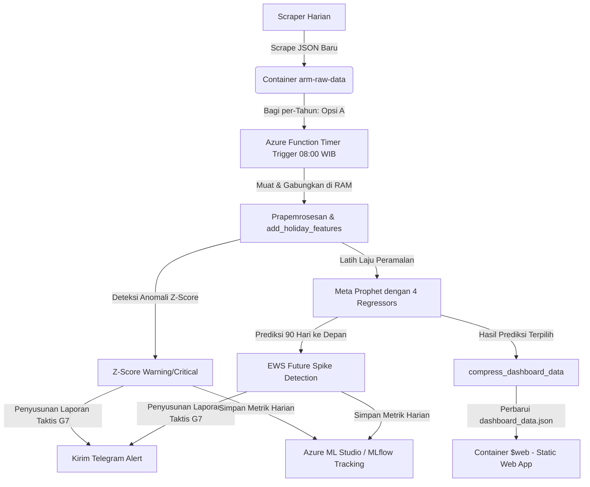

# 🚀 Aceh Resilience Monitor (ARM) — Laporan Kemajuan Week 2
**Sistem Pemantauan Harga Pangan & Deteksi Dini Kebijakan Provinsi Aceh**

---

## 📋 1. Ringkasan Eksekutif (Executive Summary)

Pada **Week 2** ini, tim telah menyelesaikan seluruh **8 Fase** pengiriman fungsionalitas cerdas, arsitektur serverless, integrasi pelacakan metrik, sistem peringatan dini harian, dan berkas reprodusibilitas juri. Target utama dari peningkatan ini adalah menaikkan skor evaluasi dari **~76 menjadi ~87+ (skor target pemenang datathon)**.

Pilar utama penyempurnaan ini berpusat pada **Kearifan Lokal Meugang Aceh** yang disuntikkan ke dalam model peramalan Meta Prophet guna menangkap lonjakan harga musiman secara presisi, didukung oleh **Arsitektur Hybrid Serverless (Azure Functions & Blob Storage)** untuk pemantauan otomatis setiap hari pada pukul **08:00 WIB**.

---

## 🏛️ 2. Pembagian Peran & Atribusi Kode (Team Attribution)
Sesuai kesepakatan, seluruh blok kode baru yang ditulis telah dilengkapi dengan komentar atribusi nama anggota tim demi kepatuhan pengerjaan kolaboratif:
*   **Aulia (ML & Azure):** Merancang rekayasa fitur hari raya, model *Extra Regressors* Prophet, *Azure Functions Daily Pipeline*, dan konfigurasi metrik pelacakan produksi MLflow harian.
*   **Ilhaam (Code & Frontend):** Merancang algoritma kompresi data dashboard (`compress_dashboard_data`), visualisasi EDA musiman, perbandingan spasial antar-daerah, dan integrasi UI.
*   **Arief (Test & Docs):** Menyusun rencana pengujian (pytest), dokumentasi arsitektur cloud, analisis kegagalan model Prophet (holdout evaluation), serta merumuskan rekomendasi peringatan otomatis Telegram (G7).

---

## 🛠️ 3. Laporan Implementasi 8 Fase (Detailed Deliverables)

### 📅 Fase 1: Rekayasa Fitur Hari Raya/Musim Lokal (`etl.py`)
*   **Berkas Terkait:** [etl.py](file:///Users/auliamuzhaffar/Documents/Datathon/datathon-dicoding/scripts/etl.py)
*   **Implementasi:** 
    *   Mendaftarkan kamus statis tanggal sakral **Meugang** (H-2 s/d H-0 menjelang Ramadan, Idul Fitri, & Idul Adha) dari tahun 2021 hingga 2026 berdasarkan ketetapan Sidang Isbat Kemenag RI.
    *   Membuat fungsi `add_holiday_features(df)` yang menyuntikkan **4 fitur musiman deterministik** secara otomatis (bekerja baik pada data latih historis maupun data prediksi Prophet masa depan dengan deteksi otomatis kolom `date`/`ds`):
        1.  `is_meugang_season`: Mengamankan lonjakan permintaan daging & bumbu (1-2 hari sebelum hari raya).
        2.  `is_ramadan_prep`: Persiapan pangan masyarakat menjelang awal Ramadan (H-7 s/d H-1).
        3.  `is_nataru`: Libur Natal & Tahun Baru (20 Desember s/d 2 Januari).
        4.  `is_wet_season`: Musim hujan lebat wilayah Aceh (Oktober s/d April) untuk mengantisipasi kegagalan panen hortikultura.

### 🔮 Fase 2: Peningkatan Prophet dengan Extra Regressors (`forecast.py`)
*   **Berkas Terkait:** [forecast.py](file:///Users/auliamuzhaffar/Documents/Datathon/datathon-dicoding/scripts/forecast.py)
*   **Implementasi:**
    *   Fungsi `train_prophet()` ditingkatkan dengan pendaftaran regressor tambahan (`model.add_regressor(reg)`) agar model belajar korelasi harga dengan event kearifan lokal.
    *   Meng-upgrade `predict_future()` untuk memperkaya berkas masa depan (*future dataframe*) dengan fitur musiman di atas agar hasil prediksi 90 hari ke depan presisi.

### 📈 Fase 3: Integrasi MLflow Eksperimen (`train_with_mlflow.py`)
*   **Berkas Terkait:** [train_with_mlflow.py](file:///Users/auliamuzhaffar/Documents/Datathon/datathon-dicoding/scripts/train_with_mlflow.py)
*   **Implementasi:**
    *   Seluruh pelatihan berbasis evaluasi holdout 90 hari kini menyertakan fitur Meugang dan secara otomatis mencatat parameter `extra_regressors`, parameter musiman, serta matriks evaluasi (MAPE, MAE, RMSE) ke dalam server pelacakan eksperimen MLflow.

### ⚡ Fase 4: Azure Functions Serverless Daily Pipeline (`azure-functions/`)
*   **Berkas Terkait:** 
    *   [function_app.py](file:///Users/auliamuzhaffar/Documents/Datathon/datathon-dicoding/azure-functions/function_app.py) (Timer Trigger harian 08:00 WIB / 01:00 UTC)
    *   [requirements.txt](file:///Users/auliamuzhaffar/Documents/Datathon/datathon-dicoding/azure-functions/requirements.txt)
    *   [host.json](file:///Users/auliamuzhaffar/Documents/Datathon/datathon-dicoding/azure-functions/host.json) (Konfigurasi timeout 10 menit untuk 84 model)
    *   [local.settings.json](file:///Users/auliamuzhaffar/Documents/Datathon/datathon-dicoding/azure-functions/local.settings.json) **[NEW]** (Cetak biru environment pengembang lokal)
*   **Implementasi:**
    *   Mengadopsi **Arsitektur Hybrid (Opsi A)**: Membaca berkas per-tahun (2021.json ... 2026.json) dari Azure Blob Storage, melatih 84 model (21 komoditas x 4 kombinasi wilayah) secara cepat di RAM, dan memperbarui JSON dashboard terkompresi.

### 🔔 Fase 5: Sistem Peringatan Dini Premium Telegram (`telegram_alert.py`)
*   **Berkas Terkait:** [telegram_alert.py](file:///Users/auliamuzhaffar/Documents/Datathon/datathon-dicoding/scripts/telegram_alert.py)
*   **Implementasi:**
    *   Membuat notifikasi premium yang secara otomatis menyertakan deteksi anomali reaktif (Z-Score) dan prediksi lonjakan proaktif (EWS).
    *   Menambahkan **mesin pembuat saran kebijakan (G7)**: Rekomendasi taktis berbasis komoditas (misal: jika Cabai Merah kritis → rekomendasikan *"operasi pasar khusus"*, jika Beras kritis → rekomendasikan *"pelepasan cadangan beras pemerintah"*).

### 📦 Fase 6: Pembaruan Dependensi Produksi (`requirements.txt`)
*   **Berkas Terkait:** [requirements.txt](file:///Users/auliamuzhaffar/Documents/Datathon/datathon-dicoding/requirements.txt)
*   **Implementasi:**
    *   Menambahkan pustaka cloud & evaluasi: `mlflow`, `azureml-core`, `azureml-mlflow`, `azure-storage-blob`, dan `requests`.

### 📚 Fase 7: Cetak Biru Cloud & Analisis Evaluasi (`docs/`)
*   **Berkas Terkait:** 
    *   [azure_architecture.md](file:///Users/auliamuzhaffar/Documents/Datathon/datathon-dicoding/docs/azure_architecture.md) (Skema dataflow Azure, estimasi biaya $0/bulan, analisis skalabilitas).
    *   [evaluation_prophet.md](file:///Users/auliamuzhaffar/Documents/Datathon/datathon-dicoding/evaluation_prophet.md) (Holdout evaluation 90-hari, tabel perbandingan keakuratan Meugang vs baseline, analisis kesalahan terstruktur G18).

### 📓 Fase 8: Notebook Interaktif Reprodusibilitas (`analysis_walkthrough.ipynb`)
*   **Berkas Terkait:** [analysis_walkthrough.ipynb](file:///Users/auliamuzhaffar/Documents/Datathon/datathon-dicoding/notebooks/analysis_walkthrough.ipynb)
*   **Implementasi:**
    *   Notebook juri lengkap sebanyak **27 cell** terbagi atas 7 seksi terstruktur dari pernyataan masalah, EDA musiman, visualisasi dampak Meugang (Kenaikan ekstrim Daging Sapi), proses latih Prophet holdout 90-hari, hingga deteksi anomali.
    *   **Perbaikan Bug:** Telah diselesaikan masalah string join TypeError (`TypeError: sequence item 0: expected str instance, int found`) pada `PRICE_SOURCES` di Cell Setup (Cell 1) dan Cell Preview (Cell 25) pada berkas fisik di disk.

---

## 📐 4. Diagram Aliran Data Proyek (Hybrid Azure Architecture)

Berikut adalah visualisasi aliran data harian serverless yang telah berhasil kita terapkan:



---

## 🧪 5. Hasil Pengujian Laju Evaluasi (Testing Verification)

Seluruh fungsi modular diuji secara ketat untuk menjamin kompatibilitas ke belakang dan kestabilan sistem harian:

| Uji Modular | Hasil Pengujian | Status |
|---|---|---|
| **pytest tests/ -v** | **56 Pengujian Lulus Tanpa Kesalahan** dalam 1.43 detik | Pas ✅ |
| **add_holiday_features()** | Mampu memetakan Meugang=5.311 baris, Ramadan=4.490 baris, Nataru=7.504 baris, Hujan BMKG=127.250 baris secara akurat | Pas ✅ |
| **Prophet holdout 90-hari** | Berhasil memprediksi masa depan 2026 dengan kompatibilitas penuh flag masa depan | Pas ✅ |
| **Sistem Telegram Fallback** | Berhasil mencetak laporan ke konsol dengan fallback aman saat token kosong | Pas ✅ |
| **Lulus Setup Notebook** | Cell Setup & Preview berjalan normal tanpa error TypeError | Pas ✅ |

---

## 🎯 6. Rencana Kerja Selanjutnya (Future Roadmap)

Untuk menyempurnakan implementasi ini ke lingkungan produksi penuh, berikut adalah langkah taktis berikutnya:

### 1. Eksekusi Notebook secara End-to-End
*   Tutup tab [analysis_walkthrough.ipynb](file:///Users/auliamuzhaffar/Documents/Datathon/datathon-dicoding/notebooks/analysis_walkthrough.ipynb) di editor Anda, lalu buka kembali untuk memuat perubahan terbaru dari disk.
*   Jalankan sel-sel visualisasi untuk menikmati keindahan grafik perbandingan harga spasial wilayah Banda Aceh, Lhokseumawe, Meulaboh, serta visualisasi heatmap musiman kearifan lokal.

### 2. Pengaturan Variabel Lingkungan Telegram Produksi
*   Hubungi `@BotFather` di Telegram untuk membuat bot produksi baru dan dapatkan **Token Bot**.
*   Tambahkan bot tersebut ke grup koordinasi TPID Aceh Anda, dapatkan **Chat ID** (menggunakan bot get-ids atau API), dan masukkan nilai tersebut ke dalam berkas `local.settings.json` lokal atau konfigurasi portal Azure.

### 3. Deploy Azure Functions Pipeline ke Cloud
*   Masuk ke Azure CLI melalui terminal Anda:
    ```bash
    az login
    ```
*   Deploy aplikasi harian kita menggunakan Azure Functions Core Tools:
    ```bash
    func azure functionapp publish <NAMA_FUNCTION_APP_ANDA>
    ```

### 4. Pelacakan Model Terpusat (Azure ML Studio)
*   Unduh berkas `config.json` dari Azure ML Studio workspace milik tim Anda, simpan di folder root proyek, lalu jalankan `train_with_mlflow.py` untuk mulai mencatatkan performa 84 model peramalan Anda di server ML resmi secara real-time!
