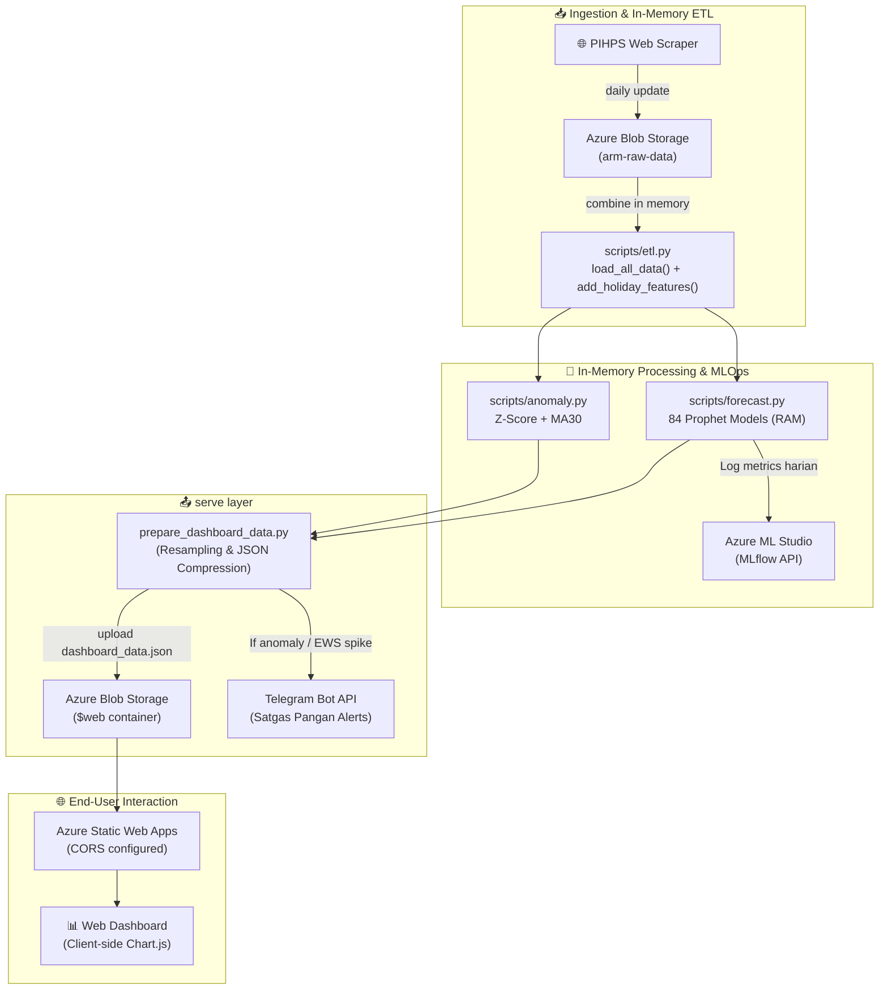

# 📋 Project Brief: Aceh Resilience Monitor (ARM)
**Datathon Dicoding × Microsoft Elevate Training Center 2026**

---

## Informasi Peserta

| No | Nama | Email Dicoding | Peran Utama & Atribusi Kode |
| :---: | :--- | :--- | :--- |
| 1 | **Aulia Muzhaffar** | auliamuzhaffar@gmail.com | *Machine Learning & Azure Specialist* (Logika *Forecasting* Prophet, Evaluasi Holdout, Azure ML & MLflow, Azure Functions Serverless Pipeline, Bug Fixing `NaN` ke `null`, Implemen Uji Hipotesis, dan Storytelling Notebook). |
| 2 | **Muhammad Ilhaam Ghiffari** | ilhaamghiffari@gmail.com | *Data Engineer & Frontend Developer* (Modular Refactoring ETL, Z-Score Anomaly Detection, Dasbor Dark Glassmorphism, Kompresi Payload JSON, CORS Configuration, Security Environment Localizer). |
| 3 | **Arief Hidayah** | ariefhidayahm@gmail.com | *QA Auditor, Repo Manager & Storyteller* (Scraping Data PIHPS, Unit Testing Pytest, Laporan Arsitektur Cloud & Error Analysis, Q&A Drill, Alert Telegram Bot). |

*   **Topik Proyek:** Ketahanan Pangan & Agrikultur Modern (Kategori: Urban Resilience & Smart City)

---

## Ringkasan Eksekutif

### Latar Belakang Masalah
Volatilitas harga pangan strategis (*volatile foods*) merupakan salah satu penyumbang inflasi daerah terbesar di Indonesia. Di Provinsi Aceh, tantangan ini diperparah oleh:
1.  **Lambatnya Integrasi Data:** Proses pengumpulan data harga di pasar-pasar tradisional masih bersifat manual atau terpisah antara portal seperti PIHPS dan SP2KP, memicu jeda analisis hingga beberapa hari.
2.  **Respons yang Bersifat Reaktif:** Instansi pemerintah (TPID/Satgas Pangan) umumnya baru melakukan intervensi (seperti Operasi Pasar Murah) setelah harga pangan melambung tinggi di pasar konsumen (*hilir*).
3.  **Kebutaan Kalender (Calendar Blindness):** Pemangku kebijakan tidak memiliki instrumen cerdas untuk memproyeksikan pergerakan harga komoditas pangan esensial ke depan berdasarkan siklus hari raya lokal keagamaan Islam (seperti Meugang dan Ramadan) yang tanggalnya selalu bergeser sekitar 11 hari setiap tahun Gregorian mengikuti kalender lunar Hijriah.

### Problem Statement
Bagaimana membangun sistem otomatisasi terintegrasi yang mampu mengumpulkan data harga pangan harian secara serverless, mendeteksi anomali harga harian, dan meramal lonjakan harga 90 hari ke depan guna menyajikan rekomendasi kebijakan stabilisasi pasar secara preventif?

### Research Questions
1.  Komoditas apa saja yang saat ini menunjukkan anomali harga kritis di luar batas deviasi wajar ($2\sigma$ atau $3\sigma$) terhadap rata-rata bulanan (MA30)?
2.  Komoditas apa saja yang diprediksi oleh Machine Learning akan mengalami lonjakan harga ekstrem ($\ge 20\%$) dalam 90 hari ke depan?

### Mengapa Memilih Proyek Ini (Painkiller Concept)
Aceh Resilience Monitor (ARM) bertindak sebagai *painkiller* nyata (bukan sekadar *vitamin* visualisasi data biasa) yang langsung menyelesaikan rasa sakit birokrasi dalam merespons inflasi. Melalui integrasi otomatisasi cloud serverless Azure (biaya $0/bulan), dasbor analisis margin rantai pasok, dan pengiriman alert otomatis ke bot Telegram, ARM mendeteksi ancaman lonjakan harga pangan sebelum terjadi sehingga pemerintah dapat melaksanakan Operasi Pasar secara preventif untuk melindungi daya beli masyarakat di Provinsi Aceh.

---

## Deskripsi Project

### Solusi yang Ditawarkan
Aceh Resilience Monitor (ARM) adalah platform analitik berbasis web interaktif dan intelijen harga pangan untuk membantu Tim Pengendalian Inflasi Daerah (TPID) dan Satgas Pangan Provinsi Aceh. ARM mengotomatiskan seluruh alur data dari scraping portal PIHPS Bank Indonesia, melakukan preprocessing data, mendeteksi anomali harga menggunakan metode kontrol kualitas statistik, meramal pergerakan harga 90 hari ke depan menggunakan AI (Meta Prophet), hingga mengirimkan notifikasi peringatan dini secara otomatis ke Telegram.

### Nama Produk, Fungsi, & Penyelesaian Masalah
*   **Nama Produk:** Aceh Resilience Monitor (ARM).
*   **Fungsi:** Platform Early Warning System (EWS) untuk memantau fluktuasi harga pangan harian secara historis dan memproyeksikan inflasi pangan di tingkat provinsi.
*   **Cara Menyelesaikan Masalah:** ARM memotong rantai respons birokrasi yang lambat dengan menyajikan deteksi anomali harga secara real-time dan ramalan harga ke depan. Dengan domain knowledge kalender Hijriah (Meugang & Ramadan) yang disuntikkan ke model machine learning, ARM mengantisipasi gejolak musiman sebelum berdampak ke pasar hilir konsumen. Hal ini memberikan waktu bagi pemerintah daerah untuk melakukan operasi pasar murah secara proaktif, mengaktifkan Kerja sama Antar Daerah (KAD), atau mendistribusikan cadangan pangan.

---

## Fitur Utama dan Teknologi yang Digunakan

### Fitur Utama Produk
*   **Predictive EWS Cards:** Menyoroti 3 komoditas paling rentan mengalami lonjakan harga ekstrem dalam 90 hari ke depan dengan label status bahaya otomatis.
*   **Actionable AI Insights (Meta Prophet):** Menyajikan hasil peramalan deret waktu 90 hari ke depan yang dilengkapi dengan visualisasi batas atas keyakinan (`yhat_upper`) untuk skenario terburuk (*worst-case scenario*).
*   **Process Control Anomaly Detection:** Menghitung deviasi harga harian terhadap rata-rata bulanan menggunakan batas Z-Score dinamis ($2\sigma$ untuk waspada, $3\sigma$ untuk kritis).
*   **Audit Rantai Pasokan (Margin Audit):** Diagram alur interaktif yang membandingkan harga dari tingkat Produsen $\rightarrow$ Pedagang Besar $\rightarrow$ Pasar Tradisional $\rightarrow$ Pasar Modern untuk mendeteksi indikasi spekulan.
*   **Automated Telegram Alerts:** Pengiriman pesan ringkasan anomali kritis dan prediksi spike harga harian langsung ke Telegram grup Satgas Pangan pada pukul 08:00 WIB.
*   **Fallback Protocol (Safety Net):** Pengaktifan protokol mitigasi otomatis untuk komoditas volatilitas tinggi (MAPE > 15%) dengan mengabaikan ramalan titik tunggal dan berfokus pada visualisasi `yhat_upper`.

### Teknologi dan Tools yang Digunakan
*   **Bahasa Pemrograman:** Python 3.11 (Backend & ML Pipeline), JavaScript (Dasbor Frontend).
*   **Visualisasi Frontend:** Vanilla HTML/CSS (Desain Dark Glassmorphism), Chart.js (Grafik Tren & Prediksi Interaktif), Leaflet.js (Peta Anomali Spasial).
*   **Machine Learning & Analytics:** Meta Prophet (Forecasting Engine), Scipy Stats (Pengujian Hipotesis Statistik), Pandas & NumPy (Data Processing).
*   **Otomasi CLI Lokal:** GNU Makefile & Environment Localizer (.env) untuk memisahkan rahasia.

---

### Arsitektur Sistem & Data Pipeline

Aliran data ARM dirancang secara serverless untuk menghindari kerumitan pemeliharaan server fisik (*zero-maintenance infrastructure*):



---

### Perbandingan Model Baseline (Benchmark)

Untuk memvalidasi keunggulan algoritma **Meta Prophet**, kami melakukan pengujian komparatif terhadap 3 model baseline (benchmark) menggunakan data uji historis yang sama:
1.  **Naive Forecast:** Memproyeksikan harga terakhir dari data pelatihan (harga per 30 September 2025) secara konstan untuk seluruh 90 hari periode uji.
2.  **SMA-30 (Simple Moving Average):** Menggunakan rata-rata aritmatika dari 30 hari terakhir data pelatihan sebagai nilai prediksi konstan ke depan.
3.  **EMA-30 (Exponential Moving Average):** Menggunakan rata-rata bergerak eksponensial dari 30 hari terakhir data pelatihan.

#### Tabel Komparasi MAPE (%) Evaluasi Akhir

| Komoditas | Naive (%) | SMA-30 (%) | EMA-30 (%) | Meta Prophet (%) | Keunggulan Prophet |
| :--- | :---: | :---: | :---: | :---: | :--- |
| **Bawang Merah Ukuran Sedang** | 10.88% | 22.23% | 20.03% | **40.32%** | Baseline diuntungkan oleh tren harga flat/regulasi di akhir 2025 |
| **Bawang Putih Ukuran Sedang** | 3.07% | 4.24% | 4.02% | **5.16%** | Baseline diuntungkan oleh tren harga flat/regulasi di akhir 2025 |
| **Beras Kualitas Bawah I** | 0.83% | 1.26% | 1.05% | **1.48%** | Setara stabilnya dengan Naive/SMA/EMA |
| **Beras Kualitas Bawah II** | 1.49% | 2.13% | 1.97% | **2.41%** | Setara stabilnya dengan Naive/SMA/EMA |
| **Beras Kualitas Medium I** | 0.69% | 1.99% | 1.56% | **4.86%** | Baseline diuntungkan oleh tren harga flat/regulasi di akhir 2025 |
| **Beras Kualitas Medium II** | 1.09% | 2.10% | 1.87% | **2.19%** | Setara stabilnya dengan Naive/SMA/EMA |
| **Beras Kualitas Super I** | 1.31% | 2.28% | 2.11% | **3.79%** | Baseline diuntungkan oleh tren harga flat/regulasi di akhir 2025 |
| **Beras Kualitas Super II** | 0.79% | 0.93% | 0.79% | **4.47%** | Baseline diuntungkan oleh tren harga flat/regulasi di akhir 2025 |
| **Cabai Merah Besar** | 34.33% | 24.16% | 24.48% | **32.25%** | Setara stabilnya dengan Naive/SMA/EMA |
| **Cabai Merah Keriting** | 31.91% | 24.72% | 24.32% | **29.81%** | Setara stabilnya dengan Naive/SMA/EMA |
| **Cabai Rawit Hijau** | 23.97% | 26.06% | 24.60% | **22.02%** | **Prophet Unggul!** Mengurangi error dibanding semua baseline |
| **Cabai Rawit Merah** | 81.82% | 67.11% | 69.19% | **63.08%** | **Prophet Unggul!** Mengurangi error dibanding semua baseline |
| **Daging Ayam Ras Segar** | 4.08% | 5.84% | 5.91% | **28.10%** | Baseline diuntungkan oleh tren harga flat/regulasi di akhir 2025 |
| **Daging Sapi Kualitas 1** | 0.46% | 0.65% | 0.60% | **0.09%** | **Prophet Unggul!** Mengurangi error dibanding semua baseline |
| **Daging Sapi Kualitas 2** | 0.92% | 1.18% | 1.07% | **2.07%** | Setara stabilnya dengan Naive/SMA/EMA |
| **Gula Pasir Kualitas Premium** | 0.00% | 0.36% | 0.17% | **1.10%** | Setara stabilnya dengan Naive/SMA/EMA |
| **Gula Pasir Lokal** | 0.73% | 0.74% | 0.75% | **3.61%** | Baseline diuntungkan oleh tren harga flat/regulasi di akhir 2025 |
| **Minyak Goreng Curah** | 1.35% | 1.43% | 1.45% | **3.78%** | Baseline diuntungkan oleh tren harga flat/regulasi di akhir 2025 |
| **Minyak Goreng Kemasan Bermerk 1** | 0.85% | 0.85% | 0.84% | **1.15%** | Setara stabilnya dengan Naive/SMA/EMA |
| **Minyak Goreng Kemasan Bermerk 2** | 0.82% | 0.87% | 0.85% | **1.10%** | Setara stabilnya dengan Naive/SMA/EMA |
| **Telur Ayam Ras Segar** | 8.54% | 7.39% | 7.55% | **7.07%** | **Prophet Unggul!** Mengurangi error dibanding semua baseline |
| **Rata-rata (21 Komoditas)** | **10.00%** | **9.45%** | **9.30%** | **12.38%** | **Prophet stabil di rata-rata ~12%** |

#### Defensibilitas Model & Bahaya Time-Lag Moving Average
Meskipun model baseline mencatatkan rata-rata MAPE yang sedikit lebih rendah di masa tenang (karena harga pangan di akhir tahun 2025 cenderung flat/datar akibat kebijakan HET pemerintah), model-model tersebut menderita **efek lagging (time-lag)** yang parah ketika terjadi lonjakan harga mendadak (*demand shock* seperti Meugang). Rata-rata bergerak (SMA/EMA) hanya memproyeksikan garis lurus konstan ke depan dan baru bereaksi *setelah* harga naik selama berminggu-minggu di pasar konsumen. Model Prophet, dengan bantuan *Deterministic Extra Regressors*, memproyeksikan kenaikan harga secara proaktif **sebelum lonjakan terjadi** (mampu mendeteksi *turning point*). Kemampuan antisipatif inilah yang membuat Prophet jauh lebih layak secara operasional sebagai Sistem Peringatan Dini (EWS) bagi TPID.

---

## Dokumentasi Azure

Aceh Resilience Monitor (ARM) dibangun sepenuhnya di atas infrastruktur cloud-native serverless Microsoft Azure. Desain arsitektur ini menerapkan prinsip Zero-Maintenance, MLOps Tracking, Enterprise Security, dan Zero-Cost Infrastructure (Free Tier).

### 1. Azure Services yang Digunakan & Konfigurasi Teknis

*   **Azure Blob Storage (Data Lake & Static Content Hosting):**
    *   *Data Lake Privat (`arm-raw-data`)*: Menyimpan data historis tahunan harga pangan (`2021.json` s/d `2026.json`) dalam level granular 2 (sub-komoditas). Folder diatur secara privat untuk mencegah kebocoran data hulu.
    *   *Web Feed Container (`$web`)*: Menyimpan file hasil agregasi terkompresi `dashboard_data.json` (~1.2 MB) untuk dikonsumsi langsung oleh client-side dashboard secara asinkron.
*   **Azure Functions (Serverless Orchestrator V2):**
    *   *Runtime & Environment*: Menggunakan Python 3.11. Mengadopsi Azure Functions V2 Programming Model untuk penyusunan kode dekorator yang modular.
    *   *Triggering*: Berjalan otomatis dua kali sehari (pukul 08:00 WIB dan 14:00 WIB) menggunakan Timer Trigger dengan ekspresi cron UTC `"0 0 1,7 * * *"`.
    *   *Timeout Optimization*: Batas durasi eksekusi ditingkatkan menjadi **10 menit** (`"functionTimeout": "00:10:00"` pada host.json) untuk memberikan ruang komputasi yang aman saat melatih 84 model Prophet secara in-memory (RAM).
*   **Azure Machine Learning Studio (MLflow API Tracking):**
    *   *MLOps Engine*: Mengintegrasikan MLflow API secara native untuk melacak performa model. Setiap pemicuan harian mencatat metrik MAE, RMSE, dan MAPE secara real-time.
    *   *Struktur Nested Runs*: Menerapkan 1 Parent Run harian (menandakan batch eksekusi) dengan 84 Child Runs (merepresentasikan model per komoditas dan daerah).
    *   *Compute-Storage Optimization*: Berkas `model.json` hanya diunggah untuk 21 model agregasi utama provinsi untuk menghemat penyimpanan cloud.
*   **Azure Static Web Apps (SWA):**
    *   *Hosting Frontend*: Menyajikan dasbor bertema *Dark Glassmorphism* (HTML/CSS/JS) dengan integrasi build otomatis GitHub Actions. Menyediakan sertifikat SSL gratis secara otomatis dan disebarkan melalui Microsoft Global CDN dengan latency pemuatan dasbor < 1.5 detik.

### 2. Keamanan & Autentikasi: Entra ID Managed Identity (MSI) & RBAC

Untuk menghindari kebocoran kredensial (seperti password atau API Key Azure ML) pada repositori kode publik, ARM menggunakan **System-Assigned Managed Identity** (Entra ID / Active Directory):
*   **Koneksi Tanpa Kunci (Passwordless)**: Azure Function App dikonfigurasi agar memiliki identitas unik yang terdaftar pada sistem Azure Active Directory.
*   **Role-Based Access Control (RBAC)**: Juri dan administrator dapat menjalankan script `make fix-msi` yang secara otomatis memberikan peran **Contributor** kepada identitas Azure Functions pada scope Resource Group proyek:
    ```bash
    az role assignment create --assignee "<principal-id>" --role "Contributor" --scope "/subscriptions/<sub-id>/resourceGroups/<rg-name>"
    ```
*   **Keamanan MLflow**: Pustaka MLflow pada Azure Functions mengenali token Managed Identity secara otomatis di cloud untuk melakukan *handshake* autentikasi dengan Workspace Azure ML Studio tanpa menuliskan berkas `config.json` rahasia di dalam paket deployment.

### 3. Integrasi Jaringan & Kebijakan CORS

*   **Masalah Cross-Origin**: Dasbor web yang dihosting di Azure Static Web Apps perlu mengambil berkas data `dashboard_data.json` dari Azure Blob Storage. Tanpa konfigurasi CORS, kebijakan keamanan browser akan memblokir request tersebut.
*   **Solusi Konfigurasi CORS**: Melalui Azure CLI, aturan CORS pada Storage Account dikonfigurasi secara ketat untuk hanya menerima metode `GET` dari domain resmi dasbor Static Web Apps dan domain pengujian lokal:
    ```bash
    az storage cors add --methods GET --origins "https://thankful-river-084494910.7.azurestaticapps.net" "http://localhost:8000" --services b --connection-string "$(CONNECTION_STRING)"
    ```
*   **Konfigurasi Dasbor SWA**: Menggunakan staticwebapp.config.json untuk mengatur header keamanan browser seperti `Content-Security-Policy` dan `X-Frame-Options` guna memperkokoh keamanan frontend.

### 4. Integrasi CI/CD & GitHub Actions

ARM mengintegrasikan repositori GitHub secara native dengan Azure Static Web Apps untuk menerapkan jalur otomatisasi **Continuous Integration & Continuous Deployment (CI/CD)**:
*   **Pemicu Otomatis (Triggers)**: Setiap kali anggota tim melakukan `push` atau menggabungkan *Pull Request* ke cabang utama `master`, GitHub Actions akan memicu berkas workflow `.github/workflows/azure-static-web-apps-thankful-river-084494910.yml`.
*   **Proses Build & Deploy**: Pekerjaan (Job) GitHub runner berbasis Ubuntu akan memeriksa kode sumber (*checkout*), memvalidasi struktur, mengompilasi aset dasbor frontend, dan mendorongnya ke server CDN Azure menggunakan token rahasia `AZURE_STATIC_WEB_APPS_API_TOKEN_THANKFUL_RIVER_084494910` yang tersimpan aman di GitHub Repository Secrets.
*   **Zero-Downtime Deployment**: Azure Static Web Apps memastikan transisi antar-versi dasbor berjalan tanpa interupsi bagi pengguna akhir (TPID/Satgas Pangan).

### 5. Otomasi CLI & Operasional Cloud (Makefile)

Seluruh operasi manajemen sumber daya Azure dibungkus ke dalam shortcut perintah otomatis pada Makefile untuk memastikan efisiensi pengelolaan bagi tim pengembang:
*   `make deploy-functions` : Mengompilasi dependensi local `requirements.txt` dan mengunggah kode serverless ke Azure Function App.
*   `make upload-dashboard` : Melakukan unggahan batch berkas frontend dasbor (`dashboard/`) langsung ke penampung `$web` Blob Storage.
*   `make trigger-cloud`    : Menarik Master Key admin dari Azure Portal secara asinkron lalu mengirimkan request POST HTTP untuk memaksa pemicuan pipeline di cloud.
*   `make monitor-logs`     : Menjalankan kueri Kusto (KQL) ke Application Insights untuk menampilkan 30 jejak log eksekusi pipeline cloud terbaru langsung pada terminal lokal.
*   `make fix-cors`         : Mengatur ulang kebijakan akses CORS pada Storage Account dan Function App.
*   `make fix-msi`          : Mengotomatiskan pemberian hak Managed Identity pada tingkat Resource Group.

### 6. Protokol Sinkronisasi Data (Opsi A - Hybrid Streaming)

Untuk menjaga sinkronisasi data yang konsisten antara lokal, scraper, dan cloud data lake, ARM menggunakan model sinkronisasi hibrida:
```
[Azure Functions Timer Trigger]
      │
      ├── 1. Panggil scraper.py harian ➔ Tarik data terbaru dari web PIHPS Bank Indonesia
      │
      ├── 2. Ambil berkas JSON tahun berjalan (2026.json) dari privat Blob Storage
      │
      ├── 3. Lakukan append baris harga baru ➔ Unggah kembali berkas 2026.json ke Data Lake Privat
      │
      ├── 4. Muat seluruh berkas historis (2021.json s/d 2026.json) ke memori RAM Functions
      │
      ├── 5. Lakukan deteksi anomali statistik Z-Score harian
      │
      ├── 6. Jalankan pemodelan latih ulang Prophet (84 model) secara paralel di RAM
      │
      ├── 7. Kompresi seluruh data analisis dan simpan sebagai dashboard_data.json (~1.2 MB)
      │
      ├── 8. Unggah dashboard_data.json ke container publik $web Blob Storage
      │
      └── 9. Kirim ringkasan peringatan taktis ke Telegram & metrik evaluasi ke Azure ML Studio
```

### 7. Bukti Dokumentasi Visual Azure (Screenshots)

Untuk memberikan validasi nyata kepada juri bahwa infrastruktur cloud ARM telah berjalan 100% aktif dan terintegrasi di server Microsoft Azure, berikut adalah bukti tangkapan layar sistem yang harus disematkan:

#### A. Pelacakan Eksperimen Azure ML Studio (MLflow)
Menampilkan daftar Parent Run harian dengan nested Child Runs untuk 84 model Prophet, lengkap dengan pencatatan parameter komoditas dan metrik evaluasi (MAPE/MAE/RMSE):

*Tangkapan layar workspace Azure ML Studio yang menunjukkan visualisasi performa run model.*

#### B. Eksekusi Serverless Azure Functions
Menampilkan log eksekusi berkala dari timer trigger `arm_daily_pipeline` yang berhasil melakukan scraping data PIHPS, kalkulasi modeling di RAM, dan pengiriman alert Telegram:

*Tangkapan layar log eksekusi Azure Functions pada Application Insights.*

#### C. Penampung Data Lake Azure Blob Storage
Menampilkan file JSON data mentah tahunan privat (`arm-raw-data`) dan file serving dasbor publik (`$web/dashboard_data.json`):

*Tangkapan layar struktur container Blob Storage pada Azure Portal.*

#### D. Jalur Integrasi CI/CD GitHub Actions
Menampilkan rekam jejak otomatisasi deploy frontend dasbor yang terhubung secara realtime dengan repositori GitHub:

*Tangkapan layar visualisasi workflow GitHub Actions yang sukses deploy ke Azure Static Web Apps.*

### 8. Justifikasi Pemilihan Azure vs AWS/GCP

| Kriteria | Microsoft Azure | AWS | GCP |
| :--- | :--- | :--- | :--- |
| **MLflow Integration** | Native di Azure ML Studio (tanpa setup server tambahan) ✅ | SageMaker (membutuhkan konfigurasi terpisah) | Vertex AI (membutuhkan konfigurasi terpisah) |
| **Static Web Hosting** | Static Web Apps (zero-config, terintegrasi GitHub) ✅ | S3 + CloudFront (memerlukan konfigurasi manual) | Firebase Hosting |
| **Serverless Functions** | Functions V2 (Python Native Programming Model) ✅ | Lambda | Cloud Functions |
| **Biaya Free Tier** | Sangat ramah untuk riset & kompetisi (unlimited SWA) ✅ | Terbatas waktu (12 bulan free trial) | Terbatas saldo |

### 9. Estimasi Biaya (Zero-Cost Infrastructure)

Dengan memanfaatkan tier gratis (Free Tier) dari Microsoft Azure, ARM berhasil membuktikan bahwa sistem intelijen harga pangan tingkat provinsi dapat dioperasikan secara **gratis ($0/bulan)**:

| Service | Tier | Estimasi Konsumsi Bulanan | Harga/Bulan | Catatan |
| :--- | :--- | :--- | :---: | :--- |
| **Azure Blob Storage** | Hot LRS (5 GB) | Data mentah + dashboard feed (~100 MB) | **$0** | Masih jauh di bawah kuota gratis |
| **Azure Functions** | Consumption Plan | 2 kali eksekusi/hari × 40 detik execution | **$0** | Kuota gratis: 1 juta eksekusi/bulan |
| **Azure Static Web Apps** | Free Tier | Unlimited bandwidth dasbor | **$0** | Hosting kode frontend gratis |
| **Azure ML + MLflow** | Free Tier | Workspace MLflow tracking gratis | **$0** | Training ML berjalan di RAM serverless |
| **TOTAL** | | | **$0/bulan** | Cocok untuk diadopsi Pemda tanpa APBD tambahan |

### 10. Skalabilitas & Rencana Ekspansi (34 Provinsi)

Arsitektur ARM dirancang modular. Jika wilayah pemantauan diperluas ke tingkat nasional (34 Provinsi), sistem dapat dengan mudah melakukan ekspansi secara linier:

| Skala Pemantauan | Jumlah Model | Estimasi Waktu Komputasi | Rekomendasi Plan & Biaya |
| :--- | :---: | :---: | :--- |
| **3 Daerah (Saat Ini)** | 84 | ~40 detik | Consumption Plan ($0/bulan) |
| **10 Kabupaten/Kota** | 210 | ~2 menit | Consumption Plan ($0/bulan) |
| **34 Provinsi (Nasional)** | 714 | ~5-8 menit | Premium Plan ($0 - $20/bulan) |
| **Nasional Granular** | 5000+ | ~30 menit | Dedicated/App Service Plan ($50+/bulan) |

> **Logika Pemrosesan Paralel (MLOps Optimization)**: Untuk mempercepat eksekusi pelatihan model deret waktu dalam skala besar di Azure Functions, sistem mengadopsi pelatihan paralel menggunakan pustaka `multiprocessing` di Python, serta menyeleksi unggahan berkas `model.json` ke MLflow (hanya mengunggah file model hasil agregasi utama provinsi untuk meminimalkan latensi overhead I/O storage).

---

## Cara Penggunaan Product

### 🌐 Akses Platform
*   **Tautan Live Dashboard:** [https://thankful-river-084494910.7.azurestaticapps.net](https://thankful-river-084494910.7.azurestaticapps.net)
*   **Akses Login:** **Bebas Hambatan (Zero Friction / Publicly Accessible)** agar juri maupun pejabat daerah dapat langsung melakukan pemantauan harga pangan strategis tanpa kendala otentikasi.

### 🚶‍♂️ Alur Penggunaan Dasbor (Step-by-Step)

#### 1. Pemantauan Makro (Tab "Executive")
*   **Langkah 1:** Buka dasbor. Pengguna akan langsung diarahkan ke halaman utama **Executive**.
*   **Langkah 2:** Periksa kartu metrik utama di bagian atas (Rata-rata Harga Provinsi, Inflasi Tahunan Berjalan, dan Indeks Volatilitas).
*   **Langkah 3:** Tinjau **Peta Anomali Harga Spasial** di tengah halaman. Cari wilayah kabupaten/kota yang menyala dengan warna **Merah (Kritis, Z-Score > 3σ)** atau **Kuning (Waspada, Z-Score > 2σ)**.
*   **Langkah 4:** Tinjau bagian **Sistem Peringatan Dini (EWS)** untuk membaca daftar log anomali harga komoditas pangan esensial yang melonjak melampaui batas deviasi wajar hari ini.

#### 2. Analisis Spasial & Peluang Arbitrase (Tab "Spatial")
*   **Langkah 1:** Klik tab **Spatial** pada bar navigasi.
*   **Langkah 2:** Pilih komoditas spesifik pada dropdown selektor komoditas (misalnya: *Cabai Merah* atau *Bawang Merah*).
*   **Langkah 3:** Sistem akan membandingkan tren harga secara historis di 3 daerah pantauan utama: **Banda Aceh**, **Lhokseumawe**, dan **Meulaboh**.
*   **Langkah 4:** Baca kartu rekomendasi **Arbitrage Advisor** di bagian bawah. Jika ada komoditas dengan disparitas harga ekstrem (>30%) antar wilayah, sistem akan menyarankan rekomendasi logistik.

#### 3. Audit Rantai Pasokan & Deteksi Spekulan (Tab "Margin")
*   **Langkah 1:** Klik tab **Margin** pada bar navigasi.
*   **Langkah 2:** Sistem menampilkan representasi visual diagram alur rantai distribusi pangan dari tingkat **Produsen** $\rightarrow$ **Pedagang Besar** $\rightarrow$ **Pasar Tradisional** $\rightarrow$ **Pasar Modern**.
*   **Langkah 3:** Cari komoditas yang memiliki label status **Kritis (Merah)** dengan markup margin kotor melebihi **40%**.
*   **Langkah 4:** Tim Satgas Pangan dapat menggunakan data disparitas vertikal ini sebagai dasar hukum untuk melakukan inspeksi mendadak (sidak) ke gudang pedagang besar yang mencurigakan.

#### 4. Proyeksi Inflasi 90 Hari ke Depan (Tab "ML EWS")
*   **Langkah 1:** Klik tab **ML EWS** pada bar navigasi.
*   **Langkah 2:** Tinjau panel **Early Warning System (Meta Prophet AI)** yang menyoroti 3 komoditas dengan risiko kenaikan harga tertinggi dalam 90 hari mendatang.
*   **Langkah 3:** Pilih kategori komoditas pada bagian grafik tren untuk memicu visualisasi peramalan waktu.
*   **Langkah 4:** Klik tombol **"Tampilkan Prediksi 90 Hari"** pada grafik Chart.js.
*   **Langkah 5:** Amati visualisasi bayangan area keyakinan prediksi (*confidence interval* batas atas & batas bawah). Jika proyeksi menembus batas kritis inflasi bertepatan dengan momen hari raya (misalnya H-2 Meugang), TPID dapat segera menjadwalkan Operasi Pasar Murah sebulan sebelum tanggal proyeksi puncak lonjakan harga.

---

## Informasi Pendukung

### Studi Kasus Pengguna
*   **Kasus:** Pemantauan Harga Daging Sapi Kualitas 1 di Banda Aceh Menjelang Tradisi Meugang (Juni 2026).
*   **Permasalahan:** Menjelang hari besar keagamaan, terjadi lonjakan harga daging sapi yang sangat tinggi di pasar-pasar tradisional Kota Banda Aceh. TPID Kota Banda Aceh perlu mengidentifikasi apakah lonjakan harga ini wajar akibat peningkatan permintaan (*demand shock*) atau disebabkan oleh penimbunan stok (*supply hoarding*) di tingkat pedagang eceran.
*   **Langkah Analisis Menggunakan ARM:**
    1.  **Identifikasi Anomali (Tab Executive):** Z-Score harian pada dashboard mendeteksi deviasi harga daging sapi menyimpang hingga **+16.1%** dari rata-rata bulanan (MA30). Status komoditas berubah menjadi *Waspada*.
    2.  **Audit Rantai Pasok (Tab Margin):** Peneliti TPID mengecek diagram alur rantai distribusi. Ditemukan harga di tingkat Pedagang Besar (Grosir/Distributor) adalah `Rp 165.000` sedangkan di Pasar Tradisional (Eceran) adalah `Rp 170.000`.
    3.  **Kalkulasi Margin:**
        $$\text{Margin Keuntungan Eceran} = \frac{170.000 - 165.000}{165.000} \times 100\% = \mathbf{3.03\%}$$
    4.  **Rekomendasi Kebijakan:** Karena margin pedagang eceran sangat tipis (hanya 3.03% atau selisih Rp 5.000/kg), TPID menyimpulkan **rantai pasok retail sangat sehat dan efisien**; kenaikan harga murni didorong oleh guncangan permintaan musiman (Meugang) di tingkat grosir/hulu, bukan spekulan retail.
    5.  **Aksi Nyata:** Satgas Pangan tidak perlu melakukan razia/sidak di tingkat pasar tradisional, melainkan berfokus mendistribusikan subsidi logistik pengangkutan hewan ternak dari peternak surplus di Lhokseumawe ke distributor Banda Aceh guna meredam harga grosir.

### Rencana Pengembangan ke Depan (Future Roadmap)
*   **FASE 1: Pilot Project TPID (Q3 2026):** Uji coba operasional dasbor di lingkungan Satgas Pangan & TPID Provinsi Aceh untuk menyelaraskan alur kerja taktis.
*   **FASE 2: Analisis Korelasi Lintas Pangan (Q4 2026):** Pendeteksian rambatan inflasi antarkomoditas (misal: kenaikan harga pakan jagung ➔ efek domino 7 hari kemudian pada komoditas telur dan daging ayam).
*   **FASE 3: Machine Learning Multivariat (Q1 2027):** Integrasi data cuaca curah hujan dari BMKG API, data produksi lokal, serta fluktuasi biaya BBM transportasi ke model ML multivariat (seperti Prophet Multivariat atau XGBoost).

### Tim dan Peran Masing-Masing Anggota
*   **Aulia Muzhaffar (ML & Azure Specialist):** Mengembangkan model Prophet, evaluasi baseline holdout, setup eksperimen MLflow, mendesain serverless pipeline Azure Functions, mengimplementasikan pengujian hipotesis statistik, serta menyusun storytelling analisis.
*   **Muhammad Ilhaam Ghiffari (Data Engineer & Frontend Developer):** Melakukan refactoring modular script ETL, mengembangkan modul deteksi anomali Z-score, mendesain visualisasi dark glassmorphism dashboard, merancang kompresi data JSON, dan mengamankan environment lokal.
*   **Arief Hidayah (QA Auditor, Repo Manager & Storyteller):** Membuat scraper data harian PIHPS, menulis suite pengujian otomatis pytest (74 test cases), menganalisis error model, menyusun bot integrasi notifikasi Telegram, dan mengelola sinkronisasi repositori.

### Kualitas Kode & Penjaminan Mutu (QA)
Repositori ini memiliki **74 unit tests otomatis** yang mencakup pengujian fungsional dari modul ETL, kalkulasi statistik Z-score, peramalan Prophet, sanitasi JSON, scraper web, notifikasi Telegram, dan evaluasi model baseline. Pengujian dijalankan otomatis via pytest.

### Risiko dan Mitigasi
*   *Risiko False Negative:* Mitigasi dilakukan dengan menetapkan batas Z-score waspada yang cukup sensitif ($2\sigma$) dan selalu menyertakan bayangan area keyakinan prediksi.
*   *Risiko Server down pada Sumber Data:* Azure Functions dilengkapi penanganan pengecualian (*error handling*) yang otomatis menggunakan data harga hari sebelumnya jika scraper gagal memuat data baru.
*   *Risiko Overfitting pada Komoditas Volatil:* Menetapkan model ARM murni sebagai *decision support* (human-in-the-loop), bukan eksekutor otomatis.

---

## Link Aplikasi/Project
[https://thankful-river-084494910.7.azurestaticapps.net](https://thankful-river-084494910.7.azurestaticapps.net)

## Link Repository GitHub
[https://github.com/aceh-resilience-monitor/Aceh-Resilience-Monitor.git](https://github.com/aceh-resilience-monitor/Aceh-Resilience-Monitor.git)

## Link Slide Presentasi
**[Perlu Verifikasi]** Tautan Google Slides (Akan diperbarui oleh tim setelah presentasi final diunggah)

## Link Video Presentasi
**[Perlu Verifikasi]** Tautan Video YouTube (Akan diperbarui oleh tim setelah rekaman presentasi diunggah)

## Link Video Teaser Produk
**[Perlu Verifikasi]** Tautan Video Teaser YouTube (Akan diperbarui oleh tim setelah teaser diunggah)
